# Agent-Insight

**让每一个 Agent 都可被观测、可被评估、可自我进化。**

## 为什么需要 Agent-Insight？

随着 Agent 在各行业的落地，开发者面临三大痛点：Agent 运行过程如同黑盒，难以定位问题根因；Skill 质量参差不齐，缺少体系化的评测与迭代手段；Agent 经验无法沉淀复用，每次优化都从零开始。Agent-Insight 正是为解决这些问题而生——它是一个框架无关的 Agent Insight 工程底座，让运行在 OpenCode、Claude Code、LangChain、OpenClaw 等任意框架上的 Agent 都能被持续观测、系统评测和自主优化。

## 架构

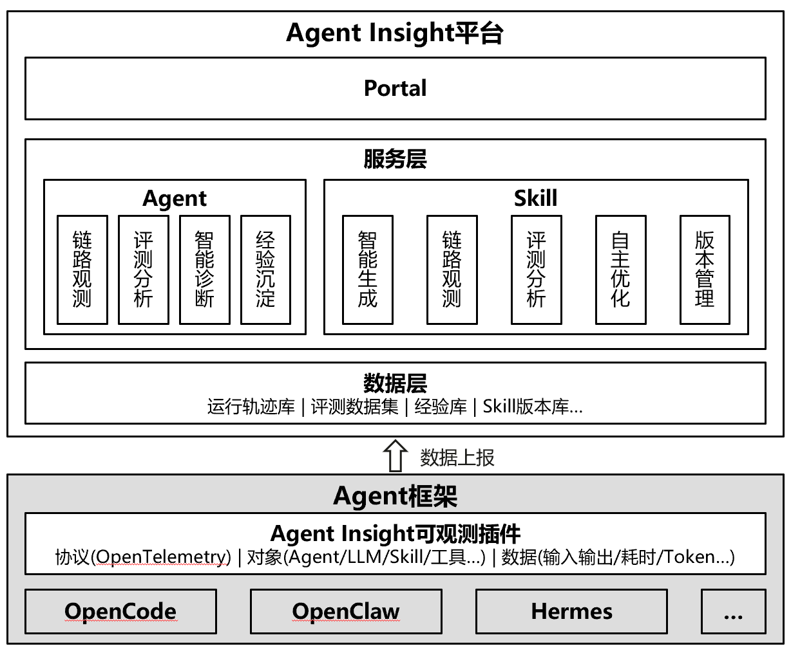

## 核心能力

- **Agent观测与自进化**：围绕运行数据采集 → 链路跟踪 → 评测分析 → 经验沉淀 → 辅助决策，构建 Agent 全生命周期的数据飞轮，将运行数据转化为实时决策能力，持续提升 Agent 运行效能。
- **Skill 开发与自进化**：围绕 Skill 生成 → 调试 → 观测 → 评估 → 优化，构建全生命周期能力闭环，将 Skill 打造为可持续进化的工程资产，提升开发效率与运行效能。

---

## 支持框架

| Agent 框架    | 采集方式 |
|:----------- |:---- |
| OpenCode    | 原生插件 |
| Claude Code | 日志旁路 |
| OpenClaw    | 日志旁路 |

---

## 安装

### 安装服务端

#### 环境要求

- Node.js >= 20.0.0
- 3000 端口未被占用

#### 一键安装

```bash
npx @witty-ai/agen-insight install
```

#### 源码安装

```bash
git clone https://gitcode.com/openeuler/witty-agent-insight.git
cd witty-agent-insight
npm install

# 开发模式
bash scripts/restart_dev.sh

# 生产模式
bash scripts/restart.sh

# 配置数据上报路径
curl -sSf http://<IP>:<PORT>/api/setup | bash
```

#### 启动服务

```bash
cd witty-agent-insight

# 开发模式
bash scripts/restart_dev.sh

# 生产模式
bash scripts/restart.sh
```

#### 访问看板

浏览器打开 `http://localhost:3000`，使用任意邮箱登录即可，例如 `demo@163.com`。
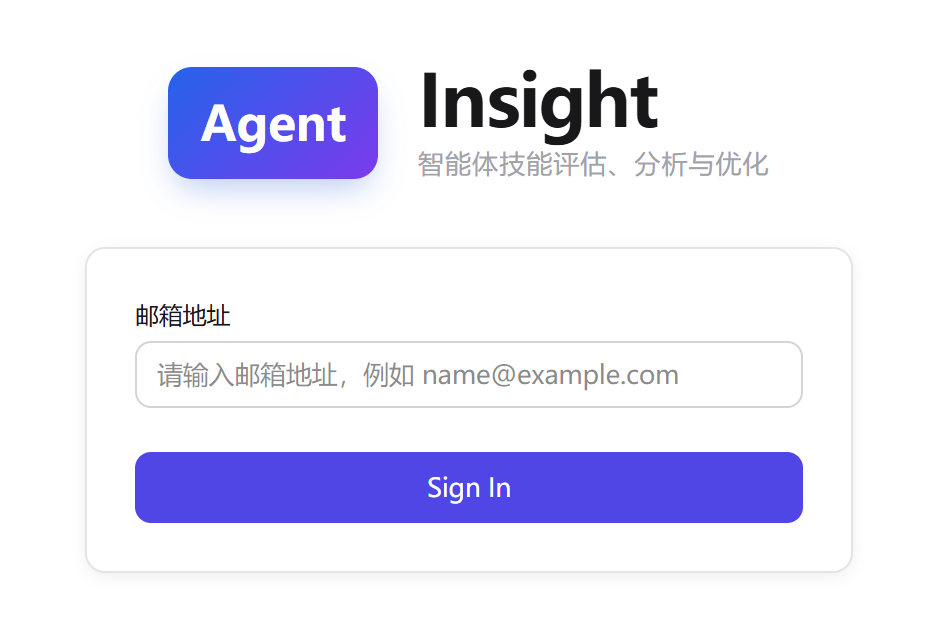

### 安装客户端

以下以 Linux 系统 + OpenCode 运行时为例：

1. 在看板的 **安装指导** 页面复制客户端安装命令。
   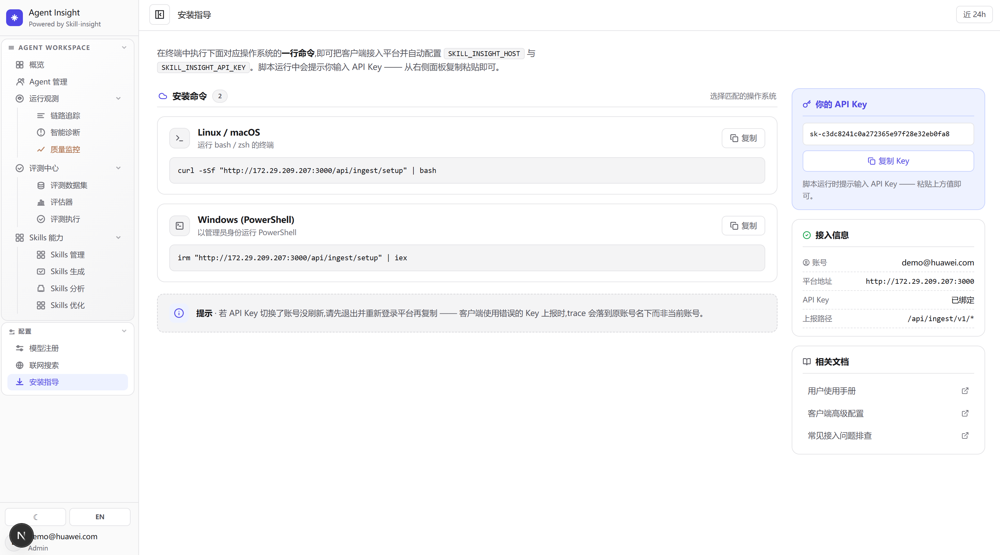
2. 在 Agent 所在服务器执行安装命令：

```bash
curl -sSf "http://172.29.209.207:3000/api/ingest/setup" | bash
```

3. 选择 Agent 运行时。
   
   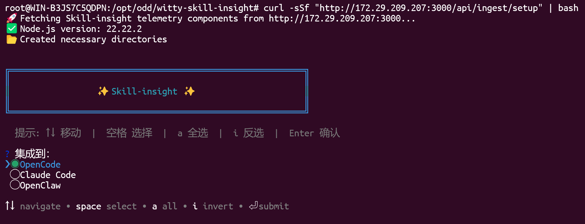

4. 粘贴在 **安装指导** 页面复制的API Key。
   
   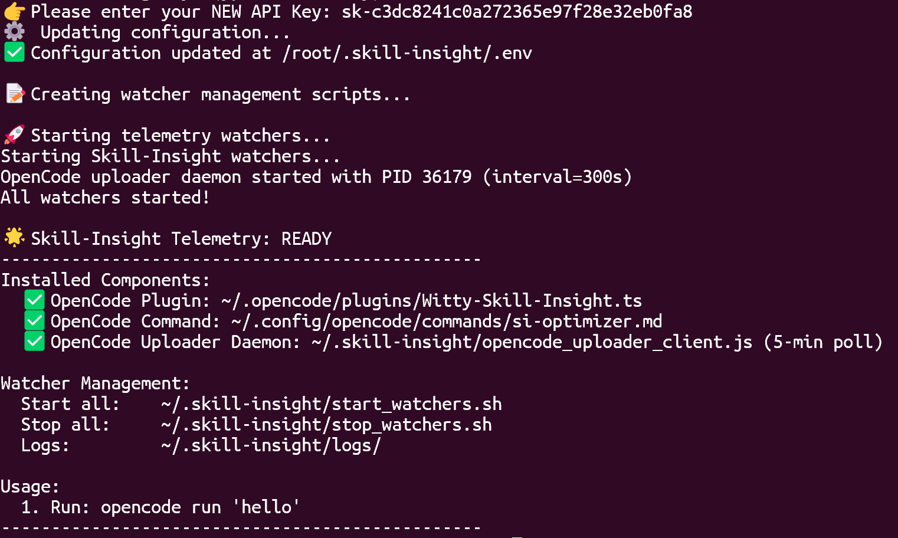

5. 执行安装成功后提示的 Usage 命令，例如：

```bash
opencode run 'hello'
```

6. 在看板的 **链路追踪** 页面确认链路数据已生成，即表示客户端安装成功。
   
   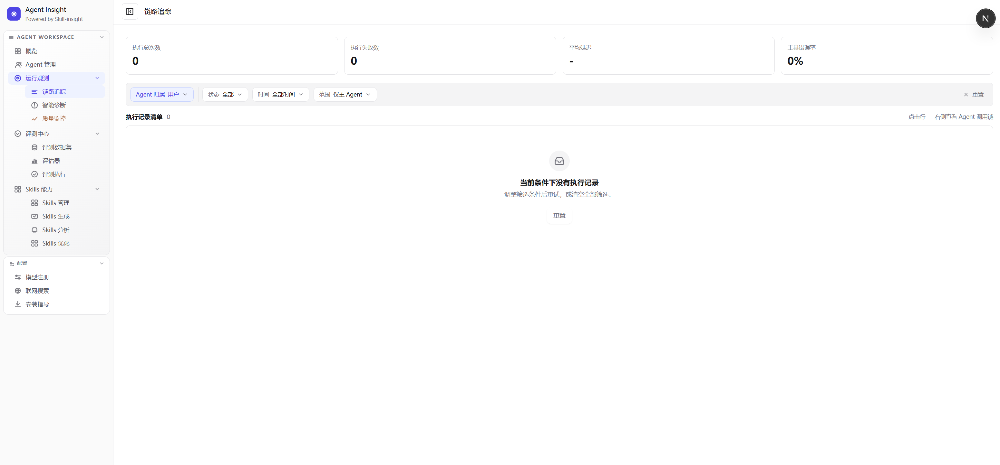

---

## 快速上手

以下演示在 Agent-Insight 看板中完成 **Skill 生成 → 评测 → 优化** 的完整流程。

### 注册模型

1. 进入 **模型注册**，单击 **注册首个模型**。
   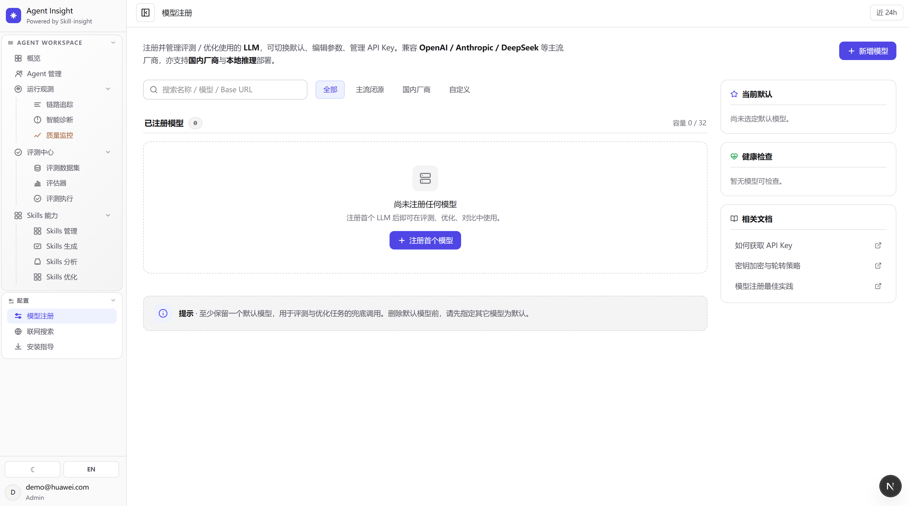

2. 选择模型供应商。
   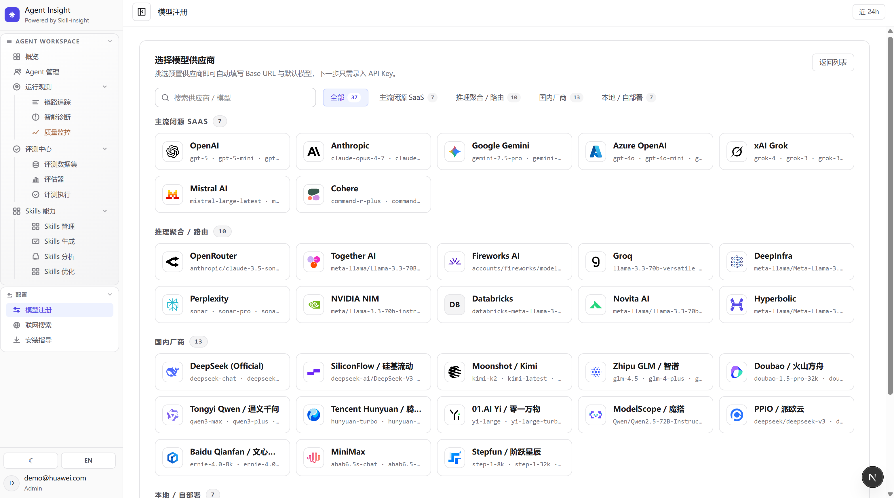

3. 配置 API 密钥，单击 **测试连接并保存**。
   
   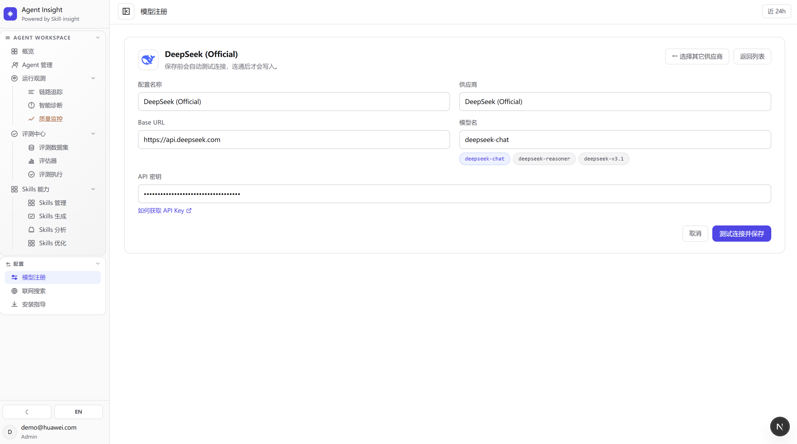

### 生成 Skill

1. 进入 **Skills 生成**，提交需求描述，例如：
   
   > 创建一个 Skill，当用户请求查看系统信息时，自动执行 shell 脚本收集当前系统的关键信息（操作系统、CPU、内存、磁盘、网络等），以 Markdown 报告呈现给用户。
   > 
   > 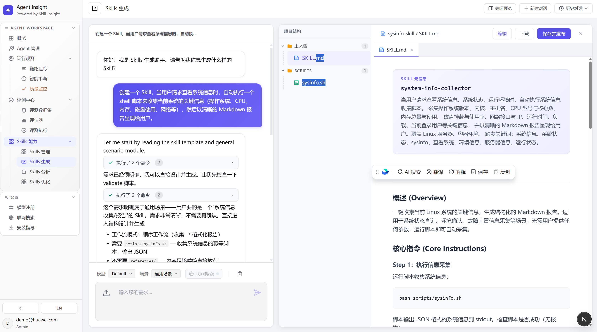

2. 单击 **保存并发布**。

### 分析 Skill

1. 进入 **Skills 分析**，单击 **静态合规**。
   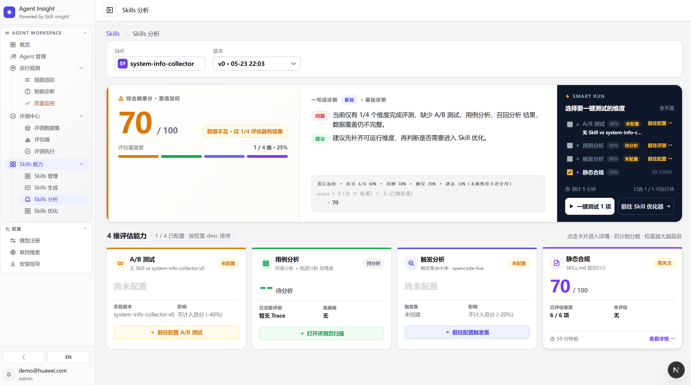

2. 单击 **重新扫描**，查看分析结果。
   
   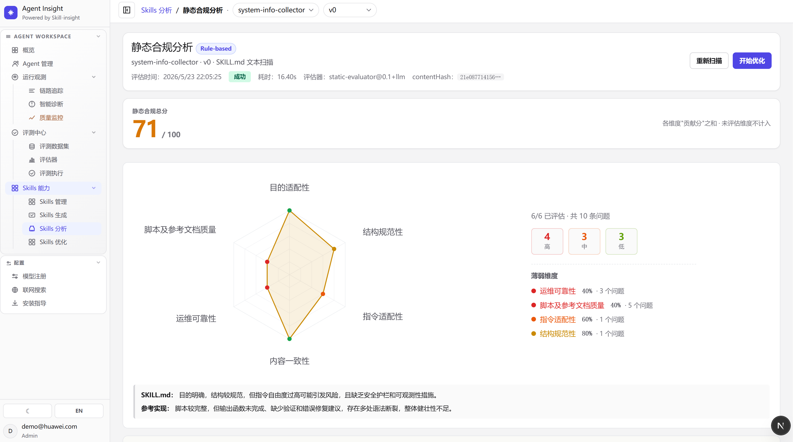

### 优化 Skill

1. 进入 **Skills 优化**，选择 Skill 并单击 **优化**。
   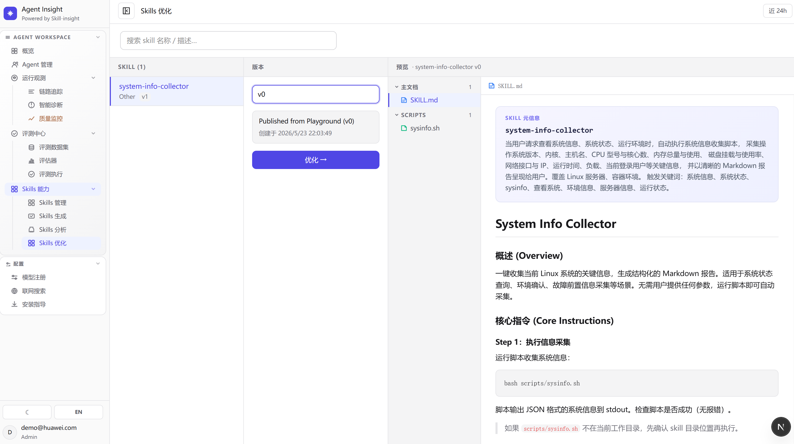
2. 选择可优化项并单击 **开始优化**，或直接输入优化需求后单击 **发送**。
   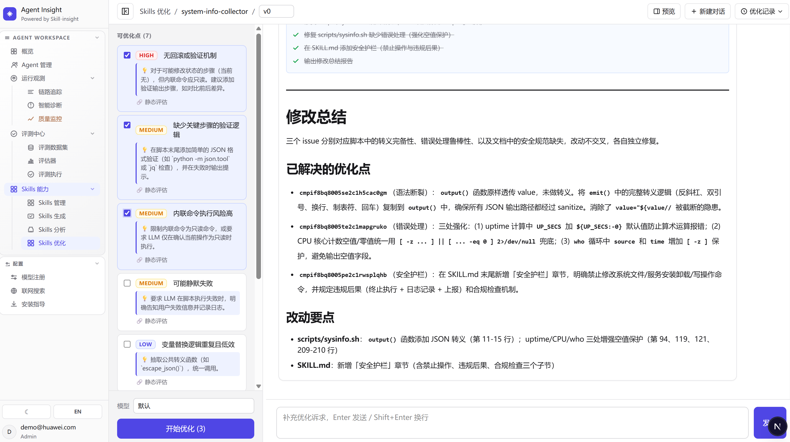
3. 优化完成后，单击 **发布为 v1**，系统将自动保存为新版本。

---

## 文档

详细使用指南见 [docs/guide](docs/guide/) 目录。

---

## 如何贡献

我们诚挚欢迎新贡献者加入项目，也会为新加入者提供全面的指导与帮助。

贡献代码前，请先签署 [CLA](https://clasign.osinfra.cn/sign/6983225bdcbb19710248ccf0)，再参考 [代码贡献指引](https://www.openeuler.org/zh/community/contribution/detail#_4-2-代码类贡献) 提交代码。

如有任何疑问、建议或讨论需求，欢迎通过以下方式联系我们：

- 提交 [Issue](https://atomgit.com/openeuler/witty-diagnosis-agent/issues)
- 发送邮件至 <intelligence@openeuler.org>

---

## License

本项目采用MIT开源协议。
