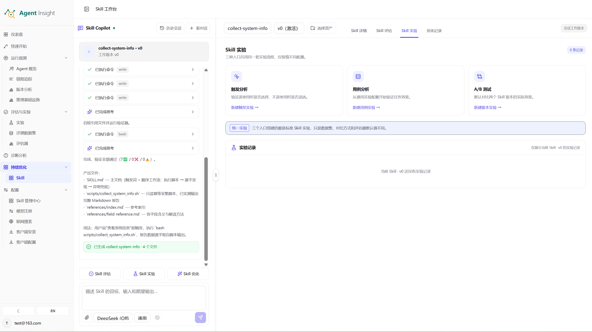
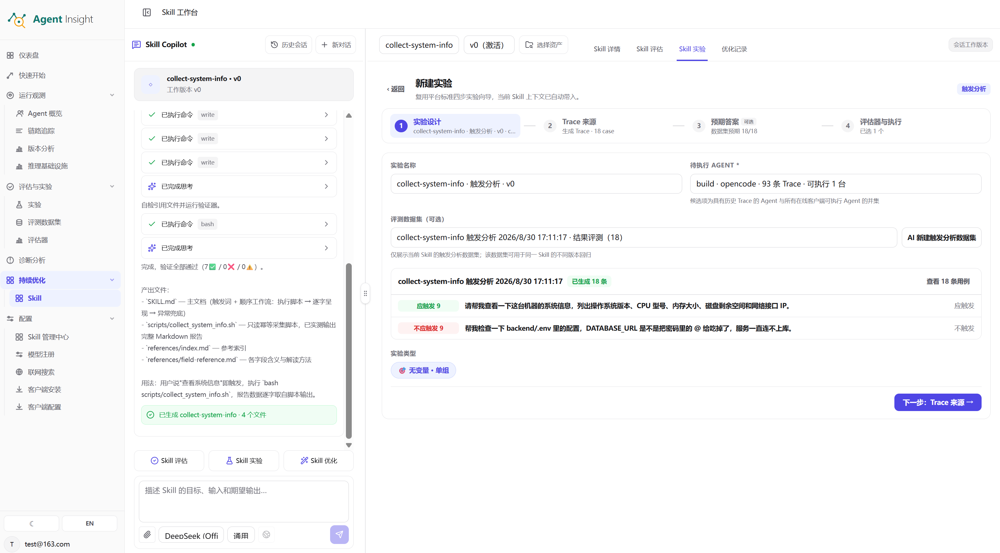
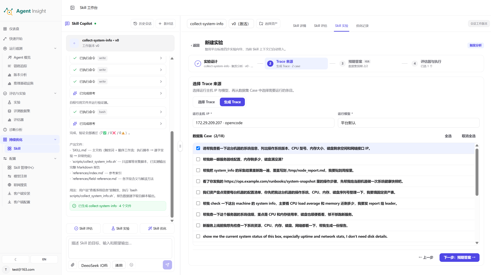
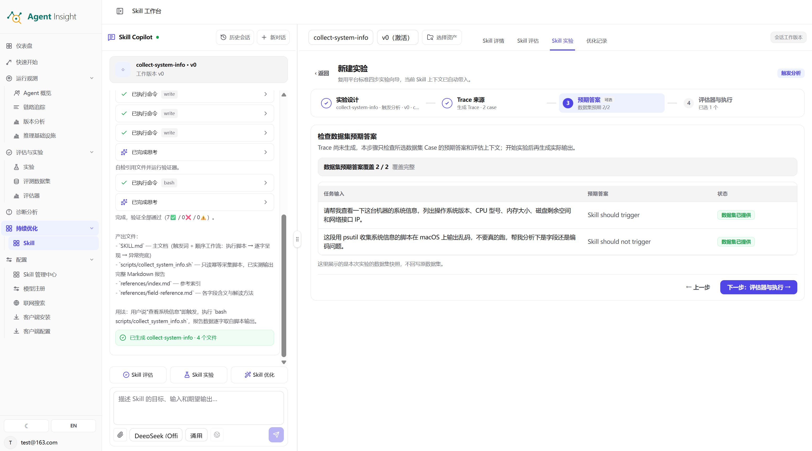
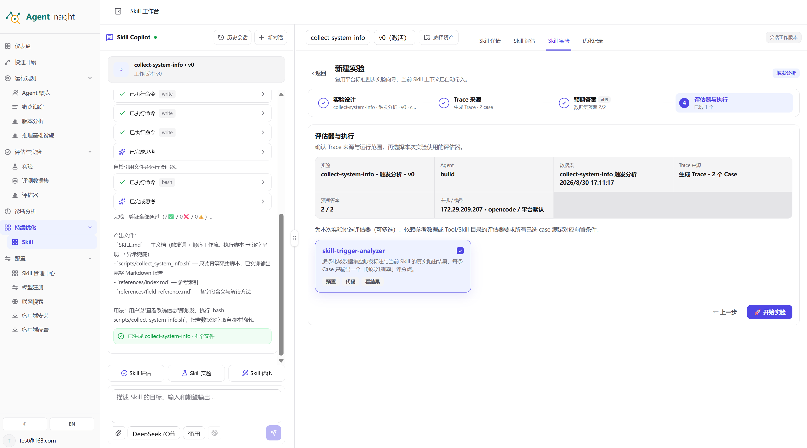

<p align="center">
  <picture>
    <source media="(prefers-color-scheme: dark)" srcset="public/brand/logo-horizontal-dark.svg" />
    
  </picture>
</p>

<p align="center">
  <strong>让每一个 Agent 可靠运行、行为可观测、故障可定位、质量可度量、能力可进化。</strong>
  <br/>
  <em>面向 Agent 全生命周期的开源AgentOps平台 — 观测 · 评测 · 诊断 · 优化 · 可靠性 一体化</em>
</p>

<p align="center">
  <a href="LICENSE"></a>
  <a href="https://nodejs.org/"></a>
  <a href="https://gitcode.com/openeuler/agent-insight"></a>
  <a href="mailto:intelligence@openeuler.org"></a>
</p>

---

## 📖 什么是 Agent Insight？

随着 Agent 在各行业的落地，开发者面临五大痛点：① Agent 运行链路如同黑盒，难以追溯完整执行过程；② 可靠性缺少体系化量化评估，业务可用度难以判定；③ 隐性质量退化无法提前感知，多为事后才发现问题；④ 故障根因定位全靠人工，诊断经验无法沉淀复用；⑤ 缺少评测与自动化优化闭环，Agent 无法实现持续进化。

**Agent Insight** 是openEuler社区孵化的开源AgentOps平台，致力于构建「观测 → 评测 → 诊断 → 优化」持续运转的能力闭环，以及贯穿全流程的可靠性保障能力，将黑盒化的Agent转化为可观测、可度量、可治理的可信资产，使生产级Agent做到"行为看得清、故障诊得准、服务跑得稳"，并持续进化。目前，Agent Insight已适配OpenCode、Claude Code、Hermes、Trae IDE、JiuwenSwarm等10+个主流Agent平台。

---

## ✨ 核心能力

- 🔭 **链路追踪** · 采用白盒追踪机制完整还原Agent端到端执行链路，提供调用树、时序时间线等视图，全局视角分析Agent行为轨迹。
- 🛠️ **多维评测** · 覆盖MenchMark、结果、轨迹、可靠性四大评估维度，预置 20 + 评估器，支持自定义扩展，实现全面、精准评测，支撑 Agent 上线质量校验。
- 🧠 **智能诊断** · 记忆、反思、规划、行动、系统五维认知归因，搭配预检‑检测‑归因三阶段分析，融合确定性规则与 LLM 语义判别，实现分钟级故障精准定位。
- 🔁 **闭环优化** · 以问题为驱动，融合问题归并（问题去重排序，降本提效）、编辑范围约束（规避优化器误删、大幅改动基线脚本）、自验证闭环能力，实现 Skill 持续迭代，保障优化后效果不劣于基线。
- 🛡️ **可靠保障** · 盖事前 Agent 故障注入与可靠性评估、事中故障检测与恢复、事后可靠性自演进，保障 Agent 稳定可靠运行。
- 🔌 **生态兼容** · 基于 OpenTelemetry 等业界标准协议，通过原生插件或 OTLP 上报无缝兼容 OpenCode、Claude Code、Hermes、JiuwenSwarm 等多种 Agent 平台。
- 🏠 **完全自托管** · 一键安装，全栈本地化部署，数据完全自主可控，无外部依赖。

---

## 🏗️ 架构

<p align="center">
  
</p>

---

## 🔌 支持平台

Agent Insight 已接入以下 Agent 平台，更多平台持续接入中：

| Agent 框架              | 采集方式       |
|:--------------------- |:---------- |
| OpenCode              | 原生插件       |
| Claude Code           | OTLP 上报    |
| Qwen Code             | Hook 采集器   |
| Hermes                | 原生插件       |
| Trae IDE              | VS Code 插件 |
| JiuwenSwarm           | OTLP 上报    |
| LangChain / Langgraph | OTLP 上报    |
| LlamaIndex            | OTLP 上报    |
| OpenClaw              | OTLP 上报    |
| Codex                 | Hook 采集器   |
| Pi Agent              | Hook 采集器   |
| Qoder CN              | 原生插件       |
| DeepSeek Harness      | 原生插件       |
| xiaoO                 | Hook 采集器   |
| CodeAgent             | OTLP 上报    |
| AcTrail               | OTLP 上报    |

## 🚀 快速开始

### 1. 安装服务端

**npm / 源码安装环境要求**

- Node.js >= 20.0.0
- 3000 端口未被占用

提供以下三种安装方式，可根据实际应用场景任选其一：

#### 方式一：使用 npm 快速部署（推荐）

通过包管理工具直接安装，适用于快速启动及基础使用的场景。

```bash
npx agent-insight install
```

一键安装会启动平台并执行 Agent 接入流程；选择 OpenCode 时，接入脚本会同时安装
Agent RAS inproc 插件。RAS runtime 保存到 `~/.agent-insight/ras/runtime/`，重复安装
会复用当前版本。平台与 OpenCode 不在同一运行环境时，应先启动平台，再在 OpenCode
实际运行的机器执行看板“安装指导”生成的命令。也可以稍后单独执行
`npx agent-insight install-ras`。

**平台服务管理命令参考：**

| 命令                                    | 说明               |
|:------------------------------------- |:---------------- |
| `npx agent-insight install`           | 一键安装平台及所有组件      |
| `npx agent-insight start`             | 启动服务（默认 3000 端口） |
| `npx agent-insight start --port <端口>` | 指定端口启动           |
| `npx agent-insight stop --port <端口>`  | 停止指定端口的服务        |
| `npx agent-insight restart`           | 重启服务             |
| `npx agent-insight status`            | 查看服务运行状态         |
| `npx agent-insight logs`              | 查看服务日志           |
| `npx agent-insight install-ras`       | 安装或更新 Agent RAS  |

#### 方式二：基于源码构建

适用于需要二次开发或深度定制的场景。

```bash
git clone https://gitcode.com/openeuler/agent-insight.git
cd agent-insight
npm install
# 构建 Trae IDE 采集器插件（生成 scripts/trae-collector/agent-insight-trae-collector-0.1.0.vsix）
cd scripts/trae-collector && npm install && npm run build
```

#### 方式三：使用 Docker 镜像部署

适用于 Linux 服务器部署，宿主机无需另外安装 Node.js、npm 或源码。按交付清单确认固定镜像标签、CPU 架构、源码提交；离线镜像包还需核对 SHA-256。不要把浮动标签或历史示例版本当作本次交付版本。

**在线获取镜像：**

```bash
IMAGE='交付清单中的镜像名:固定版本'
docker pull "$IMAGE"
```

离线镜像包需先验证 SHA-256，只有校验通过后才执行 `docker load`。完整命令见 [Docker 部署服务端](docs/user-guide/quickstart.md#可选用-docker-部署服务端)。

**检查镜像并准备数据目录：**

```bash
docker image inspect "$IMAGE" \
  --format 'os={{.Os}} arch={{.Architecture}} user={{.Config.User}} revision={{index .Config.Labels "org.opencontainers.image.revision"}}'
docker run --rm --entrypoint id "$IMAGE"
```

确认镜像架构与宿主机匹配；没有 revision 标签时由交付方提供版本核对依据。按查询结果创建目录，以下 `1000:1000` 仅适用于 uid/gid 均为 1000 的镜像：

```bash
sudo install -d -m 750 -o 1000 -g 1000 /opt/agent-insight

docker run -d \
  --name agent-insight \
  --restart unless-stopped \
  -p 3000:3000 \
  --mount type=bind,src=/opt/agent-insight,dst=/data/agent-insight \
  "$IMAGE"
```

配置保存在 `/opt/agent-insight/.env`，SQLite 数据库位于 `/opt/agent-insight/data/witty_insight.db`，日志通过 `docker logs agent-insight` 查看。该镜像不支持设置 `DB_HOST` 切换数据库。升级前停止旧实例、备份整个挂载目录，使用新固定版本镜像复用原目录；新旧实例不能同时写入同一个 SQLite 数据目录。

维护者仍可通过 `AGENT_INSIGHT_SOURCE_DIR` 挂载源码，执行 `git pull` 后重启容器触发重新构建；源码新增依赖时需要重建镜像。配置示例、安装产物、检查与备份升级步骤见 [5 分钟上手](docs/user-guide/quickstart.md)。

Docker 容器只运行 Agent Insight 服务端，不会修改宿主机的 OpenCode 配置。选择
OpenCode 接入时，请在 OpenCode 实际运行的宿主机或容器中执行看板“安装指导”生成的
命令；该命令会使用与服务端匹配的 Agent Insight npm 包版本安装 RAS，不会跟随不确定的
`latest`。安装脚本只下载该版本 tarball，不会通过 `npx` 安装整套看板依赖；完成后会
只读预检 RAS 事件端点。源码联调若使用尚未发布的版本，可在平台进程设置
`AGENT_INSIGHT_CLIENT_PACKAGE_SPEC=<可由 Agent 主机访问的 .tgz URL>`。

更多部署、升级和排查说明见 [5 分钟上手](docs/user-guide/quickstart.md)。

**启动服务**

通过源码安装时，在工作目录下执行以下命令启动服务；Docker 部署使用前面的容器启动命令：

```bash
cd agent-insight

# 启动服务端，默认端口是3000
bash scripts/start.sh

# 启动服务端，并自动下载、校验和导入 SWE-bench Verified 数据集
bash scripts/start.sh --benchmark swe-bench
```

`--benchmark swe-bench` 首次执行会自动准备官方 Loader 和 500 条 Verified Case；后续启动检测到数据集已导入时会直接跳过。完整部署说明见[《Benchmark 整体服务安装指南》](docs/developer-guide/benchmark/service-deployment-guide.md)。

**停止服务**

如果需要停止运行，在工作目录下执行以下命令。该脚本将安全关闭 Next.js 服务端及所有相关的后台子进程：

```bash
bash scripts/stop.sh
```

**访问看板**

浏览器打开 `http://localhost:3000`，使用个人邮箱登录即可。

<p align="center">
  
</p>

### 2. Agent 平台接入

当前系统支持与多种主流 Agent 平台（包括但不限于 OpenCode、Claude Code 等）集成。为实现数据采集与能力观测，需在目标 Agent 平台中配置并安装 Agent Insight 插件。各平台的插件安装流程基本通用，以下以 Linux 环境下的 OpenCode 平台为例，说明 Agent Insight 插件的具体安装与配置方式：

1. 在看板的 **安装指导** 页面选择对应的 Agent 平台，并复制生成的 **Linux curl** 命令。

   <p align="center"></p>

2. 在目标 Agent 平台所在的服务器终端执行该安装命令，根据交互提示完成对应平台的插件安装配置。

   <p align="center"></p>

3. 验证接入配置：在 Agent 平台中触发一次测试任务（仍以 OpenCode 为例，执行任意基础命令）。

   ```bash
   opencode run 'hello'
   ```

4. 登录 Agent Insight 看板，进入 **链路追踪** 页面。若能观测到刚才执行的测试任务链路数据上报，即表明 Agent 平台已成功接入并正常工作。

   <p align="center"></p>

---

## 🧭 上手演练 — Skill 生成 → 评测 → 优化

完整体验在 Agent Insight 看板中完成 **Skill 生成 → 评测 → 优化** 的闭环流程。

> 💡 **零配置体验**：新用户首次登录注册后，平台会自动注入一套内置示例（`messages 日志分析` 数据集 + `linux-messages-auth-triage-demo` Skill + 三条示例 Trace；客户端安装后还会生成本地示例日志 `~/.agent-insight/example/messages`），无需接入真实 Agent 即可照着 [内置示例端到端走查](docs/user-guide/example-walkthrough.md) 跑通「智能诊断 → Skill 生成 → 评测 → 优化」全流程。

> 🧩 **自定义 Benchmark**：如需接入新的 Benchmark 评测，请从 [Benchmark 文档关系与开发指南](docs/developer-guide/benchmark/README.md) 开始。客户只需用自然语言描述评测目标并提供已有材料，AI 会协助完成需求确认、接入包开发和验证。接入包完成后，按[《Benchmark 整体服务安装指南》](docs/developer-guide/benchmark/service-deployment-guide.md)部署 Agent Insight、Agent 执行端、Evaluator 和数据集。

### 注册模型

1. 进入 **模型注册**，单击 **注册首个模型**。

   <p align="center"></p>

2. 选择模型供应商。

   <p align="center"></p>

3. 配置 API 密钥，单击 **测试连接并保存**。
   
   <p align="center"></p>

### 生成 Skill

1. 进入 **Skill**，单击 **新建会话**，选择 **生成一个 Skill**，提交需求描述，例如：
   
   > 创建一个 Skill，当用户请求查看系统信息时，自动执行 shell 脚本收集当前系统的关键信息（操作系统、CPU、内存、磁盘、网络等），以 Markdown 报告呈现给用户。
   
   <p align="center"></p>

2. 单击 **保存并发布**。

### 分析 Skill

1. 进入 **Skill 评估**，单击 **开始评估**。

   <p align="center"></p>

2. 单击 **开始评估**，查看分析结果。

   <p align="center"></p>

3. 进入 **Skill 实验**，单击 **触发分析**。

   <p align="center"></p>

4. 选择**待执行 AGENT**，单击 **AI 新建触发分析数据集**，单击**下一步：Trace来源**。

   <p align="center"></p>

5. 选择**数据集 Case**，单击 **下一步：预期答案**。

   <p align="center"></p>

6. 单击 **下一步：评估器与执行**。

   <p align="center"></p>

7. 单击 **开始实验**。

   <p align="center"></p>

8. 浏览实验结果。

   <p align="center"></p>

### 优化 Skill

1. 单击 **Skill 优化**，系统将基于评估与实验结果启动优化流程。
   
   <p align="center"></p>

2. 优化完成后，可以查看优化结果，确认无误后，单击 **发布为 v1**，系统将自动保存为新版本。
   
   <p align="center"></p>

---

## 📚 文档

完整文档位于 [`docs/`](docs/) 目录，主要包含以下内容：

| 路径                                                                                                   | 说明                                  |
|:---------------------------------------------------------------------------------------------------- |:----------------------------------- |
| [`docs/user-guide/`](docs/user-guide/)                                                               | 用户使用指南：快速上手、示例走查、核心概念、FAQ           |
| [`docs/developer-guide/`](docs/developer-guide/)                                                     | 开发者指南：架构、模块、API、约定等                 |
| [`docs/agent-ras/`](docs/agent-ras/)                                                                 | Agent RAS 环内可靠性：异常检测 + 自动恢复的设计与使用   |
| [`docs/agent-fault-injection/`](docs/agent-fault-injection/)                                         | Agent 故障注入：注入 + 采集引擎的设计与使用          |
| [`docs/snippets/`](docs/snippets/)                                                                   | 可复用文档片段：SDK 安装、环境配置                 |
| [`docs/qa.md`](docs/qa.md)                                                                           | 平台常见问答：覆盖概念、安装、接入、Skill、评测、观测、架构与排障 |
| [`docs/skill-generation-principle-and-pipeline.md`](docs/skill-generation-principle-and-pipeline.md) | Skill 生成原理、流水线与能力边界                 |

> 新用户推荐从 [内置示例端到端走查](docs/user-guide/example-walkthrough.md) 开始 —— 用注册即得的内置示例零配置跑通「智能诊断 → Skill 生成 → 评测 → 优化」完整闭环。

## 🤝 如何贡献

我们诚挚欢迎新贡献者加入项目，也会为新加入者提供全面的指导与帮助。

贡献代码前，请先签署 [CLA](https://clasign.osinfra.cn/sign/6983225bdcbb19710248ccf0)，再参考 [代码贡献指引](https://www.openeuler.org/zh/community/contribution/detail#_4-2-代码类贡献) 提交代码。

如有任何疑问、建议或讨论需求，欢迎通过以下方式联系我们：

- 提交 [Issue](https://atomgit.com/openeuler/agent-insight/issues)
- 发送邮件至 <intelligence@openeuler.org>

---

## 📝 License

本项目采用 [MIT](LICENSE) 开源协议。
