<p align="center">
  <picture>
    <source media="(prefers-color-scheme: dark)" srcset="public/brand/logo-horizontal-dark.svg" />
    
  </picture>
</p>

<p align="center">
  <strong>让每一个 Agent 都可被观测、可被评估、可自我进化。</strong>
  <br/>
  <em>面向 Agent 全生命周期的开源工程平台 — 观测 · 评测 · Skills 优化 一体化</em>
</p>

<p align="center">
  <a href="LICENSE"></a>
  <a href="https://nodejs.org/"></a>
  <a href="https://gitcode.com/openeuler/agent-insight"></a>
  <a href="mailto:intelligence@openeuler.org"></a>
</p>

---

## 📖 什么是 Agent Insight？

随着 Agent 在各行业的落地，开发者面临三大痛点：Agent 运行过程如同黑盒，难以定位问题根因；Skill 质量参差不齐，缺少体系化的评测与迭代手段；Agent 经验无法沉淀复用，每次优化都从零开始。

**Agent Insight** 正是为解决这些问题而生 —— 它是一个**框架无关**的统一AgentOps平台，让运行在 OpenCode、Claude Code、Hermes、Openclaw 等任意框架上的 Agent 都能被持续观测、系统评测和自主优化。

> 与同类产品不同的是，Agent Insight 把 **Skills（Agent 能力）** 作为一等公民，提供从生成、A/B 测试到优化的完整闭环。

---

## ✨ 核心能力

- 🔭 **Agent 观测与自进化** · 围绕 *运行数据采集 → 链路跟踪 → 评测分析 → 经验沉淀 → 辅助决策* 构建 Agent 全生命周期的数据飞轮，支撑故障定位与质量监控，并将运行数据沉淀为迭代优化的原料，持续驱动优化。
- 🛠️ **Skill 开发与自进化** · 围绕 *Skill 生成 → 调试 → 观测 → 评估 → 优化* 构建全生命周期能力闭环，将 Skill 打造为可持续进化的工程资产。
- 🆎 **智能 A/B 测评** · Config → Execution → Decision 三步法结构化工作流，支持一键执行、自动对比与智能决策，让能力升级有据可依、省心高效。
- 🧠 **智能诊断** · 基于链路与失败模式自动定位异常调用与根因。
- 🔌 **框架无关** · 基于 OpenTelemetry 等业界标准协议，通过原生插件或 OTLP 上报无缝兼容 OpenCode、Claude Code、Hermes、JiuwenSwarm 等多种 Agent 运行时与平台。
- 🏠 **完全自托管** · 一键安装，全栈本地化部署，数据完全自主可控，无外部依赖。

---

## 🏗️ 架构

<p align="center">
  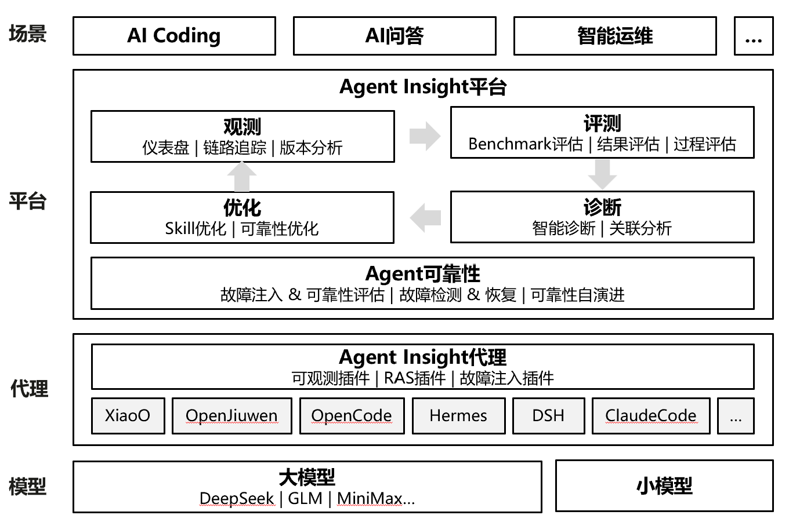
</p>

---

## 🔌 支持平台

Agent Insight 框架无关，已接入以下 Agent 运行时/框架，更多平台持续接入中：

| Agent 框架    | 采集方式    |
|:----------- |:------- |
| OpenCode    | 原生插件    |
| Claude Code | OTLP 上报 |
| Hermes      | 原生插件    |
| Trae IDE | VS Code 插件 |
| JiuwenSwarm | OTLP 上报 |
| Langgraph | OTLP 上报 |

## 🚀 快速开始

### 1. 安装服务端

**环境要求**

- Node.js >= 20.0.0
- 3000 端口未被占用

提供以下两种安装方式，可根据实际应用场景任选其一：

#### 方式一：使用 npm 快速部署（推荐）

通过包管理工具直接安装，适用于快速启动及基础使用的场景。

```bash
npx agent-insight install
```

**平台服务管理命令参考：**

| 命令                                    | 说明               |
|:------------------------------------- |:---------------- |
| `npx agent-insight install`           | 一键安装平台及所有组件      |
| `npx agent-insight start`             | 启动服务（默认 3000 端口） |
| `npx agent-insight start --port <端口>` | 指定端口启动           |
| `npx agent-insight stop --port <端口>`  | 停止指定端口的服务        |
| `npx agent-insight restart`           | 重启服务             |
| `npx agent-insight status`            | 查看服务运行状态         |
| `npx agent-insight logs`              | 查看服务日志           |

#### 方式二：基于源码构建

适用于需要二次开发或深度定制的场景。

```bash
git clone https://gitcode.com/openeuler/agent-insight.git
cd agent-insight
npm install
# 构建 Trae IDE 采集器插件（生成 scripts/trae-collector/agent-insight-trae-collector-0.1.0.vsix）
cd scripts/trae-collector && npm install && npm run build
```

#### 方式三：使用 Docker 镜像部署

适用于服务器部署或希望应用容器与数据目录分离的场景。镜像已发布为多架构，`x86_64` 服务器会自动拉取 `linux/amd64`，`aarch64` 服务器会自动拉取 `linux/arm64`。

**用法一：在线拉取 Docker Hub 镜像**

```bash
docker pull karaggagent/agent-insight:latest

mkdir -p ~/.agent-insight/data
chmod -R 777 ~/.agent-insight

docker run -d \
  --name agent-insight \
  --restart unless-stopped \
  -p 3000:3000 \
  -v ~/.agent-insight:/data/agent-insight \
  karaggagent/agent-insight:latest
```

生产环境如需锁定版本号，可以把 `latest` 换成固定版本，例如 `karaggagent/agent-insight:0.5.0`。

**用法二：离线导入 `.tar` 镜像**

如果服务器无法访问 Docker Hub，可以先拿到离线镜像包，例如 `agent-insight-0.5.0-image.tar`，再导入运行：

```bash
docker load -i agent-insight-0.5.0-image.tar
docker images | grep agent-insight

mkdir -p ~/.agent-insight/data
chmod -R 777 ~/.agent-insight

docker run -d \
  --name agent-insight \
  --restart unless-stopped \
  -p 3000:3000 \
  -v ~/.agent-insight:/data/agent-insight \
  karaggagent/agent-insight:0.5.0
```

**用法三：挂载源码运行，代码更新后重启即可生效**

适用于服务器要跟着最新代码跑、又不想每次改动都重新打镜像的场景。给容器加一个 `AGENT_INSIGHT_SOURCE_DIR` 环境变量，指向挂载进来的源码目录：

```bash
git clone https://gitcode.com/openeuler/agent-insight.git /srv/agent-insight

docker run -d \
  --name agent-insight \
  --restart unless-stopped \
  -p 3000:3000 \
  -e AGENT_INSIGHT_SOURCE_DIR=/src \
  -v /srv/agent-insight:/src:ro \
  -v ~/.agent-insight:/data/agent-insight \
  karaggagent/agent-insight:latest
```

之后更新代码只需要 `git pull` 加一次重启，容器会按最新源码重新构建再启动：

```bash
cd /srv/agent-insight && git pull
docker restart agent-insight
```

不配置 `AGENT_INSIGHT_SOURCE_DIR` 时行为与之前完全一致，仍然直接运行镜像里打好的 `agent-insight` npm 包。依赖用的是镜像预装的那一份，所以源码改了 `package.json` 新增依赖时需要重新构建镜像，详见 [5 分钟上手](docs/user-guide/quickstart.md)。

容器内 `/data/agent-insight` 对应宿主机当前用户的 `~/.agent-insight`，默认 SQLite 数据库位于 `~/.agent-insight/data/witty_insight.db`。升级镜像时保留这个挂载目录即可复用数据。

更多部署、升级和排查说明见 [5 分钟上手](docs/user-guide/quickstart.md)。

**启动服务**

安装完成后，在工作目录下执行以下命令启动服务：

```bash
cd agent-insight

# 启动服务端，默认端口是3000
bash scripts/start.sh
```

**停止服务**

如果需要停止运行，在工作目录下执行以下命令。该脚本将安全关闭 Next.js 服务端及所有相关的后台子进程：

```bash
bash scripts/stop.sh
```

**访问看板**

浏览器打开 `http://localhost:3000`，使用个人邮箱登录即可。

<p align="center">
  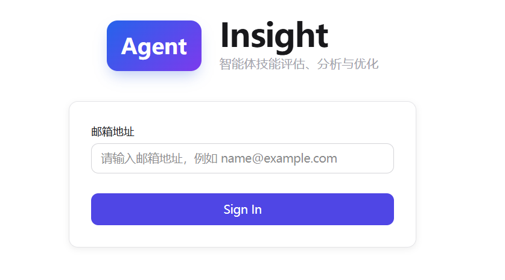
</p>

### 2. Agent 平台接入

当前系统支持与多种主流 Agent 平台（包括但不限于 OpenCode、Claude Code 等）集成。为实现数据采集与能力观测，需在目标 Agent 平台中配置并安装 Agent-Insight 插件。各平台的插件安装流程基本通用，以下以 Linux 环境下的 OpenCode 平台为例，说明 Agent-Insight 插件的具体安装与配置方式：

1. 在看板的 **安装指导** 页面选择对应的 Agent 平台，并复制生成的插件安装命令。
   
   <p align="center">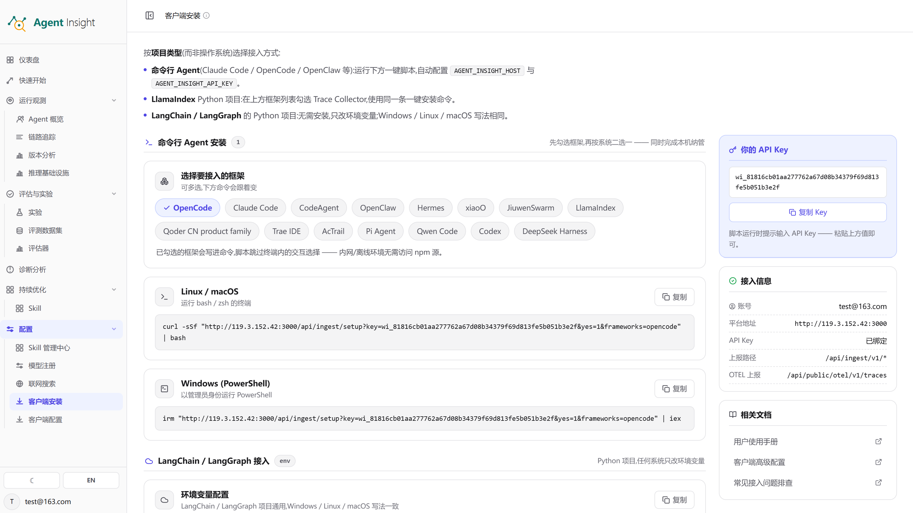</p>

2. 在目标 Agent 平台所在的服务器终端执行该安装命令，根据交互提示完成对应平台的插件安装配置。
   
   <p align="center">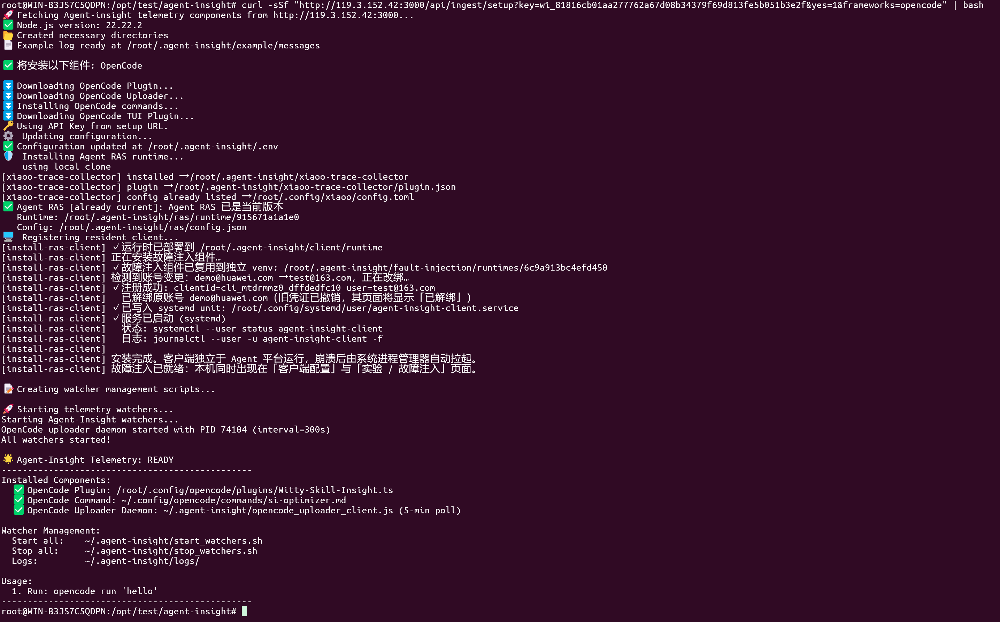</p>

3. 验证接入配置：在 Agent 平台中触发一次测试任务（仍以 OpenCode 为例，执行任意基础命令）。
   
   ```bash
   opencode run 'hello'
   ```

4. 登录 Agent-Insight 看板，进入 **链路追踪** 页面。若能观测到刚才执行的测试任务链路数据上报，即表明 Agent 平台已成功接入并正常工作。
   
   <p align="center">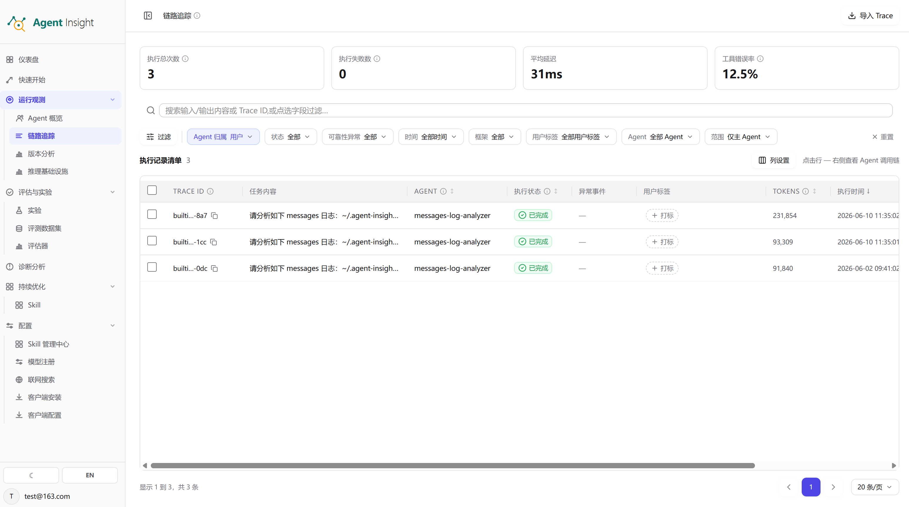</p>

---

## 🧭 上手演练 — Skill 生成 → 评测 → 优化

完整体验在 Agent-Insight 看板中完成 **Skill 生成 → 评测 → 优化** 的闭环流程。

> 💡 **零配置体验**：新用户首次登录注册后，平台会自动注入一套内置示例（`messages 日志分析` 数据集 + `linux-messages-auth-triage-demo` Skill + 三条示例 Trace；客户端安装后还会生成本地示例日志 `~/.agent-insight/example/messages`），无需接入真实 Agent 即可照着 [内置示例端到端走查](docs/user-guide/example-walkthrough.md) 跑通「智能诊断 → Skill 生成 → 评测 → 优化」全流程。

### 注册模型

1. 进入 **模型注册**，单击 **注册首个模型**。
   
   <p align="center">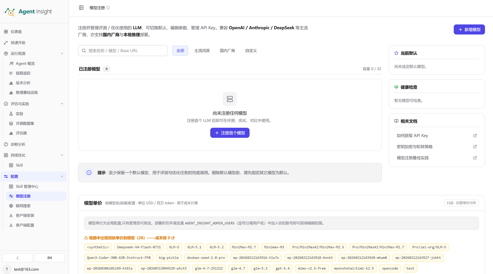</p>

2. 选择模型供应商。
   
   <p align="center">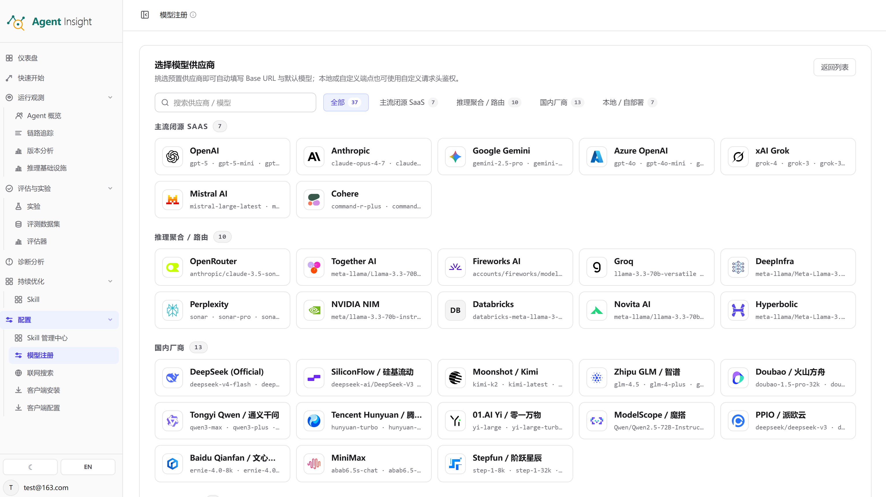</p>

3. 配置 API 密钥，单击 **测试连接并保存**。
   
   <p align="center">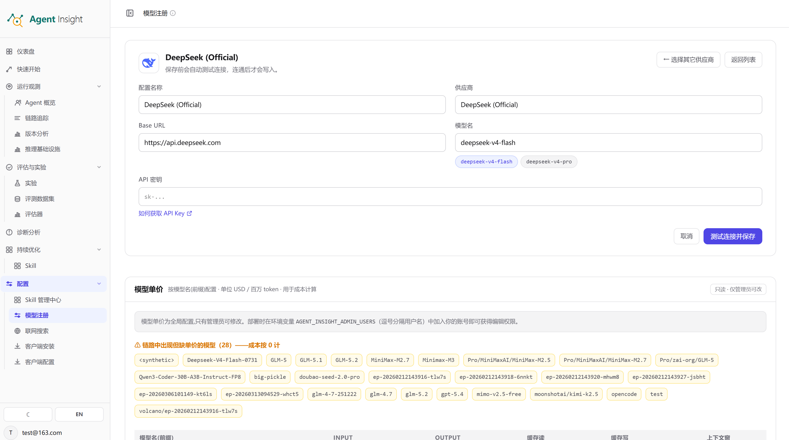</p>

### 生成 Skill

1. 进入 **Skills 生成**，提交需求描述，例如：
   
   > 创建一个 Skill，当用户请求查看系统信息时，自动执行 shell 脚本收集当前系统的关键信息（操作系统、CPU、内存、磁盘、网络等），以 Markdown 报告呈现给用户。
   
   <p align="center">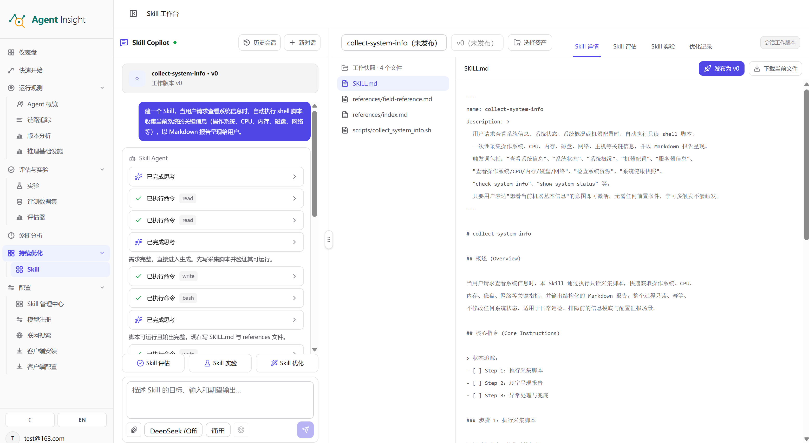</p>

2. 单击 **保存并发布**。

### 分析 Skill

1. 进入 **Skills 评测**，单击 **静态合规**。
   
   <p align="center">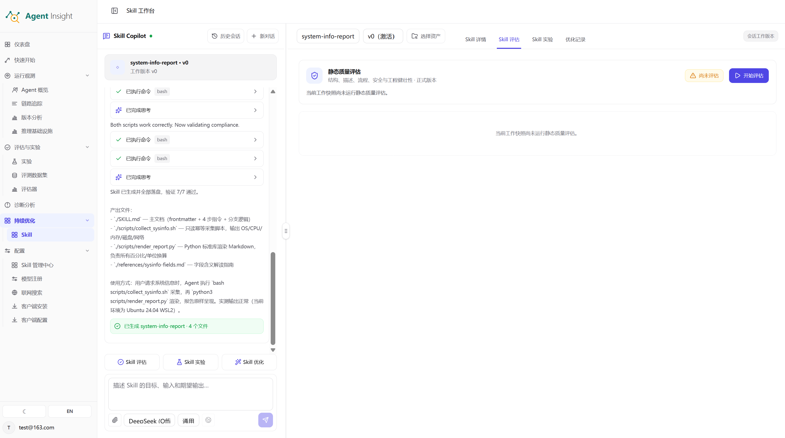</p>

2. 单击 **重新扫描**，查看分析结果。
   
   <p align="center">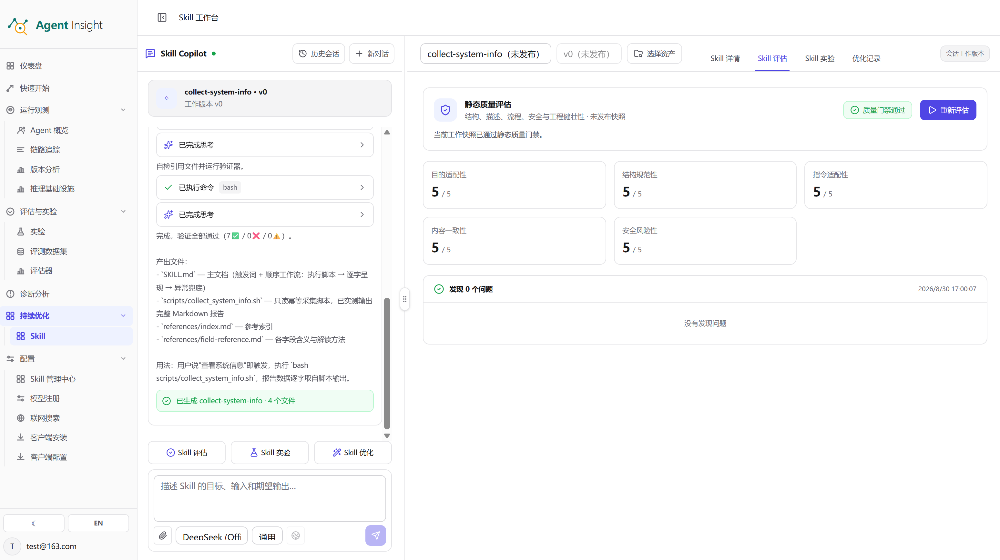</p>

### 优化 Skill

1. 进入 **Skills 优化**，选择 Skill 并单击 **优化**。
   
   <p align="center">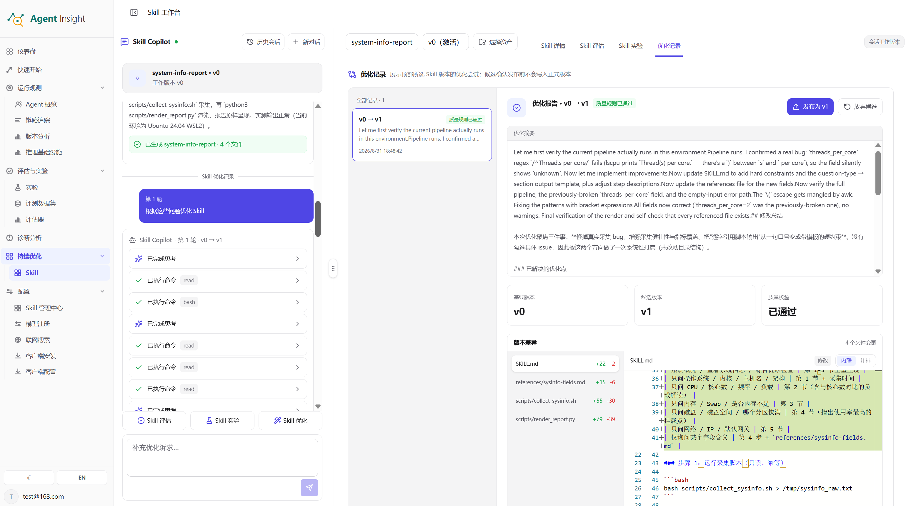</p>

2. 选择可优化项并单击 **开始优化**，或直接输入优化需求后单击 **发送**。
   
   <p align="center">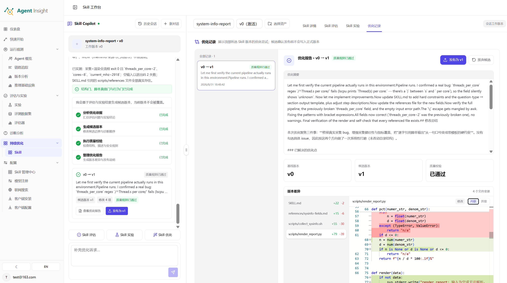</p>

3. 优化完成后，单击 **发布为 v1**，系统将自动保存为新版本。

---

## 📚 文档

详细使用指南见 [`docs/user-guide`](docs/user-guide/) 目录。新用户推荐从 [内置示例端到端走查](docs/user-guide/example-walkthrough.md) 开始 —— 用注册即得的内置示例零配置跑通完整闭环。

## 🤝 如何贡献

我们诚挚欢迎新贡献者加入项目，也会为新加入者提供全面的指导与帮助。

贡献代码前，请先签署 [CLA](https://clasign.osinfra.cn/sign/6983225bdcbb19710248ccf0)，再参考 [代码贡献指引](https://www.openeuler.org/zh/community/contribution/detail#_4-2-代码类贡献) 提交代码。

如有任何疑问、建议或讨论需求，欢迎通过以下方式联系我们：

- 提交 [Issue](https://atomgit.com/openeuler/agent-insight/issues)
- 发送邮件至 <intelligence@openeuler.org>

---

## 📝 License

本项目采用 [MIT](LICENSE) 开源协议。
