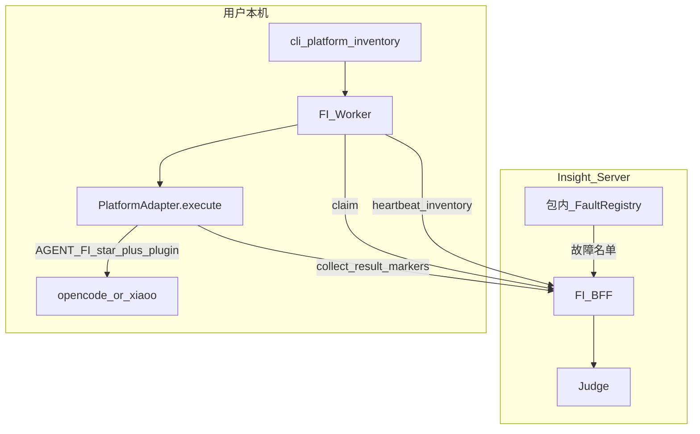
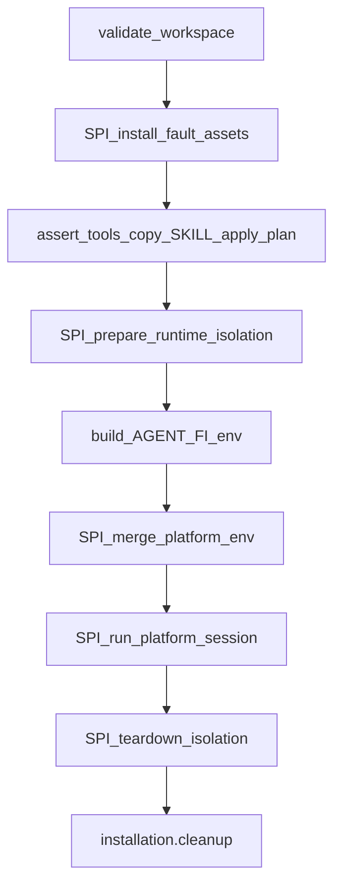

# FI 多平台接入方案

> 范围：仓根 `agent_fault_injection/platform_adapters/`。  
> 状态：✅ OpenCode / xiaoO（cli 与 daemon 同一 Adapter 内分支）已落地。  
> 新增被测宿主：实现 Adapter SPI，**不要**复制现有 `execute` / rewrite。

---

## 1. 问题与目标

被测宿主启动方式、隔离目录、环境变量不同，但故障配方、文件注入、运行时改写、Judge 必须共用。若每个平台复制一整段 `execute`，能力面与改写逻辑会分叉：同一 `fault.json` 在 OpenCode 生效、在新平台变成空操作。

目标：

| 项目 | 约定 |
|------|------|
| 公共步骤 | workspace 校验、装 Skill、`apply_injection_plan`、组 `AGENT_FI_*`、cleanup 上收到 `execute` 模板 |
| 平台差异 | 只填 SPI：资产安装、隔离 overlay、env 合并、拉起会话、轨迹映射 |
| 评判 | 只走 Insight 服务端 Judge；Adapter **不必**实现平台 Judge |
| 名单分源 | 故障名单：Insight 部署包内 Python registry。平台/Agent/Model 是否就绪：只信本机 `platform inventory` → Worker heartbeat |

非目标：完整 Ports 六边形；为 cli/daemon 各建一套 Template Method；setuptools `agent_fault_injection.platforms` entry points（未做）；按故障声明 `platforms` 过滤（已删，UI 默认双平台）；独立 FastAPI / Vite 产品路径。

---

## 2. 设计意图

Adapter 是 **被测宿主的插座**，不是第二套注入引擎。

| 意图 | 做法 |
|------|------|
| 配方与平台解耦 | `skills/<id>/` 不写平台名；某 op 仅一平台有挂点，由引擎 / Adapter 承担空操作，不在配方里过滤 |
| 改写语义不进 Adapter | runtime op 的 SoT 在 `rewrite_engine`；Adapter 只负责把插件 / Hooker 装上、把 `AGENT_FI_*` 传进子进程 |
| 一种平台一块类 | xiaoO 的 cli / daemon 是 `run_platform_session` **内部** harness 策略，不拆两个 Adapter、不拆两套模板 |
| 服务端不冒充用户机 | Insight 不 `which opencode`；platforms 列表来自在线 Worker 的 inventory |

三种常见改动：

| 要做的事 | 改哪里 | 不要改 |
|----------|--------|--------|
| 加一个故障模式 | 仅 `fault_inject/skills/<id>/` | 能力面 yaml、rewrite、Adapter |
| 加一种注入原语 | `capability_api.yaml` + 引擎实现 + 对拍 | 夹在「加故障」的 PR 里；在 Adapter 发明 op |
| 接一个被测宿主 | 本目录 SPI + registry 注册 | 复制 OpenCode/xiaoO 整段 `execute` / rewrite |

---

## 3. 架构



| 数据 | 谁说了算 |
|------|----------|
| 有哪些故障 | Insight 进程里的 Python catalog（与用户本机包版本无关的「服务端名单」） |
| 本机有无 OpenCode / xiaoO、哪些 agent/model | Worker 启动时一次 `python -m agent_fault_injection.cli platform inventory --json` |
| 这次 Run 改了哪些文件 / 数据面 | Adapter 副作用 + 宿主插件事件；Judge 仍 join Prisma `Session` |

`execute` 是模板方法：共享准备与收尾，子类只填 SPI。registry 显式 `register`，启动时 `_load_builtins` 挂上 `opencode` / `xiaoo`。

---

## 4. `execute` 模板与 SPI

公共步骤上收后，平台只填钩子。顺序固定（`PlatformAdapter.execute`）：



| 步骤 | 归属 | 意图 |
|------|------|------|
| validate workspace | 共享 `lifecycle` | 路径必须是本机已存在目录 |
| install tools/skill | **SPI** `install_fault_assets` | 平台 skills / tools / 插件落点不同 |
| assert tools / 拷 SKILL.md / `apply_injection_plan` | 共享 | 文件层注入与故障剧本对所有平台相同 |
| isolation / overlay | **SPI** `prepare_runtime_isolation` | 临时 config、不污染用户全局配置 |
| build `AGENT_FI_*` | 共享 | run id、skill、raw dir、runtime JSON、是否暴露 skill |
| merge platform env | **SPI** `merge_platform_env` | 可加 `XIAOO_CONFIG` 等；**不得丢掉**共享键；随后剥掉 `RAS_DET_*` |
| launch / wait ready / monitor | **SPI** `run_platform_session` | 含 cli/daemon 分支、等 `plugin-ready`、超时 |
| map_trajectory | **SPI** | 平台 raw → `trajectory.jsonl` |
| cleanup | 共享 `InstallSession.cleanup` + **SPI** `teardown_isolation` | 删 overlay；失败也要跑 |

SPI 必填：`install_fault_assets`、`merge_platform_env`、`run_platform_session`、`map_trajectory`。  
`prepare_runtime_isolation` / `teardown_isolation` 默认可空。

对外契约还有：`execute`（模板，一般不覆写）+ `map_trajectory`。可选 `list_agents` / `list_models` / `health_check`（默认空列表 / `{ready: true}`）。

xiaoO cli 与 daemon：**同一 Adapter 内**看 `platform_options.harness`，不各建一套类。

---

## 5. 最小接入

1. 子类 `PlatformAdapter`，实现上表 SPI。
2. `PlatformAdapterRegistry._load_builtins` 注册平台名：

```python
self.register("xiaoo", XiaoOAdapter)
```

3. 会话产物：`raw/events.jsonl`（含激活事件）与 `trajectory.jsonl`；`interactions.json` 仅 markers + Trace ID（`interactions` 恒 `[]`）。
4. 可选 `{run_root}/execution.jsonl` 作本地排障，**不是** Judge 真源。
5. 实现 `list_agents` / `list_models` / `health_check`，供 `platform inventory --json` 聚合。Worker 启动时拉一次，**不**每次 heartbeat 重算，也**不**用 JS 硬编码 builtin 名单。

`execute` 语义：安装故障资产、启动被测运行时、等到结束，返回 `PlatformRunResult`。不要在这里实现 Judge、不要读 Prisma、不要合成 `RasAnomalyEvent`。

---

## 6. 激活事件与本地产物

插件 / Hooker / Adapter 往 `raw/events.jsonl` 追加行。激活窗口与 markers 依赖数值 `recorded_at`。

| `kind` | 含义 |
|--------|------|
| `fault.activation.started` | 开始要求加载故障 skill（或等价隐藏激活） |
| `fault.activation.completed` | 已成功加载一次 → collect 侧 `faultActivated=True` |

`execution.jsonl` 每行一对象，常用 `type`：`assistant` / `tool` / `final_answer` / `session_error` / `platform_protection`。OpenCode 映射写 `trajectory.jsonl`（FI kinds），不依赖旧 `opencode.event` / `raw/session.json`（后者不是 Trace ID 契约）。

`taskId` = 平台原生 session，写入 `FaultInjectionRun.sessionTaskId`；禁止用 `runId` 冒充。

---

## 7. `platform_options`

任务 JSON 里与平台相关的键，Adapter 从 `request.platform_options` 读取。

| 键 | 归属 | 含义 |
|----|------|------|
| `model` | 公共 | 传给宿主的模型 |
| `auto` | 公共 | 非交互 / 自动跑完 |
| `executable` | 公共 | 宿主可执行文件覆盖 |
| `plugin_startup_timeout` | 公共 | 等 `plugin-ready` 秒数 |
| `harness` | xiaoO 私有（同层） | `cli` / `daemon` |

平台私有键与公共键 **同层**，暂不强制嵌套 `opencode.*` / `xiaoo.*`。未知键应忽略，不要当错误。

---

## 8. 扩展约定

- 新平台只实现 SPI，**不要**复制 OpenCode / xiaoO 整段 `execute`，也不要复制 rewrite handlers。
- 能力面以 `capability_api.yaml` + CI 为准；Adapter 里出现新 `op` 字符串 = 走错层。
- inventory **不**合成 CLI 未返回的 `build/plan/general/explore`。
- 独立 FastAPI / Vite 不纳入产品路径。
