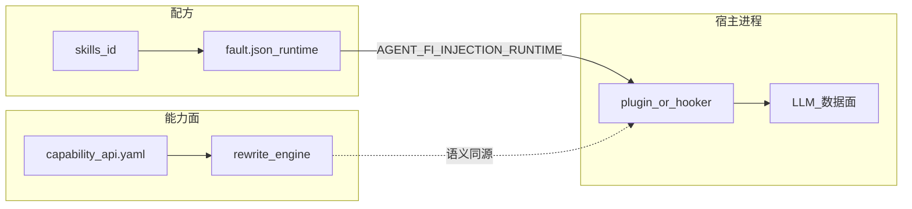
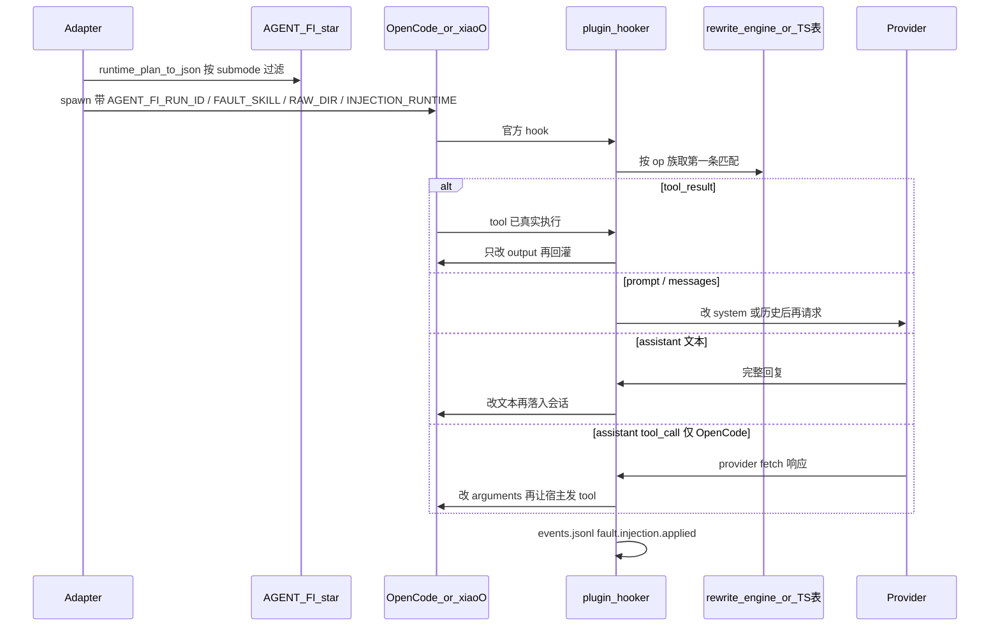
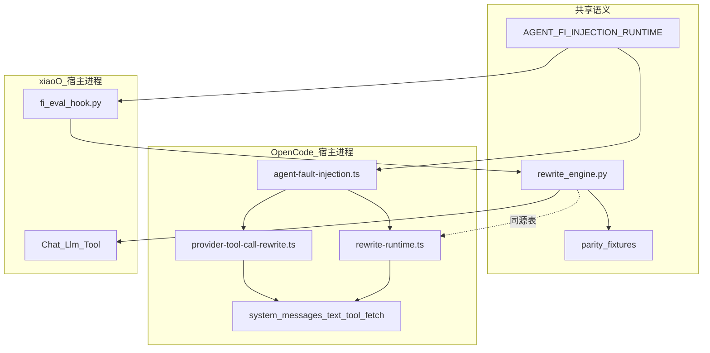
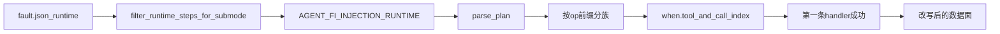
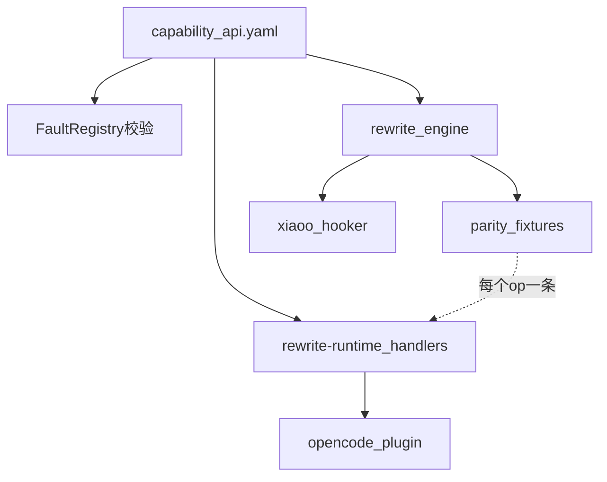

# 运行时故障注入：工具结果篡改 / 提示词修改 / 拦截改写

> 范围：仓根 `agent_fault_injection/fault_inject/injection/rewrite_engine.py` + 平台插件 / Hooker。  
> 状态：✅ 已落地（OpenCode 全挂点；xiaoO 除 tool-call 参数外对称）。  
> 非侵入：不改 OpenCode / xiaoO 源码，只经官方插件 / Hooker 改 **LLM 数据面**。

---

## 1. 问题与目标

文件层注入（`file_tamper`）改的是 workspace；Skill 剧本改的是 Agent 读到的步骤。这两条都碰不到「这一轮 LLM 实际看到 / 实际发出」的字节：tool 返回、system、历史消息、助手文本、即将发出的 tool 参数。

目标：

| 项目 | 约定 |
|------|------|
| 配方 | `fault.json` 的 `injection.runtime[]` 只引用封闭 `runtime_ops` |
| 语义 SoT | Python `rewrite_engine`；平台薄层不得另写一套 if-chain |
| 热路径 | 宿主进程内改写；**不**每 hook 启 Python 子进程 |
| 证据 | 可选 `fault.injection.applied` 事件；**不**写 `runtime-*.before/after.txt` 自证快照 |
| Judge | 看轨迹 / 终答 / 终态 workspace，不以注入快照为必要条件 |

非目标：改模型权重；在宿主源码里打补丁；完整 Ports 六边形；面向故障作者开放「注册新 op」；xiaoO 对称实现 `assistant.tool_call.replace_argument`（本轮 OpenCode 优先）。

五类 `injection_method` 的产品划分见故障模式插件方案；本文只覆盖三条 **runtime 数据面**：`prompt_modify` / `tool_result_tamper` / `intercept_rewrite`。`skill_inject` 可附带 `injection.runtime`（如 S4），仍走同一引擎。

---

## 2. 三维模型

| 轴 | 含义 | 本仓落点 |
|----|------|----------|
| **注入方式** | 怎么碰到数据面 | catalog `injection_method` + runtime op |
| **故障类型** | 注入什么语义 | `fault_inject/skills/<id>/` |
| **变异模式** | Semantic vs Structure | runtime op 实现策略（P0 均为 Structure：字面替换 / 追加 / 丢历史） |



---

## 3. 端到端路径

Adapter 公共步骤把过滤后的 runtime plan 塞进环境变量；宿主启动后插件 / Hooker 读一次，在官方挂点上 **就地改写** 即将送给模型或刚从工具返回的对象。



关键约束：

- 无 `AGENT_FI_RUN_ID` + `AGENT_FI_FAULT_SKILL` + `AGENT_FI_RAW_DIR` → 插件 / Hooker **空实现**，不影响日常宿主。
- `when_submode` 在组 env 时过滤（`filter_runtime_steps_for_submode`），热路径不再看子模式。
- 含 `assistant.tool_call.*` 时 `AGENT_FI_EXPOSE_FAULT_SKILL=0`，不把故障 Skill 指令推给 Agent。
- OpenCode 必须 **mutate in place**（`output.system.push` / splice `messages`）；对 `output.system = …` 赋值是静默空操作。

---

## 4. 设计决策

| 编号 | 决策 | 理由 |
|------|------|------|
| D-001 | 表驱动同源：Python SoT，TS 只接线 | 避免 OpenCode / xiaoO / 单测三套语义 |
| D-002 | 热路径不启 Python 子进程 | hook 在 LLM 延迟预算内；OpenCode 用 TS handlers 表 |
| D-003 | 每族 **第一条匹配即停** | 配方可叠加多步，运行时确定、可对拍 |
| D-004 | Structure 替换，不跑 LLM 生成变异 | P0 可复现；Semantic 变异未做 |
| D-005 | 不写自证 before/after 快照 | Judge 以轨迹为准，避免注入工具自证 |
| D-006 | tool-call 参数走 provider `fetch` | OpenCode 无稳定的「即将发 tool」hook；xiaoO 本轮不对齐 |

否决：每 hook `python -c rewrite_engine`；在主插件文件写业务 if-chain；把 `execution.jsonl` 当 Judge 真源。

---

## 5. 平台挂点

### 5.1 设计意图

宿主差异只允许出现在 **「何时能摸到哪一块数据面」**，不允许出现在 **「改写算不算成功」**。OpenCode 用 TypeScript 插件，xiaoO 用 Python Hooker；两边挂的官方点不同，但 op 语义、`when` 匹配、第一条命中即停，必须同一套。

因此分层是：

| 层 | 职责 | 禁止 |
|----|------|------|
| 官方 hook | 拿到可变对象、计数、写 `events.jsonl` | 内嵌 `from`/`to` 业务分支 |
| 改写引擎 | 解释 `runtime_ops` | 知道 OpenCode / xiaoO 的 hook 名 |
| Adapter | 装插件 / Hooker、组 `AGENT_FI_*`、把 TS lib 拷进隔离目录 | 在 `execute` 里复制改写逻辑 |

不改宿主源码：升级 OpenCode / xiaoO 时只跟官方 hook 契约，不跟内部函数。无 `AGENT_FI_*` 三件套时挂点返回空实现，插件可留在用户机上而不污染日常会话。

### 5.2 架构：两种接线、一块数据面



OpenCode 隔离目录：入口只进 `.opencode/plugins/agent-fault-injection.ts`；`rewrite-runtime.ts` 与 `provider-tool-call-rewrite.ts` 进 `.opencode/lib/`（相对 `../lib/` 导入）。**勿进 `plugins/`**，也不整目录扫 `plugin/*.ts`——OpenCode 会把 plugins 下每个 `.ts` 当独立插件加载，lib 被扫进去会双实例或加载失败。Adapter 安装时把这两份 lib **拷到 workspace**，缺 sibling 时宿主静默跳过插件且不写 `plugin-ready`。

xiaoO：Hooker 由 stdin JSON 进、stdout JSON 出，按 `hook_point` / `stage` 分成 Chat / Llm / Tool 三族。同解释器 `import rewrite_engine`，仍 **不是** 每 hook 再 spawn Python。

### 5.3 挂点对照

| 数据面 | 意图 | OpenCode | xiaoO |
|--------|------|----------|-------|
| System / Prompt | 请求发出前改 system 部件 | `experimental.chat.system.transform` | `*.Chat.system.transform`（或 `--system` 回退） |
| Messages | 改即将送给模型的历史 | `experimental.chat.messages.transform` | `*.Llm.complete.pre` |
| Assistant 文本 | 模型已生成、写入会话前改字面 | `experimental.text.complete`（`chat.message` 仅非 user 回退） | `*.Llm.complete.post` |
| Assistant tool 参数 | 模型已选 tool，**执行前**改 arguments | provider `fetch` 拦 JSON/SSE | **未对称落地** |
| Tool 结果 | 工具 **已真实执行** 后改 output | `tool.execute.after` | `*.Tool.*.post` |

挂点选择的理由：

- **system 每轮重做**：宿主会重建 system；runtime `system.*` 必须可重复应用，激活指令（「去 load 故障 Skill」）只首轮插入。
- **messages 以 needle 去重**：会话重建可能丢掉仅内存中的 transform；xiaoO pre hook 会重放直到 JSON 里已有注入文本。
- **assistant 文本走 complete 而非 user 入站**：`chat.message` 在标准 OpenCode 是 user-inbound；只在非 user 且能看到 `from` needle 时回退，避免把 prompt 当面改掉。
- **tool 结果跳过 `skill` 工具**：Skill 加载本身是激活通道，不在这条路上篡改，以免激活失败被伪装成「已注入」。
- **tool-call 走 fetch**：OpenCode 没有稳定的「即将发 tool」官方 hook；只能在 provider 响应（JSON / SSE）里改 `arguments`，再让宿主按改写后的调用去执行。xiaoO 本轮不对齐，配方若依赖此 op 在 xiaoO 上等于空操作。

OpenCode 必须 **mutate in place**（`push` / `splice`）；`output.system = 新数组` 是静默空操作，属于宿主契约，不是风格问题。

---

## 6. runtime 步骤契约

### 6.1 设计意图

配方作者只声明 **「在什么条件下，对哪一块数据面做哪种结构变换」**，不声明平台、不声明 Judge。能力面把变换收成封闭 op，运行时用同一套匹配规则，保证：

1. 加故障不能发明 `file.patch` / `llm.mutate` 这类新原语。
2. 热路径确定：同族扫描，**第一条成功改写即返回**（可对拍、可复现）。
3. 子模式在组 env 时裁掉，hook 内不再解析 `when_submode`，避免 Python / TS 再分叉一套过滤。

`injection_method` 是产品标签（UI / catalog）；`injection.runtime[].op` 才是机制。二者可以并存（`skill_inject` + `system.append` 的 S4），以 `fault.json` 为准，不要靠推断。

### 6.2 架构：计划编译 vs 热路径解释



| 阶段 | 在哪 | 做什么 |
|------|------|--------|
| 编译 | Adapter `build_fi_injection_env` | 按任务子模式丢掉 `when_submode` 不匹配的步；序列化 JSON |
| 解释 | 插件 / Hooker 每次 hook | 读环境变量数组；按 op 前缀选族；`when` 过滤；调 handler |
| 计数 | `raw/runtime-*-call-counts.json` | tool / assistant / assistant-tool **1-based**，跨 hook 调用持久化 |

计划是 JSON 数组，不是图、不是 DSL。胶水 `runtime_env.py` 只做过滤与序列化，**不是**第三套 plan 语言。

### 6.3 步骤字段

```json
{
  "op": "tool_result.replace_text",
  "when": { "tool": "read|file_read|Read", "call_index": 1 },
  "when_submode": "4",
  "args": { "from": "\"stock\": 2", "to": "\"stock\": 20" }
}
```

| 字段 | 规则 |
|------|------|
| `op` | 必须是 `capability_api.yaml` 的 `runtime_ops`；未知 op 热路径跳过，不算 applied |
| `when.tool` | 可选；`*` / 空 = 全匹配；否则 **整串 fullmatch**（OpenCode：`^(?:pattern)$`）。用 `read\|file_read\|Read` 覆盖宿主别名，禁止子串误伤 |
| `when.call_index` | 可选整数；该 tool（或 assistant 文本 / assistant-tool）计数；缺省则该 tool 每次都可命中，由「第一条成功」收敛 |
| `when_submode` | 可选；只在组 env 时生效，热路径不可见 |
| `args` | 随 op：替换类要 `from`/`to`；`system.append` / `messages.inject` 要 `text`；`assistant.truncate` 要 `max_chars`；tool-call 要 `path` + `from`/`to` |
| 匹配顺序 | 同族（`tool_result.*` / `system.*` / `messages.*` / `assistant.*`）从头扫，**第一条** handler 返回成功即停 |

封闭 op：

```yaml
runtime_ops:
  - tool_result.replace_text
  - tool_result.replace_all
  - system.append
  - system.replace_text
  - messages.history.drop
  - messages.inject
  - assistant.replace_text
  - assistant.truncate
  - assistant.tool_call.replace_argument
```

`replace_text` 与 `replace_all` 现网语义相同（全局 `replace`）；保留两个名字是能力面稳定，配方不要当成「只换一次 vs 全换」。`assistant.tool_call.replace_argument` 的 `path` 是点分字段（禁 `__proto__` / `prototype` / `constructor`）；仅当叶值 **全等** `from` 且不同于 `to` 才改。含此 op 时不向 Agent 暴露故障 Skill（`AGENT_FI_EXPOSE_FAULT_SKILL=0`），否则模型会按剧本「故意选错」，与拦截改写叠床架屋。

### 6.4 产品边界（method × 挂点）

三条 runtime method 对应 **不同时刻的数据面**，混用挂点会让 Judge 分不清「模型看错了」还是「工具真错了」。

| method | 改什么 | 不改什么 |
|--------|--------|----------|
| `tool_result_tamper` | 工具 **已经执行完** 的 output，再喂回模型 | 跳过真实执行去伪造结果；不改即将发出的 arguments |
| `prompt_modify` | system / 显式 prompt 文本 | Skill 装载剧本本身（`skill_inject`）；不改 tool output |
| `intercept_rewrite` | 下一轮请求里的历史 / 伪造消息；或助手已生成文本 / tool 参数 | 工具返回值（走 `tool_result.*`） |

`messages.inject` 的 `position`：`merge_user` / `prepend` / `append` 都并入已有 user 消息（needle 已在会话 JSON 里则跳过，防重复注入）；其它值才追加独立消息。`messages.history.drop` 从尾部丢非 system 条，保留 system，避免把故障激活指令一并删掉。

---

## 7. 表驱动同源与能力面门禁

### 7.1 设计意图

OpenCode 热路径必须是 TS（hook 在 LLM 延迟预算内，不能 `spawn python`）。xiaoO 热路径已经是 Python。若两套各自写 if-chain，op 语义必然漂。因此：

- **语义 SoT** 只有 Python `rewrite_engine`（函数按数据面分：`apply_tool_result_rewrite` 等）。
- OpenCode `rewrite-runtime.ts` 是 **同一张 op→handler 表的移植**，不是第二套产品逻辑。
- 对拍 fixture 锁住「每个 `runtime_ops` 至少一条期望」；缺 fixture = 能力面未完成。

主插件 / Hooker **只许**选挂点、维护 call_index、写 events。业务「从 A 换成 B」只许出现在 handlers 表或 `rewrite_engine`。

### 7.2 架构：一份名单、三个消费者

```text
capability_api.yaml                 封闭名单（能力面真源）
        │
        ├─ catalog 校验 fault.json     配方不得引用名单外 op
        ├─ rewrite_engine.py           xiaoO Hooker / 单测直接调用
        └─ test_rewrite_parity_fixtures.py
                │
                └─ 期望约束 rewrite-runtime.ts handlers
                         │
                         └─ plugin 只 import apply* 接线
```



否决的形状：每 hook `python -c` 调引擎（延迟 + 进程抖动）；在 `agent-fault-injection.ts` 里写 `if (faultSkill === …)` 改写（除现网 `tool-argument-error` 的 **评测夹具 native tool** 外，不得再加业务故障分支）；把 provider fetch 解析逻辑拷进插件入口。

### 7.3 新增 runtime op

禁止夹在「加一个故障模式」的 PR 里。顺序：

1. `capability_api.yaml` 列入 `runtime_ops`
2. `rewrite_engine.py` 实现 + `test_rewrite_parity_fixtures.py` 加一条
3. `rewrite-runtime.ts` 的 `handlers` 表加同名项（`assistant.tool_call.*` 另接 `provider-tool-call-rewrite.ts`）
4. 如需新挂点，只加接线，不把匹配规则写进插件入口
5. 禁止在主插件文件写业务分支

未走完 1–3 的 op，配方引用应被 catalog 拒绝。平台差异（某 op 仅 OpenCode 有挂点）由引擎 / Adapter 承担，配方 **不** 写 `platforms`。

---

## 8. 配方与示例

### 8.1 设计意图

配方回答「测哪种语义故障」；runtime 步骤回答「用哪条封闭 op 碰到数据面」。Insight 任务表单 / 实验 YAML 只选自包含故障，**不再**维护包内 `configs/*` 示例目录——示例真源就是 `skills/<id>/fault.json`。

混合故障的架构：`injection_method` 取 **主通道**（Agent 先 load Skill 的标 `skill_inject`），机械改写放 `injection.runtime` 并用 `when_submode` 限定场景。不要为 S4 另建一个故障 id。

### 8.2 现网对照

| 意图 | method | 示例 | 机制 |
|------|--------|------|------|
| 工具观测似真偏移，诱导错误决策 | `tool_result_tamper` | `tool-observation-delta`；smoke `tool-result-token` | 真实 `read` 之后把 `"stock": 2` 换成 `20` |
| 约束互斥 / 覆盖 system | `skill_inject` + runtime S4（展示亦可叫 prompt） | `planning-logic-error`@4；smoke `prompt-system-token` | `system.append` 硬覆盖终答规则 |
| 把假先验写进下一轮上下文 | `skill_inject` + runtime S4 | `memory-noise-interference`@4；smoke `history-inject-token` | `messages.inject` merge 进 user |
| 改助手已得出的中间结论再回灌 | `intercept_rewrite` | `intermediate-conclusion-drift`；smoke `assistant-corruption-token` | `assistant.replace_text`（complete 之后） |
| 模型选对了 tool/Skill，执行前掉包参数 | `intercept_rewrite` | `skill-selection-conflict`（skill `name`）；`tool-argument-error`（`order.txt`） | `assistant.tool_call.replace_argument` + `call_index: 1` |

`skill-selection-conflict` 同时用 `file.write` 把正确 / 诱饵 Skill 放进 workspace——那是 **文件层**，与 runtime 掉包 `name` 正交：没有文件层，改参数会指向不存在的 Skill；没有 runtime，模型若自己选对则诱饵不会被调用。

TOKEN smoke 下沉到探针故障，用来验证挂点打通，不占用业务故障 id。

---

## 9. 证据与 Judge

- **不再**由注入工具 / 插件强制写 `runtime-*.before/after.txt`
- 改写成功可记 `raw/events.jsonl`：`kind=fault.injection.applied`，payload `kind` = `tool_result` \| `prompt` \| `messages` \| `assistant` \| `assistant_tool_call`
- Judge：**轨迹、终答、终态 workspace 为主**；遗留快照或事件仅可选，缺省不是必要条件
- `injectionEvidence` 已从 collect 协议移除

---

## 10. 修订

| 日期 | 说明 |
|------|------|
| 2026-08-13 | 扩充 §5–§8：挂点架构、步骤编译/解释、同源消费者、配方意图 |
| 2026-08-10 | 吸纳独立仓业务语义故障；新增 `assistant.tool_call.replace_argument`；TOKEN 探针下沉 smoke |
| 2026-08-10 | `injectionEvidence` 从 collect 协议移除；对外注入方式统一为五类（`route_manipulate` 已废） |
| 2026-08-06 | `injectionEvidence` 产品字段废弃；本机 Judge / evaluation.py 删除 |
| 2026-08-05 | 边界重划：injection 仅能力；不写自证快照；Judge 看轨迹/终答 |
| 2026-08-04 | 意译五 key；落地 prompt + intercept；第六类 route 预留后废弃 |
| 2026-08-04 | 初版 L3 runtime FI |
