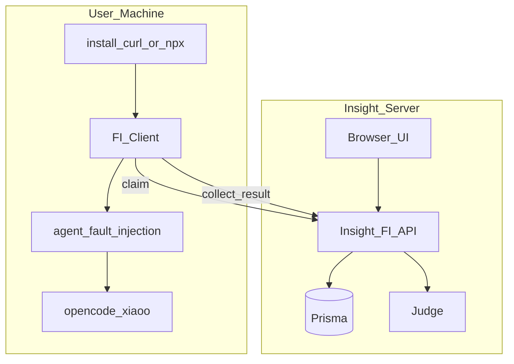

# FI 服务端 / 客户端分离

> 范围：Insight FI 控制面 + 本机 FI Client（Worker）+ 仓根 `agent_fault_injection/`。  
> 状态：✅ 已落地（2026-08-05）— 浏览器 E2E：无 Worker 提示 / Worker inventory / claim→collect-result  
> 现网以本文为准。历史 SDD 在 `docs/design/fi-server-client-split/`。

---

## 1. 问题与目标

历史路径：Insight Next **同机 spawn** Python CLI。服务端能 `which` 到本机 Agent、把 workspace 展开成**服务器**家目录，远程部署后主路径必错；保留 opt-in spawn 会双路径漂移。

目标：

| 项目 | 约定 |
|------|------|
| 控制面 | Insight 只写库、展示、Judge；**不**跑注入 |
| 执行面 | 用户本机 **FI Client**（[`scripts/fi-worker.js`](../../../../scripts/fi-worker.js)）主动 heartbeat / claim / 回传 |
| 注入语义 | 仍在 `agent_fault_injection` CLI；Worker 只拼参数、管进程、上传 |
| 安装 | curl `/api/fault-injection/setup` 与 `install-fault-injection`，对齐 RAS「本机能力」 |
| 数据 | 权威库在服务端 Prisma；本机 `~/.agent-insight/fault-injection/` 只是运行目录 |

非目标：浏览器直连本机 Worker；WebSocket 推送；无常驻进程、按需拉起；服务端再开 spawn / dry-run stub；FI collect 合成 RAS 异常。

---

## 2. 角色边界

```text
Insight 服务端     UI · Task/Run CRUD · 租约 sweep · collect-result → Judge · 故障 catalog（包内 Python）
FI Client          常驻 Worker：协议 + 本机 inventory + spawn CLI + 杀进程组
注入引擎           agent_fault_injection：配方、Adapter、采集产物
被测宿主           OpenCode / xiaoO（与 Worker 同机）
```

UI 只写库；Worker 主动拉活。服务端不得假设能打开本机 artifacts。故障名单走 Insight 部署包内 registry，**不**依赖用户本机 Python；平台/Agent/Model 名单只信在线 Worker inventory，禁服务端 `which` 冒充用户机。

---

## 3. 目标拓扑



单机调试 = 服务端进程 + FI Client **两角色**，不是 Next 内嵌采集。

---

## 4. 设计决策

| 编号 | 决策 | 理由 |
|------|------|------|
| D-001 | 彻底去掉服务端 spawn | 与「远程 Insight + 本机能力」一致；留 spawn 必漂 |
| D-002 | 短轮询 claim + DB 条件更新 | 与 ingest HTTP/fail-open 同风格；MVP 不用 WS；`updateMany` `count===1` 防双领 |
| D-003 | Node Worker 包装 Python CLI | 复用已验证注入引擎；安装器与 `install-ras.js` 同为 Node |
| D-004 | Workspace 仅本机解析 | 服务端禁止 `homedir` 展开后写入跨主机绝对路径 |
| D-005 | 真实采集一律经 Worker | 已删除 dry-run / stub 创建入口；联调也走 claim |

否决：服务端 opt-in spawn；浏览器直连 Worker；无常驻、仅按需拉起（claim/stop 不及时；FI 需要实验进程生命周期，不同于 RAS inproc）。

---

## 5. 整体实现框架

实现不是「Next 调 Python」一条链，而是 **拉模式编排**：服务端是状态机 + 权威库；本机 Worker 是唯一执行器；Python CLI 是唯一注入/采集实现。三块通过 HTTP 契约拼起来，进程边界不得再交叉。

### 5.1 四层与代码落点

```text
浏览器 UI
  └─ /api/fault-injection/*          Next Route（薄：鉴权 + 调 lib）
        ├─ worker-protocol.ts        租约 / heartbeat / inventory 缓存
        ├─ store.ts                  建 Task+Run、ingest、Judge、聚合进度
        ├─ workspace.ts              逻辑 workspace 归一（服务端永不展开 homedir）
        ├─ compose-prompt.ts         建任务时合成「使用 <skill>，执行<场景>」
        ├─ engine.ts                 仅：包内 spawn Python 读故障 catalog / SKILL.md
        └─ judge.ts                  服务端评判（getActiveConfig）
Prisma   FaultInjectionTask / Run / Worker

本机安装面
  GET /setup → bash → install-fault-injection.js
       写 ~/.agent-insight/fault-injection/config.json
       pip 装 agent_fault_injection
       拉起 fi-worker.js（默认后台）

本机 FI Client（fi-worker.js，唯一进程管家）
  tick: heartbeat → claim → spawn CLI → 读 artifacts/<runId>/collect-result.json → upload
  stop: 杀 CLI 进程组（Unix `kill -pid`）
  禁止 spawn RAS / DaemonRasSession

注入引擎（用户机 python -m agent_fault_injection.cli）
  run：装 Skill / 应用 fault.json / 跑 Adapter / 写产物
  platform inventory --json：本机探测 opencode/xiaoo
```

约束：**kill / artifact 路径 / CLI argv 只在 Worker**。`engine.ts` 不得再实现 `runCollector`。API 路由不得直接 `spawn` 注入。

### 5.2 两条 Python 路径（必须分开）

| 谁 spawn | 跑在哪 | 做什么 | 不做什么 |
|----------|--------|--------|----------|
| Insight `engine.ts` | **服务端**（包内 `agent_fault_injection/`） | `FaultRegistry` + UI catalog：故障 id / 标签 / 子模式 / SKILL.md | 不跑 Agent、不写用户 workspace |
| Worker `fi-worker.js` | **用户本机** | `cli run`（注入+采集）、`cli platform inventory` | 不读 Prisma、不跑 Judge |

故障目录可以远程展示，因为配方在 npm/仓包里；平台是否就绪只能本机 inventory 经心跳上报。无在线 Worker 时 `POST /tasks` 返回 503，不落库假跑。

### 5.3 主链路如何实现

**① 启用 Client。** 页面无 Worker 时给出带当前用户 Key 的 curl。`GET /setup` 返回 bash：有仓则 `node scripts/install-fault-injection.js --start`，否则空目录 `npx agent-insight install-fault-injection --start`。安装器写 `config.json`（`insightBaseUrl` / `apiKey` / `workerId` / `maxParallel` / `pollIntervalMs` / `workspaceBase` / `artifactsDir`），装 Python 包，后台拉起 Worker。Key 必须对应当前登录账号；换 Key 重跑 setup 会重启已有 Worker。

**② 上报能力。** Worker 启动时 `python -m agent_fault_injection.cli platform inventory --json`，结果放进 heartbeat 的 `inventoryJson`。UI 的 platforms/agents/models/health **只读** `lastSeenAt` 未过期的 Worker 缓存（在线窗口 `min(claimTimeout, 60s)`）。服务端禁止用自己的 PATH 冒充。

**③ 建任务（只写库）。** UI `POST /tasks`：校验在线 Worker 且该平台 `ready` → `normalizeFiWorkspaceInput` 把空/`~`写成 `__default__` → `createTaskWithRuns`：一条 Task + N 条 `status=queued` 的 Run。每条 Run 的 `requestJson` 已含合成后的 prompt、逻辑 workspace、model、timeout。**此处不 spawn、不 claim。**

**④ Worker 拉活。** 每 `pollIntervalMs`（默认 2000）一轮：

1. `POST /worker/heartbeat`（workerId、inventory、busySlots）→ 服务端先 `sweepStaleClaims` 再 upsert Worker。
2. `POST /worker/claim`（`limit = max(0, maxParallel - busy)`，服务端再 cap 8）→ 再 sweep，再原子认领，响应 `{ runs, commands }`。
3. `commands[].type=stop` → `killRun`（进程组）。
4. 对每条 run：本机解析 workspace → `mkdir` → `python -m agent_fault_injection.cli run --run-id … --platform … --agent … --fault … --prompt … --workspace <已解析> --output-dir <artifactsDir> …`（**全参数**，runId 不是唯一入参）。
5. CLI 退出后读 `artifactsDir/<runId>/collect-result.json`（允许子目录）；非 0 仍优先用已写出的产物。
6. `POST /runs/:runId/collect-result`。失败则带 `error` 再传一次。`busy` 在 in-flight Promise 里加减，限制本机并行。

Worker **不得** import / spawn RAS。同机 RAS 是否在场只取决于宿主是否已挂 RAS 插件，与本次 claim 无关。

**⑤ 回传入库 + 评判。** collect-result 路由按 `run.user === apiKey 用户` 找 Run。写入与评判拆开：`persistFiCollectIngress` 只更新 `FaultInjectionRun`，再 `finishFiJudgeFromDb` **只读 Prisma**。禁止用上传 body 当评判/展示真源；服务端不打开本机 artifacts。

- 已 `stopped` 且无 partial → **409**，Worker 丢弃。
- 用户 stop 且无 FI 信号（无 markers / 未激活 / 无 Trace ID）→ 只标 `stopped`，不 Judge。
- 有 `error` 且无 FI 信号 → `failed`。
- 否则写入 markers / `faultActivated` / Trace ID，再 Judge；`refreshTaskProgress` 聚合 Task。
- stop 且已有部分产物：先 ingest，再强制 `stopped`，不留 completed 绿灯。

collect **不**写/覆盖 `Session.interactions`，**不** `saveExecutionRecord`，**不**合成 `RasAnomalyEvent`。无观测行时排查 Insight 采集器，不用 FI collect 兜底造行。

**⑥ 停止。** `POST /tasks/stop` `{ taskIds }`：仍 `queued` 的立即 `stopped`（claim 时也会把 `queued+stopRequested` 清掉，不发给 Worker）；已 `collecting` 只设 `stopRequested`，等 Worker 在下一轮 claim 的 `commands` 里杀进程再上报。

**⑦ 展示。** Run 页 `/agent-ras/fault-injection/runs/[runId]`：Session + FI markers，可选并列真 RAS（**分源**，禁止把 FI 标成 RAS）。可靠性 `/agent-ras/trace` 只索引平台真实上报的根 `Execution` + 真 RAS ①。同 Trace ID 可互跳，不表示 FI 归属 RAS。

### 5.3.1 Trace join

| 产物 | 角色 |
|------|------|
| `interactions.json` | 仅 markers + Trace ID；`interactions` 恒为 `[]` |
| `trajectory.jsonl` | 评测侧事件日志；**不是** Session 合并格式 |
| `raw/session.json` | **不是** Trace ID 契约；OpenCode FI 不写 |

`taskId` = 平台原生 session（OpenCode `ses_…`、xiaoO gateway UUID），产品称 **Trace ID**，对齐时写入 `FaultInjectionRun.sessionTaskId` → Prisma `Session`（⓪）。`runId` 只标识本次 FI 实验。**禁止**用 `runId` 冒充 `taskId`。拿不到平台 session 时 `sessionAligned: false` 且 `taskId` 为 null。对话树字段形状以 [`agent-trace.ts`](../../../../src/lib/engine/observability/agent-trace.ts) 为准，本文不复制。

### 5.3.2 服务端 Judge

实现：[`judge.ts`](../../../../src/lib/fault-injection/judge.ts) + [`fault-injection-judge.ts`](../../../../src/prompts/fault-injection-judge.ts)；模型 `getActiveConfig`。本机 Python Judge / CLI `--judge*` 已删除。

| 项 | 约定 |
|----|------|
| 输入 | Prisma `Session.interactions`（`summarizeTrace`）+ `FaultInjectionRun` 故障元数据；无 `injectionEvidence` |
| 主依据 | 轨迹 / 终答 / 终态 workspace |
| 输出 | `outcome` × `faultContainmentStatus` |
| 合法组合 | `occurred×unresolved\|recovered`；`not_occurred×prevented\|inconclusive` |
| 历史 `no_trace` | 读路径映射 `inconclusive`（证据不足，不是「无轨迹」） |
| 无模型 | `judge_skipped` |
| `rejudge` | 只重读库 |

**Session 门闩：** `sessionAligned` 且已激活时，轮询 Prisma `Session`（默认最多 120s，`FI_JUDGE_SESSION_WAIT_MS` / `FI_JUDGE_SESSION_POLL_MS`），直到 `interactions` 含 assistant 轮次或 `endTime` 已写入（避免仅有 user 首条就评判）。超时仍未就绪 → `failed`（`session_trace_not_ready`）。

### 5.4 认领与租约如何落地

认领在 [`worker-protocol.ts`](../../../../src/lib/fault-injection/worker-protocol.ts)，不在路由里手写 SQL。

**防双领：** 先 `findFirst` 下一条 `user + queued + !stopRequested`（`queuedAt` 升序），再对该 `id` `updateMany({ status: queued, stopRequested: false })` → `collecting` 并写 `workerId`/`claimedAt`。`count!==1` 则这条已被别人领走，换下一条。禁止「读出来再无条件 update」。

**租约回收：** 每次 heartbeat/claim **入口** `sweepStaleClaims`（同 user）。`AGENT_INSIGHT_FI_CLAIM_TIMEOUT_SEC` 默认 300、下限 60。`collecting` 且 Worker 失踪或 `claimedAt` 过期：有 `stopRequested` → `stopped`，否则回 `queued` 清空 `workerId`，允许别的 Worker 重试。不另建 cron。

Claim 回包字段（Worker 原样变成 CLI argv）：`runId, platform, agent, fault, submode, prompt, model, workspaceLogical, timeoutSeconds`。

### 5.5 Workspace 如何落地

| UI 输入 | 服务端写入 `Task.workspace` / Run.requestJson | Worker |
|---------|-----------------------------------------------|--------|
| 空 / 省略 / `~` / `~/…` | `__default__` | `config.workspaceBase` |
| 相对路径 | 原文 | `resolve(workspaceBase, relative)` |
| 绝对路径 | 原文（视为**用户本机**） | 原样传 CLI |

服务端 [`workspace.ts`](../../../../src/lib/fault-injection/workspace.ts) 只做归一，**从不** `os.homedir()`。Worker `resolveWorkspace` 是唯一展开点。

### 5.6 权威数据 vs 本机目录

| 层 | 位置 | 职责 |
|----|------|------|
| 权威业务 | Prisma `FaultInjectionTask` / `Run` / `Worker` | 状态、Judge、inventory 缓存；UI 只读此层 |
| 本机运行目录 | `~/.agent-insight/fault-injection/` | config、workspaces、artifacts、worker.log；**不是**展示真源 |

Run 关键列：`workerId`、`stopRequested`、`queuedAt`、`claimedAt`、`sessionTaskId`（Trace ID）、`faultActivated`。创建即为 `queued`。  
Worker 行：`workerId`（`fi-worker-<hostname>-<hex>`）、`user`、`lastSeenAt`、`inventoryJson`、`busySlots`。

---

## 6. 控制面一览

鉴权：Worker 必须 `x-witty-api-key` → user。`maxParallel` 默认 5。

| 接口 | 行为 |
|------|------|
| `POST/GET /tasks`、`GET /task/:taskId` | 创建只落库；无 Worker → 503 |
| `POST /tasks/stop`、`POST /tasks/delete` | stop：queued 立即停；collecting 只标意图 |
| `POST /task/:taskId/rerun` | 目标 Run 重新标 `queued` |
| `GET /runs/:runId`、`GET .../trace`、`POST .../rejudge` | 展示 / Trace join / 只读库重评 |
| `POST /worker/heartbeat` | sweep + 续命 + inventory |
| `POST /worker/claim` | sweep + 原子认领；带 `runs` 与 stop `commands` |
| `POST /worker/commands` | 同等 stop 拉取（主循环用 claim 附带即可） |
| `POST /runs/:runId/collect-result` | persist Run 后只读库 Judge |
| `GET /platforms*` `/health` | 读在线 inventory；禁假目录 |
| `GET /setup` | bash 安装脚本（query 带 key） |
| `GET /faults` | 服务端包内 Python catalog |

Task 聚合：任一 Run `collecting`/`judging` → `running`；全部仍 `queued` → `queued`（不得写死 `running`）；终态 failed > stopped > completed。

---

## 7. Run 状态

```text
queued ──claim──► collecting ──upload──► judging ──► completed | judge_skipped | failed
  │                    │
  │ stop（入队未领）     │ stop 意图 + kill / 超时 sweep
  ▼                    ▼
stopped              stopped
collecting ──租约超时且未 stop──► queued（可被其他 Worker 重试）
```

---

## 8. 可靠性与安全（取舍）

| 场景 | 策略 |
|------|------|
| 无 Worker | 任务不可创建（503）或已入队则保持 `queued`；服务端绝不代跑 |
| Worker 崩溃 | sweep 回 `queued` 可重试 |
| CLI 非 0 但已写产物 | Worker 仍上传该 collect-result |
| 上传闪断 | 本地 artifacts 仍在，下一轮/重试 POST |
| Stop 延迟 | 最多约一个 pollInterval；queued 立即停 |
| setup URL 含 key | 与 ingest setup 同等泄露面；HTTPS + 可轮换 |
| 越权 claim | 始终按 apiKey→user；upload 校验 `run.user` |

---

## 9. 废弃

- Next 同机 spawn collector / `queue.ts` 泵 / 服务端 `which` 冒充本机预检
- 创建任务 dry-run stub（`buildStubCollectPayload` 产品入口）
- 服务端把 workspace 展开成自家 homedir
- FI collect 合成可靠性 `Execution` / RAS 异常事件
- Worker 与 RAS 杂交 runner（历史上误用 `fi_daemon_runner`）
