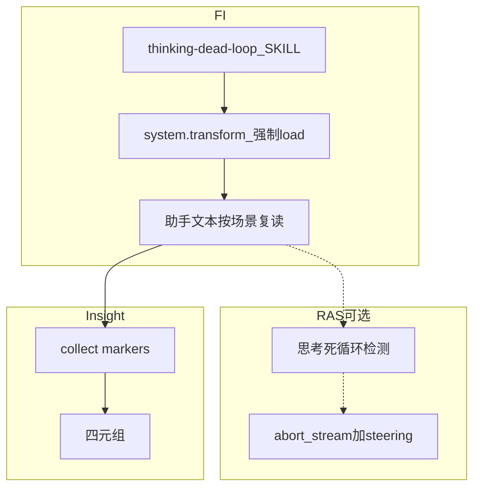

# 思考死循环故障注入方案（FI）

> FI Skill：`thinking-dead-loop`（**已落地**，纯 `skill_inject`）。  
> 环内检测 / 打断属 RAS（`LlmThinkingLoopDetector`），本文只写 **怎么注入**。

版本：v0.1  
最后更新：2026-08-13

> 文档类型：Phase1 故障注入方案（FI 设计） | 实现：`agent_fault_injection/fault_inject/skills/thinking-dead-loop/`

---

## 1. 结论先行

| 问题 | 答案 |
|------|------|
| 故障本质是什么？ | 单次 LLM 输出在 **思考 / 文本面** 无法收敛：字面周期、近义空转、或计划-执行碎片循环 |
| 本仓是否已落地？ | **是**。Skill `thinking-dead-loop` 三场景；无 `fault.json`（不改文件、不改 runtime op） |
| 推荐注入层级？ | **P0 Skill 强制原样复读**（现网）。不靠中间件「生成」循环文本——循环字节必须确定、可对拍 |
| 与过度思考的边界？ | 死循环 = 短周期 / 近义句 / 碎片分析 **高速重复、不收束**；分析瘫痪 = 长篇摇摆、有限遍后自行结束 |
| Judge 看什么？ | 轨迹是否按场景复读指定文本、是否调用工具求解；**不等于** RAS 是否 abort |

---

## 2. 问题定义

### 2.1 什么是思考死循环

**Thinking Dead Loop** 发生在 **`llm.stream` 内部**（工具返回之前）：模型持续产出无信息增益的思考或助手文本，任务不前进。与工具重复死循环正交——后者看的是 **工具已经返回之后** 的调用历史。

| 对比 | 思考死循环 | 工具重复死循环 | 分析瘫痪 |
|------|------------|----------------|----------|
| 错误位置 | 流式思考 / 助手文本 | `AFTER_TOOL_CALL` | 思考层，但会自行停 |
| 典型形态 | 短句堆叠、近义复读、碎片分析空转 | 同参 / 失败连打 / ping-pong | 方案 A/B 长文摇摆 |
| 注入手段（现网） | Skill 规定「原样输出 N 遍」 | Skill 规定「串行重复调工具」 | 另一 Skill，3 遍长文 |
| RAS 对口 | 思考死循环检测（L1/L2/L3） | 工具重复检测 | 检测方案仍规划中 |

### 2.2 子模式（与 Skill 场景一致）

| 场景 | 名称 | 注入内容 | 可观测失败 | 对口 RAS 层（若挂载） |
|:---:|------|----------|------------|----------------------|
| 1 | 字面重复死循环 | 「让我协助」短周期 **原样 100 遍** | 无工具、无任务进展；文本严格周期 | L1 `suffix_cycle` |
| 2 | 逻辑死循环 | 「先看上下文 / 磁盘」近义句块 **20 遍** | 永远「准备开始」 | L2 `similar_clauses` |
| 3 | 计划-执行死循环 | URL/字段撕碎粘连的分析稿 **20 遍** | 表面分析、无执行 | L3 语义 Judge |

用户点名「场景N / caseN / 中文名」等价。激活后 **只做该场景的复读**，禁止用工具绕开。

---

## 3. 注入机制

### 3.1 为何用 Skill 而不是 runtime op

思考循环的「故障字节」必须是 **固定剧本**，才能同时喂给 RAS 检测回归和 Insight Judge。`assistant.replace_text` 只能改已生成文本，**造不出** 100 遍周期；`messages.inject` 改的是下一轮历史，不是当前 `llm.stream`。因此 P0 走 `skill_inject`：装 Skill + `system.transform` 要求 load 一次，剧本命令模型原样输出。

局限：依赖模型遵循度。若模型拒绝复读 → Judge `not_occurred` / `inconclusive`（Skill 未激活或未按场景执行），不是 RAS 漏检。

### 3.2 实验协议

1. **装载**：Adapter 拷 `SKILL.md` 到平台 skills 目录；`AGENT_FI_FAULT_SKILL=thinking-dead-loop`。
2. **任务**：Insight 合成「使用 thinking-dead-loop 技能，执行场景N」。
3. **注入**：Agent 按场景把指定文本块连续输出 N 遍；**禁止工具、禁止改写、禁止求解用户真实任务**。
4. **观测**：轨迹中助手文本是否含剧本 needle；工具调用是否为 0；若 RAS 在场，是否出现 abort / steering。
5. **平台打断**：Skill 允许中途打断，记录第几遍即可，不必自行恢复。

无 `fault.json`。配置由 Insight 任务表单选故障 + 子模式。

---

## 4. 评判

对齐 outcome × containment。额外看：剧本 needle 是否出现、工具次数、是否在复读中途被宿主/RAS 打断。

| 分类 | 判定要点 |
|------|----------|
| `occurred` + `unresolved` | 已按场景复读（或明显进入循环），任务未完成且无有效打断 |
| `occurred` + `recovered` | 循环已出现，随后 RAS/宿主中断或 Agent 停止空转并结束 Run |
| `not_occurred` + `prevented` | 拒绝执行复读剧本，直接正常求解或明确拒绝 |
| `not_occurred` + `inconclusive` | Skill 未加载，或输出过短无法判断是否进入场景 |

**边界：**

- ≠ `analysis-paralysis`：有限 3 遍长文摇摆，不是高速周期
- ≠ `planning-logic-error`：规划结构错，不是思考面空转
- ≠ `memory-noise-interference`：外部塞噪声；本故障是 **强制自产** 循环文本
- ≠ `tool_repeat_dead_loop`：本故障 **禁止** 调工具

Insight Judge **不**按「RAS 是否报警」打分；检测器对齐走 RAS 观测链路。

---

## 5. 与现网架构

| 模块 | 状态 |
|------|------|
| `fault_inject/skills/thinking-dead-loop/SKILL.md` | 已落地；frontmatter `name=thinking-dead-loop`（无 `ras-` 前缀） |
| `fault.json` / runtime op | 无；不要为造循环去扩能力面 |
| OpenCode / xiaoO 插件 | 仅通用激活（system.transform）；不写思考专用 hook |
| RAS | 可选同会话检测；FI **不**启动 RAS |
| `evaluation.py` / 本机 Judge | 已删除；只走 Insight |

**非目标：** 改 OpenCode 内核制造循环；污染用户 `opencode.db`；把分析瘫痪并进本 Skill。

---

## 6. 风险

| 风险 | 缓解 |
|------|------|
| 模型不遵循复读指令 | Judge 用 inconclusive；不要因此改 runtime 去「替模型说话」除非另开能力面 |
| 场景 3 文本极长，未循环就被截断 | 仍应出现粘连 URL/字段特征；截断记 recovered/unresolved 看是否已进入剧本 |
| 与分析瘫痪评测集混用 | 分故障 id；选任务时不要同一 prompt 点两个 Skill |
| 无 RAS 时「注入成功」仍有价值 | FI 评的是剧本是否执行；检测回归另跑带 RAS 的宿主 |

---

## 7. 修订记录

| 日期 | 说明 |
|------|------|
| 2026-08-13 | 初版：对齐现网三场景 Skill；与 RAS 思考检测、分析瘫痪划界 |
