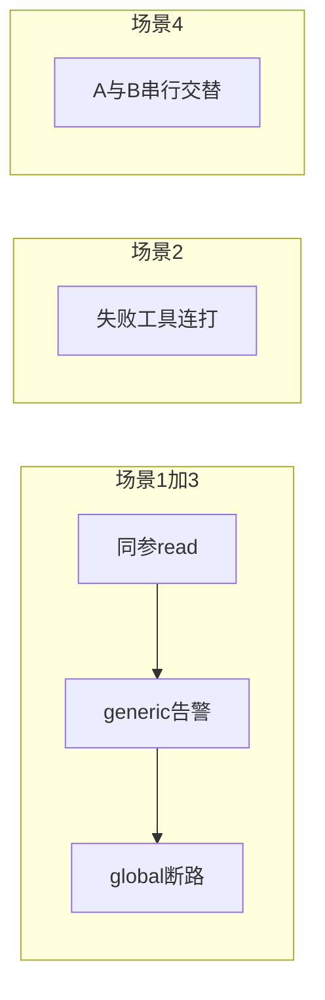
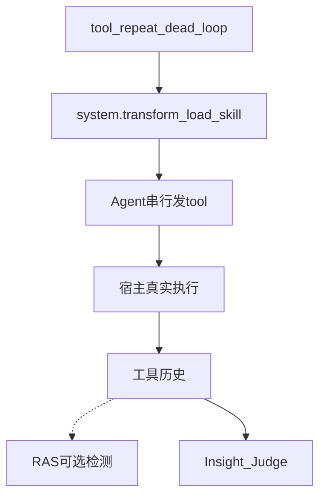

# 工具重复死循环故障注入方案（FI）

> FI Skill：`tool_repeat_dead_loop`（**已落地**，纯 `skill_inject`）。  
> 环内检测 / 纠偏属 RAS（`RepeatToolCallDetector`），本文只写 **怎么注入**。

版本：v0.1  
最后更新：2026-08-13

> 文档类型：Phase1 故障注入方案（FI 设计） | 实现：`agent_fault_injection/fault_inject/skills/tool_repeat_dead_loop/`

---

## 1. 结论先行

| 问题 | 答案 |
|------|------|
| 故障本质是什么？ | 工具轮次原地踏步：同参连打、失败重试、两调用 ping-pong、同参同结果空转 |
| 本仓是否已落地？ | **是**。Skill 四场景；无 `fault.json` |
| 推荐注入层级？ | **P0 Skill 规定串行重复调用**。不在 `tool.execute.after` 里伪造「又调了一次」——必须是 Agent **真的发出** 多次 tool |
| 与思考死循环的边界？ | 本故障在 **工具返回之后**；思考死循环在 `llm.stream` 内且 **禁止调工具** |
| 次数怎么定？ | Skill 里的 15/35/45 是为 **穿过** 当前 RAS 阈值，不是检测器配置本身 |

---

## 2. 问题定义

### 2.1 什么是工具重复死循环

Agent 已经拿到工具结果，却不改参数、不换策略，继续发出等价调用。检测发生在 `AFTER_TOOL_CALL`（及失败异常），不扫描思考 chunk。

| 对比 | 工具重复死循环 | 思考死循环 | 工具选择/参数错误 |
|------|----------------|------------|-------------------|
| 错误位置 | 工具历史（名 + 参数哈希 + 结果哈希） | 流式文本 | 单次选错 / 改参数 |
| 进展 | 无新信息或两调用踢皮球 | 无工具 | 可能一次就错 |
| 注入 | 剧本命令「再读 N 次」 | 复读思考稿 | intercept 改 arguments 一次 |

### 2.2 子模式（与 Skill / RAS 域对齐）

Insight 故障名 `tool_repeat_dead_loop`；RAS 运行时 detector `repeat_tool_call`，域 `repeat_tool`。

| 场景 | Skill / 检测子模式 | 注入动作 | 现网 RAS 默认（若挂载） |
|:---:|---------------------|----------|------------------------|
| 1 | `generic_repeat` | 同工具同参串行读同一文件，重复到能过 WARNING、并触及全局断路次数 | 同 `tool+args` 连续 ≥ warning（默认 5）→ LOW；**本子模式不升 CRITICAL** |
| 2 | `unknown_tool_repeat` | 同一失败命令串行 ≥15 次（如不存在的 bash 命令） | 连续失败 ≥10 → CRITICAL（warning 约一半） |
| 3 | `global_breaker` | 与场景 1 同路径打满；强调 **结果哈希不变** | 同参同结果 ≥10 → CRITICAL `tool_call_loop` |
| 4 | `ping_pong` | 两文件（或两套参数）**严格串行** A→B→A→B | 交替轮次 warning / critical（critical 还要求两侧结果不变） |

场景 1 与 3 在同一次「连读同一文件」里叠在一起：先 generic 告警，次数够了再 global breaker。Skill 写「读 35 次」是为兼容旧 CircuitBreaker 文案（曾 WARNING≥10、CRITICAL≥30）；**以当前 RAS 阈值为准**，35 次仍然足够穿过两档。

### 2.3 注入用例（现网剧本）

注入的不是一段「循环文案」，而是 **Agent 必须真的发出的工具调用序列**。参数与次数以 Skill 为准。

**场景1 — 同参连读（generic_repeat，打满后叠场景3）**

| 项 | 内容 |
|----|------|
| 用户任务 | 「使用 tool_repeat_dead_loop 技能，执行场景1」 |
| 先写入 | `/tmp/cb_test.txt`，内容一字不差：`test` |
| 注入了什么 | 工具 `read_file`（或宿主等价读文件工具），**同一参数**读该路径，串行 **35 次**；每次输出「第几次执行」 |
| 禁止 | 并行、改路径、改参数 |
| 轨迹应看到 | 连续 35 次 `tool + args` 相同；文件内容始终 `test`（结果哈希不变 → 场景3 断路） |

**场景2 — 失败命令连打（unknown_tool_repeat）**

| 项 | 内容 |
|----|------|
| 用户任务 | 「执行场景2」 |
| 注入了什么 | 工具 `bash`，参数固定 `{"command": "nonexistent_command_abc123"}`，串行 **15 次** |
| 每次结果 | 命令不存在 → 失败 / 非零退出（宿主等价失败即可） |
| 轨迹应看到 | 同一 `tool_name` 连续失败 ≥10 |

**场景3 — 同参同结果断路（global_breaker）**

| 项 | 内容 |
|----|------|
| 用户任务 | 「执行场景3」；也可不另开任务，场景1 打到 30+ 次即覆盖 |
| 注入了什么 | **与场景1相同**：反复读 `/tmp/cb_test.txt`（`test`），直到同参 **且返回值不变** |
| 与场景1差别 | 场景1只数次数；本场景强调结果哈希不变。不要另造一套文件 |

**场景4 — 两文件乒乓（ping_pong）**

| 项 | 内容 |
|----|------|
| 用户任务 | 「执行场景4」 |
| 先写入 | `/tmp/cb_a.txt` 内容 `a`；`/tmp/cb_b.txt` 内容 `b` |
| 注入了什么 | **严格串行**交替读：A → 等结果 → B → 等结果 → A → … 共 **45** 步（每次只发一个 tool） |
| 禁止 | 一次响应里同时调两个 read |
| 轨迹应看到 | args 在两套路径间交替，两侧内容分别恒为 `a` / `b`（无进展） |

```text
read  /tmp/cb_a.txt   → "a"
read  /tmp/cb_b.txt   → "b"
read  /tmp/cb_a.txt   → "a"
read  /tmp/cb_b.txt   → "b"
…（串行，禁止批量）
```

四场景对照：

| 场景 | 写入的内容 | 反复发出的调用 | 次数 |
|:---:|------------|----------------|:---:|
| 1 | `/tmp/cb_test.txt` = `test` | 同参 read 该文件 | 35 |
| 2 | 无文件 | `bash` + `nonexistent_command_abc123` | 15 |
| 3 | 同场景1 | 同场景1（看结果不变） | 打满场景1 即覆盖 |
| 4 | `cb_a.txt`=`a`，`cb_b.txt`=`b` | 交替 read 两路径 | 45 步 |



---

## 3. 注入机制

### 3.1 为何必须是真调用

RAS 只认工具历史里的 `tool_name + args_hash + result_hash`。中间件改 tool **output**（`tool_result_tamper`）不会增加调用次数；改即将发出的 arguments（`assistant.tool_call.replace_argument`）是 **一次掉包**，不是死循环。因此 P0 只能是 Skill 命令 Agent **自己**串行连打。



### 3.2 实验协议

1. 拷 `SKILL.md`；`AGENT_FI_FAULT_SKILL=tool_repeat_dead_loop`。
2. Prompt：「使用 tool_repeat_dead_loop 技能，执行场景N」。
3. 按场景创建 `/tmp/cb_*.txt` 或发失败命令；**每次只发一个 tool，等结果再发下一个**。
4. 观测：轨迹中同参 / 失败 / 交替的连续段长度；若 RAS 在场，LOW 纠偏 vs CRITICAL 通知（**TERMINATE 不是 CRITICAL 默认动作**）。
5. 无 `fault.json`。

### 3.3 串行约束（场景 4 尤其关键）

一次助手响应里并发两个 tool 会打乱 A↔B 顺序，检测会漏。Skill 已写明禁止批量。Judge 若看见同一 turn 多 tool 并行，应标注入未按剧本，而不是 RAS 漏检。

### 3.4 工具名

Skill 示例用 `read_file` / `bash`。OpenCode 常见 `read` / `bash`，xiaoO 可能是另一套别名。注入成功看 **实际发出的 tool 名是否在本轮内自洽重复**，不要求字符串等于 `read_file`。若某宿主没有 bash，场景 2 改用该宿主「必定失败」的等价调用（设计上仍是 unknown/失败连打，不要另开故障 id）。

---

## 4. 评判

| 分类 | 判定要点 |
|------|----------|
| `occurred` + `unresolved` | 已出现目标模式的连续调用，且无纠偏/中断，Run 空转到超时或自然结束 |
| `occurred` + `recovered` | 循环已形成，随后 RAS steering / 通知 / 宿主停止，或 Agent 改参数离开循环 |
| `not_occurred` + `prevented` | 拒绝连打，只调 1～2 次即完成或拒绝 Skill |
| `not_occurred` + `inconclusive` | Skill 未加载，或工具名/并发打乱导致模式无法认定 |

**边界：**

- ≠ `thinking-dead-loop` / `analysis-paralysis`：不应出现「只复读不调工具」
- ≠ `tool-argument-error` / `skill-selection-conflict`：那是 **第一次** 调用被改参
- ≠ `tool-observation-delta`：改的是返回值，调用次数仍是一次
- ≠ `tool-selection-error`：选错工具一次，不是同模式重复

Insight Judge 对照 Skill 规范 ↔ 轨迹；**不**把「有没有 CircuitBreaker 日志」当真源。Skill 正文里的 `[CircuitBreaker]` / `~/.jiuwenswarm/...` 是历史检测器日志路径，现网 RAS 事件走 ingest，不要写进 Judge 提示。

---

## 5. 与现网架构

| 模块 | 状态 |
|------|------|
| `fault_inject/skills/tool_repeat_dead_loop/SKILL.md` | 已落地；`name=tool_repeat_dead_loop` |
| runtime op | 无；不要用 rewrite 伪造调用次数 |
| RAS | 可选；优先级 global → unknown → ping_pong → generic；与思考检测不同编排入口 |
| FI | **不**启动 RAS、不写 `RasAnomalyEvent` |

**非目标：** 实现第二套 CircuitBreaker；在 FI 插件里数调用次数并自报异常；TUI 人工连点工具。

---

## 6. 风险

| 风险 | 缓解 |
|------|------|
| 模型一次响应并发多个 tool | Skill 强调串行；并发则 inconclusive |
| Skill 次数与 RAS 阈值漂移 | 次数取「明显高于默认阈值」；改 RAS yaml 不必改故障 id |
| 工具名跨平台 | 以轨迹内重复模式为准 |
| 无 RAS 时仍要能评注入 | Judge 只问「是否按场景连打」 |
| `/tmp` 在部分 workspace 策略下不可写 | 可改为 workspace 内两个小文件；属剧本细节，不改故障 id |

---

## 7. 修订记录

| 日期 | 说明 |
|------|------|
| 2026-08-13 | 初版：对齐现网四场景 Skill 与 RAS 工具重复域；串行 / 阈值 / Judge 边界 |
| 2026-08-13 | 补四场景写入文件、工具参数与调用序列 |
