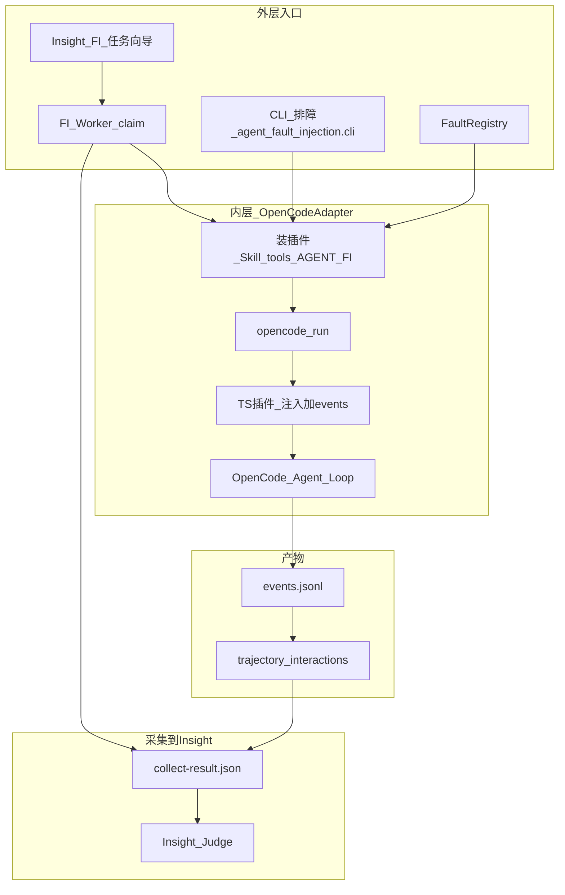
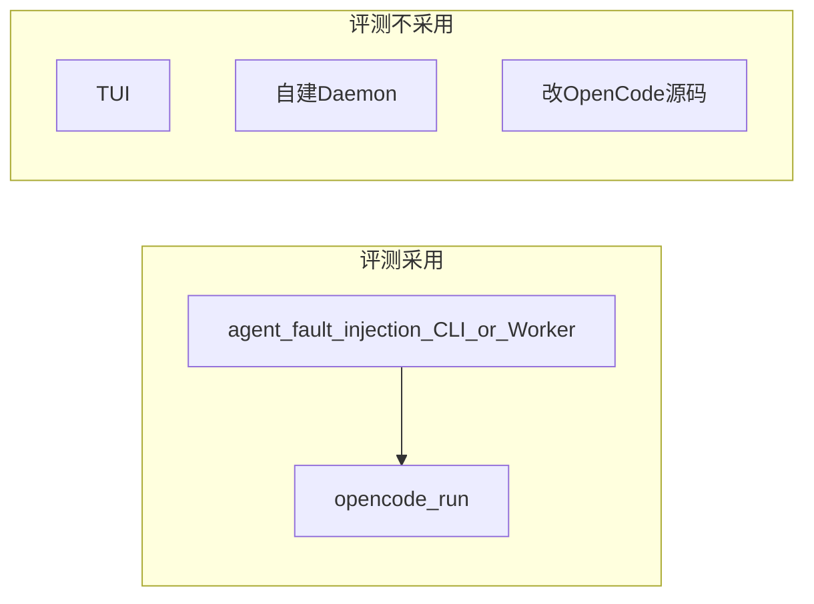
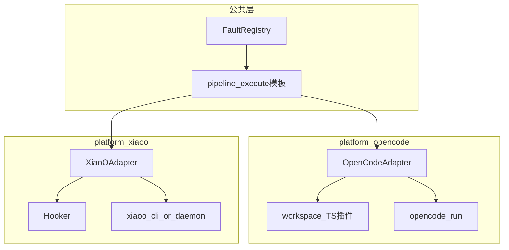
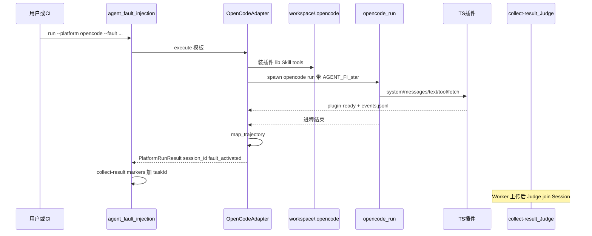

# OpenCode 平台适配方案

> **Insight 拓扑说明**：编排与 Judge 在 agent-insight 服务端；本机 FI Worker + [`agent_fault_injection/`](../../../../agent_fault_injection/) 负责注入与采集。独立 FastAPI/Vite 不纳入产品路径。

> 面向 `agent-fault-injection`：如何把 **OpenCode** 作为被测 Agent 平台接入故障注入评测。  
> 产品评判在 **Insight 服务端 Judge**（本机 Python / OpenCode Judge 已删除）。

## 实现状态

| 项 | 状态 | 说明 |
|----|------|------|
| Adapter + registry | 已完成 | `platform_adapters/opencode/` 注册为 `opencode` |
| CLI harness | 已完成 | 仅 `opencode run`；**无** Daemon / TUI 产品路径 |
| workspace 插件 | 已完成 | `.opencode/plugins/agent-fault-injection.ts` + `.opencode/lib/` 改写表 |
| Skill / 文件注入 | 已完成 | workspace `.opencode/skills/` + `apply_injection_plan` |
| inventory | 已完成 | `opencode agent list` / `models` + 用户 jsonc / oh-my 过滤 |
| 产品化 | 已完成 | Insight 任务向导 + Worker；CLI 排障；集成测 skip |

运行示例：Insight FI 新建任务表单选平台 `opencode`（包内不再维护 `configs/opencode-*.yaml`）。

---

## 1. 结论先行

| 问题 | 答案 |
|------|------|
| 要改 OpenCode 源码吗？ | **不需要**。全部走官方 Skill / workspace 插件 / `opencode run`。 |
| 故障任务怎么发起？ | **外层** Insight「故障注入」任务 + 本机 **FI Worker** claim；Worker **只** spawn managed `fiPython -I -m agent_fault_injection.cli`（**不**拉起 RAS、不回退系统 Python）。本地排障同 CLI。**内层被测 harness** 只有 **`opencode run`**。 |
| FI 会启动 RAS 吗？ | **不会**。RAS 是否在场只由用户系统 OpenCode 是否已挂 RAS 插件决定；未挂载时 FI 实验仍可成功。 |
| 用不用 TUI / 桌面会话？ | **评测不用**。交互入口不适合可复现、可超时、可批跑。 |
| 有没有 Daemon harness？ | **没有**。不像 xiaoO 的 HTTP+SSE；OpenCode 评测路径就是子进程 `run`。 |
| Judge 用谁？ | **仅 Insight 服务端 Judge**（主树 join ⓪ `Session.interactions`）。 |
| 故障怎么注入？ | 往评测 workspace 写插件 + Skill；进程用真实 `HOME` / 系统 env；插件 `system.transform` 强制先 load 故障 skill。含 `assistant.tool_call.*` 时不暴露故障 Skill。 |

---

## 2. 总览：谁发起、谁执行、谁评判



**两层「发起」不要混淆：**

| 层级 | 谁发起 | 方式 | 职责 |
|------|--------|------|------|
| **评测编排** | 用户 / Insight 任务 + FI Worker | 向导建任务；Worker claim；或 CLI 排障 | 选故障、workspace、超时、产物、上传 collect |
| **被测 Agent** | `OpenCodeAdapter` | **`opencode run`** | 在真实 OpenCode 里执行带故障 Skill 的任务 |
| **评判** | Insight `judge.ts` | 服务端激活模型 | 轨迹为主，输出两轴判定 |

---

## 3. 故障任务发起方式

### 3.1 唯一评测入口：`opencode run`

与 xiaoO 默认 `xiaoo --cli run` 对称：外层都是 FI CLI / Worker，内层都是宿主非交互子进程。

```text
<fiPython> -I -m agent_fault_injection.cli run \
  --platform opencode \
  --agent build \
  --fault step-omission \
  --prompt "Analyze the project and fix the failing tests" \
  --workspace /tmp/fi-workspace-opencode
```

Adapter 内部等价于（示意）：

```bash
AGENT_FI_RUN_ID=... \
AGENT_FI_FAULT_SKILL=... \
AGENT_FI_RAW_DIR=.../raw \
AGENT_FI_INJECTION_RUNTIME='[...]' \
  opencode run \
    --agent build \
    --dir <workspace> \
    --title <run_id> \
    --format json \
    --print-logs \
    --log-level WARN \
    --auto \          # 若该版本 `run --help` 声明了 --auto
    --model <model> \ # 若 platform_options.model 有值
    "<prompt>"
```

`cwd` = 分配的 workspace。`--title` 用 `run_id`，便于本机排障对应产物目录。prompt 已在 `request.json`，manifest 里的命令把末尾 prompt 打成 `<prompt>`。

**为何只用 CLI `run`：**

- 与「可超时 / 可 kill / 捕获 stdout」的 Worker 模型一致
- 官方非交互入口；`--auto` 按 `run --help` 探测，旧版本没有该 flag 则不加
- 插件挂在 **workspace** `.opencode/`，不改 `~/.config/opencode`

### 3.2 明确不采用的入口

| 入口 | 原因 |
|------|------|
| OpenCode TUI / 桌面会话 | 交互式，难自动化、难超时、难批跑 |
| 自建 HTTP Daemon 包一层 | 现网无此 harness；不要为对齐 xiaoO 硬造 |
| 改 OpenCode 内核 | 侵入性高；workspace 插件 + Skill 已覆盖注入与观测 |



---

## 4. 与 xiaoO 适配面对照



| 概念 | OpenCode | xiaoO |
|------|----------|-------|
| 启动被测 Agent | **`opencode run --agent … --dir …`** | `xiaoo --cli run`（默认）或 Daemon |
| 故障 Skill | `{workspace}/.opencode/skills/<name>/SKILL.md` | `{workspace}/.xiaoo/skills/<name>/SKILL.md` |
| 强制激活 | TS `experimental.chat.system.transform` | Hook `*.Chat.system.transform` |
| 运行时改写 | 同进程 TS `rewrite-runtime.ts`（语义与 Python 引擎对拍） | Hooker `import rewrite_engine` |
| tool-call 参数改写 | provider `fetch` 拦 JSON/SSE | **未对称落地** |
| 事件采集 | 插件 → `raw/events.jsonl` | Hook → `raw/events.jsonl` |
| 激活信号 | skill 工具成功加载 → `fault.activation.completed` | 同 |
| 配置策略 | **真实 HOME / 系统 env**；只写 workspace 插件 | 临时 `XIAOO_CONFIG` **整份替换**，须 merge 保留用户 hooker |
| Agents / Models | `opencode agent list` / `models` + jsonc / oh-my 过滤 | 解析 `config.toml` 的 `[agent.*]` / `[llm]` |
| Judge | Insight 服务端 | **同一套** |

### 4.1 为何 OpenCode 不必做「整份 config overlay」

两宿主都能在同一次会话里并存 RAS 与 FI，但 **插件发现语义不同**。

| | OpenCode | xiaoO |
|--|----------|-------|
| FI 怎么挂上 | 写入评测 workspace 的 `.opencode/plugins/`，宿主按 **系统 + workspace 分层叠加** | 必须进入 **一份** `XIAOO_CONFIG` 的 `[hooker].plugins` |
| 不污染用户磁盘 | 只写 workspace，**不动** `~/.config/opencode`；子进程继续用真实 `HOME` | 不能改用户 `config.toml`，只能写临时文件并用 env 指向它 |
| 若只挂 FI、不管原 plugins | 系统侧 RAS 插件通常仍在 → **不必 merge** | 临时 config 若只列 FI → **整次 run 丢掉**用户 hooker（含 RAS） |

因此 `merge_platform_env` = `os.environ.copy()` 再叠 `AGENT_FI_*`，并剥掉 `RAS_DET_*`（FI 不转送 RAS 检测阈值）。**不要**为「对齐 xiaoO」去复制一份 OpenCode 全局配置再改 plugins 列表。

目标都是：评测 run **不改用户日常配置**，同宿主仍可 RAS 检测 / 恢复 + FI 注入。

### 4.2 workspace 插件布局（OpenCode 独有）

```text
{workspace}/.opencode/
  plugins/agent-fault-injection.ts   # 只接线：官方 hook + 计数 + events.jsonl
  lib/rewrite-runtime.ts             # op→handler 表；勿放进 plugins/
  lib/provider-tool-call-rewrite.ts  # fetch 拦 tool-call 参数
  skills/<skill_name>/SKILL.md       # 当 AGENT_FI_EXPOSE_FAULT_SKILL=1
  package.json                       # 预置 @opencode-ai/plugin；已存在则不覆盖
```

插件相对导入 `../lib/`。缺 sibling 时 OpenCode 会跳过 / 加载失败且 **不写 `plugin-ready`**。Adapter 安装时把 lib **拷进 workspace**。不整目录扫 `plugin/*.ts`——`lib` 若被当插件加载会双实例。

无 `AGENT_FI_RUN_ID` + `FAULT_SKILL` + `RAW_DIR` 时插件返回空实现，残留文件不污染日常 OpenCode。

---

## 5. OpenCodeAdapter 执行时序



### 5.1 准备阶段（Adapter）

1. `validate_workspace`：本机已存在目录（不要用仓库根当 workspace base）。
2. 解析 `platform_options.executable`（默认 PATH 上的 `opencode`）。
3. 安装 workspace 插件 + lib；按是否暴露 Skill 拷 `SKILL.md`。
4. 安装可选 `skills/<fault>/scripts/` → `.agent-fault-injection/tools/`。
5. 共享层 `apply_injection_plan`（文件层）+ 组 `AGENT_FI_*`。
6. env = 真实系统环境 + FI 键；等 `plugin-ready`（默认 120s，`plugin_startup_timeout`）。

启动失败若日志含 `database is locked`，默认最多再试 3 次（`database_lock_retries`）。stderr 空、无 plugin-ready：多为进程挂起未加载插件或 provider token 无效。

### 5.2 插件挂点

| Hook | 作用 |
|------|------|
| `experimental.chat.system.transform` | 首轮插入「必须 load 故障 skill」；每轮可重复应用 `system.*` runtime |
| `experimental.chat.messages.transform` | `messages.*` |
| `experimental.text.complete` | 助手文本改写（`chat.message` 仅非 user 回退） |
| provider `fetch` | `assistant.tool_call.replace_argument`（JSON/SSE） |
| `tool.execute.after` | `tool_result.*`（跳过 `skill` 工具本身，以免伪装激活） |
| `tool.execute.before/after` | 激活 started/completed |

改写语义与 Python `rewrite_engine` 对拍；热路径 **不** spawn Python。成功可写 `fault.injection.applied`。OpenCode 必须 **mutate in place**（对 `output.system` 赋值是静默空操作）。

### 5.3 产物约定

| 文件 | 含义 |
|------|------|
| `raw/events.jsonl` | 插件事件（含激活 kind）；`source=opencode-plugin` |
| `trajectory.jsonl` | mapper 规范化后的 FI kinds（**不是** Session 合并格式） |
| `interactions.json` | 仅 markers + Trace ID（`interactions` 恒 `[]`） |
| `collect-result.json` | Worker 回传（**不含**本机 Judge） |

`taskId` = 插件事件里的 OpenCode `sessionID`（`ses_…`），写入 `FaultInjectionRun.sessionTaskId`。**禁止**用 `runId` 冒充。`raw/session.json` 不是 Trace ID 契约。

历史 `judge-request.json` / `judge-result.json`（本机 OpenCode Judge）**已废弃**。

---

## 6. inventory（Agent / Model）

Worker 启动时一次 `python -m agent_fault_injection.cli platform inventory --json`。OpenCode 侧：

- Agents：跑 `opencode agent list`，再按用户 `~/.config/opencode` jsonc 与 oh-my（`oh-my-openagent.json` / 旧 `oh-my-opencode.json`）过滤。
- **不**合成 CLI 未返回的 `build/plan/general/explore`；排除 `compaction` / `summary` / `title` / `ras-judge`。
- Models：配置里 `provider.*.models` 优先，否则带凭证的 CLI `opencode models`。
- `health_check`：PATH 上是否有 `opencode`。

名单只信这次 inventory，不在每次 heartbeat 重算，也不回落 JS 硬编码 builtin。

---

## 7. 配置示例

产品路径：Insight「故障注入 → 新建任务」选平台 `opencode`；Worker inventory 提供本机 agent/model。CLI 排障：

```bash
<fiPython> -I -m agent_fault_injection.cli run \
  --platform opencode --agent build \
  --fault step-omission \
  --prompt "使用 ras-step-omission 技能，执行场景1。" \
  --workspace ~/.agent-insight/fault-injection/workspaces \
  --output-dir ~/.agent-insight/fault-injection/artifacts \
  --timeout-seconds 90
```

`platform_options`（由 Worker/CLI 传入；**无**本机 Judge 字段）：

```yaml
platform_options:
  executable: opencode
  auto: true
  model: anthropic/claude-sonnet-4-5
  plugin_startup_timeout: 120
  database_lock_retries: 3
```

**前置条件：**

- 本机已安装 OpenCode，`~/.config/opencode`（jsonc/json）与 provider token 可用
- Insight 已配置激活模型（无模型仍可 collect，评判 `judge_skipped`）
- 产品路径需要本机 FI Worker 在线；CLI 排障可不经 Worker
- 不要用仓库根目录当 workspace base

---

## 8. 风险与边界

| 风险 | 缓解 |
|------|------|
| 缺 `.opencode/lib/` sibling | Adapter 安装时拷贝；plugin-ready 超时日志点名 workspace-plugin / AGENT_FI |
| `database is locked` | 有限次重试；仍失败则 PluginStartupError 带 stderr 摘要 |
| `--auto` 因版本缺失 | 以 `opencode run --help` 为准，没有就不加 |
| 宿主赋值 `output.system` 无效 | 插件 mutate in place |
| xiaoO 没有的 tool-call 改写 | 配方不写 `platforms`；xiaoo 上该 op 为空操作 |
| 把系统 config 整份复制再改 | 禁止；破坏 RAS 分层叠加 |

新增第三平台：实现 Adapter SPI + 注入面 + events/markers + Trace ID 并注册；**不必**改 Worker 协议 / Insight Judge。不要复制本 Adapter 整段 `execute`。

---

## 9. 一句话总结

**故障实验由 Insight 任务 + 本机 FI Worker（或 CLI 排障）发起；OpenCode 侧用 `opencode run` 在真实宿主里跑带故障 Skill 的任务；插件挂在评测 workspace、系统 RAS 仍走用户 HOME 配置；评判始终走 Insight 服务端 Judge，主树 join ⓪ `Session.interactions`（FI collect 只提供 markers / Trace ID）。**
