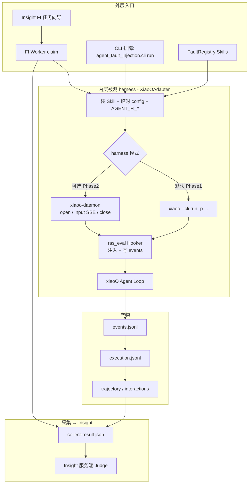
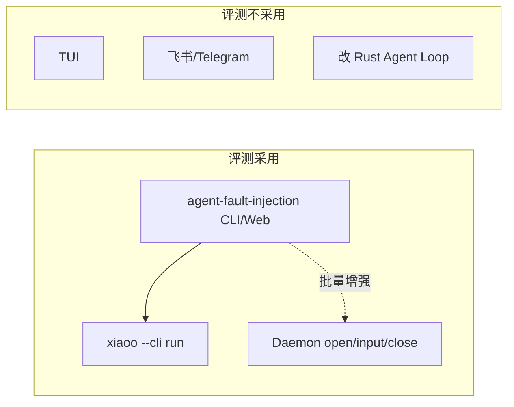
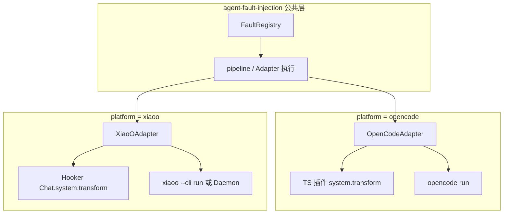
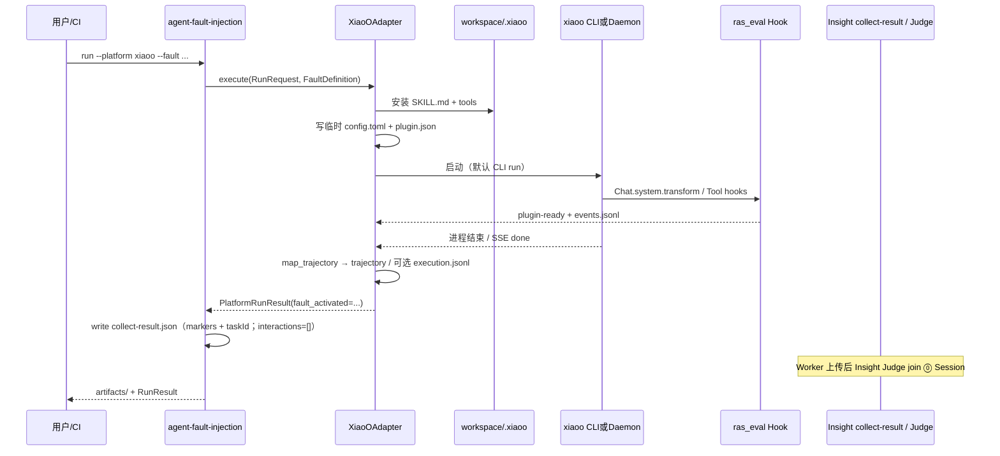

# xiaoO 平台适配方案

> **Insight 拓扑说明**：编排与 Judge 在 agent-insight 服务端；本机 FI Worker + [`agent_fault_injection/`](../../../../agent_fault_injection/) 负责注入与采集。独立 FastAPI/Vite 不纳入产品路径。


> 面向 `agent-fault-injection`：如何把 **xiaoO**（openEuler AgentOS 智能中枢）作为被测 Agent 平台接入故障注入评测。  
> 产品评判在 **Insight 服务端 Judge**（本机 Python Judge 已删除）。

## 实现状态

| 阶段 | 状态 | 说明 |
|------|------|------|
| Phase 0 框架解耦 | 已完成 | Registry / 可选 execution.jsonl / **Insight 服务端 Judge（join ⓪）** |
| Phase 1 CLI Adapter | 已完成 | `platform_adapters/xiaoo/` + Hooker + `registry` 注册 |
| Phase 2 Daemon harness | 已完成 | `platform_options.harness: daemon` + `daemon_url` |
| Phase 3 Skill 平台可见性 | 已完成（后调整） | 原 `fault-catalog.yaml` 的 `platforms` 已移除；故障配方面向通用平台，UI 默认双平台。平台能力差异由 Adapter / 文档说明 |
| Phase 4 产品化 | 已完成 | Insight 任务向导 + Worker；CLI 真跑；集成测 skip |

运行示例：Insight FI 新建任务表单（包内不再维护 `configs/xiaoo-*.yaml` 示例）。

---

## 1. 结论先行

| 问题 | 答案 |
|------|------|
| xiaoO 要改核心 Rust 吗？ | **不需要**。全部走官方 Skill / Hook 插件 / CLI / Daemon API。 |
| 故障任务怎么发起？ | **外层**由 Insight「故障注入」任务（BFF）+ 本机 **FI Worker** claim 执行；Worker **只** spawn `python3 -m agent_fault_injection.cli`（**不**拉起 RAS）。本地排障同 CLI。**内层被测 harness** 默认用 **`xiaoo --cli run`**，批量/可观测增强可选 **Daemon HTTP+SSE**（FI 自有 adapter，非 RAS SessionHub）。 |
| FI 会启动 RAS 吗？ | **不会**。RAS 是否在场只由平台是否已挂载 RAS 决定；未挂载时 FI 实验仍可成功。曾经误把 `fi_daemon_runner`（FI runner + `DaemonRasSession`）接到 Worker，已废除。 |
| 用不用 TUI / 飞书渠道？ | **评测不用**。交互入口不适合可复现、可超时、可批跑的故障实验。 |
| Judge 用谁？ | **仅 Insight 服务端 Judge**（主树 join ⓪ `Session.interactions`；本机 Python / OpenCode Judge 已删除，不作为产品路径）。 |
| 故障怎么注入？ | Workspace 安装 `SKILL.md` + 临时 `XIAOO_CONFIG` 挂评测 Hook；Hook 的 `system.transform` 强制先 load 故障 skill（对齐 OpenCode 插件语义）。 |

---

## 2. 总览：谁发起、谁执行、谁评判



**两层「发起」不要混淆：**

| 层级 | 谁发起 | 方式 | 职责 |
|------|--------|------|------|
| **评测编排** | 用户 / Insight 任务 + FI Worker | Insight 向导创建任务；Worker claim；或 CLI 排障 | 选故障、分配 workspace、超时、产物、上传 collect |
| **被测 Agent** | `XiaoOAdapter` | **默认 CLI**；可选 Daemon | 在真实 xiaoO 运行时里执行带故障 Skill 的任务 |
| **评判** | Insight `judge.ts` | 服务端激活模型 | 轨迹为主，输出两轴判定 |

---

## 3. 故障任务发起方式详解

### 3.1 推荐默认：CLI（`xiaoo --cli run`）

与现有 OpenCode 路径对称：`OpenCodeAdapter` 调 `opencode run`，`XiaoOAdapter` 调 `xiaoo --cli run`。

```text
agent-fault-injection run \
  --platform xiaoo \
  --agent <config.toml 中的 agent 名> \
  --fault step-omission \
  --prompt "Analyze the project and fix the failing tests" \
  --workspace /tmp/ras-workspace-xiaoo
```

Adapter 内部等价于（示意）：

```bash
XIAOO_CONFIG=/path/to/run-private/config.toml \
AGENT_FI_RUN_ID=... \
AGENT_FI_FAULT_SKILL=... \
AGENT_FI_EVENTS_FILE=.../events.jsonl \
AGENT_FI_PLUGIN_READY=.../plugin-ready.json \
  xiaoo --cli run \
    -p "使用 <skill> 技能。Analyze the project..." \
    --format json \
    # cwd = 分配的 workspace
```

**为何默认 CLI：**

- 实现简单，与 OpenCode 子进程模型一致，易于超时 / kill / 捕获 stdout
- 每次 run 写临时 `XIAOO_CONFIG`（不改用户文件），但以用户真实 config 为底并叠加 FI hooker，保留用户 RAS 等 plugins（**为何必须保留**见 §4.1）
- 适合单次调试与 CI 冒烟

### 3.2 可选增强：Daemon HTTP + SSE

当 `platform_options.harness: daemon`（或等价开关）时：

```text
POST /api/v1/runtimes/open
POST /api/v1/runtimes/input   → SSE 消费 turn / tool 事件
POST /api/v1/runtimes/close
```

可选：`checkpoint` / `checkout` 做同 workspace 对照实验。

**何时用 Daemon：**

- 批量 run、希望少冷启动
- 需要更细的流式事件（补齐 CLI JSON 不够全的部分）
- 需要 pause/resume、文件读写 API 做副作用断言

### 3.3 明确不采用的入口

| 入口 | 原因 |
|------|------|
| `xiaoo` TUI | 交互式，难自动化、难超时、难批跑 |
| 飞书 / Telegram channels | 渠道异步与权限模型不适合受控评测 |
| 改 Agent Loop 内核 | 侵入性高；Hook + Skill 已覆盖注入与观测 |



---

## 4. 与 OpenCode 适配面对照



| ras-eval 概念 | OpenCode | xiaoO |
|---------------|----------|-------|
| 启动被测 Agent | `opencode run --agent …` | **`xiaoo --cli run`**（默认）或 Daemon |
| 故障 Skill | 隔离 config `skills/` | `{workspace}/.xiaoo/skills/<name>/SKILL.md` |
| 强制激活 | TS `experimental.chat.system.transform` | Hook `*.Chat.system.transform` |
| 事件采集 | TS 插件 → `events.jsonl` | Hook 写 `events.jsonl`（+ CLI json / SSE） |
| 激活信号 | skill 工具成功加载 | 同：观察 skill 工具成功 → `fault.activation.completed` |
| 配置策略 | 系统 `~/.config/opencode` + workspace 注入插件 | 系统 `~/.config/xiaoo` 内容合并进临时 `XIAOO_CONFIG`，**保留用户 hooker（含 RAS）并叠加 FI** |
| Agents / Models | `opencode agent list` / `models` | 解析 `config.toml` 的 `[agent.*]` / `[llm]` |
| Judge | Insight 服务端 | **同一套** Insight Judge |

### 4.1 为何 xiaoO 要「overlay 保留 RAS hooker」，而 OpenCode 不必

两宿主**都能**在同一次会话里并存 RAS 与 FI，但插件挂载语义不同，因此 FI 的配置策略不能照搬。

| | OpenCode | xiaoO |
|--|----------|-------|
| FI 怎么挂上 | 写入评测 workspace 的 `.opencode/plugins/`，宿主按 **系统 + workspace 分层叠加** 发现插件 | 必须进入 **`[hooker].plugins`** 列表；宿主按 **一份** `XIAOO_CONFIG`（或默认 `~/.config/xiaoo/config.toml`）加载 |
| 不污染用户磁盘 | 只写 workspace，**不动** `~/.config/opencode`；进程继续用真实 `HOME` / 系统 env（含用户已装 RAS） | 不能改用户磁盘上的 `config.toml`，只能写**临时** config 并用 `XIAOO_CONFIG` 指向它 |
| 若只挂 FI、不管原 plugins | 系统侧 RAS 插件通常仍在 → 一般不丢 | 临时 config 若只列 FI → **整次 run 丢掉**用户已有 hooker（含 RAS） |

因此：

- **OpenCode**：宿主本身支持 workspace 增量挂载 → FI 只塞 `.opencode/plugins/agent-fault-injection.ts`，RAS 自然还在；**不需要**做「整份 config merge + 保留 plugins」逻辑。
- **xiaoO**：临时 `XIAOO_CONFIG` 是**替换**整份生效配置，而 hooker 列表是替换语义、不是 OpenCode 那种自动叠加 → 必须以用户真实 config 为底，**保留**已有 `[hooker].plugins`（含 RAS），再 **append** FI plugin，写到临时文件（实现：`platform_adapters/xiaoo/config_overlay.py`）。

目标都是：评测 run **不改用户日常配置**，同时同宿主仍可观测 / 检测 / 恢复（RAS）并注入（FI）。

---

## 5. XiaoOAdapter 执行时序



### 5.1 准备阶段（Adapter）

1. 校验并分配独立 workspace（`{base}/.ras-runs/...`）。
2. `InstallSession` 安装可选 `skills/<fault>/scripts/` → `.agent-fault-injection/tools/`。
3. 复制故障 `SKILL.md` → `.xiaoo/skills/<skill_name>/SKILL.md`（项目级最高优先级）。
4. 生成 run 私有 `config.toml`（`XIAOO_CONFIG`；**不**改用户磁盘文件；理由见 §4.1）：
   - 以用户真实 `~/.config/xiaoo/config.toml` 为底
   - **保留**原 `[hooker].plugins`（含 RAS），再 append FI bundled `plugin.json`
   - `[skills].dirs`（如需要）；可选 model / `[agent.<name>]` 覆盖
5. 设置 `AGENT_FI_*`；无这些变量时 Hook **空操作**（残留插件安全）。

### 5.2 Hooker 最小行为

| Hook point | 作用 |
|------------|------|
| `*.Chat.system.transform` | 注入「必须先成功调用 skill 工具加载目标故障 skill 一次」 |
| `*.Tool.*.post`（或 skill 专用） | 检测激活，写 `fault.activation.completed` |
| 可选 Tool/Llm hooks | 追加规范化事件，供本地 `execution.jsonl`（非 Judge 真源） |

### 5.3 产物约定（跨平台）

| 文件 | 含义 |
|------|------|
| `raw/events.jsonl` | 原始/半原始事件流（含激活 kind） |
| `execution.jsonl` | 可选本地规范化证据（**非** Insight Judge 真源） |
| `trajectory.jsonl` / `interactions.json` | 轨迹与 markers + Trace ID（`interactions` 恒为 `[]`） |
| `collect-result.json` | Worker 回传 Insight 的采集载荷（**不含**本机 Judge 产物） |

规范化 `execution.jsonl` 行类型示例：`assistant` / `tool` / `final_answer` / `session_error` / `platform_protection`。

> 历史产物名 `judge-request.json` / `judge-result.json`（本机 OpenCode Judge）**已废弃**，勿再写入或依赖。

---

## 6. 配置示例

产品路径请在 Insight「故障注入 → 新建任务」选择平台 `xiaoo` 与故障模式；Worker inventory 提供本机 agent/model。本地 CLI 排障示例：

```bash
python3 -m agent_fault_injection.cli run \
  --platform xiaoo --agent build \
  --fault tool_repeat_dead_loop --submode 2 \
  --prompt "执行场景2 / case2 / unknown" \
  --workspace ~/.agent-insight/fault-injection/workspaces \
  --output-dir ~/.agent-insight/fault-injection/artifacts \
  --timeout-seconds 90
```

Adapter 侧可选 `platform_options`（示意；由 Worker/CLI 传入，**无**本机 Judge 字段）：

```yaml
platform_options:
  harness: cli                 # 默认；批量可改为 daemon
  # daemon_url: http://127.0.0.1:18080
  executable: xiaoo
  plugin_startup_timeout: 120
```

**前置条件：**

- 本机已安装并配置好 **xiaoO**（`config.toml`、LLM provider）
- Insight 侧已配置激活模型（**服务端 Judge** 依赖；无模型时仍可 collect，评判为 `judge_skipped`）
- 本机 FI Worker 在线（产品路径）；CLI 排障可不经 Worker
- 不要用仓库根目录当 workspace base

---

## 7. 落地阶段（与实现计划对齐）

| 阶段 | 内容 | 故障任务发起 |
|------|------|--------------|
| Phase 0 | 框架解耦：Adapter Registry、可选 `execution.jsonl`、Judge 归 Insight（join ⓪）、Web 委托 | 无 xiaoO |
| Phase 1 | `XiaoOAdapter` + Hooker + CLI harness | **`xiaoo --cli run`** |
| Phase 2 | Daemon harness 增强 | `harness: daemon` |
| Phase 3 | Skill 跨平台兼容（工具名 / 暂不支持清单） | 同 Phase 1/2 |
| Phase 4 | Insight 任务向导 + Worker + 文档 | — |

新增第三平台时：实现 Adapter + 注入面 + FI events/markers + Trace ID 并注册即可；**不必**改 Worker 协议 / Insight Judge。

---

## 8. 风险与边界

| 风险 | 缓解 |
|------|------|
| Skill 正文写死 OpenCode 工具名（如 todo vs `todo_write`） | `platform_overrides` 或优先通用故障；部分故障标 unsupported |
| CLI `--format json` 事件不全 | Hook 自采为权威源；Phase 2 SSE 补齐 |
| 部分 runtime op（如 `assistant.tool_call.replace_argument`）仅 OpenCode | 文档与 catalog 标明平台能力差；xiaoo 侧勿假设全 op |
| Hook 子进程延迟 | 仅挂关键 hook point；事件追加写文件 |

---

## 9. 一句话总结

**故障实验由 Insight 任务 + 本机 FI Worker（或 CLI 排障）发起；xiaoO 侧默认用 CLI `xiaoo --cli run` 执行带故障 Skill 的真实 Agent；可选 Daemon 做批量与细粒度观测；评判始终走 Insight 服务端 Judge，主树 join ⓪ `Session.interactions`（FI collect 只提供 markers / Trace ID）。**
