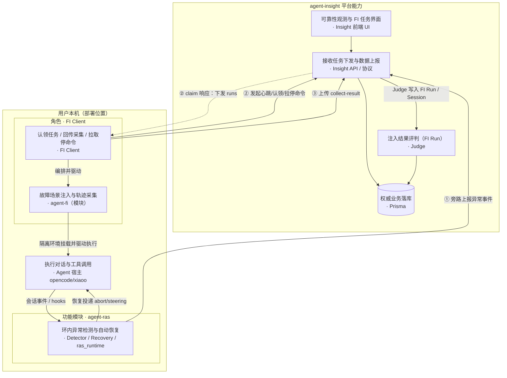
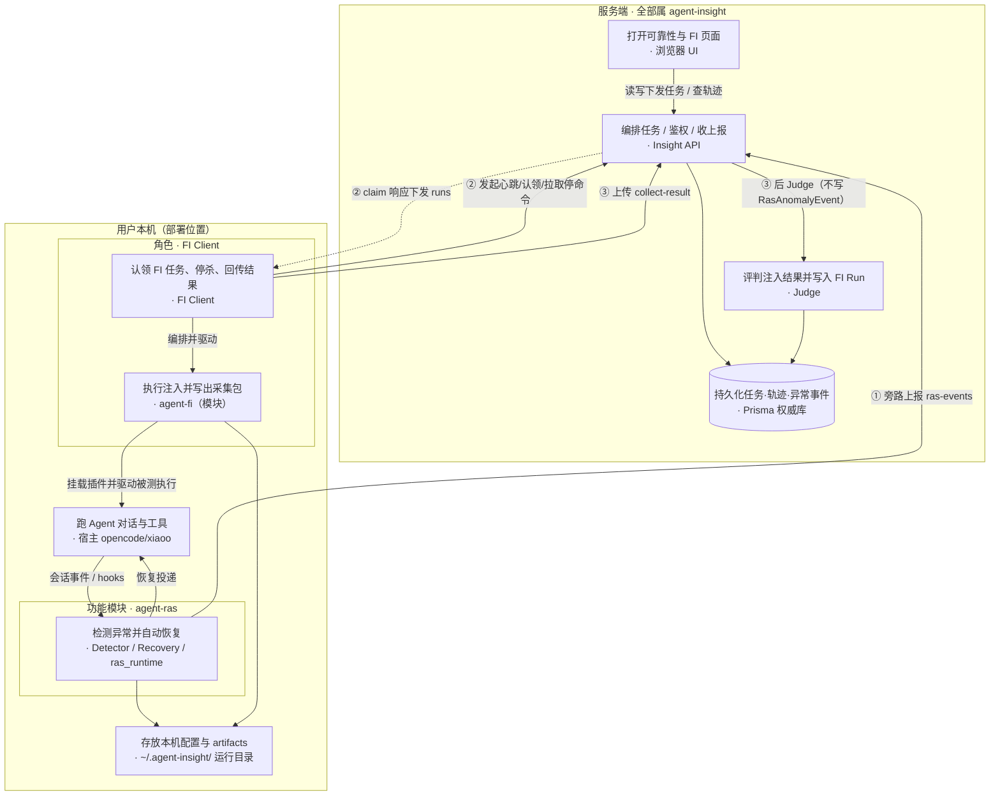
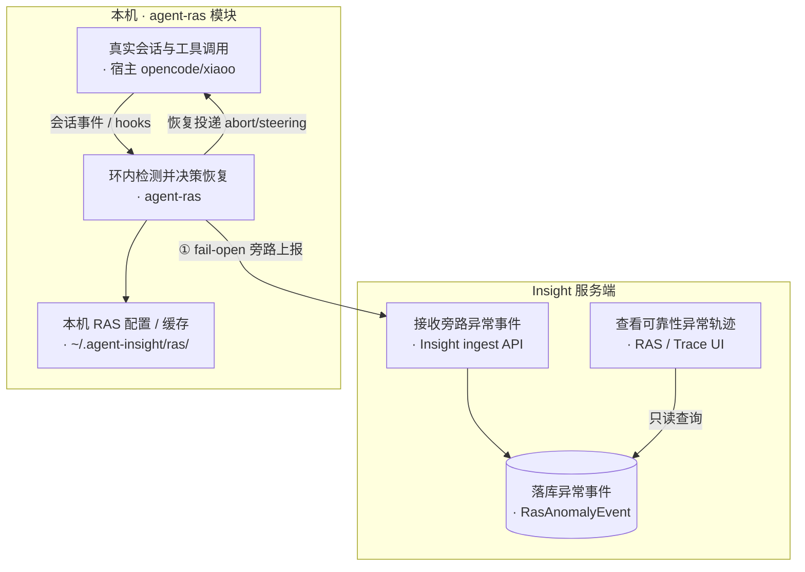
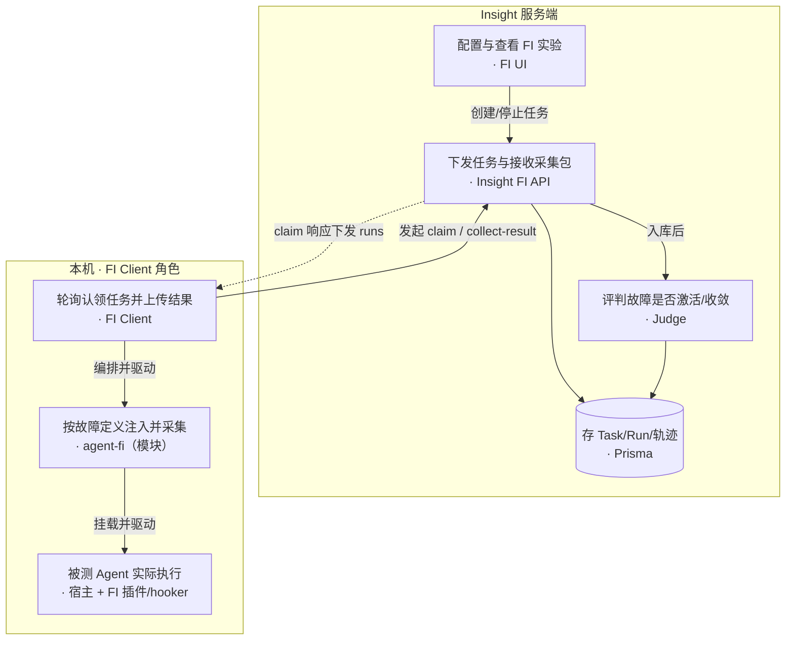
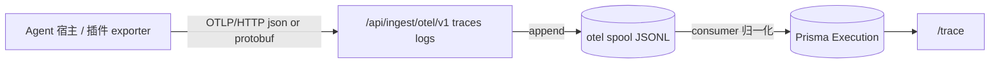
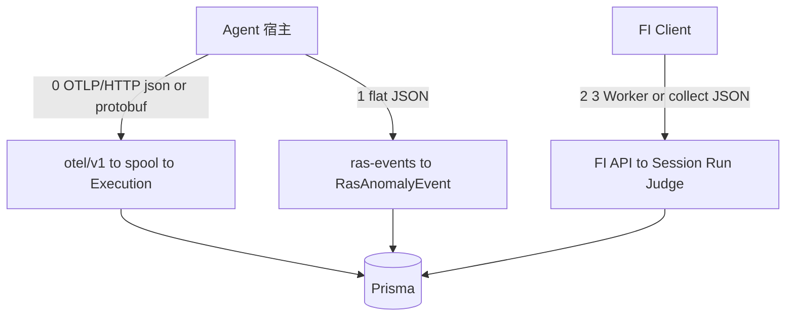
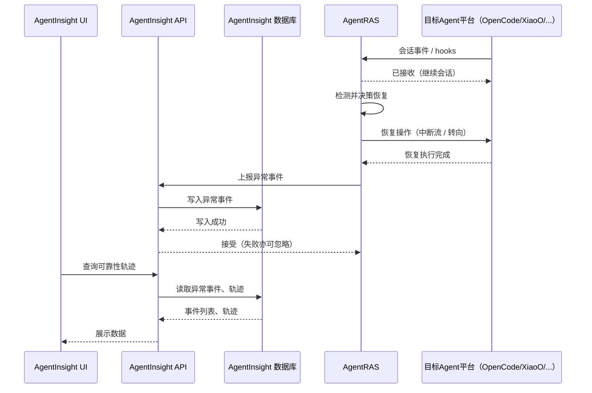
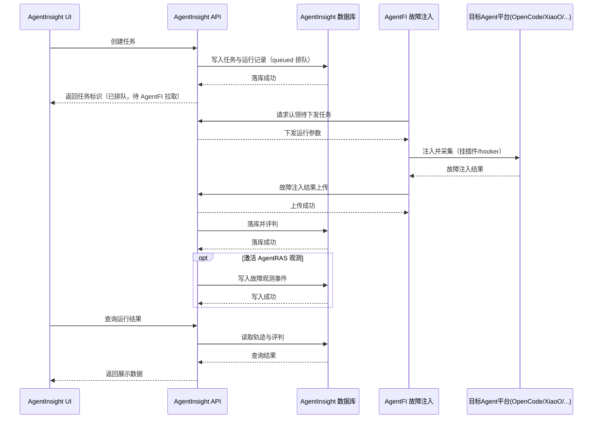

# Agent Insight · RAS · FI 关系设计说明

> **文档性质**：说明既有平台 **agent-insight** 与新增功能模块 **agent-ras**、**agent-fi** 的边界、部署与数据关系  
> **对齐实现**：2026-08-05（FI 已切 Insight 服务端 + 本机 FI Client；RAS 环内旁路上报已落地）  
> **图文版**：[ras-fi-insight-relationship.html](./ras-fi-insight-relationship.html)  
> **三产品逻辑图**：[agent-insight-ras-fi-logic.html](./agent-insight-ras-fi-logic.html)（AgentInsight · AgentRAS · AgentFI）  
> **图示约定**：节点一律 **「功能简述 · 角色/模块名」**（功能在前）；优先写**角色**，实现进程名仅作注记。  
> **方向约定**：实线 = 主动调用/投递；虚线 = 响应回程（如 claim 下发 runs）。RAS↔Host 为同进程双向（事件进、恢复出）。②③ 由 **FI Client** 发起，不是注入算法包绕过 Client 直连 API。

---

## 0. 命名与边界（先读）

| 名称 | 指什么 | **包含** | **不包含** |
|------|--------|----------|------------|
| **agent-insight**（角色：**Insight 服务端**） | 既有观测与编排**平台** | UI、Insight API、数据协议与契约、Prisma/权威库、Judge、鉴权、安装下发面 | 不在用户 Agent 进程内做检测/注入算法 |
| **FI Client**（角色） | 相对 Insight 的**本机 FI 侧** | 认领/心跳/拉停命令、驱动注入采集、回传 collect-result | 不含 FI UI / 权威库 / Judge / HTTP 契约设计（属 Insight） |
| **agent-ras** | 环内可靠性**功能实现模块** | Detector / Recovery / ras_runtime / 平台薄适配 | 不含前端、Prisma schema、HTTP 契约 |
| **agent-fi**（`agent_fault_injection`） | 故障注入**功能实现模块**（支撑 FI Client） | Fault catalog、注入工具、平台 Adapter、CLI 采集 | 不含 FI UI、FaultInjection* 表、Judge；与 Insight 的控制面由 **FI Client** 角色承担 |

**一句话**：Insight = 服务端平台；**FI Client** = 本机 FI 角色（认领/回传/编排注入）；agent-ras / agent-fi = 实现模块。叙述优先用角色，不先钉死进程名。源码可同仓，**能力归属按上表，不按目录名把 UI/DB 算进模块**。



---

## 报告导读

| # | 问题 | 章节 |
|---|------|------|
| 1 | 按部署位置：Insight 服务端 vs 用户本机（含 RAS/FI 模块） | §1 |
| 2 | Insight 为 RAS/FI **新增了哪些平台能力**（UI/DB/API） | §2 |
| 3 | agent-ras 模块做什么、如何对接 Insight（含 **RAS 拓扑**） | §3 |
| 4 | agent-fi / FI Client 做什么、如何对接 Insight（含 **FI 拓扑**） | §4 |
| 5 | 数据上报与协议（含 OTel、取舍结论、**代码级上报链路与时机**） | §5 |
| 6 | OpenCode / xiaoO 上 RAS vs FI 挂载对照 | §6 |
| 7 | .so / 安装路径 / 分册索引 | §7–§9 |

---

## 1. 部署全景（角色：Insight 服务端 ↔ 本机 FI Client / RAS）

不以仓库子目录或进程名为轴，而以 **角色 + 部署位置** 为轴。



| 角色 / 部署位 | 归属 | 内容 |
|---------------|------|------|
| **Insight 服务端** | agent-insight | UI、Insight API、Prisma、Judge、鉴权 |
| 本机 · **agent-ras** | 功能模块 | 检测/恢复（宿主内旁路） |
| 本机 · **FI Client** | 角色（由 agent-fi + 本机编排实现） | 认领/回传/驱动注入；当前实现含 `fi-worker.js` + CLI，叙述用角色名 |
| 本机 · 共享 | 宿主 + 运行目录 | opencode/xiaoo；`~/.agent-insight/`（非权威） |

浏览器可远程；**同机可同时有 RAS 模块与 FI Client，但分属不同框，不混装**。

---

## 2. agent-insight：平台侧能力（含为 RAS/FI 新增的部分）

下列一律算 **Insight**，即使源码路径靠近 `agent-ras` 路由或 `fault-injection` lib：

### 2.1 前端

| 入口 | 说明 |
|------|------|
| `/agent-ras/trace` 等 | 可靠性观测（读 `RasAnomalyEvent` 等） |
| `/agent-ras/fault-injection` | FI UI 入口（redirect → `/tasks`；目录在 `/faults`） |
| 设置页活跃模型 | FI Judge 依赖 |

### 2.2 数据与协议

| 能力 | 说明 |
|------|------|
| Prisma：`Execution`、`Session`、`RasAnomalyEvent`、`FaultInjection*` … | **权威业务落库**（水缸）；UI/Judge 只读这里 |
| OTLP ingest + spool consumer | **既有主观测进水管**：宿主/插件 → `/api/ingest/otel/v1/*` → 本机 spool → 归一化为 `Execution`（见 §5.0） |
| `POST /api/ingest/ras-events` | RAS 旁路事件契约（**非 OTLP**；Insight 拥有） |
| `/api/fault-injection/*` | FI 任务、FI Client 控制面、collect-result、setup（Insight 拥有） |

> OTel 与 Prisma **不是二选一**：OTel 是进水管口径之一；Prisma 是权威库访问层。契约细节见 [09-otlp-attribute-contract](../../developer-guide/09-otlp-attribute-contract.md)。

### 2.3 服务端逻辑

| 能力 | 说明 |
|------|------|
| FI Judge（`judge.ts`） | 二维 outcome × containment；结果落 FI Run |
| ~~`ras-bridge`~~ | **已移除**：不再为 FI 激活合成 `RasAnomalyEvent`；可靠性观测靠正常轨迹（Execution）+ 真 RAS ① |
| FI Client 任务占用 / 超时回收（实现可称 lease） | 服务端状态机 |
| dry-run stub | 不经本机模块 |

**Insight 不做**：在 Agent 进程内跑 Detector/Recovery；在服务端 `spawn` 用户本机的 opencode/xiaoo（已废弃）。

---

## 3. agent-ras：功能实现模块 ↔ Insight

### 3.1 模块职责（仅实现）

- L0 检测 / 恢复策略（单源 Python `core/`）
- 平台适配：深挂载（如 openjiuwen）或协议 inproc（OpenCode / xiaoO / …）
- OpenCode 可选 **libpython.so** 同进程嵌入
- 本机配置目录 `~/.agent-insight/ras/`（运行用，非展示真源）

### 3.2 与 Insight 的交界

| 方向 | 内容 | 归属 |
|------|------|------|
| 模块 → Insight | `insight_push` → `POST /api/ingest/ras-events`（fail-open） | **协议与落库 = Insight**；推送客户端代码在模块内 |
| Insight → 用户 | 可靠性观测 UI 展示 `RasAnomalyEvent` | Insight |
| 模块内部 | abort_stream / steering 等恢复投递 | **只发生在宿主进程**，不经 Insight 决策 |

### 3.3 RAS 拓扑（Insight 服务端 ↔ agent-ras）

与 §4.3 FI 对称：一边是**服务端观测**，一边是**本机环内模块**（无常驻「认领」角色；恢复不经 Insight）。



| 对照 | RAS | FI（§4.3） |
|------|-----|------------|
| 本机角色 | **功能模块** agent-ras（嵌宿主） | **角色** FI Client + agent-fi |
| 与 Insight | 单向旁路上报 ① | 双向控制面 ② + 结果 ③ |
| Insight 决策 | **无**（恢复在环内） | 有 Judge（FI Run）；**不**桥进 `RasAnomalyEvent` |
| 断连 | fail-open，不影响会话 | Client 停则无法认领新 Run |

### 3.4 RAS 不上报什么

- 不把「恢复是否成功」交给 Insight Judge（无 FI 式服务端评判）
- 不要求 Insight 持有本机 runtime 句柄；断连即 fail-open

细节：[agent-ras architecture](../../agent-ras/designs/architecture.md)。

---

## 4. agent-fi：功能实现模块 ↔ Insight

### 4.1 模块职责（仅实现）

- Fault catalog / Skill、结构注入与 runtime plan
- 平台 Adapter（OpenCode TS 插件、xiaoO hooker）
- CLI：`python -m agent_fault_injection.cli run … --no-judge`
- 本机写出 `collect-result.json` 等 artifacts

### 4.2 与 Insight 的交界

| 方向 | 内容 | 归属 |
|------|------|------|
| Insight → FI Client | 任务元数据经 claim 下发（platform/fault/prompt/…） | **任务模型与 API = Insight** |
| FI Client → Insight | 上传 collect-result（interactions / markers / evidence） | **契约与入库 = Insight** |
| Insight 内部 | Judge、FI UI | Insight |

**FI Client** 是角色；当前实现里编排常驻进程是 `scripts/fi-worker.js`，注入在 agent-fi 包内。协议与契约属 Insight，叙述默认用角色名。

### 4.3 FI 拓扑（Insight 服务端 ↔ FI Client）



旧「Next 同机 spawn CLI」已废弃。单机调试 = **Insight 服务端** + **FI Client** 两角色。

---

## 5. 数据上报与协议（协议属 Insight）

### 5.0 既有主链路：OTel → spool → Prisma（与 RAS/FI 并列）

Insight 主观测走 **OpenTelemetry Protocol（OTLP）**：宿主 / 框架 exporter 按 OTLP/HTTP 上报 traces、logs（JSON 或 Protobuf）。这条链路**不属于** AgentRAS / AgentFI，但同属 AgentInsight 平台；与 ① 常按 `taskId` 对齐展示。

**协议要点（⓪）**

| 项 | 值 |
|----|-----|
| 协议 | **OTLP/HTTP**（非 gRPC） |
| Content-Type | `application/json` 或 `application/x-protobuf` |
| 端点 | `/api/ingest/otel/v1/traces` · `/logs` · `/metrics`（桩） |
| 载荷形态 | OTLP `ResourceSpans` / `ResourceLogs`（含 resource + span/log attributes） |
| 落库 | spool → consumer → Prisma `Execution` / `Session` |

契约真源：[OTLP 属性契约](../../developer-guide/09-otlp-attribute-contract.md)。



| 阶段 | 含义 |
|------|------|
| OTLP 接受成功 | 已写入 spool，**不等于**立刻在所有观测查询可见 |
| spool consumer | 进程内消费 → 归一化 → **Prisma** 写入 `Execution` 等 |
| 与 RAS | RAS 旁路是 **flat JSON**（非 OTLP），**禁止**写入 OTLP spool；可靠性页可左连接根 `Execution` |
| 与 FI | FI 真源是 **collect-result JSON**（非 OTLP）；同 session 可并存 OTel `Execution` 对照 |

### 5.1 通道总表（按数据协议）

| # | 通道 | 数据协议 / 载荷格式 | Insight 入口 | 落库 | 语义 |
|---|------|---------------------|--------------|------|------|
| ⓪ | 主观测 | **OTLP/HTTP**（JSON 或 Protobuf）：`ResourceSpans` / `ResourceLogs` | `/api/ingest/otel/v1/{traces\|logs\|…}` | spool → `Execution` | 通用链路追踪 |
| ① | RAS 旁路 | **flat JSON**（非 OTLP）：`taskId` / `type` / `deliveryId` / `payload` | `/api/ingest/ras-events` | `RasAnomalyEvent` | 检出/恢复事件；fail-open |
| ② | FI 控制面 | FI Worker JSON（非 OTLP）：heartbeat / claim / commands | `/api/fault-injection/worker/*` | 任务占用与超时回收 | 无轨迹正文 |
| ③ | FI 采集 | **collect-result JSON**（非 OTLP）：`interactions` / `markers`（`injectionEvidence` 已废弃，恒 `{}`） | `…/runs/:id/collect-result` | `Session` + `FaultInjectionRun` → Judge | 实验轨迹真源 |
| ~~④~~ | ~~FI→观测~~ | **已移除** | — | 不再写 `RasAnomalyEvent` | 可靠性观测以 Execution / 真 RAS ① 为准 |



### 5.2 汇聚与 UI（均属 Insight）

| 表 | 写入 | Insight UI |
|----|------|------------|
| `Execution`（及派生） | ⓪ OTel consumer | `/trace` 等链路追踪 |
| `RasAnomalyEvent` | ①（真 RAS） | `/agent-ras/trace`（可左连接根 Execution） |
| `Session.interactions` | ③（及既有 ingest） | FI Run 轨迹等 |
| `FaultInjection*` | UI + ②/③ | `/agent-ras/fault-injection` |

同 `taskId` / `sessionTaskId` 可互跳；用户归属须一致。

### 5.3 collect-result 关键字段（契约属 Insight；由 agent-fi 填充）

| 字段 | 含义 |
|------|------|
| `runId` / `taskId` | Run id / 平台 session → `Session.taskId` |
| `framework` / `fault` / `injectionMethod` | 平台与故障元数据 |
| `faultActivated` | Judge / FI Run 门闩（**不**再触发观测表写入） |
| `interactions` / `markers` | 轨迹真源（`injectionEvidence` 已废弃） |

### 5.4 时序（RAS ① 展开）

约定：实线 `->>` = 请求；虚线 `-->>` = 对应响应（成对出现）。本图只画 RAS 环内检测 / 恢复 / 旁路上报，不体现 OTLP。



旁路上报为自研 JSON（非 OTLP）。恢复不经 AgentInsight 决策；上报失败不影响会话。

### 5.5 时序（FI ③ 展开）

约定同上。本图只画故障注入主路径，不体现 OTLP。

**下发方式**：创建任务后只在 AgentInsight **排队**（`queued`），**不会**由服务端主动推到本机。**AgentFI** 常驻拉取；**认领成功时的响应**才是「下发运行参数」（拉模式，不是推模式）。



认领 / 故障注入结果上传均为自研 JSON（非 OTLP）。主观测 OTLP 见 §5.0。

### 5.6 设计取舍与展示路径（讨论结论）

以下为架构讨论沉淀，**不改变上文时序图**；图仍按实现语义绘制。

#### 5.6.1 为何不统一成 OTLP

| 通道 | 协议 | 原因 |
|------|------|------|
| ⓪ 主观测 | OTLP | 通用 Agent 运行轨迹，生态与属性契约已有 |
| ① RAS 异常/恢复 | 自研 flat JSON | 领域事件（`deliveryId` 幂等、fail-open、actions/anchor）；**禁止**写入 OTLP spool |
| ③ FI 实验包 | 自研 collect-result JSON | Judge 需要 `faultActivated` / markers / evidence；与 Run 生命周期绑死 |

OTLP 可「硬套」attributes，但会变成「穿 OTLP 壳的私有协议」，Judge/租约/停杀仍无法用 exporter 模型表达。更合理的「统一」是：**关联键统一（`taskId`）+ 权威库统一（Prisma）+ UI 按场景拼**，而不是所有字节走一种线上协议。

#### 5.6.2 与观测链路如何关联

- **不是**协议层把 RAS/FI 嵌进 Span，而是落库后用 **Trace ID**（=`taskId`，平台原生会话 ID）对齐。
- 对齐键 = 剥掉 `opencode:` / `xiaoo:` 后的裸 session（OpenCode `ses_…`、xiaoo gateway UUID）。产品 UI 称 **Trace ID**；Prisma 字段 `FaultInjectionRun.sessionTaskId` 存同一值。`FaultInjectionRun.runId`（`ras-…`）只标识实验 Run，**禁止**静默当作 `Session.taskId` / 可靠性 join key。
- **不要**新增独立 session id 文件作为对外关联契约。OpenCode 插件可选写出的 `raw/session.json` 仅是会话快照（重建 interactions），不是公开 join 键。
- RAS 推送会剥平台前缀以对齐 OTel/`Execution.taskId`；可靠性页以根 `Execution` **左连接**同 `taskId` 的 `RasAnomalyEvent`（可含 ras-only、无链路任务）。
- FI：`collect-result.taskId` 仅在 `sessionAligned=true` 时写入 `Session` / `sessionTaskId`；拿不到平台 session 时标记 `session_unaligned`，注入观测仍在 FI Run；**不再**写 `RasAnomalyEvent`。
- 普通 `/trace` **不嵌** RAS 面板；可靠性看 `/agent-ras/trace`（真 RAS / Execution）。

#### 5.6.3 服务端如何展示

模式：**先落 Prisma，再 API 读库拼视图**（不是边收边流式渲染原始协议）。

1. 写：各 ingest 入口落库（OTel 另经 spool consumer）。
2. 读：可靠性列表并行查 `Execution` + `RasAnomalyEvent` 后按 `taskId` 合并；FI Run 读已落库 `Session.interactions`。
3. OTel：`accepted` 只表示进 spool，**不等于**立刻在所有观测查询可见。

#### 5.6.4 FI「下发」为何图上是认领（拉模式）

- **业务语义**：Insight 排队后把任务交给本机 AgentFI。
- **工程实现**：本机常驻轮询 `heartbeat` + `claim`；**下发发生在认领响应里**（拉模式）。服务端一般无法稳定主动连入用户本机（NAT/休眠/无公网）。
- 时序图保留认领箭头以反映实现；若改真推送（长连接/回调）属协议变更，不在本文「只改图」范围。

#### 5.6.5 AgentFI 角色边界（叙述不拆 CLI）

文档角色统一称 **AgentFI**（认领 + 注入采集 + 回传）。实现上可含 `fi-worker.js` 与 `python -m agent_fault_injection.cli`，**不必**在关系说明里拆成两个产品角色。

#### 5.6.6 FI 实验轨迹 vs 平台日常上报

- **实验真源**仍是 FI 本机采集 → collect-result（插件/hooker 埋点 + Adapter 映射）。
- 平台 OTel 可并存对照，**不能替代**激活/证据/按 `runId` 绑定的实验包。
- 插件双重职责：注入改写 + 写 `events.jsonl`；Adapter 负责编排与跑完后映射，不实时旁听对话。

### 5.7 数据上报具体链路与时机

#### 5.7.1 时机总表

| 通道 | 何时上报 Insight | 实时？ |
|------|------------------|--------|
| ⓪ OTel | 宿主/插件按自身 exporter 节奏推送 | **近似实时**（流式/批）；落库展示仍经 spool consumer，有延迟 |
| ① RAS | **检出异常或产生 action_result 等事件时**即 push | **近实时（事件级）**，非等整段会话结束；fail-open |
| ② FI 控制面 | Client 周期 heartbeat / 需要时 claim、拉 commands | 轮询；无轨迹正文 |
| ③ FI 采集 | **单次 Run（一次注入实验）结束后**读 `collect-result.json` 再 POST | **任务/Run 完成后**整包上报（非边跑边传 interactions） |
| ~~④ FI→观测~~ | **已移除** | — |

#### 5.7.2 ① RAS 旁路（事件级、近实时）

```text
SessionHub 检出/恢复
  → fire_push_anomaly / fire_push_action_result
  → push_anomaly / push_action_result → push_event
  → POST /api/ingest/ras-events
  → normalizeRasIngestBody → upsertRasIngestRecords
  → RasAnomalyEvent（可挂 executionId）
```

| 步骤 | 路径 | 符号 |
|------|------|------|
| 触发推送 | [`agent_ras/ras_runtime/session_hub.py`](../../../agent_ras/ras_runtime/session_hub.py) | 调用 `fire_push_anomaly` / `fire_push_action_result` |
| 组包与 HTTP | [`agent_ras/ras_runtime/insight_push.py`](../../../agent_ras/ras_runtime/insight_push.py) | `fire_push_*` → `push_anomaly` / `push_action_result` → `push_event` |
| 路由 | [`src/app/api/ingest/ras-events/route.ts`](../../../src/app/api/ingest/ras-events/route.ts) | `POST` |
| 归一化 | [`src/lib/ingest/ras/normalize.ts`](../../../src/lib/ingest/ras/normalize.ts) | `normalizeRasIngestBody` |
| 落库 | [`src/lib/ingest/ras/store.ts`](../../../src/lib/ingest/ras/store.ts) | `upsertRasIngestRecords`（内可 `findRootExecutionId`） |

载荷：`{ events: [{ taskId, type, deliveryId, framework, anomalyKind, severity, summary, actionTypes, payload }] }`。契约见 [OTLP 文档 RAS 旁路节](../../developer-guide/09-otlp-attribute-contract.md#ras-旁路属性)。

#### 5.7.3 ③ FI 采集（Run 完成后整包）

本机先写盘，**实验跑完**再上传；不是边注入边向 Insight POST interactions。

```text
fi-worker tick: claim
  → runCollector: spawn cli run --no-judge
  → ExperimentRunner.run
       Adapter.execute（插件/hooker → raw/events.jsonl 等）
       map_trajectory / InsightInteractionsMapper.map
       build_collect_payload → write_collect_payload（collect-result.json）
  → uploadResult: POST …/collect-result
  → ingestCollectAndJudge
       Session.interactions + FaultInjectionRun + Judge
```

| 步骤 | 路径 | 符号 |
|------|------|------|
| 轮询认领/上传 | [`scripts/fi-worker.js`](../../../scripts/fi-worker.js) | `tick` → `runCollector` → `uploadResult` |
| CLI / 编排 | [`agent_fault_injection/.../cli.py`](../../../agent_fault_injection/cli.py)、[`runner.py`](../../../agent_fault_injection/runner.py) | `ExperimentRunner.run` |
| 映射 interactions | [`.../pipeline/interactions_mapper.py`](../../../agent_fault_injection/pipeline/interactions_mapper.py) | `InsightInteractionsMapper.map` |
| 组装/写盘 | [`.../collect_payload.py`](../../../agent_fault_injection/collect_payload.py) | `build_collect_payload`、`write_collect_payload` |
| 路由 | [`src/app/api/fault-injection/runs/[runId]/collect-result/route.ts`](../../../src/app/api/fault-injection/runs/[runId]/collect-result/route.ts) | `POST` |
| 入库+评判 | [`src/lib/fault-injection/store.ts`](../../../src/lib/fault-injection/store.ts) | `ingestCollectAndJudge` |
| ~~④ bridge~~ | **已移除**（原 `ras-bridge.ts`） | — |

运行中插件只往本机 `raw/` append；**对 Insight 的 ③ 是 Run 结束一次 POST**。控制面 ②（heartbeat/claim）与 ③ 分开，可周期发生。

#### 5.7.4 ⓪ OTel（对照，非 RAS/FI 真源）

| 步骤 | 路径（示意） | 说明 |
|------|----------------|------|
| 接入 | [`src/app/api/ingest/otel/v1/traces/route.ts`](../../../src/app/api/ingest/otel/v1/traces/route.ts) 等 | OTLP/HTTP |
| 消费 | [`src/lib/ingest/otel-consumer/`](../../../src/lib/ingest/otel-consumer/) | spool → `Execution` |

与 ①/③ 仅靠 `taskId` 对齐展示，互不替代。

---

## 6. 平台挂载对照（OpenCode / xiaoO）

同一宿主上可并存 RAS 与 FI，**挂载点与职责不同**。

| | agent-ras | agent-fi |
|--|-----------|----------|
| **目的** | 真实会话检测并恢复 | 实验注入并采集 |
| **OpenCode** | 协议 inproc；可 **libpython.so** 嵌 detectors | 临时隔离 config + **TS 插件** `agent-fault-injection.ts`（无 so） |
| **xiaoO** | hooks → ras_runtime（socket/inproc 等，见 RAS 文档） | config overlay + **Python hooker** 子进程 |
| **与 Insight** | ① ras-events | ②③ FI Client + collect-result |
| **恢复/评判** | 本机 HostControl 投递 | Insight 服务端 Judge |

### 6.1 FI × OpenCode（模块内）

隔离 config、装 Skill、跑前 structural apply；插件 hooks：`system.transform` / `messages.transform` / `text.complete` / `tool.execute.*`。`tool-argument-error` 仅 OpenCode。

### 6.2 FI × xiaoO（模块内）

Skill 入 `.xiaoo/skills`；默认 Tool-only plugin，完整拦截需 chat-llm 档；无 Chat 时 `system.append` 折入 `--system`。

### 6.3 注入方式矩阵（agent-fi 实现能力）

| injection_method | OpenCode | xiaoO |
|------------------|----------|-------|
| `skill_inject` | ✅ | ✅ |
| `file_tamper` | ✅ | ✅ |
| `prompt_modify` | ✅ | ⚠️ 需 Chat / 否则 `--system` |
| `tool_result_tamper` | ✅ | ✅ |
| `intercept_rewrite` | ✅ | ⚠️ 需 chat-llm |

两层管道：Structural（跑前）+ Runtime（环境变量计划）。激活：`requested → started → completed`。

---

## 7. 共享库（.so）边界

| 场景 | 是否加载 .so | 说明 |
|------|--------------|------|
| agent-ras × OpenCode inproc | **是**（libpython） | 模块实现细节 |
| agent-fi × OpenCode / xiaoO | **否** | TS 插件 / python3 hooker |
| agent-insight 服务端 | 否 | 不嵌入用户 Agent |

---

## 8. 安装与路径

| 项 | 归属 | 路径 / 命令 |
|----|------|-------------|
| Insight DB | Insight | `~/.agent-insight/data/witty_insight.db` 或 `DATABASE_URL` |
| RAS 本机配置 | 模块运行目录 | `~/.agent-insight/ras/`；`install-ras` |
| FI 本机配置 / artifacts | 模块运行目录 | `~/.agent-insight/fault-injection/` |
| FI Client 启用 | Insight 安装面 | `npx agent-insight install-fault-injection --start` 或 `/api/fault-injection/setup`（实现进程可含 fi-worker） |

```bash
export AGENT_INSIGHT_HOST=https://insight.example
export AGENT_INSIGHT_API_KEY=<key>
npx agent-insight install-fault-injection --start
```

---

## 9. 参考分册

| 文档 | 归属视角 |
|------|----------|
| [agent-ras architecture](../../agent-ras/designs/architecture.md) | RAS **模块**实现 |
| [agent-fault-injection architecture](./architecture.md) | FI **模块** + 与 Insight 交界摘要 |
| [server-client-split.md](./server-client-split.md) / [phase2 SDD](../../design/fi-server-client-split/phase2-requirements-design.md) | Insight FI 远程编排 |
| [modules/task-orchestration.md](./modules/task-orchestration.md) 等 | Insight FI API / Judge / bridge |
| [guides/getting-started.md](../guides/getting-started.md) | FI 启用 |
| developer-guide ingest / OTLP 契约 | Insight **协议** |

---

## 附录：术语

| 术语 | 含义 |
|------|------|
| agent-insight / Insight 服务端 | 平台角色：UI + API/协议 + DB + Judge |
| AgentFI / FI Client | 本机故障注入**角色**：认领、注入采集、回传（实现上可含 worker + `agent_fault_injection` 进程，叙述不拆） |
| agent-ras | 环内检测/恢复**实现模块** |
| agent-fi | AgentFI 的**实现包**（`agent_fault_injection`） |
| `fi-worker.js` | AgentFI 侧编排实现细节；叙述优先写 AgentFI |
| ⓪ OTel / OTLP | **数据协议**：OTLP/HTTP（JSON 或 Protobuf）上报 traces/logs；端点 `/api/ingest/otel/v1/*`；归一化后落 Prisma `Execution`。RAS/FI 旁路 **不是** OTLP |
| ①②③ | RAS/FI 数据/控制通道（④ FI→观测 bridge 已移除；均非替代 Prisma） |
| Prisma | 权威库访问层（水缸）；OTel/RAS/FI 最终多落于此 |
| inproc | RAS 同进程嵌入（可含 libpython） |
