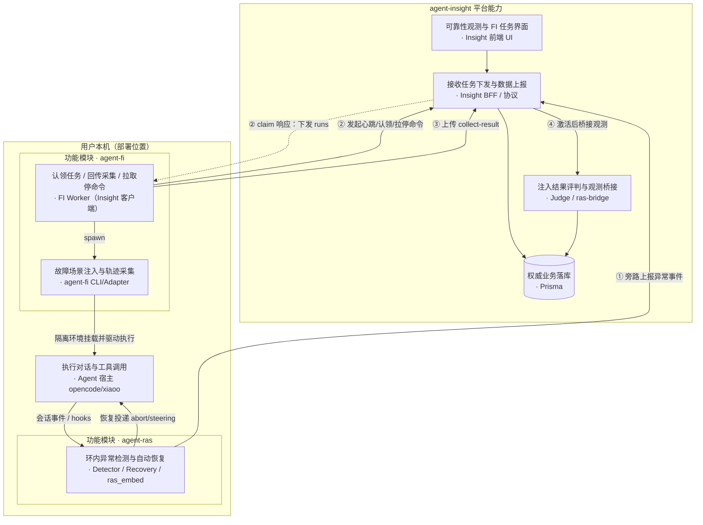
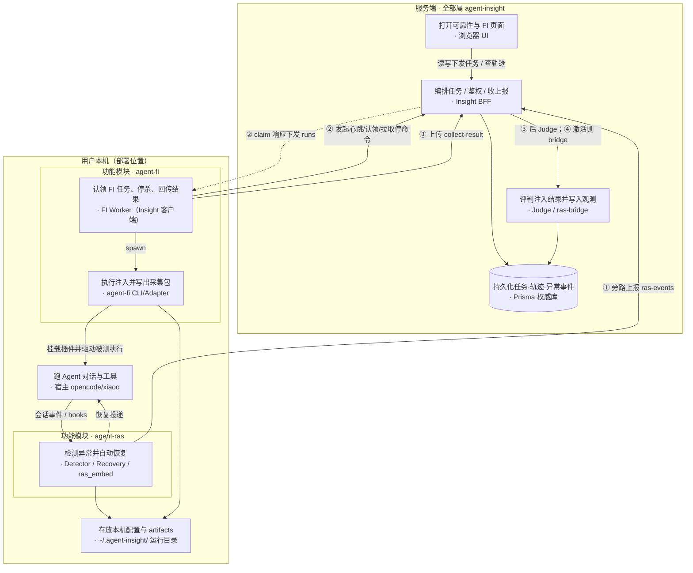
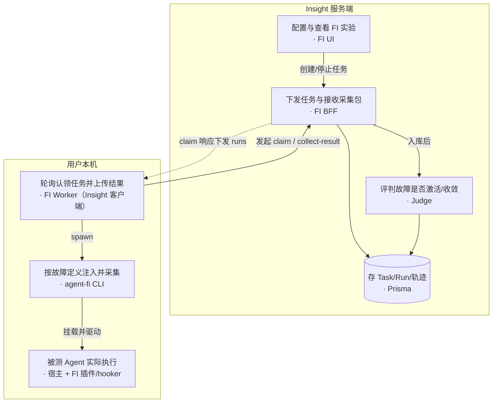
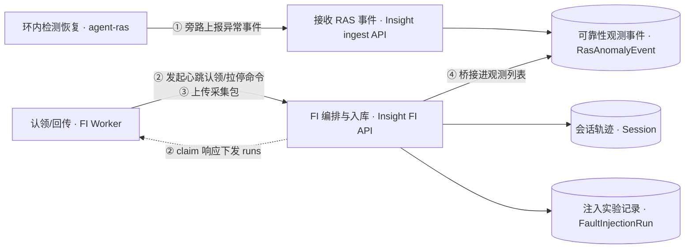
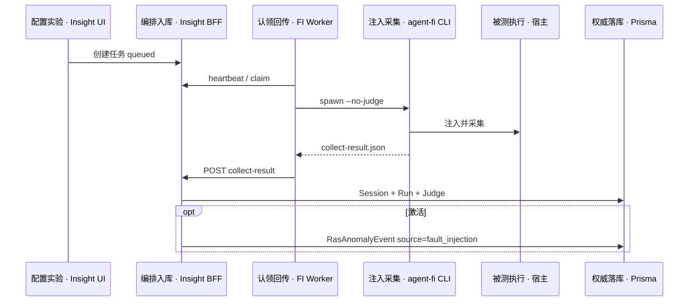

# Agent Insight · RAS · FI 关系设计说明

> **文档性质**：说明既有平台 **agent-insight** 与新增功能模块 **agent-ras**、**agent-fi** 的边界、部署与数据关系  
> **对齐实现**：2026-08-05（FI 已切远程 Insight + 本机 Worker；RAS 环内旁路上报已落地）  
> **图文版**：[ras-fi-insight-relationship.html](./ras-fi-insight-relationship.html)  
> **图示约定**：节点一律 **「功能简述 · 模块/组件名」**（功能在前）；边标签带通道动作。  
> **方向约定**：实线 = 主动调用/投递；虚线 = 响应回程（如 claim 下发 runs）。RAS↔Host 为同进程双向（事件进、恢复出）。②③ 由 **FI Worker** 发起，不是 agent-fi 包直连 API。

---

## 0. 命名与边界（先读）

| 名称 | 指什么 | **包含** | **不包含** |
|------|--------|----------|------------|
| **agent-insight** | 既有观测与编排**平台**（可扩展） | UI、BFF/API、数据协议与契约、Prisma/权威库、服务端 Judge、鉴权、安装脚本下发面 | 不在用户 Agent 进程内做检测/注入算法 |
| **agent-ras** | **新增**环内可靠性**功能实现模块** | Detector / Recovery / ras_embed / 平台薄适配（hooks、HostControl、可选 libpython inproc） | **不含**前端页面、Prisma schema、HTTP 契约设计（这些归 Insight） |
| **agent-fi**（`agent_fault_injection`） | **新增**故障注入**功能实现模块** | Fault catalog、注入工具、平台 Adapter、本机 Worker/CLI 采集编排 | **不含** FI 任务 UI、FaultInjection* 表、Judge、Worker HTTP 协议（这些归 Insight） |

**一句话**：Insight 是「旧平台 + 为 RAS/FI 新增的产品面与数据面」；RAS / FI 是「装在用户本机、干具体活」的实现模块。源码可同仓，**能力归属按上表划分，不按目录名把 UI/DB 算进 RAS/FI**。



---

## 报告导读

| # | 问题 | 章节 |
|---|------|------|
| 1 | 按部署位置：Insight 服务端 vs 用户本机（含 RAS/FI 模块） | §1 |
| 2 | Insight 为 RAS/FI **新增了哪些平台能力**（UI/DB/API） | §2 |
| 3 | agent-ras 模块做什么、如何对接 Insight | §3 |
| 4 | agent-fi 模块做什么、如何对接 Insight | §4 |
| 5 | 数据上报与协议（协议属 Insight；两侧如何填） | §5 |
| 6 | OpenCode / xiaoO 上 RAS vs FI 挂载对照 | §6 |
| 7 | .so / 安装路径 / 分册索引 | §7–§9 |

---

## 1. 部署全景（服务端 = Insight；用户端 = 宿主 + 模块）

不以仓库子目录为轴，而以 **跑在哪** 为轴。



| 部署位 | 归属 | 内容 |
|--------|------|------|
| 服务端进程 | **Insight** | UI、BFF、Prisma、Judge、bridge、鉴权 |
| 用户本机 · **功能模块 agent-ras** | **agent-ras** | 检测/恢复算法与平台适配（宿主内旁路） |
| 用户本机 · **功能模块 agent-fi** | **agent-fi** + Insight Worker 客户端 | FI CLI/Adapter；`fi-worker.js` 协议属 Insight、进程跑在本机 |
| 用户本机 · 共享 | 宿主 + 运行目录 | opencode/xiaoo；`~/.agent-insight/`（非权威） |

浏览器可远程；**宿主与两个功能模块同机，但 RAS / FI 分属不同模块框，不混装**。

---

## 2. agent-insight：平台侧能力（含为 RAS/FI 新增的部分）

下列一律算 **Insight**，即使源码路径靠近 `agent-ras` 路由或 `fault-injection` lib：

### 2.1 前端

| 入口 | 说明 |
|------|------|
| `/agent-ras/trace` 等 | 可靠性观测（读 `RasAnomalyEvent` 等） |
| `/agent-ras/fault-injection` | FI 任务/故障目录/Run 轨迹 UI |
| 设置页活跃模型 | FI Judge 依赖 |

### 2.2 数据与协议

| 能力 | 说明 |
|------|------|
| Prisma：`RasAnomalyEvent`、`FaultInjectionTask/Run/Worker`、`Session` … | 权威业务数据 |
| `POST /api/ingest/ras-events` | RAS 旁路事件契约（Insight 拥有） |
| `/api/fault-injection/*` | FI 任务、Worker、collect-result、setup（Insight 拥有） |
| OTLP 等既有 ingest | Insight 既有观测面（本说明不展开） |

### 2.3 服务端逻辑

| 能力 | 说明 |
|------|------|
| FI Judge（`judge.ts`） | 二维 outcome × containment |
| `ras-bridge` | FI 激活后写入观测表（`source=fault_injection`） |
| Worker 租约 / claim 超时 sweep | 服务端状态机 |
| dry-run stub | 不经本机模块 |

**Insight 不做**：在 Agent 进程内跑 Detector/Recovery；在服务端 `spawn` 用户本机的 opencode/xiaoo（已废弃）。

---

## 3. agent-ras：功能实现模块 ↔ Insight

### 3.1 模块职责（仅实现）

- L0 检测 / 恢复策略（单源 Python `core/`）
- 平台适配：深挂载（如 openjiuwen）或协议 inproc（OpenCode / xiaoO / …）
- OpenCode 可选 **libpython.so** 同进程嵌入
- 本机配置目录 `~/.agent-insight/ras/`（运行用，非展示真源）

### 3.2 与 Insight 的交界

| 方向 | 内容 | 归属 |
|------|------|------|
| 模块 → Insight | `insight_push` → `POST /api/ingest/ras-events`（fail-open） | **协议与落库 = Insight**；推送客户端代码在模块内 |
| Insight → 用户 | 可靠性观测 UI 展示 `RasAnomalyEvent` | Insight |
| 模块内部 | abort_stream / steering 等恢复投递 | **只发生在宿主进程**，不经 Insight 决策 |

### 3.3 RAS 不上报什么

- 不把「恢复是否成功」交给 Insight Judge（无 FI 式服务端评判）
- 不要求 Insight 持有本机 runtime 句柄；断连即 fail-open

细节：[agent-ras architecture](../../agent-ras/designs/architecture.md)。

---

## 4. agent-fi：功能实现模块 ↔ Insight

### 4.1 模块职责（仅实现）

- Fault catalog / Skill、结构注入与 runtime plan
- 平台 Adapter（OpenCode TS 插件、xiaoO hooker）
- CLI：`python -m agent_fault_injection.cli run … --no-judge`
- 本机写出 `collect-result.json` 等 artifacts

### 4.2 与 Insight 的交界

| 方向 | 内容 | 归属 |
|------|------|------|
| Insight → 模块 | 任务元数据经 Worker claim 下发（platform/fault/prompt/…） | **任务模型与 API = Insight** |
| 模块 → Insight | Worker 上传 collect-result（interactions / markers / evidence） | **契约与入库 = Insight** |
| Insight 内部 | Judge、ras-bridge、FI UI | Insight |

`scripts/fi-worker.js`：实现上随安装落到本机，但 **Worker 协议与编排语义属 Insight 平台客户端**；注入语义仍在 agent-fi 包内。

### 4.3 FI 拓扑（模块 + Insight 客户端）



旧「Next 同机 spawn CLI」已废弃。单机调试 = Insight 服务进程 + 本机 Worker 两角色。

---

## 5. 数据上报与协议（协议属 Insight）

### 5.1 通道总表

| # | 通道 | 发起（实现侧） | Insight 入口（平台） | 落库 | 语义 |
|---|------|----------------|----------------------|------|------|
| ① | RAS 旁路 | agent-ras `insight_push` | `POST /api/ingest/ras-events` | `RasAnomalyEvent` | 真实会话检出/恢复相关事件；fail-open |
| ② | FI 控制面 | FI Worker | `/worker/heartbeat\|claim\|commands` | Worker 表、Run 租约 | 无轨迹正文 |
| ③ | FI 采集结果 | Worker 读本机 JSON | `POST …/runs/:id/collect-result` | `Session` + `FaultInjectionRun` → Judge | 实验轨迹真源 |
| ④ | FI→观测 | Insight `ras-bridge` | 内部 | 再写 `RasAnomalyEvent`，`source=fault_injection` | 仅激活且非 dry-run |



### 5.2 汇聚与 UI（均属 Insight）

| 表 | 写入 | Insight UI |
|----|------|------------|
| `RasAnomalyEvent` | ① 或 ④ | `/agent-ras/trace` |
| `Session.interactions` | ③（及既有 ingest） | FI Run 轨迹等 |
| `FaultInjection*` | UI + ②/③ | `/agent-ras/fault-injection` |

同 `taskId` / `sessionTaskId` 可互跳；用户归属须一致。

### 5.3 collect-result 关键字段（契约属 Insight；由 agent-fi 填充）

| 字段 | 含义 |
|------|------|
| `runId` / `taskId` | Run id / 平台 session → `Session.taskId` |
| `framework` / `fault` / `injectionMethod` | 平台与故障元数据 |
| `faultActivated` | ④ 的门闩 |
| `interactions` / `markers` / `injectionEvidence` | 轨迹与证据 |

### 5.4 时序（FI ③ 展开）



RAS 侧无对称「claim」：宿主内模块运行时主动 ① push 即可。

---

## 6. 平台挂载对照（OpenCode / xiaoO）

同一宿主上可并存 RAS 与 FI，**挂载点与职责不同**。

| | agent-ras | agent-fi |
|--|-----------|----------|
| **目的** | 真实会话检测并恢复 | 实验注入并采集 |
| **OpenCode** | 协议 inproc；可 **libpython.so** 嵌 detectors | 临时隔离 config + **TS 插件** `agent-fault-injection.ts`（无 so） |
| **xiaoO** | hooks → ras_embed（socket/inproc 等，见 RAS 文档） | config overlay + **Python hooker** 子进程 |
| **与 Insight** | ① ras-events | ②③ Worker + collect-result |
| **恢复/评判** | 本机 HostControl 投递 | Insight 服务端 Judge |

### 6.1 FI × OpenCode（模块内）

隔离 config、装 Skill、跑前 structural apply；插件 hooks：`system.transform` / `messages.transform` / `text.complete` / `tool.execute.*`。`tool-argument-error` 仅 OpenCode。

### 6.2 FI × xiaoO（模块内）

Skill 入 `.xiaoo/skills`；默认 Tool-only plugin，完整拦截需 chat-llm 档；无 Chat 时 `system.append` 折入 `--system`。

### 6.3 注入方式矩阵（agent-fi 实现能力）

| injection_method | OpenCode | xiaoO |
|------------------|----------|-------|
| `skill_inject` | ✅ | ✅ |
| `file_tamper` | ✅ | ✅ |
| `prompt_modify` | ✅ | ⚠️ 需 Chat / 否则 `--system` |
| `tool_result_tamper` | ✅ | ✅ |
| `intercept_rewrite` | ✅ | ⚠️ 需 chat-llm |
| `route_manipulate` | ❌ | ❌ |

两层管道：Structural（跑前）+ Runtime（环境变量计划）。激活：`requested → started → completed`。

---

## 7. 共享库（.so）边界

| 场景 | 是否加载 .so | 说明 |
|------|--------------|------|
| agent-ras × OpenCode inproc | **是**（libpython） | 模块实现细节 |
| agent-fi × OpenCode / xiaoO | **否** | TS 插件 / python3 hooker |
| agent-insight 服务端 | 否 | 不嵌入用户 Agent |

---

## 8. 安装与路径

| 项 | 归属 | 路径 / 命令 |
|----|------|-------------|
| Insight DB | Insight | `~/.agent-insight/data/witty_insight.db` 或 `DATABASE_URL` |
| RAS 本机配置 | 模块运行目录 | `~/.agent-insight/ras/`；`install-ras` |
| FI 本机配置 / artifacts | 模块运行目录 | `~/.agent-insight/fault-injection/` |
| FI Worker 启动 | Insight 安装面 | `npx agent-insight install-fault-injection --start` 或 `/api/fault-injection/setup` |

```bash
export AGENT_INSIGHT_HOST=https://insight.example
export AGENT_INSIGHT_API_KEY=<key>
npx agent-insight install-fault-injection --start
```

---

## 9. 参考分册

| 文档 | 归属视角 |
|------|----------|
| [agent-ras architecture](../../agent-ras/designs/architecture.md) | RAS **模块**实现 |
| [agent-fault-injection architecture](./architecture.md) | FI **模块** + 与 Insight 交界摘要 |
| [server-client-split.md](./server-client-split.md) / [phase2 SDD](../../design/fi-server-client-split/phase2-requirements-design.md) | Insight FI 远程编排 |
| [modules/task-orchestration.md](./modules/task-orchestration.md) 等 | Insight FI API / Judge / bridge |
| [guides/getting-started.md](../guides/getting-started.md) | FI 启用 |
| developer-guide ingest / OTLP 契约 | Insight **协议** |

---

## 附录：术语

| 术语 | 含义 |
|------|------|
| agent-insight | 平台：UI + API/协议 + DB + Judge |
| agent-ras | 环内检测/恢复**实现模块** |
| agent-fi | 故障注入/采集**实现模块**（包名 `agent_fault_injection`） |
| FI Worker | Insight 本机编排客户端（非 FI 算法本体） |
| ①②③④ | §5 四条数据/控制通道 |
| inproc | RAS 同进程嵌入（可含 libpython） |
