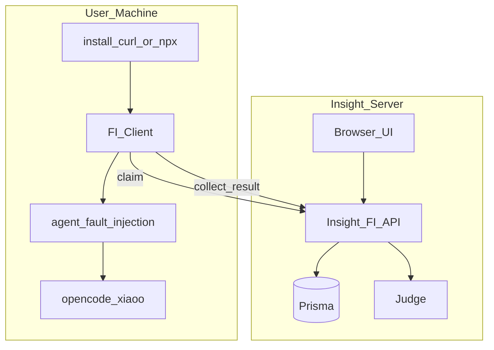

# FI 服务端 / 客户端分离

> **状态**：✅ 已落地（2026-08-05）— 浏览器 E2E：无 Worker 提示 / Worker inventory / claim→collect-result

> **完整 SDD**：[phase2-requirements-design.md](../../design/fi-server-client-split/phase2-requirements-design.md)  
> **开发计划**：[phase3-development-plan.md](../../design/fi-server-client-split/phase3-development-plan.md)  
> **需求输入**：[phase1-requirements-analysis.md](../../design/fi-server-client-split/phase1-requirements-analysis.md)  
> **读者总览**：[ras-fi-insight-relationship.md](./ras-fi-insight-relationship.md)（Insight · RAS · FI 关系说明）

## 一句话

Insight **服务端**负责任务下发、状态/结果展示与 Judge；用户本机扮演 **FI Client** 角色（认领、注入编排、回传），由本机安装面启用，并驱动 `agent_fault_injection`；主路径为 claim → collect-result（租约续命等控制面细节见 phase2）。

## 目标拓扑



## 废弃

旧「Next 同机 spawn collector」路径已删除；单机调试 = Insight 服务端 + FI Client 两角色。

## 安装

```bash
# 远程 Insight
curl -fsSL "$HOST/api/fault-injection/setup?key=$API_KEY" | bash

# 仓内 / npm
npx agent-insight install-fault-injection --start
# 检查
npx agent-insight install-fault-injection --check
```

细节与接口表见完整 SDD。

**评审**：初评 conditionally passed（71）→ 修订后四维约 83，见 [design-dimensions-review.md](../../design/fi-server-client-split/review/design-dimensions-review.md)。
