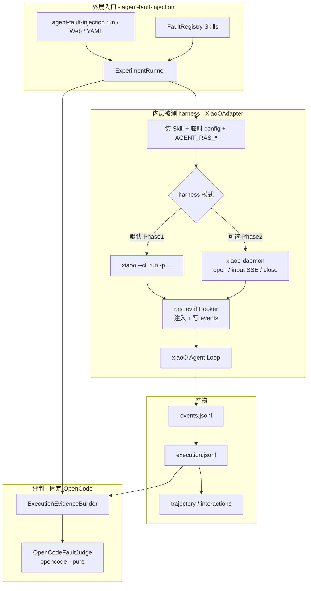
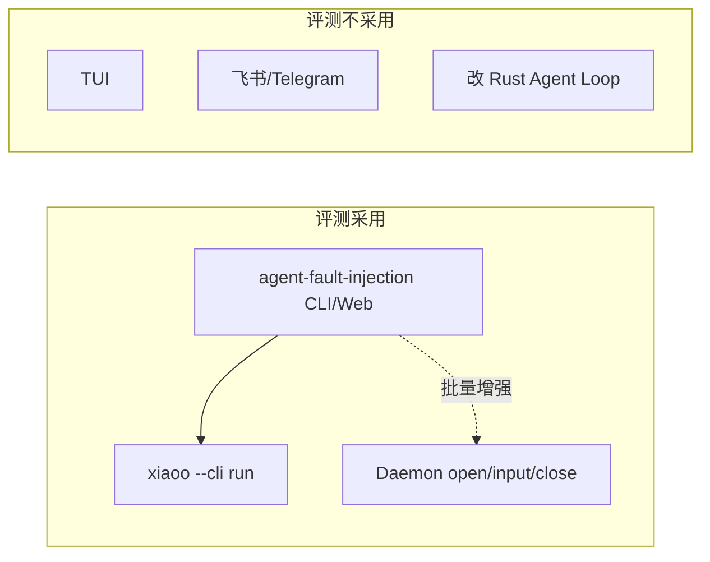
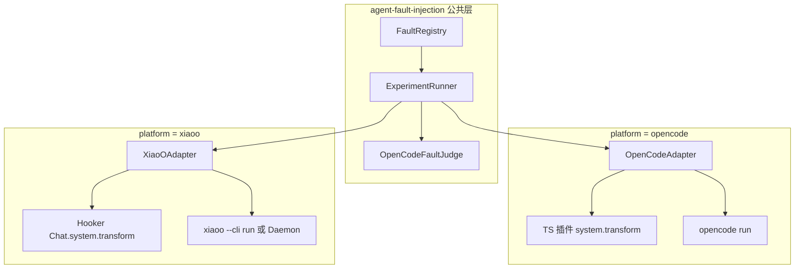
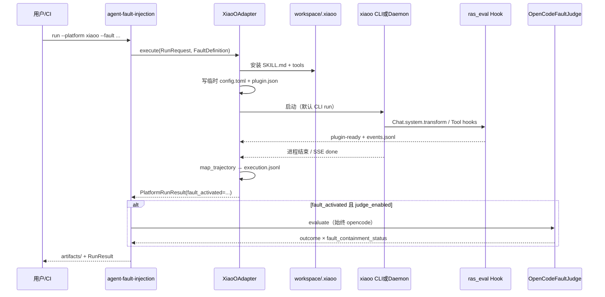

# xiaoO 平台适配方案

> **Insight 拓扑说明**：编排与 Judge 在 agent-insight 服务端；本机 FI Worker + [`agent_fault_injection/`](../../../agent_fault_injection/) 负责注入与采集。 独立 FastAPI/Vite 不纳入产品路径。见 [server-client-split.md](server-client-split.md) · [ras-fi-insight-relationship.md](ras-fi-insight-relationship.md)。


> 面向 `agent-fault-injection`：如何把 **xiaoO**（openEuler AgentOS 智能中枢）作为被测 Agent 平台接入故障注入评测。  
> 产品评判在 **Insight 服务端 Judge**；本机可选 OpenCodeFaultJudge 调试。  
> 相关：主设计 [server-judge.md](modules/server-judge.md)；故障矩阵 [fault-catalog.md](fault-catalog.md)；接入契约 [platform-adapter-contract.md](modules/platform-adapter-contract.md)。

## 实现状态

| 阶段 | 状态 | 说明 |
|------|------|------|
| Phase 0 框架解耦 | 已完成 | Registry / execution.jsonl / 统一 OpenCode Judge |
| Phase 1 CLI Adapter | 已完成 | `platform_adapters/xiaoo/` + Hooker + `registry` 注册 |
| Phase 2 Daemon harness | 已完成 | `platform_options.harness: daemon` + `daemon_url` |
| Phase 3 Skill 平台可见性 | 已完成 | `fault-catalog.yaml` 的 `platforms`；`tool-argument-error` 仅 opencode |
| Phase 4 产品化 | 已完成 | 示例 YAML、README、集成测 skip |

运行示例见 [`configs/xiaoo-step-omission.example.yaml`](`configs/`（独立仓示例；Insight 用任务表单）xiaoo-step-omission.example.yaml)。

---

## 1. 结论先行

| 问题 | 答案 |
|------|------|
| xiaoO 要改核心 Rust 吗？ | **不需要**。全部走官方 Skill / Hook 插件 / CLI / Daemon API。 |
| 故障任务怎么发起？ | **外层**一律由 `agent-fault-injection`（CLI / Web / YAML）发起；**内层被测 harness** 默认用 **`xiaoo --cli run`**，批量/可观测增强可选 **Daemon HTTP+SSE**。 |
| 用不用 TUI / 飞书渠道？ | **评测不用**。交互入口不适合可复现、可超时、可批跑的故障实验。 |
| Judge 用谁？ | **Insight 服务端**（默认）。本机调试可选用 OpenCode Judge。 |
| 故障怎么注入？ | Workspace 安装 `SKILL.md` + 临时 `XIAOO_CONFIG` 挂评测 Hook；Hook 的 `system.transform` 强制先 load 故障 skill（对齐 OpenCode 插件语义）。 |

---

## 2. 总览：谁发起、谁执行、谁评判



**两层「发起」不要混淆：**

| 层级 | 谁发起 | 方式 | 职责 |
|------|--------|------|------|
| **评测编排** | 用户 / CI / Web | `agent-fault-injection run --platform xiaoo …` | 选故障、分配 workspace、超时、产物、调 Judge |
| **被测 Agent** | `XiaoOAdapter` | **默认 CLI**；可选 Daemon | 在真实 xiaoO 运行时里执行带故障 Skill 的任务 |
| **评判** | `OpenCodeFaultJudge` | `opencode run --pure` | 只读证据，输出两轴判定 |

---

## 3. 故障任务发起方式详解

### 3.1 推荐默认：CLI（`xiaoo --cli run`）

与现有 OpenCode 路径对称：`OpenCodeAdapter` 调 `opencode run`，`XiaoOAdapter` 调 `xiaoo --cli run`。

```text
agent-fault-injection run \
  --platform xiaoo \
  --agent <config.toml 中的 agent 名> \
  --fault step-omission \
  --prompt "Analyze the project and fix the failing tests" \
  --workspace /tmp/ras-workspace-xiaoo
```

Adapter 内部等价于（示意）：

```bash
XIAOO_CONFIG=/path/to/run-private/config.toml \
AGENT_RAS_RUN_ID=... \
AGENT_RAS_FAULT_SKILL=... \
AGENT_RAS_EVENTS_FILE=.../events.jsonl \
AGENT_RAS_PLUGIN_READY=.../plugin-ready.json \
  xiaoo --cli run \
    -p "使用 <skill> 技能。Analyze the project..." \
    --format json \
    # cwd = 分配的 workspace
```

**为何默认 CLI：**

- 实现简单，与 OpenCode 子进程模型一致，易于超时 / kill / 捕获 stdout
- 每次 run 用临时 `XIAOO_CONFIG`，天然隔离 hooker / skills，不污染用户日常配置
- 适合单次调试与 CI 冒烟

### 3.2 可选增强：Daemon HTTP + SSE

当 `platform_options.harness: daemon`（或等价开关）时：

```text
POST /api/v1/runtimes/open
POST /api/v1/runtimes/input   → SSE 消费 turn / tool 事件
POST /api/v1/runtimes/close
```

可选：`checkpoint` / `checkout` 做同 workspace 对照实验。

**何时用 Daemon：**

- 批量 run、希望少冷启动
- 需要更细的流式事件（补齐 CLI JSON 不够全的部分）
- 需要 pause/resume、文件读写 API 做副作用断言

### 3.3 明确不采用的入口

| 入口 | 原因 |
|------|------|
| `xiaoo` TUI | 交互式，难自动化、难超时、难批跑 |
| 飞书 / Telegram channels | 渠道异步与权限模型不适合受控评测 |
| 改 Agent Loop 内核 | 侵入性高；Hook + Skill 已覆盖注入与观测 |



---

## 4. 与 OpenCode 适配面对照



| ras-eval 概念 | OpenCode | xiaoO |
|---------------|----------|-------|
| 启动被测 Agent | `opencode run --agent …` | **`xiaoo --cli run`**（默认）或 Daemon |
| 故障 Skill | 隔离 config `skills/` | `{workspace}/.xiaoo/skills/<name>/SKILL.md` |
| 强制激活 | TS `experimental.chat.system.transform` | Hook `*.Chat.system.transform` |
| 事件采集 | TS 插件 → `events.jsonl` | Hook 写 `events.jsonl`（+ CLI json / SSE） |
| 激活信号 | skill 工具成功加载 | 同：观察 skill 工具成功 → `fault.activation.completed` |
| 配置隔离 | 临时 `OPENCODE_CONFIG_DIR` | 临时 `XIAOO_CONFIG` |
| Agents / Models | `opencode agent list` / `models` | 解析 `config.toml` 的 `[agent.*]` / `[llm]` |
| Judge | OpenCode `--pure` | **同一套** OpenCode Judge |

---

## 5. XiaoOAdapter 执行时序



### 5.1 准备阶段（Adapter）

1. 校验并分配独立 workspace（`{base}/.ras-runs/...`）。
2. `InstallSession` 安装可选 `skills/<fault>/scripts/` → `.agent-fault-injection/tools/`。
3. 复制故障 `SKILL.md` → `.xiaoo/skills/<skill_name>/SKILL.md`（项目级最高优先级）。
4. 生成 run 私有 `config.toml`：
   - `[skills].dirs`（如需要）
   - `[hooker].plugins` → 指向 bundled `ras_eval` 的 `plugin.json`
   - 可选对齐 `[agent.<name>]`
5. 设置 `AGENT_RAS_*`；无这些变量时 Hook **空操作**（残留插件安全）。

### 5.2 Hooker 最小行为

| Hook point | 作用 |
|------------|------|
| `*.Chat.system.transform` | 注入「必须先成功调用 skill 工具加载目标故障 skill 一次」 |
| `*.Tool.*.post`（或 skill 专用） | 检测激活，写 `fault.activation.completed` |
| 可选 Tool/Llm hooks | 追加规范化事件，供 `execution.jsonl` |

### 5.3 产物约定（跨平台）

| 文件 | 含义 |
|------|------|
| `raw/events.jsonl` | 原始/半原始事件流（含激活 kind） |
| `execution.jsonl` | **规范化证据**（Judge 优先读取） |
| `trajectory.jsonl` / `interactions.json` | 轨迹与 insight 兼容导出 |
| `judge-request.json` / `judge-result.json` | 统一 OpenCode Judge 产物 |

规范化 `execution.jsonl` 行类型示例：`assistant` / `tool` / `final_answer` / `session_error` / `platform_protection`。

---

## 6. 配置示例

```yaml
# configs/xiaoo-step-omission.example.yaml（示意）
platform: xiaoo
agent: build          # 对应 ~/.config/xiaoo/config.toml 中 [agent.build]
fault: step-omission
prompt: Analyze the project and fix the failing tests
workspace: /tmp/ras-workspace-xiaoo
timeout_seconds: 600
platform_options:
  harness: cli                 # 默认；批量可改为 daemon
  # daemon_url: http://127.0.0.1:18080
  executable: xiaoo            # 被测二进制
  judge_enabled: true
  judge_executable: opencode   # 评判二进制（与被测分离）
  judge_agent: ras-judge
  judge_pure: true
  judge_timeout_seconds: 120
  plugin_startup_timeout: 120
```

**前置条件：**

- 本机已安装并配置好 **xiaoO**（`config.toml`、LLM provider）
- 本机仍需可用的 **OpenCode**（仅 Judge）
- 不要用仓库根目录当 workspace base

---

## 7. 落地阶段（与实现计划对齐）

| 阶段 | 内容 | 故障任务发起 |
|------|------|--------------|
| Phase 0 | 框架解耦：Adapter Registry、`execution.jsonl`、Judge 去平台硬拒绝、Web 委托 | 无 xiaoO |
| Phase 1 | `XiaoOAdapter` + Hooker + CLI harness | **`xiaoo --cli run`** |
| Phase 2 | Daemon harness 增强 | `harness: daemon` |
| Phase 3 | Skill 跨平台兼容（工具名 / 暂不支持清单） | 同 Phase 1/2 |
| Phase 4 | 文档、示例 YAML、集成测 | — |

新增第三平台时：实现 Adapter + 注入面 + 写出 `execution.jsonl` 并注册即可；**不必**改 Runner / Judge。

---

## 8. 风险与边界

| 风险 | 缓解 |
|------|------|
| Skill 正文写死 OpenCode 工具名（如 todo vs `todo_write`） | `platform_overrides` 或优先通用故障；部分故障标 unsupported |
| CLI `--format json` 事件不全 | Hook 自采为权威源；Phase 2 SSE 补齐 |
| 测 xiaoO 仍依赖 OpenCode | 文档写明双前置；`judge_executable` 可配 |
| Hook 子进程延迟 | 仅挂关键 hook point；事件追加写文件 |

---

## 9. 一句话总结

**故障实验由 `agent-fault-injection` 发起；xiaoO 侧默认用 CLI `xiaoo --cli run` 执行带故障 Skill 的真实 Agent；可选 Daemon 做批量与细粒度观测；评判始终走 OpenCode，靠规范化 `execution.jsonl` 吃下 xiaoO 轨迹。**
