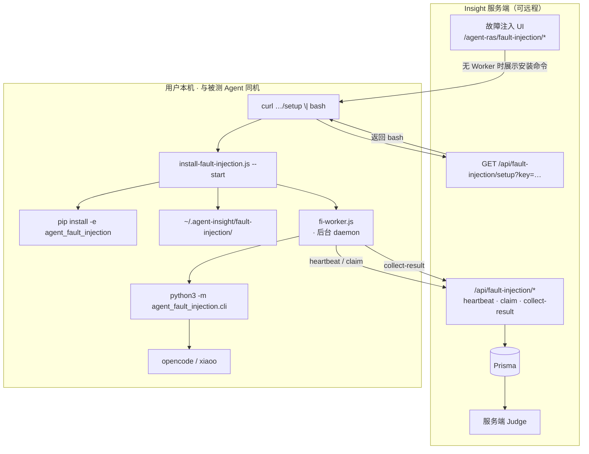
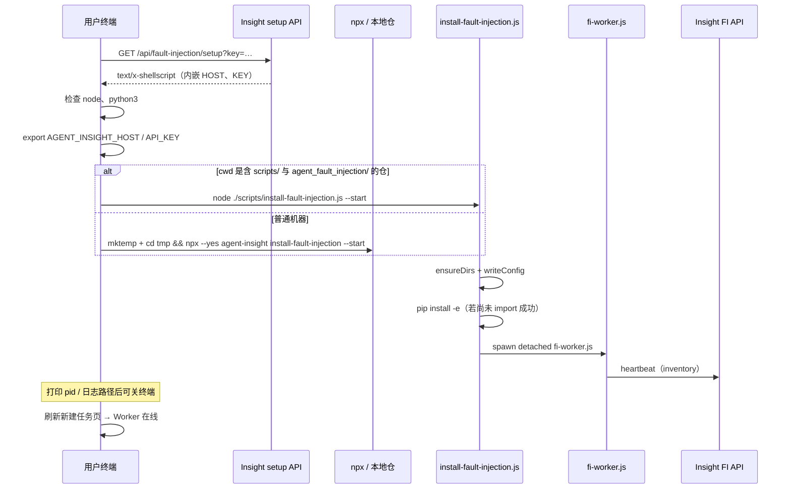
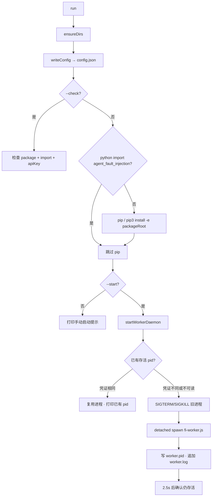
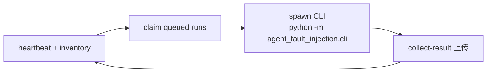
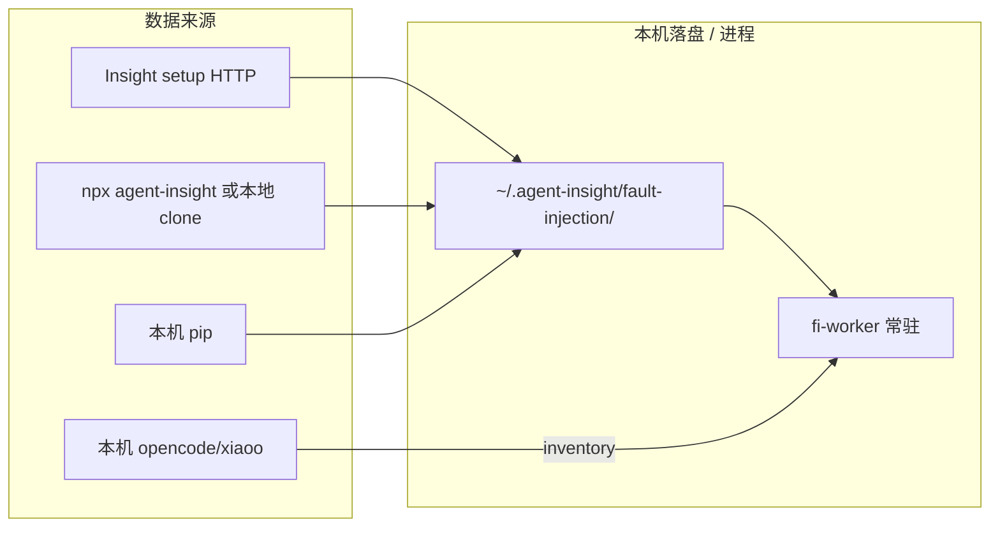

# Agent FI：本机安装过程详解

> **读者**：需要理解「执行 FI setup curl 后，用户机器上发生了什么」的使用者与排障者。  
> **范围**：本机 **FI Client / Worker** 的安装、落盘与常驻进程；不含故障 Skill 内容与服务端 Judge 算法。  
> **真源**：[`src/app/api/fault-injection/setup/route.ts`](../../../src/app/api/fault-injection/setup/route.ts)、[`scripts/install-fault-injection.js`](../../../scripts/install-fault-injection.js)、[`scripts/fi-worker.js`](../../../scripts/fi-worker.js)。  
> **关系总览**：[Insight · RAS · FI](../designs/ras-fi-insight-relationship.md) · [server-client-split](../designs/server-client-split.md)。  
> **产品操作**：[user-guide/observability/fault-injection.md](../../user-guide/observability/fault-injection.md)。

---

## 1. 一句话

FI 安装命令在用户本机启用 **FI Client**：把 Python 包 `agent_fault_injection` 装好、写好 Worker 配置，并（默认）**后台常驻** `fi-worker`。Worker 向远程 Insight **心跳 / claim / 回传 collect-result**；真正注入由本机 CLI 驱动 OpenCode / xiaoO。**服务端**负责任务编排与 Judge，不在用户机跑注入算法。



---

## 2. 入口命令对照

| 入口 | 典型命令 | 何时用 |
|------|----------|--------|
| **新建任务页提示** | 页面生成的 `curl -fsSL "$HOST/api/fault-injection/setup?key=$API_KEY" \| bash` | 无在线 Worker；**以页面命令为准** |
| **手动等价** | 同上，自行替换 `$HOST` / `$API_KEY` | 脚本化部署 |
| **仓内 / 已有 npm 包** | `npx agent-insight install-fault-injection --start` | 开发机或已装 CLI |
| **仅检查** | `npx agent-insight install-fault-injection --check` | 不启 Worker，校验包与 apiKey |
| **前台排障** | `… --start --foreground` 或 env `AGENT_INSIGHT_FI_WORKER_FOREGROUND=1` | 日志打在终端 |

与 RAS / 观测安装指导的区别：

| | FI setup（本文） | 看板 `/api/setup` |
|--|------------------|-------------------|
| URL | `/api/fault-injection/setup` | `/api/ingest/setup`（rewrite `/api/setup`） |
| 目标 | FI Worker 常驻 | 观测插件 +（条件）RAS |
| 是否交互勾选框架 | 否 | 是 |
| 是否依赖 RAS | **否** | RAS 为可选附加 |

---

## 3. 本机前置条件清单

| 项 | 要求 | 不满足时 |
|----|------|----------|
| Node.js | 可执行 `node`（Worker 与安装器） | setup 脚本直接 exit |
| Python 3 | `python3` 在 PATH；可 `import agent_fault_injection`（或允许 pip 安装） | pip 安装失败则整体失败 |
| pip / pip3 | 首次装 editable 包 | 安装中断 |
| 网络 | 本机能访问 Insight `$HOST`（HTTP）；若走 `npx` 还需访问 npm | npx / 心跳失败 |
| API Key | **当前登录账号**的 Key（Worker 按用户隔离） | 心跳无人认领 / 页面仍显示无 Worker |
| 被测平台 | 本机已装 **OpenCode** 和/或 **xiaoO**（与 Worker **同机**） | inventory 空，向导无法选平台/模型 |
| 写权限 | `~/.agent-insight/fault-injection/` | 无法写 config / pid / log |

常用环境变量：

| 变量 | 作用 |
|------|------|
| `AGENT_INSIGHT_HOST` | Insight 基址（写入 config，Worker 请求用） |
| `AGENT_INSIGHT_API_KEY` | Worker 鉴权头 |
| `AGENT_INSIGHT_FI_WORKER_ID` | 可选覆盖 workerId |
| `AGENT_INSIGHT_FI_WORKER_FOREGROUND=1` | 前台跑 Worker |

---

## 4. curl 端到端时序



---

## 5. setup 路由返回的 bash 逐步说明

实现：[`src/app/api/fault-injection/setup/route.ts`](../../../src/app/api/fault-injection/setup/route.ts)。

| 步 | 脚本行为 | 说明 |
|----|----------|------|
| 1 | `set -euo pipefail` | 任一步失败即退出 |
| 2 | 打印 `host=$HOST` | HOST 来自请求的 `protocol://host` |
| 3 | 检查 `node`、`python3` | 缺则 stderr 报错退出 |
| 4 | `export AGENT_INSIGHT_HOST` / `AGENT_INSIGHT_API_KEY` | KEY 来自 query `key` |
| 5a | 若 `./scripts/install-fault-injection.js` 且 `./agent_fault_injection` 存在 | **本地仓路径**（开发常见） |
| 5b | 否则 | `mktemp` 空目录 + `npx --yes agent-insight install-fault-injection --start`（避免在包内 cwd 触发错误的 `file:` 解析，尤其 WSL `/mnt/*`） |
| 6 | 提示后台已跑、可关终端；换 Key 会重启 Worker | 同 Key/host 再跑则保留进程 |

缺少 `key` 时 API 直接 **400**，不会返回可执行脚本。

---

## 6. `install-fault-injection.js` 逐步说明

实现：[`scripts/install-fault-injection.js`](../../../scripts/install-fault-injection.js)。



### 6.1 目录

一律在：

```text
~/.agent-insight/fault-injection/
├── config.json
├── worker.pid          # --start 后
├── worker.log
├── artifacts/          # Run 本机产物
└── workspaces/         # 隔离 workspace 基目录
```

### 6.2 `config.json` 字段

| 字段 | 含义 | 来源 |
|------|------|------|
| `insightBaseUrl` | Insight 根 URL（无尾 `/`） | `AGENT_INSIGHT_HOST` 或保留旧值，默认 `http://127.0.0.1:3000` |
| `apiKey` | Worker 鉴权 | `AGENT_INSIGHT_API_KEY` 或保留旧值 |
| `workerId` | 稳定 Worker 标识 | 首次生成 `fi-worker-<hostname>-<hex>`，之后保留 |
| `maxParallel` | 并行 Run 上限 | 默认 5 |
| `pollIntervalMs` | 轮询间隔 | 默认 2000 |
| `artifactsDir` | 产物目录 | 默认 `…/artifacts` |
| `workspaceBase` | workspace 基路径 | 默认 `…/workspaces` |
| `packageRoot` | `agent_fault_injection` 路径 | 解析 cwd 仓或安装器旁路径 |

### 6.3 Python 包解析顺序

`resolvePackageRoot()`：

1. `cwd/agent_fault_injection`（含 `pyproject.toml` 或 `setup.py`）  
2. 否则 `scripts/../agent_fault_injection`（npm 包或仓内布局）  

若 `python3 -c "import agent_fault_injection"` 失败：先 `pip install -e`，再试 `pip3`。

### 6.4 Worker 进程生命周期

- **日志**：`~/.agent-insight/fault-injection/worker.log`（追加）  
- **PID 文件**：`worker.pid`  
- **凭证变更检测**（Linux/WSL）：读 `/proc/<pid>/environ` 中的 `AGENT_INSIGHT_API_KEY` / `AGENT_INSIGHT_HOST`；与目标不一致则重启  
- **停止**：`kill $(cat ~/.agent-insight/fault-injection/worker.pid)`  
- **前台**：`--foreground` 时 stdio 继承当前终端，不写 detached  

---

## 7. Worker 跑起来之后（安装后的稳态）

`fi-worker.js` 不在「安装」脚本里展开全部业务，但理解安装结果需要知道它做什么：



- **inventory**：本机真实 agents/models，供新建任务向导选平台  
- **claim**：领取 `queued` 任务，在隔离 workspace 注入并采集  
- **collect-result**：回传后由 **Insight 服务端 Judge** 评判（本机不再跑产品 Judge）  
- **不**启动 RAS；若宿主已挂 RAS，那是安装指导/install-ras 的结果，与 FI 任务解耦  

本机排障产物（权威仍在 DB）：

```text
~/.agent-insight/fault-injection/artifacts/<runId>/
```

禁止把仓库根当作 `workspaceBase`。

---

## 8. 数据从哪里来

| 数据 / 产物 | 来源 |
|-------------|------|
| setup 脚本 | Insight 动态生成（内嵌当前请求的 Host + Key） |
| `install-fault-injection.js` / `fi-worker.js` | **本地仓** 或 **`npx agent-insight`** 包内 `scripts/` |
| `agent_fault_injection` Python 树 | 同上包内目录；本机 `pip install -e` |
| 故障 Skill / catalog | Python 包内 `fault_inject/skills/` 等（随包） |
| API Key / Host | setup query → env → `config.json` |
| Agent / Model 列表 | Worker 启动后对本机平台做 inventory，经 heartbeat 上报 Insight |
| Judge 结论 | **仅服务端**；不从本机上传包直读为权威 |



---

## 9. 验收与排障

### 验收

```bash
# 安装检查
npx agent-insight install-fault-injection --check

# 进程与日志
cat ~/.agent-insight/fault-injection/worker.pid
ps -p "$(cat ~/.agent-insight/fault-injection/worker.pid)" -o pid,cmd
tail -n 50 ~/.agent-insight/fault-injection/worker.log

# UI：打开 /agent-ras/fault-injection/tasks/new ，平台应可选
```

### 常见失败

| 现象 | 可能原因 | 处理 |
|------|----------|------|
| setup 400 | 未带 `key=` | 使用当前账号 API Key |
| `Node.js is required` / `python3 is required` | PATH 缺工具 | 安装 Node 20+、Python3 |
| `npx install failed` | 网络或 registry；或在错误 cwd | 检查 npm；或在仓根用本地 installer 分支 |
| Worker 启动后立即退出 | Key/Host 错、依赖缺 | 看 `worker.log` 尾部；`--foreground` 复现 |
| 页面仍无 Worker | Key 属于别的用户；防火墙挡心跳；Worker 未起 | 确认 Key；本机 curl Insight；查 pid |
| 有 Worker 但平台空 | 本机未装 OpenCode/xiaoO 或不在 PATH | 同机安装并保证 inventory 能枚举 |
| 换账号后任务不对人 | 旧 Worker 仍用旧 Key | 用新 Key 重跑 setup（应自动重启） |

---

## 10. 与 RAS / 观测的边界（安装面）

| | FI（本文） | RAS | 观测采集 |
|--|-----------|-----|----------|
| curl | `/api/fault-injection/setup` | 多经 `/api/setup` 条件触发，或 `install-ras` | `/api/setup` |
| 常驻进程 | **是**（fi-worker） | 否（inproc） | 视框架（uploader/watcher） |
| 装 RAS？ | 否 | 是 | 否（可同一次脚本顺带） |
| 文档 | 本文 | [RAS 本机安装过程](../../agent-ras/guides/local-install-process.md) | developer-guide / user-guide 各平台页 |

完整链路建议（xiaoo 举例）：先按安装指导装观测 +（可选）RAS，再单独 curl FI setup；FI overlay 会保留用户已有 hooker 插件再追加注入能力。

---

## 11. 源码与延伸阅读

| 文件 | 说明 |
|------|------|
| [`src/app/api/fault-injection/setup/route.ts`](../../../src/app/api/fault-injection/setup/route.ts) | curl 安装脚本 |
| [`scripts/install-fault-injection.js`](../../../scripts/install-fault-injection.js) | 目录、config、pip、启停 Worker |
| [`scripts/fi-worker.js`](../../../scripts/fi-worker.js) | 心跳 / claim / CLI / collect |
| [`bin/cli.js`](../../../bin/cli.js) | `install-fault-injection` / `fi-worker` 子命令 |
| [getting-started.md](getting-started.md) | 最短启用 |
| [task-orchestration.md](../designs/modules/task-orchestration.md) | Insight FI API |
| [server-client-split.md](../designs/server-client-split.md) | 拓扑与废弃路径 |
