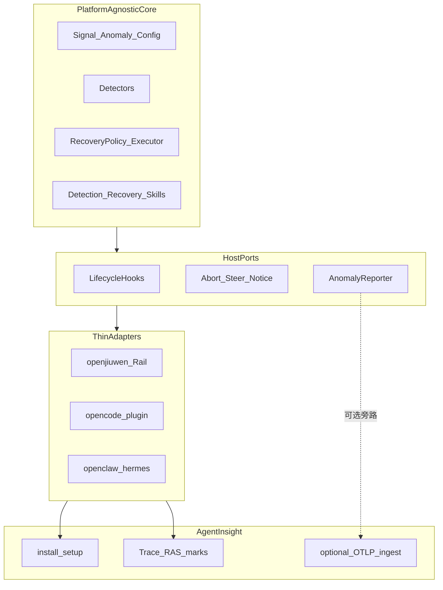

# 多平台挂载方式分析：AgentInsight 落位 + 分层挂载

> 选型结论供本仓后续平台无关演进使用。  
> **产品落位**：整包装入 **[agent-insight](https://gitcode.com/openeuler/agent-insight)** 仓根 `agent_ras/`。  
> 「核 + 薄适配器」分层模式仍适用。

## 1. 结论

**产品家 = AgentInsight**（仓根 `agent_ras/` + insight 安装入口 + Trace 页面内嵌 RAS 监控）。  

**挂载模型** = 平台无关核 + 按宿主深度的薄 `platform_adapter`（环内 abort / steer / notice）。  

**观测旁路**（可选）= OTLP → agent-insight ingest；**不能**替代环内恢复。

不采用「仅 OTLP / 仅 Cursor Skill」作为 RAS 主路径：无法实现流式中断与 steering。

## 2. 对照表（历史选型语境）

| 维度 | agent-insight（现产品家） | 对 agent_ras |
|------|---------------------|---------------------------|--------------|
| 目标 | 框架无关 AgentOps（观测 / 评测 / Skill 工程）+ **承载 RAS 模块** | RAS 是环内检测 + 恢复；与 insight 观测互补 |
| 平台无关核 | OTLP schema + 本仓 Python `core/` | 核应是 Signal / Detector / Recovery，非某平台 Rail |
| 挂载 | 原生插件 **或** OTLP；另增 RAS Host 插件安装入口 | 需要**深挂载**才能 abort / steer |
| 落位 | **仓根 `agent_ras/`** | 见 [`../design/inproc-package-migration/agent_insight_migration.md`](../design/inproc-package-migration/agent_insight_migration.md) |

## 3. 为何不能只用 OTLP

agent-insight 已接入 OpenCode / Claude Code / Hermes 等观测路径。这对 **可观测性** 很合适，但 agent_ras 的关键价值在：

1. 流中检测（thinking loop / repeat tool）
2. 确认异常后打断进行中的 `llm.stream`
3. suppress / steer / notice / terminate

这些都发生在 Agent 决策环 **内部**，必须有宿主生命周期钩子与控制面 API。insight 的 telemetry 扩展典型只做旁路，不劫持控制环——故 RAS 以 **并列 Host 插件 + Python core** 进入 insight，而不是改写成 exporter。

## 4. 分层挂载（仍采用）

```
平台无关核：core（detectors / recovery / skills）
        │ 薄适配器 platform_adapter
   ┌────┼────┬──────────┐
   ▼    ▼    ▼          ▼
openjiuwen  OpenCode  openclaw  Hermes
深 Rail     薄插件     骨架       骨架
```

| 分层角色 | agent_ras 落点 |
|----------|----------------|
| 算法与策略 | `core/` |
| 深适配器 | `platform_adapter/openjiuwen`（第一等） |
| 薄适配器 | `platform_adapter/opencode` 等 + INSTALL |
| 产品安装/UI | agent-insight scripts + Trace 页面 RAS 标识 |

## 5. 目标架构



### 能力分层

- **深适配器（环内 RAS）**：lifecycle 采 Signal、stream 观测、abort/steer/notice。
- **浅适配器（说明 / Skill）**：无同构钩子时先挂检测 skill + 指南，不宣称同等恢复能力。
- **产品壳**：AgentInsight 负责一键安装与人机监控；不把算法搬进 Next.js。

## 6. 易挂载体验（建议抄法）

| 来源 | 可抄项 |
|------|--------|
| AgentInsight | framework / setup 选择器；`scripts/` + `/api/ingest/setup/*`；配置目录 `~/.agent-insight` |

## 7. 明确不采用的路径

- 把 RAS 做成「仅 OTLP exporter」：丢失环内恢复。
- 把全部能力塞进 Cursor Skill：无法打断 provider 流。
- 为每个平台重写 Detector 算法：算法必须留在 core。

下一步拆分与里程碑见 [`../design/package-baseline/development_plan.md`](../design/package-baseline/development_plan.md)；迁入清单见 [`../design/inproc-package-migration/agent_insight_migration.md`](../design/inproc-package-migration/agent_insight_migration.md)。
