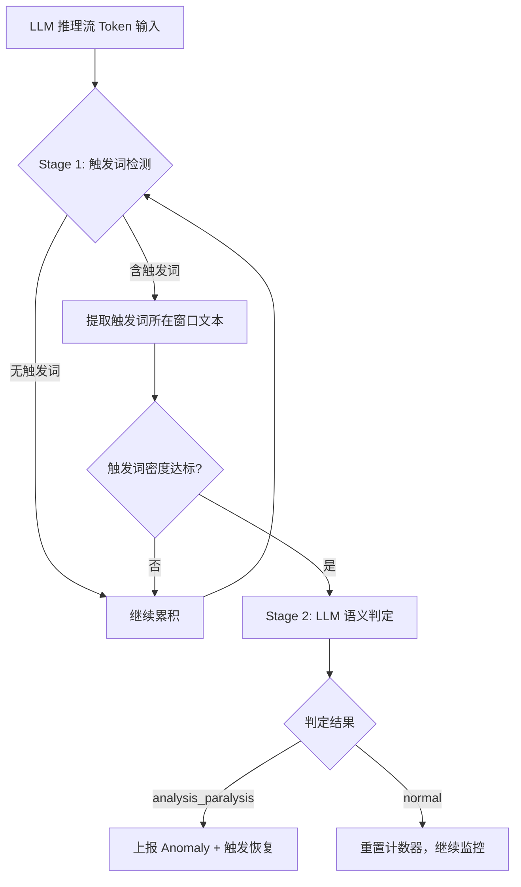
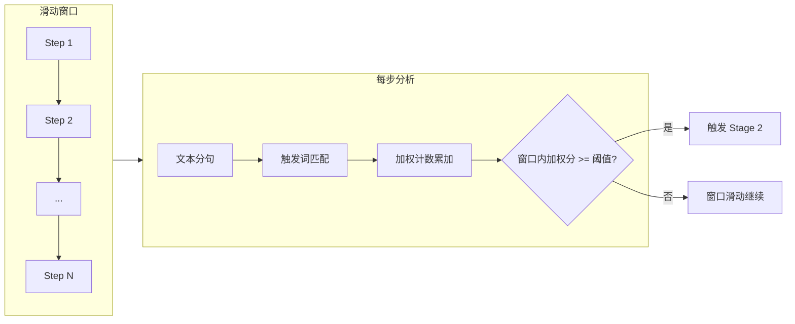
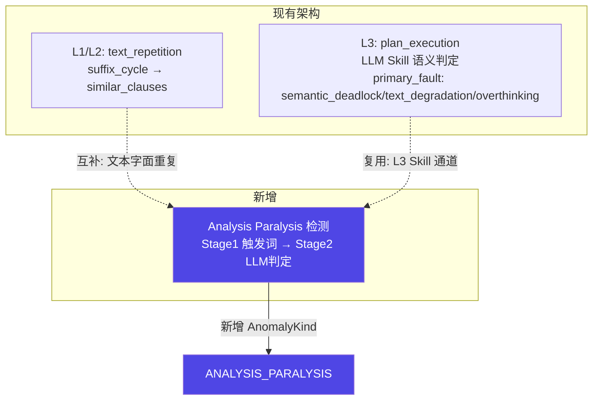
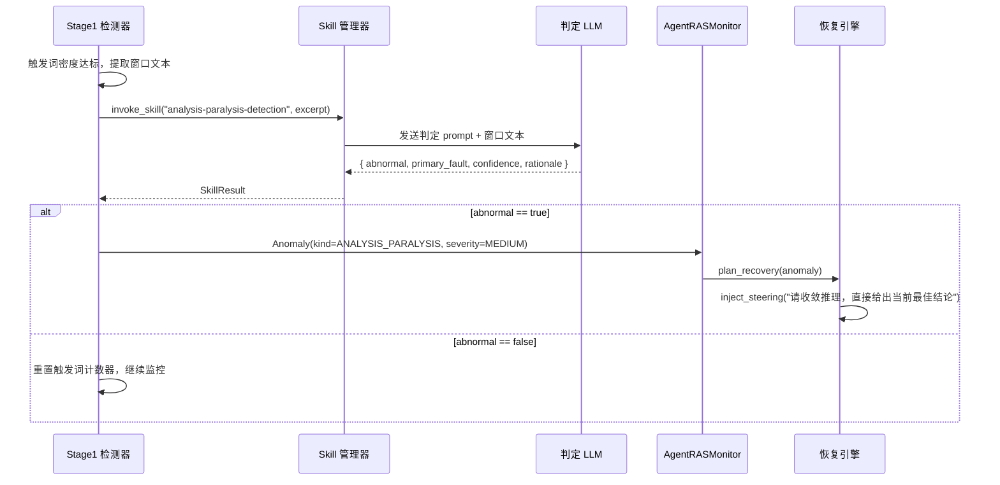
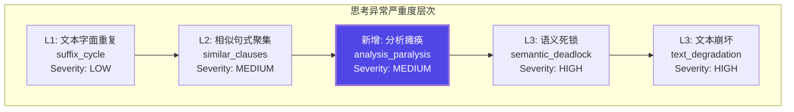
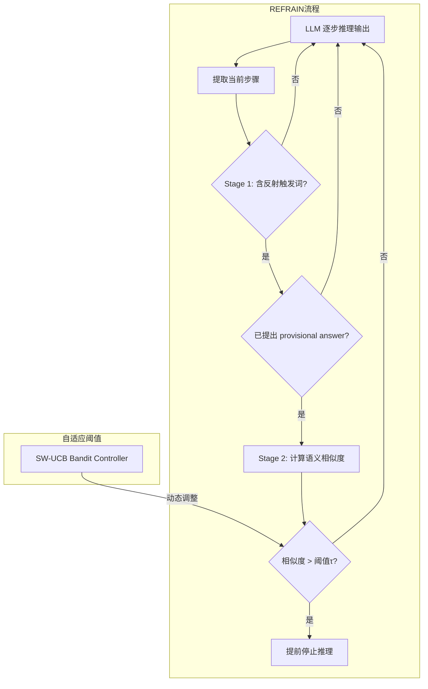
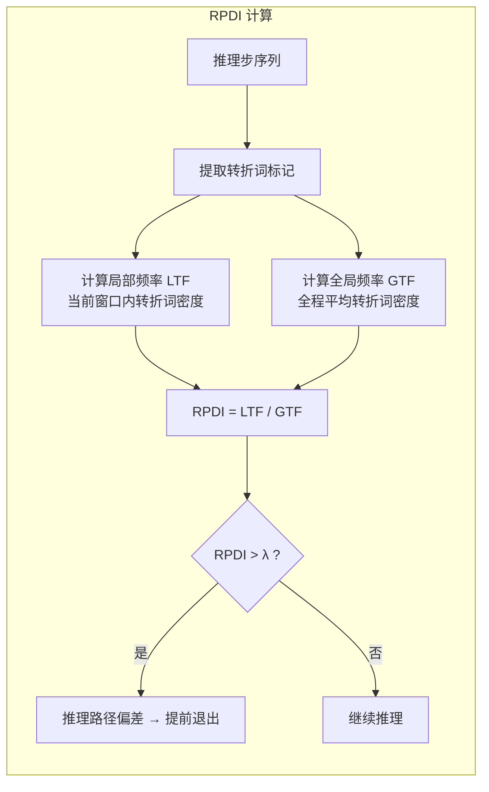
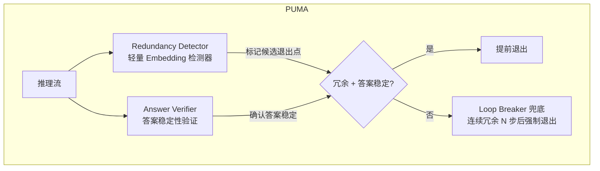

# LLM 过度思考（Analysis Paralysis）二阶段检测 — 需求分析与方案

版本：v0.1  
最后更新：2026-07-29

> 文档类型：Phase1 需求分析 + 方案设计（合并） | 关联项目：agent-insight / agent_ras  
> 复杂度：**Medium**（新增触发词库 + 二阶段 LLM 判定；复用现有 L3 Skill 检测通道）  
> 关联模块：[agent_ras/core/detectors/llm_thinking_loop.py](../../../../agent_ras/core/detectors/llm_thinking_loop.py)

---

## 一、场景问题

### 1.1 问题定义

**Analysis Paralysis（分析瘫痪）** 是 LLM Agent 在执行任务过程中表现出的一种异常模式：模型在内部反复推演、自我质疑、换说法重复已有结论，但始终没有实质性的推理进展。其关键特征：

- **不是死循环**：经过若干轮重复推理后，agent 最终会自行结束这段冗余思考，不会无限循环
- **语义停滞**：思考内容在语义层面高度相似或循环，但没有引入新信息
- **消耗浪费**：这段时间的 token 消耗和时间开销对任务完成没有贡献

这与现有检测器覆盖的两种异常有明显区别：

| 异常类型 | 特征 | 现有覆盖 |
|---------|------|---------|
| 文本死循环（suffix_cycle） | 相同文本片段字面重复循环 | ✅ L1 已有（`LoopDetector.suffix_cycle`） |
| 语义死锁（semantic_deadlock） | 反复权衡同一批对象，换说法但结论不前进 | ✅ L3 已有（`primary_fault: semantic_deadlock`） |
| **分析瘫痪（overthinking/analysis paralysis）** | 冗长推理 + 反复自我质疑 + 微弱推进但整体停滞 | ⚠️ L3 有 `overthinking` 标签但无针对性检测 |

> 来源：Cuadron et al., "The Danger of Overthinking" (2025) 将 Analysis Paralysis 定义为三种过度思考模式之首："模型在做出任何环境交互之前，花费过多时间进行内部推演，困在规划阶段迟迟不动手。"

### 1.2 典型表现

以下是一个 analysis paralysis 的典型片段（模拟）：

```
等一下，我需要再仔细想想这个方案...
方案A的优点是可以快速实现，但是可能存在兼容性问题...
方案B更稳健，但开发周期会变长...
嗯，也许我应该重新评估一下需求本身...
如果我选择方案A，需要处理以下几个问题：1) ... 2) ...
但如果选方案B，这些问题就不存在了，但代价是...
让我再想想... 方案A确实是更快的，但兼容性风险...
其实方案B也有它的优势，比如...
我觉得还是应该从需求角度重新梳理...
```

特征：反复在 A/B 之间摇摆，每次都在"等一下""让我再想想""重新梳理"之后回到相同的论点上，虽然有文字推动但语义实质未前进。

### 1.3 影响范围

- **Token 浪费**：冗余推理通常占正常推理量的 40-60%（参考 EMNLP 2025 "Answer Convergence" 研究，CoT 中约 40% 的推理步骤是冗余的）
- **延迟增加**：ROM 论文报告去除过度思考可减少 46.5% 的 wall-clock 延迟
- **用户体验恶化**：用户等待一段没有产出的思考时间
- **成本增加**：o1-high vs o1-low 的价差可达 $600/任务（Cuadron et al. 数据）

---

## 二、业务价值

### 2.1 定量收益

| 维度 | 预期效果 | 数据来源 |
|------|---------|---------|
| Token 节省 | 减少 20-55% 冗余思考 token | REFRAIN (ACL 2026) |
| 延迟降低 | 减少 46.5% wall-clock 延迟 | ROM (arxiv 2603.22016) |
| 准确率 | 不降低甚至略提升（+1-3pp） | ROM / REFRAIN / PUMA |
| 成本节省 | 每个任务可减少 20-43% 计算成本 | Cuadron et al. (2025) |

### 2.2 定性价值

- 让用户感知到 agent 的可靠性提升（不会"发呆"）
- 为 agent-insight 平台的 RAS 能力增加一个可量化的检测维度
- 与现有 `LLM_THINKING_LOOP` / `LLM_THINKING_DEAD_LOOP` 形成完整的思考异常检测覆盖

---

## 三、解决方案

### 3.1 总体架构

采用**二阶段级联检测**，先快后准：



### 3.2 Stage 1：触发词库检测

#### 3.2.1 触发词分类体系

综合 REFRAIN（ACL 2026）和 RPDI-EE（arxiv 2603.14251）的触发词研究，建立 5 类触发词：

| 类别 | 语义含义 | 来源 | 示例触发词 |
|------|---------|------|-----------|
| **Self-Check**（自我复核） | 主动暂停推理进行验证 | REFRAIN §3.2 | `等一下` `让我检查` `再确认一下` `is that correct` `double check` `wait, let me` |
| **Strategy Shift**（策略摇摆） | 在多个方案之间反复切换 | REFRAIN §3.2 | `换一个思路` `另一种方法` `或许可以` `alternatively` `what if` `another way` |
| **Uncertainty**（不确定性表达） | 持续的犹豫和不确定 | REFRAIN §3.2 | `不太确定` `好像` `也许` `似乎` `not sure` `hmm` `perhaps` `maybe` |
| **Retrospective**（回溯重述） | 回到已经讨论过的点重新开始 | REFRAIN §3.2 | `回到之前` `前面提到` `recall that` `as established` `as we discussed` |
| **Transition Spikes**（异常转折） | 高熵转折词异常高频出现 | RPDI-EE §3 | `Wait` `But` `However` `Actually` `不对` `不过` `但是` `实际上` |

#### 3.2.2 触发词库配置结构

```json
{
  "trigger_categories": {
    "self_check": {
      "weight": 1.0,
      "phrases": ["等一下", "让我检查", "再确认一下", "wait, let me", "double check", "is that correct", "hold on", "let me verify"]
    },
    "strategy_shift": {
      "weight": 1.0,
      "phrases": ["换一个思路", "另一种方法", "或许可以", "alternatively", "what if", "another way", "let me try", "how about"]
    },
    "uncertainty": {
      "weight": 0.6,
      "phrases": ["不太确定", "好像", "也许", "似乎", "not sure", "hmm", "perhaps", "maybe", "I think", "probably"]
    },
    "retrospective": {
      "weight": 1.2,
      "phrases": ["回到之前", "前面提到", "recall that", "as established", "as we discussed", "earlier we", "let me go back"]
    },
    "transition_spikes": {
      "weight": 0.8,
      "phrases": ["Wait", "But", "However", "Actually", "不对", "不过", "但是", "实际上", "等一下", "等等"]
    }
  },
  "detection_threshold": 4,
  "window_steps": 10,
  "min_window_chars": 500,
  "semantic_similarity_threshold": 0.85
}
```

#### 3.2.3 触发检测算法



#### 3.2.4 与现有检测器的关系

现有 `LlmThinkingLoopDetector` 已有双通道架构：



### 3.3 Stage 2：LLM 语义判定

当 Stage 1 触发后，将捕获的文本窗口送给 LLM 做语义层面判定。

#### 3.3.1 判定 Skill 定义

判定 prompt（复用现有 `llm-loop-detection` Skill 通道）：

```markdown
# 分析瘫痪语义判定

你是分析瘫痪检测器。以下片段来自 Agent 的推理流窗口（Stage 1 触发词检测已标记可疑区域）。
请判断是否存在 **analysis_paralysis**（分析瘫痪），即：反复自我质疑、方案摇摆但语义实质未推进。

## 判定标准

### analysis_paralysis（分析瘫痪）
- 片段中存在多轮"等一下/再想想/换思路"后回到同一个分析点
- 在多个选项/方案之间反复摇摆但没有做出选择或引入新信息
- 冗长的自我复核和论证铺陈，但整体推理进度极慢或停滞
- 注意：渐进式推进搜索（如逐个排查代码文件、逐步细化搜索范围）不算分析瘫痪

### none（正常）
- 推理在引入新信息、缩小选项、或明确向答案推进
- 偶发复核但不占主导
- 即使推理较长但每步都有新进展

## 输出格式

```json
{
  "abnormal": true/false,
  "primary_fault": "analysis_paralysis" | "none",
  "confidence": 0.0-1.0,
  "rationale": "简短判定理由",
  "trigger_patterns": ["检测到的触发模式列表"],
  "stall_duration_estimate": "停滞持续步数估计"
}
```
```

#### 3.3.2 判定流程图



### 3.4 与现有异常等级的关系



### 3.5 数据模型扩展

#### 3.5.1 新增 `AnomalyKind`

```python
# agent_ras/core/models.py 扩展
class AnomalyKind(str, Enum):
    REPEAT_TOOL_CALL = "repeat_tool_call"
    TOOL_CALL_LOOP = "tool_call_loop"
    LLM_THINKING_LOOP = "llm_thinking_loop"         # L1/L2 text_repetition
    LLM_THINKING_DEAD_LOOP = "llm_thinking_dead_loop" # L3 semantic
    ANALYSIS_PARALYSIS = "analysis_paralysis"        # 【新增】分析瘫痪
```

#### 3.5.2 新增 `primary_fault` 值

```python
# agent_ras/core/detectors/skill_verdicts.py 扩展
class ThinkingLoopFault(str, Enum):
    NONE = "none"
    SEMANTIC_DEADLOCK = "semantic_deadlock"
    TEXT_DEGRADATION = "text_degradation"
    OVERTHINKING = "overthinking"
    ANALYSIS_PARALYSIS = "analysis_paralysis"  # 【新增】
```

#### 3.5.3 Anomaly evidence 示例

```json
{
  "mode": "analysis_paralysis",
  "channel": "trigger_word_detection",
  "recovery_profile": "analysis_paralysis",
  "chunk_type": "llm_reasoning",
  "buffer_len": 4520,
  "window_chars": 1200,
  "trigger_categories_hit": ["self_check", "strategy_shift", "uncertainty"],
  "trigger_count": 7,
  "trigger_threshold": 4,
  "thinking_excerpt": "等一下，我需要再仔细想想...",
  "skill_name": "analysis-paralysis-detection",
  "primary_fault": "analysis_paralysis",
  "skill_rationale": "频繁自我质疑和方案摇摆，5轮推理后仍未推进，语义停滞明显",
  "skill_confidence": 0.87,
  "stall_duration_estimate": 5
}
```

---

## 四、参考业界做法

### 4.1 REFRAIN — 反射冗余二阶段判别

**来源**：ACL 2026 long, "Stop When Enough: Adaptive Early-Stopping for Chain-of-Thought Reasoning"

**核心思想**：不在推理过程中打断模型，而是维护一个滑动窗口，监控当前推理步与前序步的语义相似度。当相似度过高 + 已有 provisional answer + 含反射触发词时，判定冗余。



**与本方案的关系**：REFRAIN 的触发词分类体系（Self-Check / Strategy Shift / Uncertainty / Retrospective）是本方案 Stage 1 触发词库的直接参考来源。

### 4.2 RPDI-EE — 推理路径偏差指数

**来源**：arxiv 2603.14251, "Reasoning Path Deviation Index for Early Exit"

**核心思想**：过度思考时，模型会出现异常高频的转折词（"Wait", "But", "Alternatively"）。通过计算局部转折词频率与全局频率的比值（RPDI），可以检测推理路径是否偏离正常轨道。



**与本方案的关系**：RPDI-EE 的"过渡转折词"（"Wait", "But" 等）纳入了本方案 Stage 1 触发词库的 `transition_spikes` 类别。

### 4.3 PUMA — 语义保留型提前退出

**来源**：arxiv 2605.17672, "Stop When Reasoning Converges: Semantic-Preserving Early Exit"

**核心思想**：将"在哪考虑停止"和"是否真的应该停止"解耦。冗余检测器标记候选退出点，答案验证器确认答案稳定性。



**与本方案的关系**：同为二阶段级联检测架构（粗筛→精判），但实现路线不同——PUMA 用 fine-tune 的专用 Embedding 模型做语义冗余判定，本方案用触发词预筛 + 通用 LLM 语义判定。其"在哪停止"和"是否真的该停止"的解耦思想，以及 Loop Breaker 兜底机制，在架构思路上对本方案有参考价值。

### 4.4 与本方案的对比总结

| 维度 | REFRAIN | RPDI-EE | PUMA | **本方案** |
|------|---------|---------|------|-----------|
| 检测层级 | 二阶段（触发词+语义相似度） | 单阶段（频率比） | 二阶段（冗余检测+答案验证） | **二阶段（触发词+LLM语义）** |
| 额外模型 | all-MiniLM-L6-v2 (~80MB) | 无（仅 logits） | Qwen3-Embedding-0.6B | **判定用已有 LLM API** |
| 自适应阈值 | SW-UCB Bandit | 固定 λ | 固定阈值 | **LLM 语义理解自然适应** |
| 误判风险 | 低（二阶段把关） | 中（单阶段） | 低 | **最低（LLM 理解上下文）** |
| 接入复杂度 | 中 | 低 | 高 | **中（复用现有 Skill 通道）** |

---

## 五、参考文献

本方案方法步骤直接参考以下工作：

1. **Cuadron, A., et al.** "The Danger of Overthinking: Examining the Reasoning-Action Dilemma in Agentic Tasks." arXiv:2502.08235, Feb 2025. https://arxiv.org/abs/2502.08235
   - 首次系统定义 agentic 场景下的 Analysis Paralysis（分析瘫痪），作为本方案的问题定义来源。

2. **"Stop When Enough: Adaptive Early-Stopping for Chain-of-Thought Reasoning (REFRAIN)."** ACL 2026 long. https://aclanthology.org/2026.acl-long.1256.pdf
   - 提出反射冗余二阶段判别框架，定义 Self-Check / Strategy Shift / Uncertainty / Retrospective 四类触发词。本方案 Stage 1 触发词库的 4/5 类别直接引自该文。

3. **"Reasoning Path Deviation Index for Early Exit (RPDI-EE)."** arXiv:2603.14251, 2025. https://arxiv.org/abs/2603.14251
   - 识别过度思考时转折词（"Wait", "But" 等）异常高频出现的模式，定义 RPDI = LTF/GTF 偏差指标。本方案 Stage 1 触发词库的第 5 类 `transition_spikes` 直接参考该文。

---

## 六、其他相关方案

以下工作在过度思考检测上与本研究同属一个大方向，但采用不同的技术路线（hidden state 检测、答案一致性、entropy 信号、训练侧优化等），与本方案的触发词+LLM 二阶段路线不直接重叠。此处梳理备查。

### 6.1 推理时检测与干预

| 方案 | 论文 | 技术路线 | 与本方案的差异 |
|------|------|---------|--------------|
| **PUMA** | arXiv:2605.17672 (2025.05) | fine-tune Embedding 模型做冗余检测 + 答案验证器解耦 + Loop Breaker 兜底 | 同为二阶段架构但检测手段不同：PUMA 用专用 Embedding 模型做语义冗余判断，本方案用触发词+LLM 语义判定 |
| **ROM** | arXiv:2603.22016 (2025.03) | 在 frozen LLM late-layer hidden state 上挂检测头，流式判断 token 级过度思考信号 | 需要模型白盒访问 hidden states；本方案纯黑盒，仅依赖输出文本 |
| **TACT** | arXiv:2605.05980 (2025.05) | 在 residual stream 中构造过度思考偏移轴，activation steering 实时修正 | 需要模型白盒 + 离线标注；本方案无需动模型参数 |
| **The Evolution of Thought** | ACL 2026 long | 监控 `` token 概率 rank 骤降，用 RCPD 决策树检测推理完成点 | 依赖 logits 访问；本方案无需 logits |
| **EAT** | OpenReview 2025 | 在每个推理行后追加 ``，监控该单 token 的熵，EMA 方差稳定时退出 | 需 logits 访问；黑盒场景需 proxy 模型 |
| **Entropy Trajectory Shape** | arXiv:2603.18940 (2025.03) | 熵轨迹单调性预测正确性（单调下降链 68.8% vs 非单调链 46.8%） | 监测信号而非触发词；可作为辅助诊断信号 |

### 6.2 基于语义相似度与答案一致性

| 方案 | 论文 | 技术路线 | 与本方案的差异 |
|------|------|---------|--------------|
| **Reconsidering Overthinking (IRD)** | arXiv:2508.02178 (2025.08) | 滑动窗口 embedding cosine 相似度（IRD）衡量局部语义停滞 | 纯 Embedding 相似度计算，无触发词预筛；本方案先用触发词缩小范围再送 LLM 判定 |
| **Answer Convergence** | EMNLP 2025 | 多轮 answer extraction + 连续 N 轮答案不变即判定收敛 | 依赖能稳定 extract answer 的场景（如数学推理）；本方案不依赖 answer extraction |

### 6.3 训练侧优化

| 方案 | 论文 | 技术路线 | 与本方案的差异 |
|------|------|---------|--------------|
| **DEPO** | arXiv:2510.15374 (2025.10) | RL 训练时对过度思考段降权 gradient，解耦 advantage 计算 | 训练侧修复，本方案明确不涉及训练 |
| **Thinkless** | arXiv:2505.13379 (2025.05) | 两个 control token 让模型自主选择短/长推理模式 | 训练侧，减少不必要思考 50-90%；本方案不涉及训练 |

### 6.4 工程实践

| 方案 | 出处 | 技术路线 | 与本方案的差异 |
|------|------|---------|--------------|
| **Degenerate Output Detection** | Agent Patterns Catalog | Ring Buffer（最近 8 条输出）+ Jaccard token overlap ≥0.7 判定重复 + escalation | 针对输出端重复，非推理阶段过度思考检测 |
| **AlexCuadron/Overthinking** | GitHub 开源 | LLM-as-judge 对 trajectory 打分 0-10（含 analysis_paralysis 指标），用于离线和后处理选优 | 评估框架而非在线检测器，但 scoring logic 可为本方案 Skill prompt 设计提供参考
