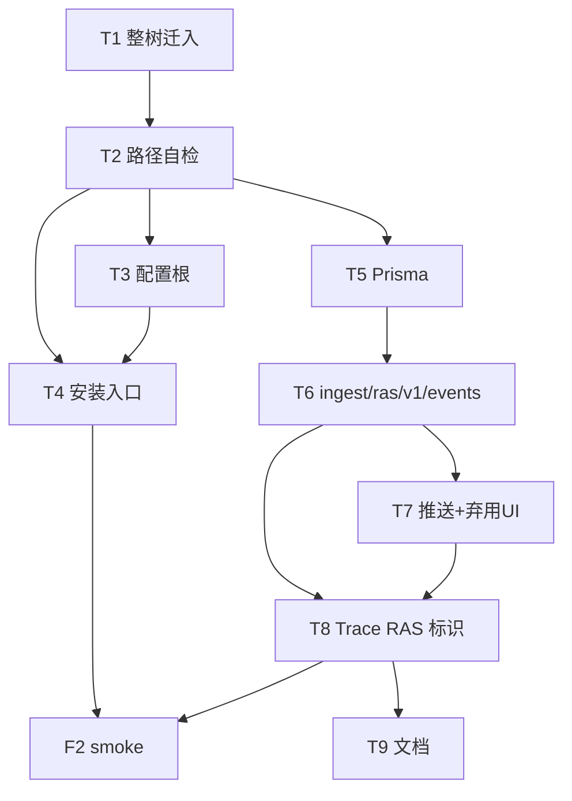

# agent_ras 迁入 agent-insight — 开发计划

版本：v0.3  
最后更新：2026-07-27

> 文档类型：Phase3 开发计划 ｜ 关联 [Phase1](phase1-requirements-analysis.md) / [Phase2](phase2-requirements-design.md)  
> 工作量：Medium ｜ 可并行：YES  
> **v0.3**：T6 改为 `/api/ingest/ras/v1/events`（对齐 OTel ingest 规范）；T8 Trace 标识。

---

## 导读

**干活顺序**：整树迁入 → 收敛为纯 inproc → 配置/安装 → Prisma + ingest → **RAS UI 页面** → 文档。

**硬约束**：不改 `core/` 语义；不合并 OTel 热路径；可靠性页复用普通 Trace 组件。

---

## §1 概览

| 项 | 内容 |
|----|------|
| 关键路径 | T1 → … → T7 → T8（Trace 标识）→ T9 |
| 验证 | pytest；`npm run test`；浏览器验收需用户确认 |

---

## §2 任务分解

### Wave A–C

T1–T5、T7 同前。  
T6：`POST/GET /api/ingest/ras/v1/events`（`x-witty-api-key`、`taskId`=`witty.session.id`、`witty.ras.*`）；**禁止**写入 otel spool。

T6.1：事件以 `deliveryId` 做投递幂等；同内容在不同时刻再次发生必须形成两条事件，服务端使用复合唯一键原子 upsert。

T6.2：移除 JS/Python client 中的 HTTP transport、`ras_service` 拉起和端口/锁文件配置；OpenCode 只通过 bun:ffi 调用 `ras_embed`，Python 宿主直接调用 `ras_embed`。

T6.3：平台启动与 Agent 接入解耦。`start` 不安装/检查 RAS；安装指导选择 OpenCode 后
绑定服务端 npm 包版本安装 telemetry + RAS，并保证重启不覆盖客户端邮箱 Key。

### Wave D — Trace UI + 文档

| ID | 任务 | 产物 | 完成标准 | 禁止 |
|----|------|------|----------|------|
| T8 | 可靠性列表 + 完整 Trace 详情；taskId join | `/agent-ras/trace` + 复用 `AgentTraceView` | 普通执行和异常执行均可见；告警锚定行为节点 | 新色板；伪造 OTel Span |
| T9 | 文档 | user-guide / developer-guide；RAS 文档统一纯 inproc | 读者使用可靠性观测，不寻找本地 RAS 服务或静态 UI | |

### 收尾

| ID | 完成标准 |
|----|----------|
| F2 | smoke：anomaly → Host action + **对应 Trace 可见标识** |
| F3 | 询问后再启 dev 浏览器验收 |

---

## §3 建议提交切片

1. `chore: 迁入 agent_ras 整树到仓根`  
2. `feat(ras): 配置根与 OpenCode 安装复用`  
3. `feat(ras): RasAnomalyEvent 与 /api/ingest/ras/v1/events`  
4. `feat(ras): ras_embed 推送事件并移除旧服务实现`  
5. `feat(trace): 链路追踪标识 RAS 环内事件`  
6. `docs: RAS 迁入与 Trace 标识说明`  

---

## §4 测试计划

| 层 | 内容 |
|----|------|
| Python | 现有单测；ingest 失败不影响 observe；`/ui/` 不可用 |
| TS | POST/GET ingest/ras（鉴权、taskId、去重）；Trace join 聚合 |
| 手工 | 安装；有/无 session 关联的 Trace；停服务后历史仍在 Trace |

---

## §5 授权提醒

改 `package.json`/CI/依赖/push 需用户授权。默认可做：迁入、API、Prisma、Trace UI、scripts、docs。

---

## §6 任务依赖图

