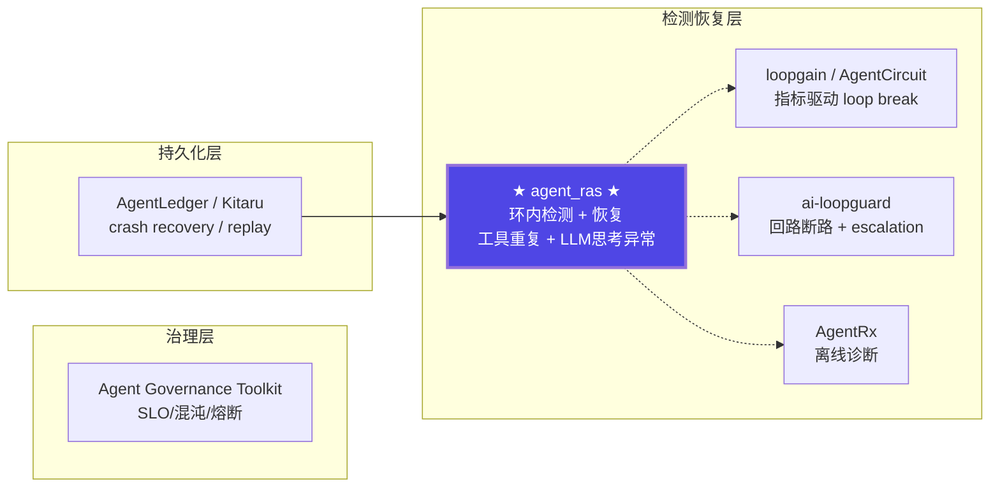

# Agent 可靠性开源生态调研报告

版本：v0.1  
最后更新：2026-07-29

> 文档类型：调研报告 | 关联项目：agent-insight / agent_ras  
> 调研范围：与 agent_ras 可对照的 agent 检测/恢复/可靠性开源仓库（不含安全审计类）

---

## 一、与 agent_ras 直接可对照的开源仓库

这些仓库与 agent_ras 最接近 —— 都是在 agent 运行时做**异常检测 + 自动恢复**，而非单纯的观测或安全审计。

| 仓库 | Stars | 核心能力 | 与 agent_ras 对照 |
|------|:---:|------|------|
| **[ai-loopguard](https://github.com/deghosal-2026/ai-loopguard)** | ~50 | 回路断路器：检测卡死模式（重复错误/测试失败/幻觉循环）→ escalation 到更强模型。支持 LangGraph 原生 `interrupt()` 人工介入或自动 escalation | 对应 agent_ras 的 `RepeatToolCallDetector` + `RecoveryPolicy`（escalation）。agent_ras 额外覆盖了 LLM 思考异常 |
| **[loopgain](https://github.com/loopgain-ai/loopgain)** | ~40 | 实时测量 loop 收敛度（Aβ loop-gain bands），在收敛后立即停止 + 质量退化前 rollback。适配 6 种 agent 框架 | 对应 agent_ras 的 loop 检测 + 恢复，但纯指标驱动（控制理论），不带语义判定 |
| **[AgentCircuit](https://github.com/simranmultani197/AgentFuse)** | ~30 | 一个装饰器搞定：Fuse（无限循环检测 kill）、Medic（LLM 自动修复输出）、Sentinel（Pydantic schema 校验）、Budget（成本断路器）。适配 LangGraph/CrewAI/AutoGen | 对应 agent_ras 的 `RepeatToolCallDetector` + `RecoveryEngine`。agent_ras 额外有 LLM 思考异常检测和流式恢复 |
| **[reivo-guard](https://github.com/tazsat0512/reivo-guard)** | ~15 | Hash + semantic (TF-IDF) 循环检测、预算执行、EWMA z-score 异常检测、CUSUM drift 检测。LangChain/LangGraph/CrewAI 适配 | 与 agent_ras 检测方法互补：reivo 用统计信号，agent_ras 用文本分析 |
| **[SpecOps AI](https://github.com/kripikroli/specops-ai)** | ~20 | 自愈策略（retry + fallback + escalation）、RCA 因果图、混沌工程沙箱、确定性 replay、OTel-native | 覆盖 agent_ras 的检测+恢复全链路，但以 OTel 观测为基础，非环内拦截 |
| **[Ojas](https://github.com/beingmartinbmc/ojas)** | ~10 | 持续健康层：drift/loop/unstable 检测 → 诊断 → 恢复协议推荐。含 12 步生命周期（ingest→scan→detect→diagnose→recover→consolidate→audit→handoff） | 与 agent_ras 设计理念最接近：都是"检测+诊断+恢复"的完整闭环。agent_ras 更轻量（环内），Ojas 更重（全生命周期） |
| **[microsoft/AgentRx](https://github.com/microsoft/AgentRx)** | **131** | LLM-judge + 结构化 invariant 评估 → 10 类故障分类 → 定位关键失败步骤。诊断而非实时拦截，覆盖 Tau-bench/Flash/Magentic-One 三个域 | 对应 agent_ras 离线诊断方向（如 L3 Reviewer）。agent_ras 额外有在线检测和恢复 |

---

## 二、更广范围的对照

### 2.1 诊断/观测层（检测为主，恢复为辅）

| 仓库 | 核心能力 |
|------|---------|
| **[agentomaly](https://github.com/sushaan-k/agentomaly)** | OTel 行为画像 → 5 种统计检测器：Tool Sequence（Jensen-Shannon 散度）、Cost Spike（Rolling z-score）、Latency Regression（Welch's t-test）、Retry Storm（Shewhart 控制图）、Hallucination Rate（Bernoulli CUSUM）。含 PagerDuty/Slack 告警 |
| **[AgentTelemetry](https://github.com/Krishnachaitanyakc/AgentTelemetry)** | OTel-based 观测，9 种 agent 专用 span kind + 4 个分析模块：循环委派检测、无限重试检测、成本爆炸检测、上下文溢出检测。适配 7 个框架 |

### 2.2 持久化执行层（关注 crash recovery / replay）

| 仓库 | 核心能力 |
|------|---------|
| **[AgentLedger](https://github.com/yaogdu/AgentLedger)** | 持久化执行运行时，支持 Python/Go/TS/Rust 四语言对等。故障分类 + 故障注入套件 + evidence 回归门禁 + cost/failure attribution。与 agent 框架解耦 |
| **[Overseer](https://github.com/nikitavivat/Overseer)** | 声明式 multi-agent graph，verifier 节点 + snapshot + retry budget + 人工干预，SQLite 持久化。强调"质量门控内嵌运行时" |
| **[Kitaru](https://github.com/zenml-io/kitaru)** (ZenML) | 持久化执行：crash 恢复、checkpoint replay、HITL wait。适配 Claude Agent SDK / LangGraph / OpenAI Agents。关注"不丢状态"而非"检测异常" |

### 2.3 治理层

| 仓库 | 核心能力 |
|------|---------|
| **[microsoft/agent-governance-toolkit](https://github.com/microsoft/agent-governance-toolkit)** | **1K stars**，微软出品。完整治理套件：Agent OS（策略引擎）+ AgentMesh（零信任身份）+ Agent SRE（SLO/混沌/熔断/成本护栏）+ Agent Runtime（沙箱隔离）。覆盖 10/10 OWASP Agentic Top 10 |

---

## 三、对照总结：agent_ras 的独特定位

### 3.1 架构全景

### 3.2 能力矩阵对照

| 能力维度 | agent_ras | ai-loopguard | loopgain | AgentCircuit | reivo-guard | Ojas | AgentRx | agentomaly |
|----------|:---:|:---:|:---:|:---:|:---:|:---:|:---:|:---:|
| 工具重复调用检测 | ✅ | ✅ | — | ✅ | — | — | — | — |
| LLM 文本死循环（字面重复） | ✅ | — | — | — | ✅ (hash) | ✅ | — | — |
| LLM 语义死锁检测 | ✅ | — | — | — | ✅ (TF-IDF) | ✅ | — | — |
| LLM 过度思考（overthinking） | ✅ | — | — | — | — | ✅ | — | — |
| 多级分层（L1/L2/L3） | ✅ | — | — | ✅ (Fuse/Medic/Sentinel) | — | — | — | — |
| 流式恢复（suppress/abort） | ✅ | — | — | — | — | — | — | — |
| 文本注入恢复（steering） | ✅ | — | — | ✅ (Medic LLM修复) | — | ✅ | — | — |
| 自动 escalation | — | ✅ | — | — | — | — | — | — |
| 离线诊断/故障分类 | ✅ (L3 Reviewer) | — | — | — | — | ✅ | ✅ (10类) | ✅ (5种) |
| 多平台适配 | ✅ (3+1) | ✅ (2) | ✅ (6) | ✅ (4) | ✅ (3) | — | — | ✅ (OTel) |
| 嵌入式部署（inproc） | ✅ | — | — | — | — | — | — | — |
| 持久化/Replay | — | — | — | — | — | — | — | ✅ (OTel) |
| 成本/TTL 断路 | — | ✅ | ✅ | ✅ | ✅ | — | — | ✅ |

### 3.3 关键发现

**agent_ras 在所有对照仓库中具有以下独特能力：**

1. **LLM 文本流内思考异常检测**：ai-loopguard / loopgain / AgentCircuit 都只关注工具调用层面的异常。agent_ras 是唯一在 LLM 推理流内同时检测字面重复、语义死锁、过度思考的仓库。

2. **环内流式恢复**：suppress（截断流的输出）+ abort（终止 + 通知用户）+ steer（注入自我修正提示）的组合，在对照仓库中无完全对等实现。AgentCircuit 的 Medic 可做 LLM 修复但不截断流。

3. **多级分层检测（L1/L2/L3）**：从文本字面 → 语义 → LLM Skill 判定的递进式检测链，AgentCircuit 有类似的 Fuse/Medic/Sentinel 三层但检测维度不同（工具重复/输出修复/schema）。

4. **detection + recovery + reviewer 全闭环**：Ojas 有类似的完整闭环但更重（12 步生命周期）。agent_ras 的轻量级环内拦截设计使其更适合嵌入式场景（如 OpenCode bun:ffi inproc 模式）。

---

## 四、参考文献

1. **microsoft/AgentRx** — GitHub: https://github.com/microsoft/AgentRx | MIT License | 131 stars | 2026-03
   - 自动化 agent 故障诊断框架，LLM-judge + structured invariant 评估。

2. **deghosal-2026/ai-loopguard** — GitHub: https://github.com/deghosal-2026/ai-loopguard | 2026
   - Agent 回路断路器，检测卡死模式后 escalation 到更强模型。

3. **loopgain-ai/loopgain** — GitHub: https://github.com/loopgain-ai/loopgain | 2026
   - 基于控制理论的 agent loop 收敛检测，Aβ loop-gain bands + best-so-far rollback。

4. **simranmultani197/AgentFuse (AgentCircuit)** — GitHub: https://github.com/simranmultani197/AgentFuse | 2026
   - 装饰器式 agent 可靠性层：Fuse（循环检测）+ Medic（LLM 修复）+ Sentinel（schema）+ Budget。

5. **tazsat0512/reivo-guard** — GitHub: https://github.com/tazsat0512/reivo-guard | 2026
   - Hash + semantic loop 检测 + EWMA z-score 异常检测 + budget guard。

6. **kripikroli/specops-ai** — GitHub: https://github.com/kripikroli/specops-ai | 2026
   - OTel-native agent 可靠性工具包：自愈策略 + RCA 因果图 + 混沌工程沙箱。

7. **beingmartinbmc/ojas** — GitHub: https://github.com/beingmartinbmc/ojas | 2026
   - Agent 持续健康层：drift/loop/unstable 检测 + 诊断 + 恢复协议推荐。

8. **sushaan-k/agentomaly** — GitHub: https://github.com/sushaan-k/agentomaly | 2026
   - OTel 行为画像 + 5 种统计异常检测器 + PagerDuty/Slack 集成。

9. **Krishnachaitanyakc/AgentTelemetry** — GitHub: https://github.com/Krishnachaitanyakc/AgentTelemetry | Apache-2.0 | 2025
   - OTel-based agent 观测，9 种 span kind + 4 个分析模块。

10. **yaogdu/AgentLedger** — GitHub: https://github.com/yaogdu/AgentLedger | 2026
    - 持久化执行运行时，Python/Go/TS/Rust 四语言对等，故障分类 + evidence 回归。

11. **nikitavivat/Overseer** — GitHub: https://github.com/nikitavivat/Overseer | 2026
    - 声明式 multi-agent graph + verifier 节点 + snapshot + retry。

12. **zenml-io/kitaru** — GitHub: https://github.com/zenml-io/kitaru | ZenML 团队 | 2026
    - 持久化执行：crash 恢复 + checkpoint replay + HITL wait。

13. **microsoft/agent-governance-toolkit** — GitHub: https://github.com/microsoft/agent-governance-toolkit | 1K stars | 2026
    - 微软完整治理套件：Agent OS + AgentMesh + Agent SRE + Agent Runtime。
