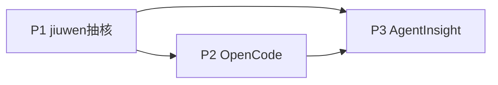

# agent_ras 开发计划（SDD）

> Phase3 产出。追溯 [`requirements_analysis.md`](./requirements_analysis.md)、[`design_spec.md`](./design_spec.md)。  
> 原则：先骨架与 jiuwen 保真，再第二平台，再 **AgentInsight**；每计划含测试门禁。

## 总览

| 计划 | 目标 | 追溯 | 预估 |
|------|------|------|------|
| **P1** | HostControl + openjiuwen 抽离，core 去宿主 import，jiuwen 全量绿 | FR-01～04 | 中 |
| **P2** | OpenCode partial 挂载 + 能力矩阵文档 | FR-05、NFR-04 | 中 |
| **P3** | 迁入 AgentInsight 安装面与 UI；预留 openclaw/Hermes 目录约定 | FR-06～07 | 小～中 |
| **P4** | 纯同进程 runtime 与统一安装器 | ✅ | 中 |

P2 不阻塞 P1 文档中的矩阵初稿；P3 依赖 P2 插件形态稳定。

---

## P1 — jiuwen 保真抽核（P0）

### 目标

可安装/可分层的包结构；`HostControl` 落地；`platform_adapter/openjiuwen` 承接 Rail/Stream/DeepAgent；core 不再 import `openjiuwen.core`；**jiuwen 行为不降级**。

### 任务分解

| 序号 | 任务 | 主要改动点 | 测试先写/门禁 |
|------|------|------------|---------------|
| 1.1 | 包骨架 | 增加 `pyproject.toml`；仓根下规划 `core/` 与 `platform_adapter/openjiuwen/`（**无 `src/`**）；兼容 re-export | 现有单测仍可收集 |
| 1.2 | 定义 HostControl | 新建 `core/host_control.py`（+ 同文件 NoOp 可选）；**不**建 StreamBus/capabilities | 假 HostControl 单元契约测 |
| 1.3 | Recovery/Monitor 改调 HostControl | `recovery/operations.py`、`monitor.py` 去掉对 `AgentCallbackContext` 控制 API 的直接依赖 | 恢复路径单测用 FakeHostControl |
| 1.4 | 迁 openjiuwen adapter | `rails/agent_ras_rail.py`、`stream_observer.py`、`DeepAgentAdapter` → `platform_adapter/openjiuwen/`；实现 HostControl | stream_observer / rail 相关测迁到 adapter |
| 1.5 | 组装与兼容 | factory/`build_agent_ras_rail` 注入 HostControl + 现有 AgentAdapter；旧 import 路径 shim | **全量** `tests/unit_tests/harness/agent_ras` 绿 |
| 1.6 | core 去宿主 import | detectors/engine/models 零 `openjiuwen.core`；logger 等替换 | core 测可不装 openjiuwen extra 跑算法子集 |

### 验收

- [ ] FR-01：factory/YAML 文档路径说明仍成立；关键场景（abort/steer/L3）与抽前一致  
- [ ] FR-02～04：core 无 `openjiuwen.core`；仅 HostControl + AgentAdapter  
- [ ] 无新增 StreamBus Protocol / capabilities 模块  

### 非目标（本计划不做）

OpenCode 插件、AgentInsight 正式合并、openclaw/Hermes 实现。

---

## P2 — OpenCode partial（P1）

### 目标

`platform_adapter/opencode`：插件采点 + HostControl 子集；L3 默认 NoOp；能力矩阵文档落地。

### 任务分解

| 序号 | 任务 | 主要改动点 | 测试/门禁 |
|------|------|------------|-----------|
| 2.1 | 能力矩阵文档 | `docs/agent-ras/architecture/capability_matrix.md`（四平台列） | 评审：OpenCode 不得标 deep abort |

| 2.2 | OpenCode Host 插件 | hooks → Signal/Monitor 调用面；session.abort / tool.before / toast 等映射 | 插件级冒烟（手动或最小自动化） |
| 2.3 | HostControl 子集实现 | 未支持方法显式 no-op | 单测：调用不抛、不假装成功 |
| 2.4 | INSTALL | `platform_adapter/opencode/INSTALL.md`（可独立测；迁 insight 前可有临时 install 脚本） | 按文档可装到 `plugins/` |

### 验收

- [ ] FR-05：OpenCode 可启用 partial RAS  
- [ ] NFR-04：INSTALL 写明无 chunk abort、默认无 L3  
- [ ] 不影响 P1 jiuwen 回归  

### 非目标

OpenCode L3 AgentAdapter（可列为 P2 后续可选）、AgentInsight 正式合并。

---

## P3 — AgentInsight 落位 + 扩展预留（P1/P2）

### 目标

整树进入 `agent-insight/agent_ras/`；insight 安装入口 + Trace 页面内嵌 RAS 监控；openclaw/Hermes 仅目录与矩阵行预留（实现可另开迭代）。

对侧任务拆解见 [`../inproc-package-migration/phase3-development-plan.md`](../inproc-package-migration/phase3-development-plan.md)。

### 任务分解

| 序号 | 任务 | 主要改动点 | 测试/门禁 |
|------|------|------------|-----------|
| 3.1 | 迁入仓根 | 整树 → `agent-insight/agent_ras/`；单一真源；独立仓归档策略 | insight CI / `pytest agent_ras/tests` |
| 3.2 | 安装集成 | `agent-insight install-ras`；插件指到稳定 runtime | 插件可装；与 OTel 插件并存 |
| 3.3 | 配置开关 | `~/.agent-insight/ras/config.json`（唯一真源）→ `agent_ras.enabled` | disabled 时 hooks no-op |
| 3.4 | 监控 UI | Insight 可靠性列表 + 复用完整 Trace 详情 | 浏览器可见 anomaly/actions 和行为链 |
| 3.5 | 扩展预留 | `platform_adapter/openclaw/`、`hermes/` 占位 + 矩阵行 + INSTALL 骨架 | 无强制实现代码 |

### 验收

- [ ] FR-07：经 insight 安装入口可出现 RAS OpenCode 插件；不破坏既有 OTel/Skill 能力  
- [ ] FR-06：扩展步骤文档化（复制 adapter 目录 + 矩阵 + INSTALL）  
- [ ] jiuwen：`pip install -e ./agent_ras[openjiuwen]` 文档可用  
- [x] 人机监控走 Agent Insight 可靠性页面  

---

## 跨计划依赖

## 回归策略

| 层级 | 内容 |
|------|------|
| 每 PR | 单测；P1 后必须含 jiuwen adapter 测 |
| P1 完成 | 对照 implementation_status 关键路径 checklist |
| P2 完成 | OpenCode 手动：重复工具 / 死循环近似场景 + 矩阵一致性审查 |
| P3 完成 | 干净机器经 insight RAS 安装入口验证插件；Trace 页面可见环内事件标识 |

## 明确排期之外

- 用 OTLP 替代环内恢复  
- OpenCode 与 jiuwen 同等流控  
- openclaw/Hermes 完整实现（P3 仅预留，实现单独立项）  
