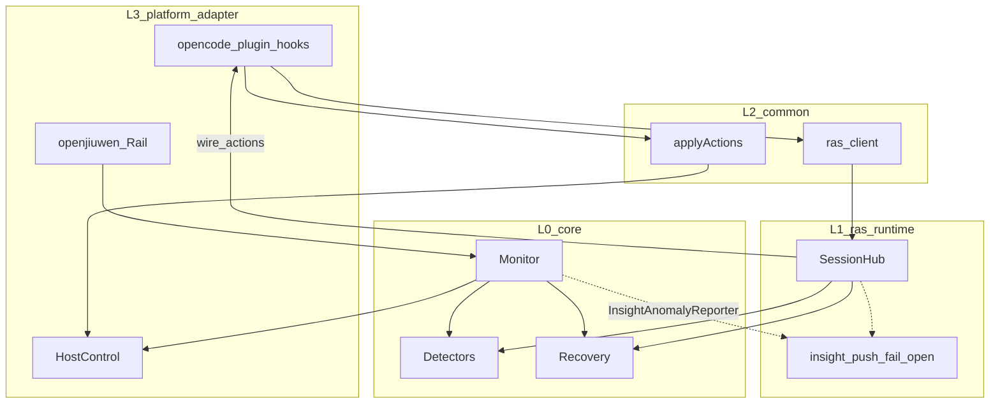
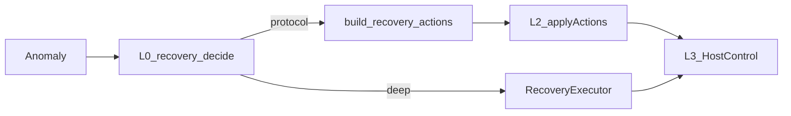
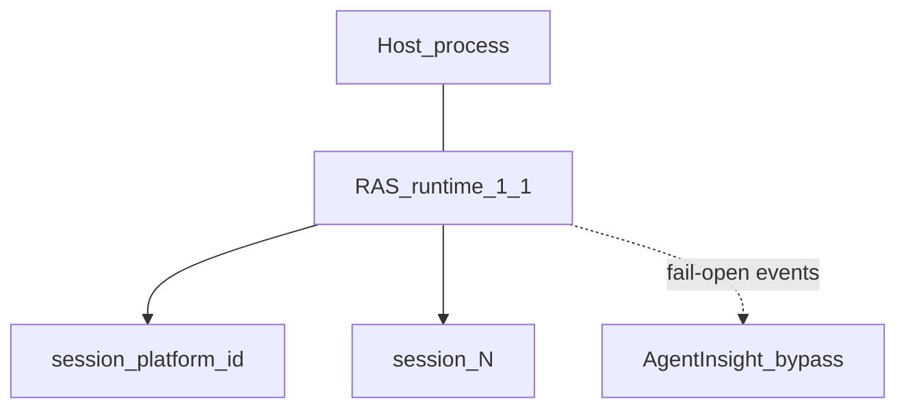
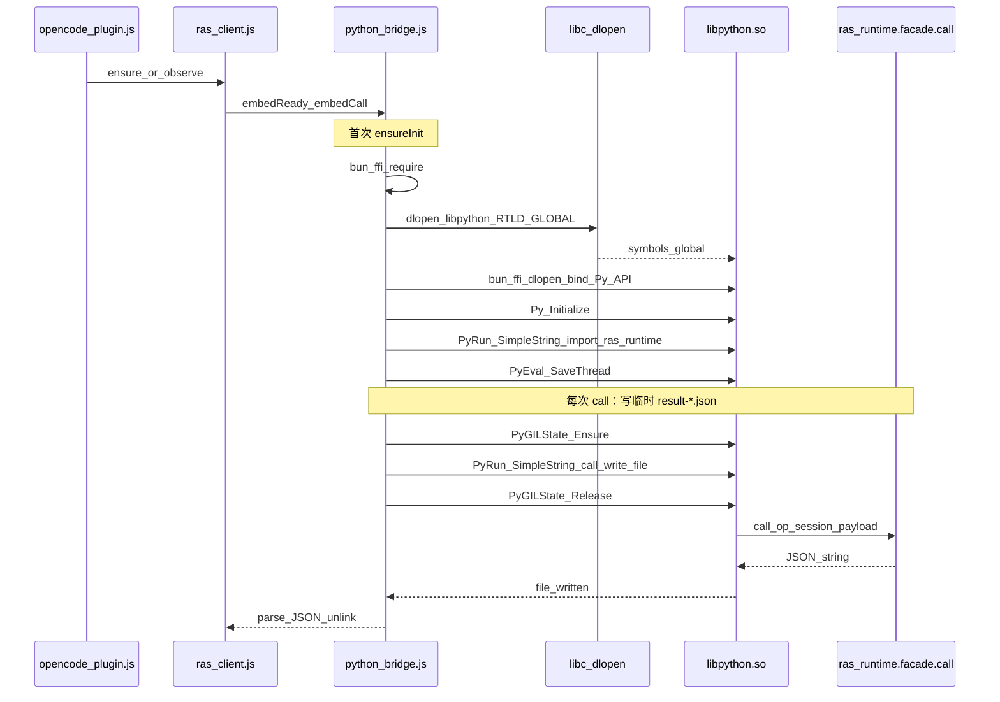
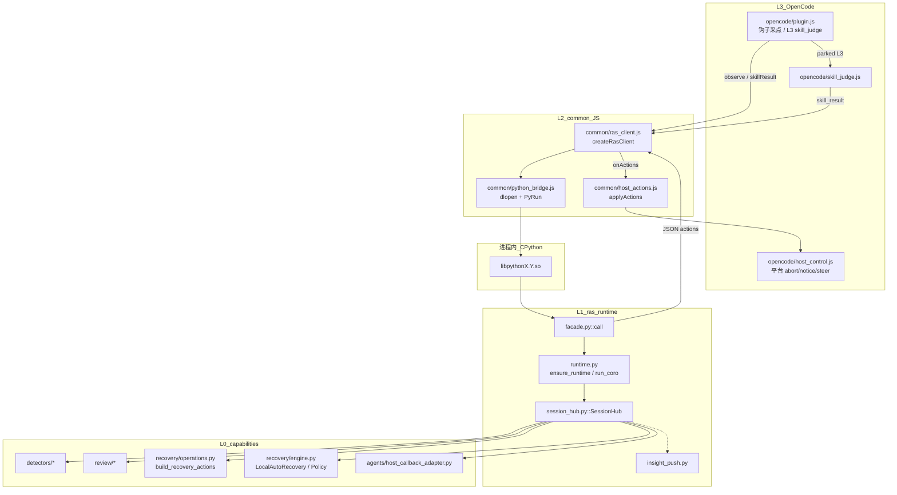
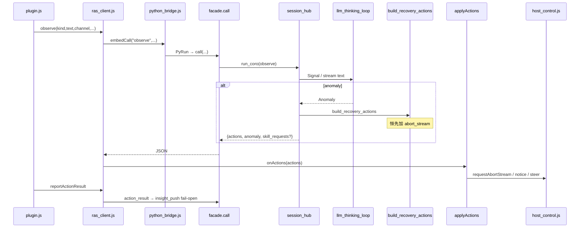
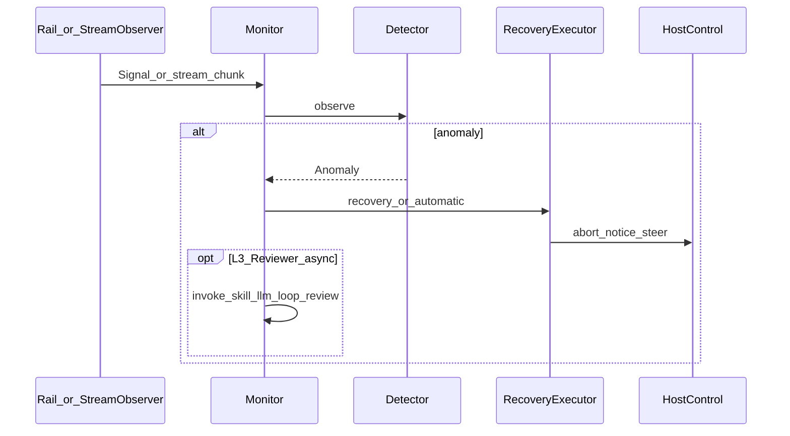
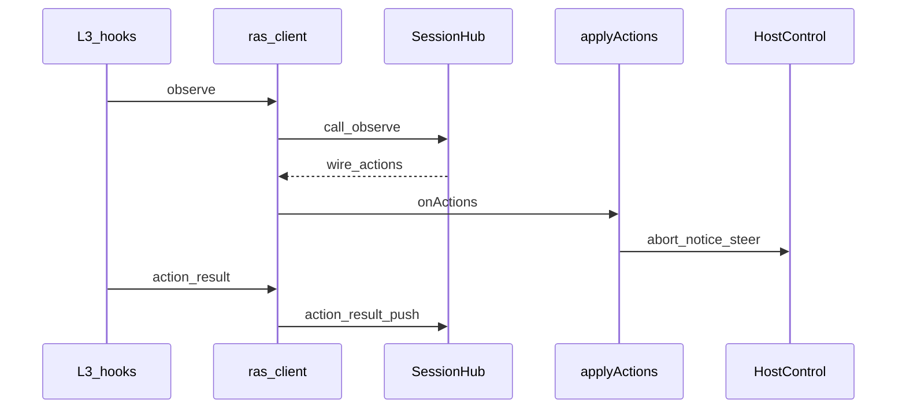

# Agent RAS 整体架构

环内可靠性包 `agent_ras/` 的唯一架构真源：目标与边界、四层同进程、拓扑、**协议 inproc（libpython 加载与文件级调用）**、主流程、当前能力摘要。模块细节见 [`modules/`](modules/)；平台对照见 [`modules/platform-adapter.md`](modules/platform-adapter.md)。

## 1. 设计目标与边界

**目标**

- 检测/恢复算法**单源**（Python `detectors/` + `review/` + `recovery/` 能力包），禁止其它语言复制 Detector / Review / Recovery 策略
- openjiuwen **深挂载不降级**（进程内直连 L0 Monitor）
- OpenCode / openclaw / Hermes 经统一协议挂载（L3 → L2 → L1 SessionHub → L0），能力深度见平台矩阵
- runtime 生命周期归宿主进程；平台只写薄适配
- inproc 不内嵌 UI；人机监控由 Agent Insight 旁路消费落库事件

**在范围内**：环内异常检测与恢复；多平台 HostControl / AgentAdapter；同进程 `ras_runtime`。

**不在范围内**：用 OTLP **替代**环内恢复；为每个平台重写检测算法；fork openjiuwen.core；Insight 看板实现（见 [`docs/design/`](../../design/) 与 developer-guide）；运行时人工 HITL 确认（现行为自动 L3 Reviewer / wire 投递）。

## 2. 四层逻辑架构

依赖单向：`L3 → L2 → L1 → L0`（协议路径）或 `L3 → L0`（openjiuwen 深挂载）。浏览器只读 Insight 落库事件，不连接 runtime。

**两条编排路径（勿混）**

| 路径 | 入口 | 编排核 | 恢复决策出口 | 投递 |
|------|------|--------|--------------|------|
| 深挂载 | `AgentRASRail` | `AgentRASMonitor` | `RecoveryExecutor` / `_apply_abnormal_recovery`（直连 Host） | L3 `JiuwenHostControl` |
| 协议 inproc | hooks → `RasClient` | `SessionHub`（**不经** Monitor） | `build_recovery_actions` → wire | L2 `applyActions` → L3 Host |

### 恢复：决策 vs 投递

| 职责 | 落点 | 说明 |
|------|------|------|
| 决策 | L0 `recovery` | Policy / Executor（深挂载）或 `build_recovery_actions`（协议）；文案已渲染 |
| 调度 | L2 `applyActions`（协议） | wire type → Host 方法；**不**回写 SessionHub |
| 投递 | L3 HostControl | 平台 API；不得改写文案或重做策略 |

协议 wire 类型：`abort_stream` | `emit_notice` | `push_steering`（`build_recovery_actions` **恒先**加 `abort_stream`）。无 `terminate` wire；`request_force_finish` 仅深挂载 Monitor 路径在 policy 含 `TERMINATE` 时可用。

## 3. 进程拓扑与生命周期

| 关系 | 基数 |
|------|------|
| runtime : 宿主进程 | 1 : 1 |
| session : runtime | N : 1（`{platform}:{native_id}`） |
| Agent Insight : runtime | 旁路事件上报，fail-open |

runtime 随宿主进程初始化与释放；不监听 RAS 端口，不写 sidecar PID/锁文件。

源码目录：`core/`（L0 契约与通用框架）、`detectors/` `review/` `recovery/` `agents/`（L0 能力包，2026-08 自 `core/` 上移一层；`review/` 为语义评审）、`ras_runtime/`（L1，原 `ras_embed`）、`platform_adapter/common/`（L2）、`platform_adapter/{openjiuwen,opencode,xiaoo,openclaw,hermes}/`（L3）。

## 4. 协议 inproc：`.so` 加载、实现与模块调用

openjiuwen **深挂载不走本节**（进程内已是 Python，直连 `core/monitor`）。本节描述 **JS 宿主**（以 OpenCode + Bun 为主）如何把 CPython 嵌进同一进程，以及文件级调用关系。Python 宿主（openclaw / Hermes 骨架）跳过 FFI，直接 `from ras_runtime import call`，见 §4.6。

### 4.1 加载的是什么 `.so`

| 对象 | 路径来源 | 作用 |
|------|----------|------|
| **`libpythonX.Y.so`**（macOS 为 `.dylib`） | `~/.agent-insight/ras/config.json` → `agent_ras.service.libpython`，或环境变量 `RAS_LIBPYTHON` | **嵌入式 CPython 解释器**；不是自研 `ras.so` |
| Python C 扩展（如 `_opcode.so`、pydantic 等） | 随 `PYTHONPATH` / `python_packages` 由解释器按需 `dlopen` | 依赖 **全局可见** 的 `Py*` 符号 |

要点：

1. Agent RAS **没有**单独编译的 native 扩展作为入口；入口是宿主进程内的 **libpython** + 纯 Python 包 `ras_runtime`。
2. Bun 的 `bun:ffi` `dlopen` 默认是 **局部符号绑定**。若只靠它加载 libpython，随后解释器再加载 `_opcode.so` 时会出现 `undefined symbol: PyList_New`。
3. 因此桥接层先用 **libc `dlopen(libpython, RTLD_NOW | RTLD_GLOBAL)`** 把 `Py*` 挂到进程全局符号表，再 `bun:ffi` 绑定 `Py_Initialize` / `PyRun_SimpleString`。初始化和 import 完成后以 `PyEval_SaveThread` 释放 GIL；每次 `embedCall` 通过成对的 `PyGILState_Ensure` / `PyGILState_Release` 进入 Python。这样**无需** `LD_PRELOAD=libpython` 即可直接跑 `opencode`，且 Python runtime loop / HTTP worker 能在两次 FFI 调用之间继续运行（见 `scripts/smoke_inproc.sh`）。

配置字段（示例见 [`agent_ras/config/agent_ras.inproc.example.json`](../../../agent_ras/config/agent_ras.inproc.example.json)）：

| 字段 | 含义 |
|------|------|
| `transport: "inproc"` | 唯一稳定传输；不启本地 RAS HTTP 端口 |
| `libpython` | 共享库绝对路径 |
| `python_home` | 写入 `PYTHONHOME` |
| `repo_root` | `agent_ras` 安装根，加入 `PYTHONPATH` |
| `python_packages` | 依赖包目录（常为 `repo_root/.python-packages`） |

### 4.2 初始化与一次 `call` 如何落地

实现文件：[`platform_adapter/common/python_bridge.js`](../../../agent_ras/platform_adapter/common/python_bridge.js)。

步骤摘要：

1. 读 `insightRasDir()/config.json`（默认 `~/.agent-insight/ras`）取 `service.*`。
2. `require("bun:ffi")`；失败则 inproc 不可用（`embedReady() === false`）。
3. `preloadLibpythonGlobal`：对 `libc.so.6`（或 macOS `libSystem`）取 `dlopen`/`dlerror`，以 `RTLD_GLOBAL` 打开 `libpython`。
4. 再用 bun:ffi 打开同一路径，绑定 `Py_IsInitialized` / `Py_Initialize` / `PyRun_SimpleString`。
5. 设置 `PYTHONHOME`、`PYTHONPATH`（`python_packages` + `repo_root`），`Py_Initialize`，`from ras_runtime import call`。
6. **返回值通道**：`PyRun_SimpleString` 拿不到 Python 返回值，故每次调用把结果写到 `~/.agent-insight/ras/calls/result-{pid}-{ts}-{seq}.json`，JS 读完删除（防多会话串读）。

### 4.3 进程内 runtime（Python 侧）

[`ras_runtime/runtime.py`](../../../agent_ras/ras_runtime/runtime.py) 在首次 `call` 时：

- 创建全局 `SessionHub`
- 起守护线程 `ras_runtime_loop`，跑独立 `asyncio` event loop
- `run_coro(hub.observe(...))`：`asyncio.run_coroutine_threadsafe` + 默认超时 8s，把异步检测桥成 FFI 同步调用

[`ras_runtime/facade.py`](../../../agent_ras/ras_runtime/facade.py) 是稳定对外 API：`call(op, session_id, payload_json) -> str`。  
ops：`health` | `hello` | `observe` | `reset` | `action_result` | `skill_result` | `flush` | `bye`。其中 `flush` 有界等待当前 session 的 anomaly/action_result HTTP receipt；超时保持 fail-open 且不取消仍在发送的任务。

### 4.4 模块关系与代码文件调用图

| 层 | 文件 | 调用谁 / 被谁调用 |
|----|------|-------------------|
| L3 | `platform_adapter/opencode/plugin.js` | 宿主事件 → `createRasClient().observe`；`onActions` → `applyActions` + `host_control`；L3 判定 → `skill_judge` → `skillResult` |
| L3 | `opencode/host_control.js` | 仅平台 API；被 `applyActions` 调用 |
| L2 | `common/ras_client.js` | → `python_bridge.embedCall`；有 actions 时回调 `onActions` |
| L2 | `common/python_bridge.js` | → libpython → `ras_runtime.call` |
| L2 | `common/host_actions.js` | wire `abort_stream`/`emit_notice`/`push_steering` → Host 方法名 |
| L1 | `ras_runtime/facade.py` | → `ensure_runtime` + `SessionHub` 方法 |
| L1 | `ras_runtime/session_hub.py` | 直连 L0 Detectors + `build_recovery_actions`（**不经** `Monitor`） |
| L0 | `detectors/*`、`review/*`、`recovery/*` | 算法与决策；与深挂载共用源码 |

**与深挂载对照（勿混）：**

| | 协议 inproc | 深挂载 |
|--|-------------|--------|
| 编排核 | `SessionHub` | `AgentRASMonitor` |
| 恢复决策出口 | `build_recovery_actions` → JSON wire | `RecoveryExecutor` / `_apply_abnormal_recovery` |
| 投递 | L2 `applyActions` → L3 Host | Monitor 直调 L3 `JiuwenHostControl` |
| 解释器 | 宿主进程内嵌 libpython（JS）或本机 Python（py client） | 宿主已是 Python |

### 4.5 observe 主路径（文件级）

L3 语义判定（OpenCode）：Detector 经 `HostCallbackAgentAdapter` park 请求 → observe 响应带 `skill_requests` → 插件跑 `skill_judge.js` → `skill_result` 回 SessionHub → 再产出 wire actions。细节见 [`modules/ras-runtime.md`](modules/ras-runtime.md)。

### 4.6 Python 宿主 inproc（无 FFI）

[`platform_adapter/common/ras_client.py`](../../../agent_ras/platform_adapter/common/ras_client.py) 同进程 `import ras_runtime`，JSON 编解码与 JS client 对齐；openclaw / Hermes hooks 用它 + 各自 `HostControl`。不加载 `python_bridge.js`，也**不**再 dlopen libpython（解释器已是宿主）。

验证：`bash agent_ras/scripts/smoke_inproc.sh`（显式 `unset LD_PRELOAD`，证明 RTLD_GLOBAL 路径成立）。

## 5. 主流程时序

### 5.1 深挂载（openjiuwen）

StreamObserver / Rail 钩子 → `Monitor` → Detector → RecoveryExecutor / automatic recovery → HostControl。Thinking-loop：**L1/L2 立即 abnormal**；**L3 自动 Reviewer skill**（非人工 HITL）→ abnormal 或 fail-open flush。

### 5.2 协议 inproc（摘要）

完整加载与文件调用见 **§4**。此处仅保留编排摘要：

## 6. 当前运行时能力摘要

**稳定**

- 单 Agent：`create_deep_agent(agent_ras=AgentRASConfig(...))` / `build_agent_ras_rail`；OpenCode：`install-ras` + inproc
- 检测：`repeat_tool`、`llm_thinking_loop`（L1/L2 字面 + 可选 L3 检测 skill）；`semantic_content_enabled` 默认 true
- 流检测（深挂载）：`StreamObserver` 在 `write_stream` 前转发 `Monitor.on_stream_chunk`
- 恢复：Policy 映射 + thinking-loop 自动路径；L3 Reviewer 自动二次判定（**无**运行时人工 ask）
- 隔离：深挂载按 `session_id` 的 invoke-scoped Monitor；协议路径按 SessionHub session

**组件边界**：Rail/钩子采 Signal；Monitor **或** SessionHub 编排；`recovery` 决策；Host 投递。稳定公共 API：`AgentRASConfig`、核心模型、`RecoveryAction`、`HostControl`、`build_agent_ras_rail` / `ras_runtime.call`。

**数据边界**：检测链路不递归脱敏；evidence 最小原则；旁路 push fail-open。

**实验**：out-of-process / process transport 不在稳定承诺内。

Insight 看板与 `POST /api/ingest/ras-events` 契约见 [developer-guide](../../developer-guide/09-otlp-attribute-contract.md) 与 [docs/design/reliability-standalone-ui](../../design/reliability-standalone-ui/)。

## 7. 加新平台

只实现 L3：采点钩子 + HostControl + INSTALL。禁止复制 detector/recovery。协议路径优先复用 `common` 的 `RasClient` + `applyActions`（避免 hooks 内联重复 wire 分发）。步骤与能力矩阵见 [`modules/platform-adapter.md`](modules/platform-adapter.md)。
