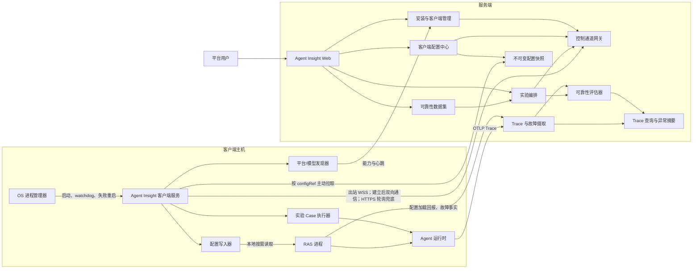
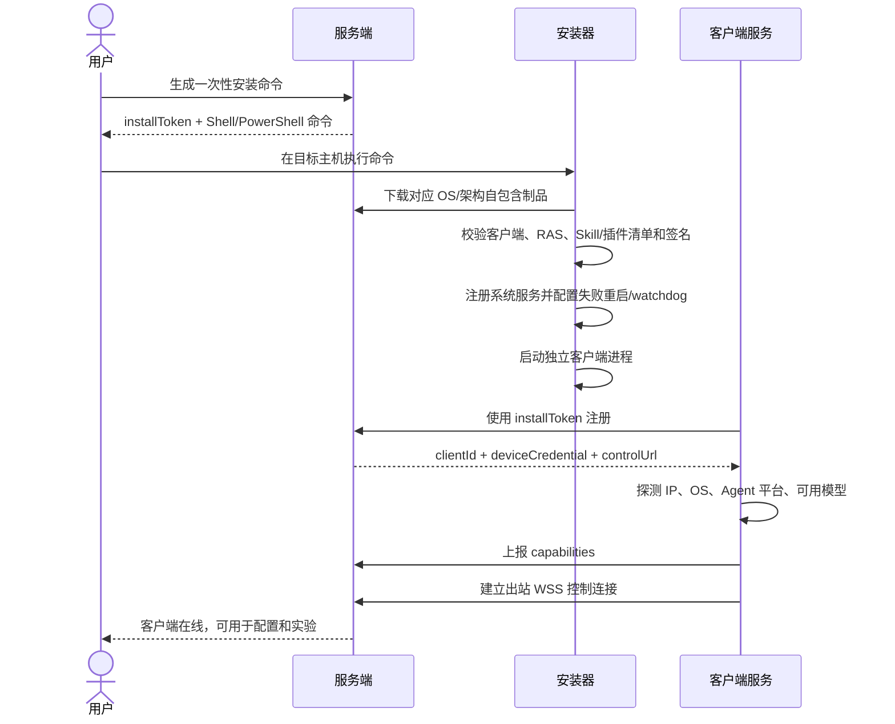
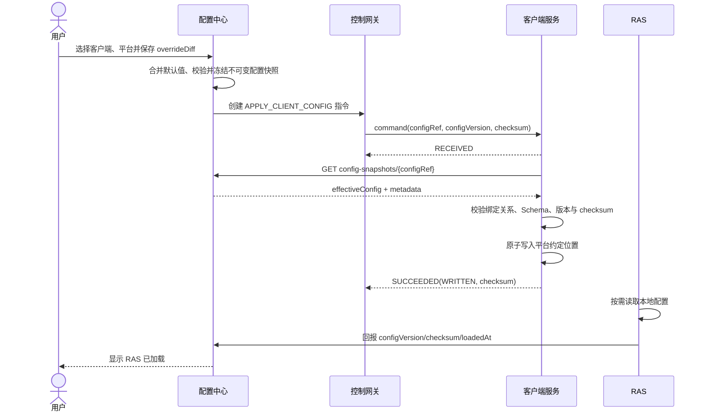
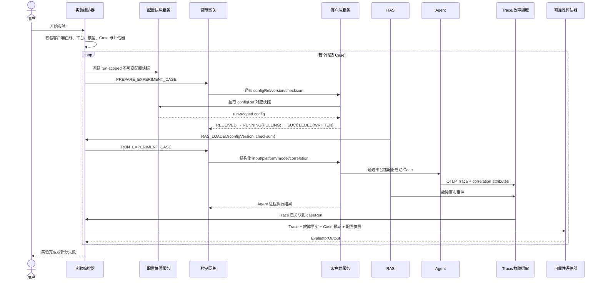

# Agent RAS 可靠性闭环：服务端与客户端交互设计

> 状态：需求设计，尚未实现  
> 日期：2026-08-11  
> 范围：链路追踪故障呈现、实验、可靠性评测数据集、可靠性评估器、客户端安装、客户端配置  
> 说明：本文同时描述现有能力的复用点与建议新增/修改的接口；标记为“新增/修改”的内容不代表当前代码已经实现。

## 1. 目标与已确认决策

本需求建立一条完整的 Agent 可靠性闭环：平台准备故障 Case 和配置，客户端执行受控任务并让 RAS 读取本地配置，Trace 与故障事实回传平台，可靠性评估器再根据 Trace 判断故障是否发生、是否被检测和消解。

已确认的产品与架构决策如下：

1. Trace 列表中的“执行状态”和“异常”是两个维度：执行状态回答任务是否完成，异常回答运行中是否出现故障。
2. Trace 列表只展示“正常 / 有异常 / 检测中 / 未检测”，故障类型、严重程度、RAS 动作与结果放在详情页。
3. 客户端/RAS 上报事实和证据，不直接成为平台的最终评估结论；可靠性评估器根据 Trace、故障事件和 Case 预期形成统一结论。
4. 平台按 Agent 平台提供内置、只读的 JSON 默认配置，所有可靠性能力默认关闭。
5. 每个客户端可以按字段覆盖平台默认配置；客户端只存差异项，恢复默认等价于删除覆盖项。
6. 页面选择顺序为“客户端（IP/主机名）→ 客户端检测到的 Agent 平台 → 配置”。
7. 服务端保存不可变的权威配置快照；控制通道只通知 `configRef`，客户端按 `configRef` 从固定设备接口拉取、校验并原子写入约定位置，RAS 再按需读取并回报已加载版本。
8. 客户端确认写入和 RAS 确认加载是两个不同状态，页面不得把“已写入”显示为“已生效”。
9. 客户端控制面只允许固定 action，不允许服务端下发任意 Shell、任意文件路径或任意可执行文件。
10. 客户端服务是独立常驻进程，由 systemd、launchd 或 Windows Service 托管；具备崩溃重启、假死 watchdog、重启限流和异常降级能力，不随 OpenCode 等 Agent 平台启停。
11. 客户端主动建立出站 WSS，连接建立后支持服务端与客户端双向通信；客户端不监听公网入站端口。
12. 首次安装同时部署客户端、RAS、故障注入 Skill/插件及版本清单；全部故障能力默认关闭，仅在有效配置快照和实验关联范围内激活。

## 2. 范围与边界

### 2.1 本期范围

- 安装并注册常驻客户端服务。
- 由操作系统进程管理器守护客户端，支持崩溃自动重启、假死检测、重启退避与异常状态上报。
- 客户端发现 IP、主机信息、Agent 平台及可用模型。
- 服务端通过双向控制通道发送白名单通知，客户端按 `configRef` 拉取配置快照并返回 ACK、同步进度和执行结果。
- 内置配置 Schema 动态渲染客户端配置页，支持客户端级差异覆盖。
- 实验使用已有 Trace，或在指定客户端、Agent 平台和模型上生成新 Trace。
- 可靠性数据集维护故障模式及 Case；可靠性数据集只能选择可靠性评估器。
- RAS/客户端上报可与 Trace、Span、实验 Case 关联的故障事实。
- 可靠性评估器输出故障发生、检测、处置、消解和最终任务结果。
- Trace 列表展示轻量异常状态，详情展示完整证据。

### 2.2 不在本期开放的能力

- 服务端向客户端执行任意命令、任意脚本或任意路径写文件。
- 服务端通过指令载荷传递任意下载 URL、完整可执行代码或未签名插件。
- 客户端离线时无限期排队，重连后自动执行历史控制指令。
- 在页面编辑平台内置默认配置。
- 由客户端自行给出平台最终评分并覆盖评估器结果。
- 将“已建立 WebSocket 连接”当作指令已经送达。

### 2.3 为闭合“生成 Trace”链路采用的设计假设

“生成 Trace”选择了远端客户端、Agent 平台、模型和数据集 Case，因此仅写入配置还不能开始运行。本文增加一个固定白名单动作 `RUN_EXPERIMENT_CASE`，由客户端的平台适配器启动指定 Agent Case。它只能消费结构化的 Case 输入、平台和模型，不接受 Shell 字符串。

如果最终由外部调度器负责启动 Agent，可将此动作替换为外部触发适配器；配置写入、RAS 加载确认、Trace 关联和评估链路保持不变。

## 3. 总体架构



### 3.1 数据面与控制面

| 平面 | 方向 | 内容 | 可靠性语义 |
|---|---|---|---|
| 控制面 | 服务端 → 客户端 | 通知配置同步、准备实验配置、运行 Case | 配置指令仅携带 `configRef/version/checksum`；必须收到应用层 `RECEIVED` |
| 配置同步 | 客户端 → 服务端 | 按 `configRef` 拉取不可变快照 | 使用固定设备接口和设备凭证；不得使用服务端传入的任意 URL |
| 控制面回执 | 客户端 → 服务端 | `RECEIVED/RUNNING/SUCCEEDED/FAILED` | `SUCCEEDED` 只表示客户端完成拉取和写入；不代表 RAS 已加载 |
| 配置加载回执 | RAS → 服务端 | 配置版本、校验值、加载时间、结果 | 只有成功回报后才能显示“RAS 已加载” |
| 数据面 | Agent → 服务端 | OTLP Trace | 复用现有 `/api/ingest/otel/v1/traces` 异步摄取链路 |
| 数据面 | RAS/客户端 → 服务端 | 故障事实与 RAS 动作事件 | 本地 spool、幂等重试；事件是证据，不是最终评分 |

## 4. 模块职责

### 4.1 服务端模块

| 模块 | 主要职责 | 复用/变更 |
|---|---|---|
| 安装与制品分发 | 生成一次性安装令牌，分发客户端、RAS、故障 Skill/插件和签名版本清单，生成 Shell/PowerShell 安装命令 | 复用 `/api/ingest/setup` 的一键安装入口模式；新增 RAS 客户端专用路由和制品 |
| 客户端注册中心 | 客户端注册、设备凭证、在线状态、IP/主机/OS、Agent 平台和模型能力 | 新增 |
| 控制通道网关 | 客户端主动连接 WSS；双向发送白名单 action/ACK/进度/结果；HTTPS 长轮询兜底 | 新增；现有 uploader 不能替代双向控制通道 |
| 内置配置注册表 | 按 Agent 平台加载只读 JSON Schema、默认值和文件适配器；默认总开关关闭 | 新增 |
| 客户端配置中心 | 保存客户端差异项，冻结不可变配置快照，创建同步记录，展示拉取/写入/加载状态 | 新增 |
| 实验编排 | 校验数据集/评估器约束；处理已有 Trace 或生成 Trace；为每个 Case 建立运行状态 | 修改现有实验域 |
| 可靠性数据集 | 增加 `reliability` 类型和必填的 `fault_injection_type` 字段 | 修改现有数据集域 |
| Trace 摄取与关联 | 复用 OTLP；利用实验、客户端、Case 关联属性绑定生成的 Trace | 修改现有摄取契约，不另建第二条 Trace 落库链路 |
| 故障事件摄取 | 接收故障发生、检测、处置和恢复事实，按 `eventId` 幂等入库 | 新增 |
| 可靠性评估器 | 读取 Trace、故障事实、Case 预期和配置快照，输出统一 `EvaluatorOutput` | 新增预置评估器，接入现有实验引擎 |
| Trace 查询 | 返回执行状态和异常状态；异常详情返回故障时间线和评估结论 | 修改列表接口，新增详情接口 |

### 4.2 客户端模块

| 模块 | 主要职责 | 约束 |
|---|---|---|
| 安装器 | 下载并校验客户端、RAS、故障 Skill/插件及版本清单，保存设备凭证，注册 systemd/launchd/Windows Service | 不依赖 npm/GitHub 等外部下载源；插件必须验签 |
| OS 进程托管 | 启动独立客户端进程，崩溃后自动重启，watchdog 发现假死后重启，限制 crash loop | 客户端不得通过递归拉起自身实现守护 |
| 常驻服务 | 主动建立 WSS、维持心跳、执行固定 action、写审计日志 | 独立于 Agent 平台启停，不监听公网入站端口 |
| 能力发现器 | 获取主机名、客户端 IP、OS/架构、已安装 Agent 平台、可用模型 | 只上报白名单信息，不扫描或上传无关文件 |
| 配置同步器 | 按 `configRef` 调用固定设备接口拉取不可变快照，校验 Schema、版本与 checksum，原子写入 | 服务端 payload 不允许指定 URL、任意绝对路径或完整配置 |
| Case 执行器 | 通过平台适配器执行结构化 Case，注入关联环境变量，回报进程级结果 | 仅执行已注册平台和模型，不接受 Shell |
| 本地事件 spool | 缓存待上报的故障事件和回执，网络恢复后按 `eventId` 重试 | 与控制指令不同：数据上报允许幂等重试 |

### 4.3 RAS 进程职责

- 由客户端服务按平台适配器保证可用；生成 Trace 时必须先完成配置加载，再启动 OpenCode 等 Agent 进程。
- 按平台约定读取客户端长期配置和实验 Case 配置。
- 校验 `configVersion`、`checksum`、有效期和关联标识。
- 回报加载成功、加载失败或版本不一致。
- 运行时产出故障、检测、处置、恢复等事实事件。
- 不直接写平台最终评分；不决定 Trace 列表最终文案。

## 5. 配置模型

### 5.1 内置配置 Schema

每个 Agent 平台随产品发布一个只读 Schema。配置升级只能随产品版本发生，页面没有“编辑平台默认值”入口。

```json
{
  "schemaVersion": "1.0",
  "platform": "opencode",
  "configVersion": "builtin-opencode-ras@1",
  "title": "OpenCode RAS",
  "defaults": {
    "enabled": false,
    "textLoop.enabled": false,
    "textLoop.detectionStartChars": 300,
    "textLoop.windowMaxChars": 1000,
    "textLoop.repeatThreshold": 5,
    "toolRepeat.enabled": false,
    "toolRepeat.warningThreshold": 5,
    "toolRepeat.criticalThreshold": 10,
    "notifyUserOnWarning": false
  },
  "sections": [
    {
      "key": "textLoop",
      "title": "思考 / 文本循环",
      "description": "检测循环文本和语义重复",
      "enabledField": "textLoop.enabled",
      "fields": [
        {
          "key": "textLoop.detectionStartChars",
          "label": "检测起始字符数",
          "type": "integer",
          "min": 1,
          "max": 100000,
          "required": true
        }
      ]
    }
  ]
}
```

字段类型至少支持 `boolean`、`integer`、`number`、`string`、`enum`。Schema 必须提供 `required/min/max/pattern/options/visibleWhen` 等校验信息，服务端和客户端使用同一份规则校验。

### 5.2 继承与覆盖

```text
最终生效配置 = 平台内置 defaults + 客户端 overrideDiff
```

- 客户端只保存被修改的 JSON Path 及其值。
- 字段旁标记来源：`平台默认` 或 `客户端覆盖`。
- 恢复单字段、分组或全部默认值时，删除对应差异项。
- 平台总开关默认 `false`。总开关关闭时，各分组参数保留但不生效。
- 平台升级新增字段时，未覆盖字段自动继承新版默认值。
- 平台升级删除或改名的字段不得继续同步；迁移器需将无效 override 标记为待处理。

### 5.3 本地文件分层

客户端写入两个互不覆盖的逻辑命名空间：

1. `client`：客户端长期配置，由“客户端配置”页面产生。
2. `experiment`：单个实验 Case 的运行配置，按 `experimentRunId/caseRunId` 隔离并带有效期。

具体文件路径由客户端的平台适配器决定。服务端控制指令只发送 `platform/scope/configRef/configVersion/checksum`，客户端再从固定接口拉取完整快照；指令不携带文件系统路径、任意 URL 或完整配置。

```json
{
  "kind": "agent-insight.ras-config",
  "schemaVersion": "1.0",
  "scope": "experiment",
  "platform": "opencode",
  "clientId": "cli_01J...",
  "configVersion": "cfg_01J...",
  "checksum": "sha256:...",
  "correlation": {
    "experimentId": "exp_01J...",
    "experimentRunId": "run_01J...",
    "caseRunId": "case_run_01J..."
  },
  "expiresAt": "2026-08-11T12:30:00.000Z",
  "config": {
    "faultInjectionType": "model_timeout",
    "faultInjection": {
      "delayMs": 30000,
      "matchModel": "qwen3-32b"
    }
  }
}
```

客户端必须使用“写临时文件 → flush/fsync → 原子 rename/replace”的方式更新配置，避免 RAS 读到半份 JSON。

## 6. 核心状态机

### 6.1 客户端服务与在线状态

```text
INSTALLED → STARTING → ONLINE → DEGRADED → RECOVERING
                         │          │           ├─ ONLINE
                         │          │           └─ DISABLED
                         └──────────┴──────────→ OFFLINE
```

- `STARTING`：操作系统进程管理器已启动服务，尚未建立控制连接。
- `ONLINE`：控制连接正常，最近一次心跳在阈值内。
- `DEGRADED`：连接存在但心跳、能力刷新、watchdog 或回执异常。
- `RECOVERING`：操作系统正在按退避策略重启客户端。
- `DISABLED`：短时间连续失败超过阈值，停止自动重启并等待管理员处理。
- `OFFLINE`：连接断开或心跳超时。
- 在线不代表指令已送达，只有应用层 `RECEIVED` 才代表送达。

Linux 建议使用 `Restart=on-failure`、`RestartSec=5s`、`StartLimitIntervalSec=300`、`StartLimitBurst=5` 和 `WatchdogSec=30s`。macOS 使用 launchd `KeepAlive`，Windows 使用 Service Recovery；服务端心跳只能判断离线，不能替代本机进程守护。

### 6.2 控制指令状态

```text
CREATED → SENT → RECEIVED → RUNNING → SUCCEEDED
                  │           └──────→ FAILED
                  └──────────────────→ EXPIRED
SENT ──ACK 超时──→ DELIVERY_FAILED
```

- 客户端离线时不创建待重连自动执行队列，立即返回 `CLIENT_OFFLINE`。
- `SENT` 后在 ACK 窗口内未收到 `RECEIVED`，状态为 `DELIVERY_FAILED`。
- 用户点击重试会创建新的 `commandId`；旧指令不会在客户端重连后自动执行。
- 客户端以 `commandId` 幂等，同一个命令不得重复执行。

### 6.3 配置同步与加载状态

```text
SAVED → SYNC_NOTIFIED → PULLING → WRITTEN → RAS_LOADED
             │              │          │           ├─ LOAD_FAILED
             │              │          │           └─ VERSION_MISMATCH
             │              │          └─ WRITE_FAILED
             │              └─ PULL_FAILED
             └─ NOTIFY_FAILED
```

`PULLING` 表示客户端已根据 `configRef` 请求不可变快照；`WRITTEN` 来自客户端 action 的 `SUCCEEDED`；`RAS_LOADED` 来自 RAS 的独立加载回报。客户端离线时配置仍可保存，但同步通知失败且不排队自动执行。

### 6.4 实验 Case 运行状态

```text
PENDING
  → FREEZING_CONFIG
  → SYNCING_CONFIG
  → WAITING_RAS_LOAD
  → RUNNING_AGENT
  → WAITING_TRACE
  → EVALUATING
  → DONE

任一步骤可进入 FAILED；用户重试生成新的 caseRun，保留旧运行记录。
```

### 6.5 Trace 的两个状态维度

| 执行状态 | 异常状态 | 示例 |
|---|---|---|
| `running` | `detecting` | Agent 仍在执行，尚未形成异常结论 |
| `success` | `normal` | 执行成功且未发现故障 |
| `success` | `abnormal` | 发生故障但被 RAS 消解，最终执行成功 |
| `failed` | `abnormal` | 故障未消解，最终执行失败 |
| `cancelled` | `unknown` | 用户取消，没有充分检测结论 |

异常状态推导优先级：

1. 任一故障事实或可靠性评估器判定 `faultOccurred=true` → `abnormal`。
2. Trace 已结束且可靠性评估器明确判定未发生故障 → `normal`。
3. Trace 执行中或可靠性评估进行中 → `detecting`。
4. 没有可靠性数据 → `unknown`，页面显示“未检测”，不能显示“正常”。

## 7. 完整交互过程

### 7.1 安装、注册与能力发现



安装令牌为一次性、短有效期。设备凭证只能访问当前客户端的设备接口，服务端仅保存凭证哈希。

### 7.2 客户端配置保存、同步与 RAS 加载



如果客户端拉取失败，页面显示“同步失败”；如果已经写入但 RAS 未回报，页面停留在“本地已写入”，超时后显示“等待 RAS 加载超时”，不得回滚为“同步失败”。

### 7.3 使用已有 Trace 的实验

1. 用户选择数据集、评估器和单个 Agent。
2. 服务端按 Agent 分页返回 Trace，用户通过名称、标签和时间等条件筛选并自由选择。
3. 创建实验时将选择的 `executionId` 写入实验 Case。
4. 启动实验后不访问客户端、不通知配置同步，直接读取已有 Trace、故障事件和参考答案。
5. 可靠性评估器或普通评估器按兼容规则运行并写入 `ExperimentEvalResult`。

### 7.4 生成 Trace 的实验



同一客户端默认一次只运行一个可靠性 Case，避免多个故障注入互相污染。若后续证明 RAS 和 Agent 平台支持隔离，可按客户端能力声明提高并发。

### 7.5 Trace 与故障事实关联

生成 Trace 时客户端必须注入以下 OTLP resource/span attributes：

```text
agent.insight.client.id
agent.insight.experiment.id
agent.insight.experiment.run_id
agent.insight.experiment.case_run_id
agent.insight.config.version
agent.insight.platform
```

故障事件使用相同的 `clientId/experimentId/experimentRunId/caseRunId`，并尽可能携带 `traceId/spanId`。Trace 先到或故障事件先到都允许；服务端在关联信息齐全后完成归并。

### 7.6 可靠性评估

可靠性评估器的输入包括：

- 数据集 Case：输入、`fault_injection_type`、注入参数和可选预期输出。
- Trace：执行状态、Span、工具/模型调用、错误、时序和最终输出。
- 故障事实：故障、检测、处置和恢复事件。
- 配置快照：内置配置版本、客户端 override、实验配置版本和校验值。

评估器至少输出以下判断点：

| 判断点 | 含义 |
|---|---|
| 故障是否发生 | Trace 或故障事实中是否有与预期故障模式一致的证据 |
| 故障是否被检测 | RAS 是否产生检测事件，检测是否发生在合理时间内 |
| 是否触发处置 | 是否出现恢复、熔断、重试、降级等 RAS 动作 |
| 故障是否消解 | 后续 Trace 是否恢复到可继续执行的状态 |
| 最终任务结果 | Agent 最终成功、失败或部分完成，成本/时延是否显著恶化 |

推荐初始评分为五个判断点各 20 分，同时把每个点作为 `points[]` 输出。证据不足时允许不输出总分，只返回 `warn` 和缺失证据说明；不能把“没有收到故障事件”直接等价为“没有发生故障”。

评估器中心页面保持现有布局和交互，仅在预置评估器注册信息中新增可靠性分类，不单独改造评估器管理页面：

```json
{
  "id": "preset-ras-reliability",
  "name": "Agent RAS 可靠性评估器",
  "source": "preset",
  "category": "reliability",
  "targetTypes": ["轨迹", "故障事件"],
  "status": "ready",
  "runtimeNote": "ras-reliability-evaluator.ts"
}
```

非可靠性评估器的 `category` 读取时按 `general` 兜底，避免要求迁移全部存量自定义评估器。数据集与评估器门控只读取注册元数据，不根据名称或标签字符串猜测。

结构化证据示例：

```json
{
  "verdict": "pass",
  "summary": "模型超时故障已发生，RAS 在 1.8 秒内检测并通过备用模型完成恢复。",
  "score": 100,
  "points": [
    { "label": "故障发生", "score": 100, "status": "covered" },
    { "label": "故障检测", "score": 100, "status": "covered" },
    { "label": "触发处置", "score": 100, "status": "covered" },
    { "label": "故障消解", "score": 100, "status": "covered" },
    { "label": "最终任务结果", "score": 100, "status": "covered" }
  ],
  "evidence": {
    "json": {
      "faultOccurred": true,
      "faultDetected": true,
      "mitigationTriggered": true,
      "mitigated": true,
      "recovered": true,
      "faultType": "model_timeout",
      "affectedSpanIds": ["7e57..."],
      "faultEventIds": ["evt_01J..."]
    }
  }
}
```

## 8. 数据模型建议

以下为建议模型，属于后续 Prisma 设计输入，不表示当前 schema 已存在。

### 8.1 新增模型

| 模型 | 关键字段 | 说明 |
|---|---|---|
| `ReliabilityClient` | `id/user/name/hostname/reportedIp/observedIp/os/arch/status/serviceHealth/processStartedAt/restartCount/lastSeenAt/agentVersion/capabilitiesJson` | 一个独立常驻客户端；区分网络在线、进程健康和重启状态 |
| `ReliabilityClientCredential` | `clientId/credentialHash/createdAt/revokedAt` | 设备凭证，只保存哈希 |
| `ReliabilityCommand` | `id/clientId/action/payloadJson/status/expiresAt/receivedAt/startedAt/completedAt/errorCode` | 控制指令审计与幂等状态 |
| `ReliabilityClientConfig` | `clientId/platform/schemaVersion/overrideJson/updatedAt` | 客户端差异项，`clientId+platform` 唯一 |
| `ReliabilityConfigSnapshot` | `id/configRef/clientId/platform/scope/configVersion/checksum/configJson/expiresAt/createdAt` | 服务端不可变权威快照；`configRef` 只允许绑定客户端拉取 |
| `ReliabilityConfigDelivery` | `id/clientId/platform/configRef/configVersion/checksum/commandId/status/pulledAt/writtenAt/loadedAt/error` | 一次配置通知、拉取、写入和加载状态 |
| `ReliabilityConfigLoad` | `id/clientId/platform/configVersion/checksum/rasProcessId/loadedAt/status/error` | RAS 加载回报，可保留历史 |
| `ReliabilityFaultEvent` | `eventId/clientId/executionId/traceId/spanId/experimentRunId/caseRunId/type/phase/severity/evidenceJson/occurredAt` | 客户端上报的事实事件，`eventId` 唯一 |
| `ExperimentRun` | `id/experimentId/status/startedAt/completedAt` | 一次实验启动；为整实验重试保留历史 |
| `ExperimentCaseRun` | `id/experimentRunId/caseId/clientId/platform/model/configVersion/commandId/executionId/status/error` | 一个 Case 的一次生成 Trace 运行 |

### 8.2 修改现有模型

| 模型 | 建议字段 | 原因 |
|---|---|---|
| `AgentEvalDataset` | `datasetKind` 增加 `reliability` | 区分可靠性数据集并触发评估器门控 |
| `Experiment` | `datasetId/traceSource/clientId/platform/model` | 保存向导选择与可追溯快照 |
| `ExperimentCase` | `datasetCaseId/faultInjectionType/caseValuesJson` | 保留数据集 Case 快照，不受后续数据集修改影响 |
| `Execution` | `anomalyStatus/anomalyCount/reliabilityUpdatedAt` | Trace 列表轻量读取，避免逐行聚合故障事件 |

`ExperimentEvalResult` 继续保存可靠性评估结果，不新建第二套评分表；结构化可靠性结论放入现有 `evidenceJson`，主结论仍使用 `verdict/summary/score/pointsJson`。

## 9. 接口总览

### 9.1 标记说明

- **新增**：当前仓库没有该接口。
- **修改**：当前接口存在，需要扩充请求、响应或行为。
- **复用**：接口形状不变，仅补充调用约定。

| 编号 | 类型 | 方法与路径 | 调用方 | 用途 |
|---|---|---|---|---|
| IF-N01 | 新增 | `POST /api/reliability/install-tokens` | Web → 服务端 | 创建一次性安装令牌和命令 |
| IF-N02 | 新增 | `GET /api/ingest/setup/ras-client` | 安装器 → 服务端 | 获取 Shell/PowerShell 安装脚本 |
| IF-N03 | 新增 | `GET /api/ingest/setup/ras-client/package` | 安装器 → 服务端 | 下载客户端、RAS、故障 Skill/插件和签名清单 |
| IF-N04 | 新增 | `POST /api/reliability/client/v1/register` | 客户端 → 服务端 | 注册客户端并换取设备凭证 |
| IF-N05 | 新增 | `WSS /api/reliability/client/v1/control` | 客户端 ↔ 服务端 | 主控制通道 |
| IF-N06 | 新增 | `POST /api/reliability/client/v1/heartbeat` | 客户端 → 服务端 | HTTPS 模式心跳与能力刷新 |
| IF-N07 | 新增 | `GET /api/reliability/client/v1/commands/next` | 客户端 → 服务端 | WSS 不可用时长轮询指令 |
| IF-N08 | 新增 | `POST /api/reliability/client/v1/commands/{commandId}/status` | 客户端 → 服务端 | 指令 ACK、进度与结果 |
| IF-N09 | 新增 | `GET /api/reliability/clients` | Web → 服务端 | 客户端列表和能力查询 |
| IF-N15 | 新增 | `PUT /api/reliability/client/v1/capabilities` | 客户端 → 服务端 | 主动刷新 IP、Agent 平台与模型能力 |
| IF-N10 | 新增 | `GET /api/reliability/config-schemas/{platform}` | Web → 服务端 | 获取内置只读配置 Schema |
| IF-N11 | 新增 | `GET/PUT/DELETE /api/reliability/clients/{clientId}/config`、`POST .../config/sync` | Web → 服务端 | 查询、覆盖、恢复及重新通知客户端同步 |
| IF-N17 | 新增 | `GET /api/reliability/client/v1/config-snapshots/{configRef}` | 客户端 → 服务端 | 按引用拉取绑定当前客户端的不可变配置快照 |
| IF-N12 | 新增 | `POST /api/reliability/client/v1/config-loads` | RAS/客户端 → 服务端 | 回报 RAS 加载配置结果 |
| IF-N16 | 新增 | `GET /api/reliability/fault-modes` | Web → 服务端 | 查询内置故障模式和参数 Schema |
| IF-M01 | 修改 | `POST /api/agent-datasets`、`PATCH /api/agent-datasets` | Web → 服务端 | 支持可靠性数据集 |
| IF-M02 | 修改 | `POST /api/experiments` | Web → 服务端 | 保存数据集、Trace 来源、客户端与模型 |
| IF-M03 | 修改 | `POST /api/experiments/{id}/run` | Web → 服务端 | 启动异步生成 Trace/评估流程 |
| IF-M04 | 修改 | `GET /api/experiments/{id}` | Web → 服务端 | 返回运行、Case 生成和评估进度 |
| IF-M05 | 修改 | `GET /api/experiments/agents` | Web → 服务端 | Agent 返回框架和可运行客户端能力 |
| IF-M06 | 修改 | `GET /api/experiments/traces` | Web → 服务端 | 分页筛选 Trace 并返回异常状态 |
| IF-N13 | 新增 | `POST /api/reliability/client/v1/fault-events/batch` | RAS/客户端 → 服务端 | 批量上报故障事实 |
| IF-M07 | 修改 | `POST /api/ingest/otel/v1/traces` | Agent → 服务端 | 接收实验关联属性，Trace 协议本身不变 |
| IF-M08 | 修改 | `GET /api/observe/data` | Web → 服务端 | Trace 列表增加异常状态与筛选 |
| IF-N14 | 新增 | `GET /api/observe/executions/{executionId}/reliability` | Web → 服务端 | Trace 异常详情 |

## 10. 详细接口定义

### 10.1 通用约定

#### 鉴权

- Web 接口沿用平台用户鉴权和 `resolveUser` 作用域。
- 客户端接口使用 `Authorization: Bearer <deviceCredential>`。
- 一次性安装令牌只能调用注册接口，不能调用设备接口或用户接口。
- `clientId` 必须属于当前用户；服务端不能仅凭请求体中的 `user` 放行。

#### 通用错误响应

```json
{
  "error": {
    "code": "CLIENT_OFFLINE",
    "message": "客户端离线，配置已保存但未通知同步",
    "requestId": "req_01J...",
    "details": {
      "clientId": "cli_01J..."
    }
  }
}
```

| HTTP | 使用场景 |
|---|---|
| `400` | 字段、Schema、平台、模型或状态不合法 |
| `401` | 用户或设备未认证 |
| `403` | 无权访问指定客户端、实验或 Trace |
| `404` | 客户端、实验、Case、Trace 或平台 Schema 不存在 |
| `409` | 状态冲突、版本冲突、实验已运行、命令重复 |
| `410` | 安装令牌或命令已过期 |
| `422` | 数据集、评估器或 Case 组合不满足业务规则 |
| `503` | 客户端离线或控制通道不可用 |
| `504` | 客户端 ACK、RAS 加载或 Trace 等待超时 |

### 10.2 IF-N01：创建安装令牌

`POST /api/reliability/install-tokens`

请求：

```json
{
  "name": "测试机-10.20.3.18",
  "expiresInSeconds": 600
}
```

成功响应 `201`：

```json
{
  "installToken": "rit_01J...",
  "expiresAt": "2026-08-11T10:10:00.000Z",
  "commands": {
    "unix": "curl -sSf 'https://insight.example/api/ingest/setup/ras-client?platform=unix' | bash -s -- --token 'rit_01J...'",
    "windows": "$env:AGENT_INSIGHT_INSTALL_TOKEN='rit_01J...'; iex (iwr 'https://insight.example/api/ingest/setup/ras-client?platform=windows' -UseBasicParsing).Content"
  }
}
```

约束：令牌只能成功注册一次；过期或已消费返回 `410 INSTALL_TOKEN_EXPIRED` 或 `409 INSTALL_TOKEN_USED`。

### 10.3 IF-N02/IF-N03：安装脚本与客户端制品

`GET /api/ingest/setup/ras-client?platform=unix|windows`

响应为 `text/x-shellscript` 或 `text/plain` PowerShell。脚本负责探测 `os/arch`、调用制品接口、校验客户端与 RAS/Skill/插件清单的摘要和签名、保存设备凭证、注册后台服务并启动。

`GET /api/ingest/setup/ras-client/package?os=linux&arch=amd64&version=1.0.0`

成功响应为二进制流，响应头至少包含：

```text
Content-Disposition: attachment; filename="agent-insight-client-linux-amd64"
X-Agent-Insight-Version: 1.0.0
X-Checksum-SHA256: <hex>
X-Manifest-Signature: <base64>
Cache-Control: private, max-age=300
```

仅允许服务端白名单中的 `os/arch/version`，禁止把 query 参数拼成文件路径。

### 10.4 IF-N04：客户端注册

`POST /api/reliability/client/v1/register`

请求：

```json
{
  "installToken": "rit_01J...",
  "client": {
    "name": "测试机-10.20.3.18",
    "hostname": "agent-host-03",
    "ip": "10.20.3.18",
    "os": "linux",
    "arch": "amd64",
    "agentVersion": "1.0.0"
  },
 "capabilities": {
    "components": {
      "rasVersion": "0.3.0",
      "faultPluginVersion": "0.4.1",
      "faultSkillBundleVersion": "0.4.1"
    },
    "platforms": [
      {
        "id": "opencode",
        "version": "1.2.3",
        "models": ["qwen3-32b", "deepseek-v3"]
      }
    ],
    "actions": ["APPLY_CLIENT_CONFIG", "PREPARE_EXPERIMENT_CASE", "RUN_EXPERIMENT_CASE"]
  }
}
```

成功响应 `201`：

```json
{
  "clientId": "cli_01J...",
  "deviceCredential": "dc_01J...",
  "control": {
    "websocketUrl": "wss://insight.example/api/reliability/client/v1/control",
    "pollUrl": "https://insight.example/api/reliability/client/v1/commands/next",
    "heartbeatIntervalSeconds": 30,
    "ackTimeoutSeconds": 5
  }
}
```

`deviceCredential` 只返回一次。客户端必须以仅当前服务账户可读的权限保存。

### 10.5 IF-N05：WSS 控制通道

连接：

```text
GET wss://insight.example/api/reliability/client/v1/control
Authorization: Bearer <deviceCredential>
X-Agent-Insight-Client-Id: cli_01J...
```

服务端指令帧：

```json
{
  "type": "COMMAND",
  "commandId": "cmd_01J...",
  "action": "APPLY_CLIENT_CONFIG",
  "createdAt": "2026-08-11T10:00:00.000Z",
  "expiresAt": "2026-08-11T10:00:30.000Z",
  "payload": {
    "platform": "opencode",
    "scope": "client",
    "configRef": "cfgref_01J...",
    "configVersion": "cfg_01J...",
    "checksum": "sha256:..."
  }
}
```

客户端回执帧：

```json
{
  "type": "COMMAND_STATUS",
  "commandId": "cmd_01J...",
  "status": "SUCCEEDED",
  "occurredAt": "2026-08-11T10:00:02.000Z",
  "result": {
    "state": "WRITTEN",
    "configRef": "cfgref_01J...",
    "configVersion": "cfg_01J...",
    "checksum": "sha256:...",
    "pulledAt": "2026-08-11T10:00:01.000Z",
    "writtenAt": "2026-08-11T10:00:02.000Z"
  }
}
```

允许的客户端状态依次为 `RECEIVED`、`RUNNING`、`SUCCEEDED` 或 `FAILED`；配置同步时 `RUNNING` 的 `result.state` 为 `PULLING`。服务端必须拒绝未知 action；客户端也必须以本地白名单再次校验。WSS payload 只包含固定 API 可解析的 `configRef`，不得包含下载 URL。

### 10.6 IF-N06/IF-N07/IF-N08：HTTPS 兜底控制

`POST /api/reliability/client/v1/heartbeat`

```json
{
  "clientId": "cli_01J...",
  "agentVersion": "1.0.0",
  "capabilitiesRevision": "cap_7",
  "status": "healthy",
  "service": {
    "processStartedAt": "2026-08-11T09:55:00.000Z",
    "supervisor": "systemd",
    "watchdog": "healthy",
    "restartCount": 0
  },
  "sentAt": "2026-08-11T10:01:00.000Z"
}
```

响应：

```json
{
  "serverTime": "2026-08-11T10:01:00.120Z",
  "nextHeartbeatSeconds": 30,
  "refreshCapabilities": false
}
```

`GET /api/reliability/client/v1/commands/next?waitSeconds=25`

- 有命令：`200`，响应体与 WSS `COMMAND` 帧一致。
- 超时无命令：`204`。
- 单次等待不超过 30 秒；不得由客户端并发发起多个长轮询。

`POST /api/reliability/client/v1/commands/{commandId}/status`

请求体与 WSS `COMMAND_STATUS` 帧一致。不存在或不属于该客户端的命令返回 `404`；已过期命令返回 `410 COMMAND_EXPIRED`。

### 10.7 IF-N09：客户端列表

`GET /api/reliability/clients?page=1&pageSize=20&status=online&keyword=10.20`

响应：

```json
{
  "items": [
    {
      "id": "cli_01J...",
      "name": "测试机-10.20.3.18",
      "hostname": "agent-host-03",
      "reportedIp": "10.20.3.18",
      "observedIp": "203.0.113.18",
      "os": "linux",
      "arch": "amd64",
      "status": "online",
      "serviceHealth": "healthy",
      "processStartedAt": "2026-08-11T09:55:00.000Z",
      "restartCount": 0,
      "lastSeenAt": "2026-08-11T10:02:00.000Z",
      "platforms": [
        {
          "id": "opencode",
          "version": "1.2.3",
          "models": ["qwen3-32b", "deepseek-v3"]
        }
      ]
    }
  ],
  "page": 1,
  "pageSize": 20,
  "total": 1
}
```

列表主字段展示 `reportedIp`；`observedIp` 只在详情中辅助网络排查，不替代运行主机 IP。

### 10.8 IF-N15：刷新客户端能力

`PUT /api/reliability/client/v1/capabilities`

请求：

```json
{
  "clientId": "cli_01J...",
  "revision": "cap_8",
  "hostname": "agent-host-03",
  "reportedIp": "10.20.3.18",
  "platforms": [
    {
      "id": "opencode",
      "version": "1.2.4",
      "models": ["qwen3-32b", "deepseek-v3"],
      "configSchemaVersion": "1.0",
      "actions": ["APPLY_CLIENT_CONFIG", "PREPARE_EXPERIMENT_CASE", "RUN_EXPERIMENT_CASE"]
    }
  ],
  "detectedAt": "2026-08-11T10:03:00.000Z"
}
```

成功响应：

```json
{
  "acceptedRevision": "cap_8",
  "serverTime": "2026-08-11T10:03:00.120Z"
}
```

同一 revision 重复上报必须幂等。服务端从连接源地址生成 `observedIp`，不接受客户端请求体覆盖该字段。平台或模型消失后，尚未开始的实验必须在启动时重新校验能力并返回 `CLIENT_CAPABILITY_CHANGED`。

### 10.9 IF-N10：获取内置配置 Schema

`GET /api/reliability/config-schemas/opencode`

响应即 §5.1 的 Schema，并增加：

```json
{
  "editable": false,
  "source": "builtin",
  "updatedWithProductVersion": "1.8.0"
}
```

平台不存在返回 `404 PLATFORM_SCHEMA_NOT_FOUND`。

### 10.10 IF-N11：客户端配置查询、保存、恢复与通知同步

#### 查询

`GET /api/reliability/clients/cli_01J.../config?platform=opencode`

响应：

```json
{
  "clientId": "cli_01J...",
  "platform": "opencode",
  "schemaVersion": "1.0",
  "builtinConfigVersion": "builtin-opencode-ras@1",
  "overrideDiff": {
    "enabled": true,
    "textLoop.enabled": true
  },
  "effectiveConfig": {
    "enabled": true,
    "textLoop": {
      "enabled": true,
      "detectionStartChars": 300,
      "windowMaxChars": 1000,
      "repeatThreshold": 5
    }
  },
  "fieldSources": {
    "enabled": "client_override",
    "textLoop.enabled": "client_override",
    "textLoop.repeatThreshold": "builtin"
  },
  "delivery": {
    "configRef": "cfgref_01J...",
    "configVersion": "cfg_01J...",
    "status": "ras_loaded",
    "pulledAt": "2026-08-11T10:00:01.000Z",
    "writtenAt": "2026-08-11T10:00:02.000Z",
    "loadedAt": "2026-08-11T10:00:04.000Z"
  }
}
```

#### 保存并通知同步

`PUT /api/reliability/clients/cli_01J.../config?platform=opencode`

```json
{
  "expectedRevision": 3,
  "overrideDiff": {
    "enabled": true,
    "textLoop.enabled": true,
    "textLoop.repeatThreshold": 6
  },
  "sync": true
}
```

响应 `202`：

```json
{
  "revision": 4,
  "configRef": "cfgref_01J...",
  "configVersion": "cfg_01J...",
  "deliveryId": "delivery_01J...",
  "commandId": "cmd_01J...",
  "status": "sync_notified"
}
```

`expectedRevision` 用于乐观锁。服务端在事务内冻结不可变快照并生成 `configRef/configVersion/checksum`；版本冲突返回 `409 CONFIG_REVISION_CONFLICT` 和当前 revision。`sync=false` 表示仅保存覆盖项、不生成同步通知，状态为 `saved`。

如果配置已保存但客户端离线，不回滚保存结果，也不创建待重连自动执行的命令。响应 `200`：

```json
{
  "revision": 4,
  "configVersion": "cfg_01J...",
  "saved": true,
  "sync": {
    "status": "failed",
    "error": {
      "code": "CLIENT_OFFLINE",
      "message": "配置已保存，但客户端离线，未通知同步"
    }
  }
}
```

#### 恢复默认

`DELETE /api/reliability/clients/cli_01J.../config?platform=opencode&path=textLoop.repeatThreshold&sync=true`

- 有 `path`：删除单字段或分组覆盖。
- 无 `path`：删除该客户端该平台的全部覆盖。
- 删除后重新计算最终配置；`sync=true` 时冻结新快照并通知客户端拉取。

#### 重新通知同步

`POST /api/reliability/clients/cli_01J.../config/sync?platform=opencode`

请求：

```json
{
  "configRef": "cfgref_01J...",
  "configVersion": "cfg_01J..."
}
```

成功响应 `202`：

```json
{
  "deliveryId": "delivery_01J...2",
  "commandId": "cmd_01J...2",
  "configRef": "cfgref_01J...",
  "configVersion": "cfg_01J...",
  "status": "sync_notified"
}
```

该接口复用已经冻结的不可变快照，只创建新的 delivery/command，不产生新的配置 revision。客户端离线返回 `503 CLIENT_OFFLINE`，且不会排队等待重连。

### 10.11 IF-N17：客户端拉取不可变配置快照

`GET /api/reliability/client/v1/config-snapshots/{configRef}`

请求头：

```text
Authorization: Bearer <deviceCredential>
X-Agent-Insight-Client-Id: cli_01J...
If-None-Match: "sha256:..."
```

成功响应 `200`：

```json
{
  "configRef": "cfgref_01J...",
  "clientId": "cli_01J...",
  "platform": "opencode",
  "scope": "experiment",
  "schemaVersion": "1.0",
  "configVersion": "cfg_case_01J...",
  "checksum": "sha256:...",
  "correlation": {
    "experimentRunId": "run_01J...",
    "caseRunId": "case_run_01J..."
  },
  "expiresAt": "2026-08-11T12:30:00.000Z",
  "config": {
    "enabled": true,
    "faultInjectionType": "model_timeout",
    "faultInjection": {
      "delayMs": 30000,
      "matchModel": "qwen3-32b"
    }
  }
}
```

服务端必须校验 `configRef` 绑定的 `clientId` 与设备凭证一致；跨客户端返回 `403 CONFIG_SNAPSHOT_FORBIDDEN`，不存在返回 `404 CONFIG_SNAPSHOT_NOT_FOUND`，过期返回 `410 CONFIG_SNAPSHOT_EXPIRED`。快照创建后不可修改；相同 ETag 返回 `304`。客户端只能调用该固定路径，控制指令不得提供替代 URL。

### 10.12 IF-N12：RAS 配置加载回报

`POST /api/reliability/client/v1/config-loads`

请求：

```json
{
  "clientId": "cli_01J...",
  "platform": "opencode",
  "scope": "client",
  "configVersion": "cfg_01J...",
  "checksum": "sha256:...",
  "rasProcessId": "ras-18421",
  "status": "loaded",
  "loadedAt": "2026-08-11T10:00:04.000Z"
}
```

失败示例：

```json
{
  "clientId": "cli_01J...",
  "platform": "opencode",
  "scope": "experiment",
  "configVersion": "cfg_case_01J...",
  "status": "failed",
  "error": {
    "code": "CONFIG_SCHEMA_INVALID",
    "message": "textLoop.repeatThreshold must be >= 1"
  },
  "loadedAt": "2026-08-11T10:05:04.000Z"
}
```

服务端校验 `configVersion/checksum/clientId/platform`。版本不一致返回 `409 CONFIG_VERSION_MISMATCH`，同时把 delivery 标为 `version_mismatch`。

### 10.13 IF-N16：故障模式查询

`GET /api/reliability/fault-modes?platform=opencode`

成功响应：

```json
{
  "items": [
    {
      "id": "model_timeout",
      "name": "模型调用超时",
      "description": "验证模型超时时 RAS 的检测与降级能力",
      "supportedPlatforms": ["opencode"],
      "parameters": [
        {
          "key": "delayMs",
          "label": "超时时间",
          "type": "integer",
          "required": true,
          "min": 1,
          "max": 300000,
          "unit": "ms"
        }
      ]
    }
  ],
  "registryVersion": "fault-modes@1"
}
```

不传 `platform` 返回全部内置模式；传入平台后只返回该平台可执行的模式。未知平台返回空数组，不把调用错误误报为平台没有故障模式。

### 10.14 IF-M01：可靠性数据集

现有 `POST/PATCH /api/agent-datasets` 修改点：

- `datasetKind` 增加 `reliability`。
- 系统字段固定包含 `input` 和 `fault_injection_type`；两者必填。
- 其余字段仍使用现有动态 `fields/values` 机制。
- 可靠性 Case 的 `fault_injection_type` 必须来自服务端支持的故障模式注册表。

创建请求示例：

```json
{
  "user": "alice",
  "name": "RAS 可靠性评测集",
  "description": "验证模型超时和工具重复故障的检测与恢复",
  "datasetKind": "reliability",
  "fields": [
    { "id": "input", "key": "input", "label": "输入", "type": "text", "system": true },
    { "id": "fault_injection_type", "key": "fault_injection_type", "label": "故障注入类型", "type": "text", "system": true },
    { "id": "reference_output", "key": "reference_output", "label": "标准答案", "type": "text", "system": true }
  ],
  "cases": [
    {
      "id": "case-model-timeout",
      "input": "分析日志并给出根因",
      "expectedOutput": "识别超时并完成降级",
      "values": {
        "fault_injection_type": "model_timeout",
        "reference_output": "识别超时并完成降级"
      },
      "tags": ["模型", "超时"]
    }
  ]
}
```

校验失败响应 `422`：

```json
{
  "error": "reliability case requires fault_injection_type",
  "details": [
    { "caseId": "case-model-timeout", "field": "fault_injection_type" }
  ]
}
```

成功响应沿用现有数据集契约：

```json
{
  "success": true,
  "dataset": {
    "id": "ds_reliability_01",
    "name": "RAS 可靠性评测集",
    "datasetKind": "reliability",
    "caseCount": 1,
    "fields": [
      { "key": "input", "label": "输入", "type": "text", "system": true },
      { "key": "fault_injection_type", "label": "故障注入类型", "type": "text", "system": true }
    ]
  },
  "warnings": []
}
```

### 10.15 IF-M02：创建实验

现有 `POST /api/experiments` 扩展请求：

```json
{
  "user": "alice",
  "name": "OpenCode 模型超时恢复实验",
  "datasetId": "ds_reliability_01",
  "agent": {
    "name": "code-review-agent",
    "framework": "opencode"
  },
  "evaluatorIds": ["preset-ras-reliability"],
  "traceSource": "generate",
  "generateTrace": {
    "clientId": "cli_01J...",
    "platform": "opencode",
    "model": "qwen3-32b",
    "datasetCaseIds": ["case-model-timeout"]
  }
}
```

选择已有 Trace 时：

```json
{
  "user": "alice",
  "name": "历史 Trace 可靠性回评",
  "datasetId": "ds_reliability_01",
  "agent": {
    "name": "code-review-agent",
    "framework": "opencode"
  },
  "evaluatorIds": ["preset-ras-reliability"],
  "traceSource": "existing",
  "existingTrace": {
    "executionIds": ["exec_01", "exec_02"]
  }
}
```

成功响应：

```json
{
  "id": "exp_01J...",
  "status": "draft",
  "caseCount": 1,
  "traceSource": "generate"
}
```

业务校验：

- 可靠性数据集只能选择 `category=reliability` 的评估器，否则 `422 RELIABILITY_EVALUATOR_REQUIRED`。
- 非可靠性数据集可以选择可靠性或非可靠性评估器。
- Agent 单选，且必须携带 framework。
- 生成 Trace 时客户端必须在线，并声明选中 platform、model 和所需 action。
- 服务端保存数据集 Case 快照，不在实验运行期间读取可能已变化的最新 Case。

### 10.16 IF-M03：启动实验

`POST /api/experiments/{id}/run`

请求：

```json
{
  "user": "alice",
  "expectedExperimentRevision": 2
}
```

成功响应由现有同步 `200` 调整为异步 `202`：

```json
{
  "experimentId": "exp_01J...",
  "experimentRunId": "run_01J...",
  "status": "running",
  "traceSource": "generate",
  "progress": {
    "totalCases": 4,
    "pending": 4,
    "running": 0,
    "done": 0,
    "failed": 0
  }
}
```

关键错误：

- `409 EXPERIMENT_ALREADY_RUNNING`
- `422 DATASET_EVALUATOR_INCOMPATIBLE`
- `503 CLIENT_OFFLINE`
- `409 CLIENT_CAPABILITY_CHANGED`：创建后客户端平台或模型能力发生变化

### 10.17 IF-M04：实验详情与进度

现有 `GET /api/experiments/{id}` 在原有聚合和分页结果上增加：

```json
{
  "id": "exp_01J...",
  "status": "running",
  "traceSource": "generate",
  "experimentRun": {
    "id": "run_01J...",
    "status": "running",
    "startedAt": "2026-08-11T10:05:00.000Z"
  },
  "generationProgress": {
    "total": 4,
    "freezingConfig": 0,
    "syncingConfig": 0,
    "waitingRasLoad": 1,
    "runningAgent": 1,
    "waitingTrace": 0,
    "evaluating": 1,
    "done": 1,
    "failed": 0
  },
  "cases": [
    {
      "id": "exp_case_01",
      "datasetCaseId": "case-model-timeout",
      "faultInjectionType": "model_timeout",
      "caseRun": {
        "id": "case_run_01J...",
        "status": "waiting_ras_load",
        "configRef": "cfgref_case_01J...",
        "configVersion": "cfg_case_01J...",
        "executionId": null,
        "error": null
      }
    }
  ]
}
```

现有 `casePage/casePageSize/caseTotal` 分页能力继续保留。

### 10.18 IF-M05/IF-M06：实验候选 Agent 与 Trace

`GET /api/experiments/agents` 的每个 Agent 增加 framework 和可运行目标：

```json
{
  "agents": [
    {
      "name": "code-review-agent",
      "framework": "opencode",
      "traces": 128,
      "runnableClients": [
        {
          "clientId": "cli_01J...",
          "reportedIp": "10.20.3.18",
          "status": "online",
          "models": ["qwen3-32b"]
        }
      ]
    }
  ]
}
```

`GET /api/experiments/traces` 保留 `page/pageSize`，增加 `anomaly` 筛选和状态：

```text
GET /api/experiments/traces?agent=code-review-agent&page=1&pageSize=20&keyword=timeout&tagIds=tag_1&from=...&to=...&anomaly=abnormal
```

```json
{
  "total": 42,
  "page": 1,
  "pageSize": 20,
  "items": [
    {
      "id": "exec_01J...",
      "taskId": "task_01J...",
      "query": "分析日志并给出根因",
      "timestamp": "2026-08-11T09:00:00.000Z",
      "lifecycleStatus": "success",
      "anomalyStatus": "abnormal",
      "latency": 12.4,
      "tokens": 3250,
      "finalResult": "..."
    }
  ]
}
```

列表不返回故障类型、严重等级和 RAS 处理详情。

### 10.19 IF-N13：故障事实批量上报

`POST /api/reliability/client/v1/fault-events/batch`

请求：

```json
{
  "clientId": "cli_01J...",
  "events": [
    {
      "eventId": "evt_01J...",
      "platform": "opencode",
      "traceId": "4bf92f3577b34da6a3ce929d0e0e4736",
      "spanId": "00f067aa0ba902b7",
      "experimentId": "exp_01J...",
      "experimentRunId": "run_01J...",
      "caseRunId": "case_run_01J...",
      "faultType": "model_timeout",
      "phase": "DETECTED",
      "severity": "high",
      "occurredAt": "2026-08-11T10:06:12.000Z",
      "detector": {
        "name": "model-timeout-detector",
        "version": "1.2.0"
      },
      "evidence": {
        "timeoutMs": 30000,
        "model": "qwen3-32b"
      }
    },
    {
      "eventId": "evt_01J...2",
      "traceId": "4bf92f3577b34da6a3ce929d0e0e4736",
      "faultType": "model_timeout",
      "phase": "RECOVERED",
      "occurredAt": "2026-08-11T10:06:14.000Z",
      "action": {
        "type": "fallback_model",
        "target": "deepseek-v3"
      },
      "outcome": {
        "success": true
      }
    }
  ]
}
```

`phase` 枚举：

```text
OBSERVED
DETECTED
MITIGATION_STARTED
MITIGATION_SUCCEEDED
MITIGATION_FAILED
RECOVERED
UNRECOVERED
```

成功响应 `202`：

```json
{
  "accepted": 2,
  "duplicates": 0,
  "rejected": []
}
```

部分拒绝仍返回 `202`，逐条给出 `eventId/code/message`。单批建议不超过 200 条和 1 MB。客户端按 `eventId` 保留本地 spool，直到服务端确认 accepted 或 duplicate。

### 10.20 IF-M07：OTLP Trace 关联属性

`POST /api/ingest/otel/v1/traces` 的 OTLP 协议、鉴权和异步 spool 行为不变，仅扩展对 §7.5 属性的识别与持久化。

输入仍为标准 OTLP。以下仅展示新增关联属性所在位置：

```json
{
  "resourceSpans": [
    {
      "resource": {
        "attributes": [
          { "key": "agent.insight.client.id", "value": { "stringValue": "cli_01J..." } },
          { "key": "agent.insight.experiment.id", "value": { "stringValue": "exp_01J..." } },
          { "key": "agent.insight.experiment.run_id", "value": { "stringValue": "run_01J..." } },
          { "key": "agent.insight.experiment.case_run_id", "value": { "stringValue": "case_run_01J..." } },
          { "key": "agent.insight.config.version", "value": { "stringValue": "cfg_case_01J..." } },
          { "key": "agent.insight.platform", "value": { "stringValue": "opencode" } }
        ]
      },
      "scopeSpans": []
    }
  ]
}
```

成功响应沿用 OTLP 接收端的受理语义，例如：

```json
{
  "partialSuccess": {
    "rejectedSpans": 0
  }
}
```

关联属性非法时不得拒绝整批合法 Span；拒绝关联并记录受限日志，Trace 仍按普通 Trace 摄取，但对应实验 Case 最终可能进入 `TRACE_CORRELATION_MISSING`。

成功仍表示“已受理写入 spool”，不表示已经生成 `Execution` 或完成实验评估。实验编排器必须等待关联后的 `Execution` 出现，不能以 OTLP HTTP `200` 作为 Trace 已可评估的依据。

### 10.21 IF-M08：Trace 列表异常状态

现有 `GET /api/observe/data` 增加：

```text
anomaly=all|normal|abnormal|detecting|unknown
```

每条 Trace 增加：

```json
{
  "records": [
    {
      "upload_id": "exec_01J...",
      "status": "success",
      "anomalyStatus": "abnormal"
    }
  ],
  "total": 1
}
```

`status` 继续表示执行生命周期，`anomalyStatus` 表示可靠性异常，二者不得合并为一个字段。

### 10.22 IF-N14：Trace 可靠性详情

`GET /api/observe/executions/{executionId}/reliability`

响应：

```json
{
  "executionId": "exec_01J...",
  "lifecycleStatus": "success",
  "anomalyStatus": "abnormal",
  "summary": {
    "faultOccurred": true,
    "faultDetected": true,
    "mitigationTriggered": true,
    "mitigated": true,
    "recovered": true,
    "finalOutcome": "success"
  },
  "faults": [
    {
      "faultType": "model_timeout",
      "severity": "high",
      "firstOccurredAt": "2026-08-11T10:06:12.000Z",
      "affectedSpanIds": ["00f067aa0ba902b7"],
      "timeline": [
        { "phase": "DETECTED", "eventId": "evt_01J...", "occurredAt": "2026-08-11T10:06:12.000Z" },
        { "phase": "RECOVERED", "eventId": "evt_01J...2", "occurredAt": "2026-08-11T10:06:14.000Z" }
      ],
      "rasAction": {
        "type": "fallback_model",
        "target": "deepseek-v3",
        "success": true
      }
    }
  ],
  "evaluation": {
    "evaluatorId": "preset-ras-reliability",
    "evaluatorVersion": "1.0.0",
    "verdict": "pass",
    "score": 100,
    "summary": "模型超时已检测并成功恢复。"
  }
}
```

没有可靠性数据时返回 `200`，`anomalyStatus=unknown`、`faults=[]`、`evaluation=null`，而不是 `404`。

## 11. 白名单 action 定义

| action | 使用场景 | 必填 payload | 成功含义 |
|---|---|---|---|
| `APPLY_CLIENT_CONFIG` | 客户端长期配置 | `platform/scope/configRef/configVersion/checksum` | 客户端已拉取快照并原子写入，不代表 RAS 已加载 |
| `PREPARE_EXPERIMENT_CASE` | 单 Case 故障注入配置 | `platform/scope/configRef/configVersion/checksum/correlation/expiresAt` | run-scoped 快照已拉取并写入 |
| `RUN_EXPERIMENT_CASE` | 生成 Trace | `platform/model/input/correlation/configRef/timeoutSeconds` | Agent 进程已结束并返回进程级结果，不代表 Trace 已入库 |
| `REFRESH_CAPABILITIES` | 手动刷新平台和模型 | 无或 `platform` | 新能力快照已上报 |

`APPLY_CLIENT_CONFIG` 和 `PREPARE_EXPERIMENT_CASE` 禁止出现 `url/config/path`；客户端只能通过固定的 IF-N17 路径拉取快照。`RUN_EXPERIMENT_CASE` 禁止出现 `command/shell/args/cwd/executable` 等自由执行字段。工作目录、Agent 可执行文件和启动参数由客户端已安装的平台适配器决定。

## 12. 故障模式注册表

服务端维护当前支持的故障模式，供数据集字段校验、实验配置生成和详情展示共用。第一版接口可与配置 Schema 一并由服务端内置，不允许前端自由提交任意类型。

建议结构：

```json
{
  "id": "model_timeout",
  "name": "模型调用超时",
  "description": "验证模型超时时 RAS 的检测与降级能力",
  "supportedPlatforms": ["opencode"],
  "parameters": [
    { "key": "delayMs", "type": "integer", "required": true, "min": 1, "max": 300000 }
  ],
  "expectedPhases": ["DETECTED", "MITIGATION_STARTED", "RECOVERED"]
}
```

数据集只保存故障模式 ID 和 Case 参数快照。名称、说明和默认参数来自注册表。

## 13. 安全、可靠性与可测试性

### 13.1 安全

- 客户端只建立到平台同域名 443 的出站连接，不开放入站端口。
- 安装令牌一次性、短有效期；设备凭证按客户端隔离并可撤销。
- WSS/HTTPS 强制 TLS；服务端校验 clientId 与设备凭证绑定关系。
- action 双端白名单，拒绝任意命令、任意路径和未知平台。
- 配置快照接口校验 `configRef-clientId` 绑定，不接受控制指令指定的下载 URL；快照不可变且带有效期。
- RAS、故障 Skill/插件使用签名版本清单，默认关闭，只能在有效配置快照作用域内激活。
- 配置 Schema 双端校验；服务端生成 checksum，客户端和 RAS 分别校验。
- 故障事件、配置和命令均带用户/客户端作用域，禁止跨用户关联 Trace。
- 日志不得记录设备凭证、完整安装令牌或可能存在的模型密钥。
- 所有保存、通知、拉取、写入、加载、运行和失败均记录审计时间线。

### 13.2 可靠性

- 控制连接在线与指令送达分开；无 `RECEIVED` 明确失败。
- 客户端由操作系统进程管理器守护：崩溃使用退避重启，watchdog 处理假死，超过 crash-loop 阈值进入 `DISABLED` 并告警。
- 服务端配置为权威源；客户端仅缓存最近有效长期配置和当前 Case 临时快照，拉取失败不得使用不匹配版本继续实验。
- 配置原子写入；RAS 以版本和 checksum 防止读取旧配置。
- 控制指令不在重连后自动补发；用户重试创建新 command。
- 故障事件属于数据面，可使用本地 spool 和幂等重试。
- Trace 和故障事件允许乱序到达；服务端按关联键最终归并。
- Agent 进程完成、Trace 入库、评估完成是三个不同阶段。
- Case 运行记录不可原地覆盖；重试保留历史，便于追责和复现。
- 实验保存数据集、配置、客户端能力和评估器版本快照。

### 13.3 性能与容量

- 客户端列表、Trace 候选和实验 Case 均服务端分页。
- Trace 列表读取 `Execution.anomalyStatus` 摘要，不逐条加载故障事件。
- 故障事件批量上报，单批限制条数和字节数。
- 同一客户端可靠性 Case 首期并发为 1；评估阶段可沿用现有实验评估并发限制。
- WSS 心跳建议 30 秒；HTTPS 长轮询单次不超过 30 秒。

### 13.4 必测场景

1. 新客户端安装、注册、发现 IP/平台/模型并上线；客户端独立于 OpenCode 启停。
2. 安装令牌过期、重复使用、客户端/RAS/Skill/插件制品或签名校验失败。
3. 客户端进程崩溃自动重启、假死被 watchdog 重启、连续失败进入 `DISABLED`。
4. 客户端离线、WSS 在线但无 ACK、命令过期、重复 commandId。
5. 平台默认关闭；客户端单字段覆盖；字段/分组/全部恢复默认。
6. 配置保存后通知失败、客户端拉取失败、快照跨客户端/过期、checksum 不一致。
7. 客户端写入成功但 RAS 未加载、加载失败、版本不一致。
8. 可靠性数据集缺少输入或故障注入类型时拒绝保存。
9. 可靠性数据集选择非可靠性评估器时拒绝创建/启动实验。
10. 已有 Trace 实验完全不访问客户端。
11. 生成 Trace 的正常链路，以及配置同步失败、RAS 加载超时、Agent 启动失败、Trace 等待超时。
12. Trace 与故障事件先后顺序互换，最终仍关联到同一 caseRun。
13. 故障发生并恢复：执行状态成功、异常状态有异常。
14. 无可靠性证据：异常状态为未检测，而不是正常。
15. 重复故障事件不重复入库，部分非法批次可逐条拒绝。
16. Trace 列表只显示异常状态；详情完整显示故障、证据、RAS 动作和评估结论。

## 14. 现有代码复用与预期变更位置

| 现有位置 | 当前能力 | 本设计关系 |
|---|---|---|
| `src/app/api/ingest/setup/route.ts`、`auto/route.ts` | 生成客户端接入脚本 | 复用入口模式，不把现有 uploader 当作控制通道 |
| `src/app/api/ingest/otel/v1/traces/route.ts` | OTLP Trace 摄取 | 复用并识别实验关联属性 |
| `src/app/api/agent-datasets/*`、`src/server/agent_datasets_storage.ts` | 动态字段数据集 | 增加 `reliability` kind 和必填字段校验 |
| `src/app/api/experiments/*`、`src/lib/engine/experiment/*` | 实验、分页 Trace、评估结果 | 增加生成 Trace 编排和可靠性评估器 |
| `src/lib/evaluators/eval-output.ts` | `verdict/summary/score/points/evidence` | 直接复用，不新增第二套输出契约 |
| `src/app/api/observe/data/route.ts` | Trace 列表和生命周期状态 | 增加独立 `anomalyStatus`，保留执行状态 |

## 15. 验收口径

本需求完成必须同时满足：

1. 用户可从安装页安装独立常驻客户端服务、RAS 和签名故障组件；系统进程管理器能自动拉起、watchdog 重启并限制 crash loop。
2. 客户端主动建立 WSS 后服务端与客户端可双向通信；平台能看到真实 IP、在线状态、服务健康、Agent 平台和模型。
3. 内置配置默认关闭且只读；客户端覆盖、恢复默认、服务端快照、通知同步、客户端拉取、写入和 RAS 加载状态可追踪。
4. 创建实验时可靠性数据集和评估器门控正确；Trace 选择分页和筛选有效。
5. 生成 Trace 可在选定客户端、平台和模型执行 Case，并将 Trace 关联回实验 Case。
6. 故障事实与 Trace/Span/Case 正确关联；重复上报不产生重复事件。
7. 可靠性评估器能输出故障发生、检测、处置、消解和最终结果，并保留证据。
8. Trace 列表只显示轻量异常状态，执行成功但发生并恢复故障时显示“成功 + 有异常”。
9. 任一链路失败时页面能区分：客户端离线、未 ACK、拉取失败、写入失败、RAS 未加载、Agent 执行失败、Trace 未到达、评估失败。

## 16. 后续实现前仍需定稿的参数

以下参数不影响本文模块边界，但开发前需要结合部署环境定稿：

- 首期正式支持的 OS/架构及自包含制品格式。
- Linux/macOS/Windows 的 watchdog 心跳间隔、重启退避、crash-loop 阈值和管理员恢复方式。
- WSS 网关与当前 Next.js 部署的承载方式；是否单独部署控制网关进程。
- 各 Agent 平台的配置文件适配器、RAS 回调接入方式和 Case 启动适配器。
- 首批故障模式及每种模式的注入参数 Schema。
- ACK、RAS 加载、Agent 执行和 Trace 等待的默认超时时间。
- 故障事件与实验配置的本地保留时间和服务端清理策略。
