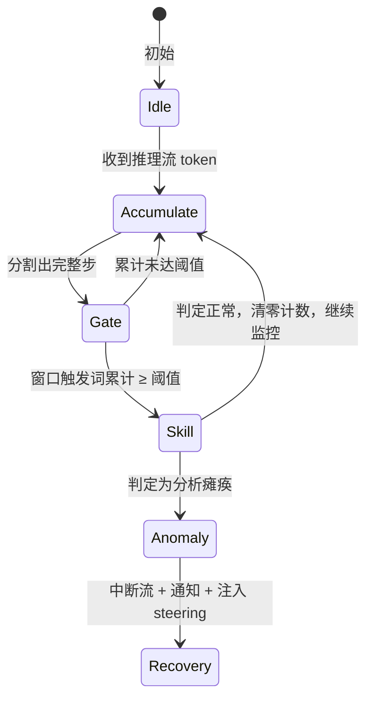
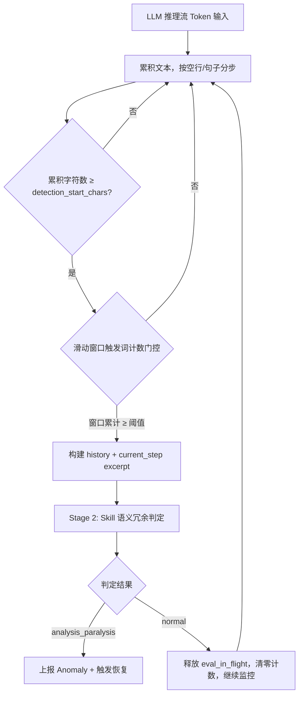
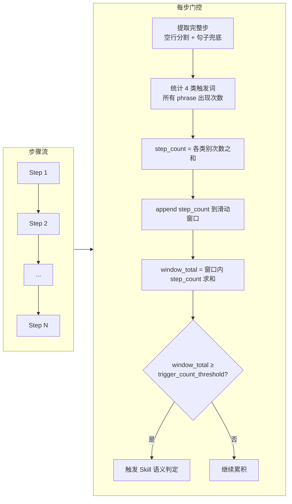
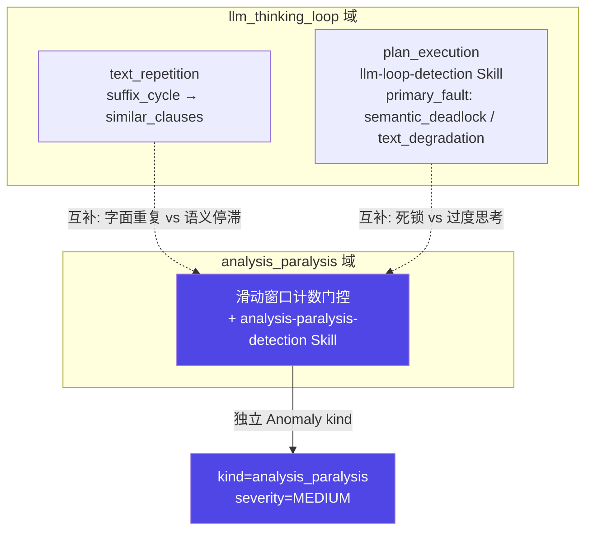
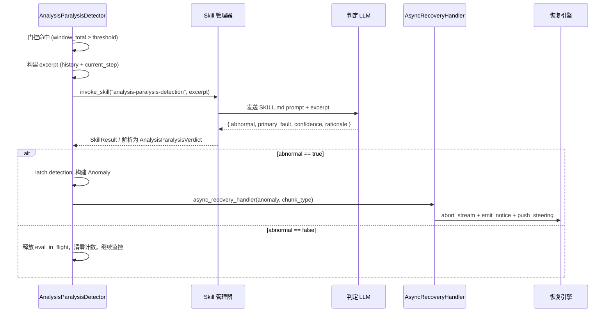
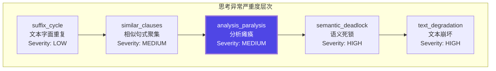
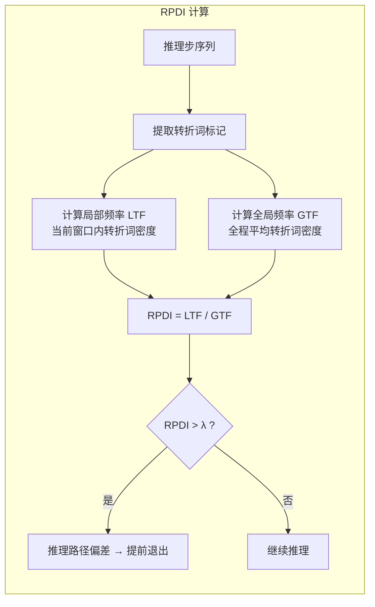
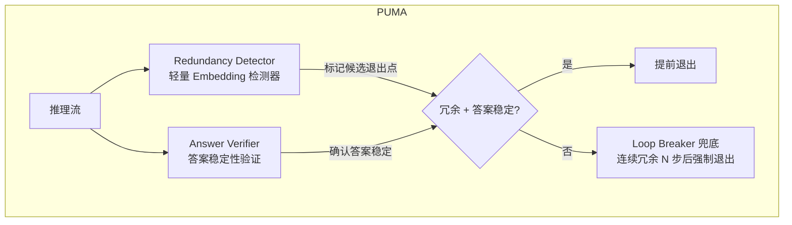

# LLM 过度思考（Analysis Paralysis）检测 — 需求分析与方案

版本：v0.2  
最后更新：2026-08-24

> 文档类型：Phase1 需求分析 + 方案设计（合并） | 关联项目：agent-insight / agent_ras  
> 复杂度：**Medium**（滑动窗口触发词计数门控 + 独立 Skill 语义冗余判定；独立检测域）  
> 关联模块：[agent_ras/detectors/analysis_paralysis.py](../../../../agent_ras/detectors/analysis_paralysis.py)

---

## 一、场景问题

### 1.1 问题定义

**Analysis Paralysis（分析瘫痪）** 是 LLM Agent 在执行任务过程中表现出的一种异常模式：模型在内部反复推演、自我质疑、换说法重复已有结论，但始终没有实质性的推理进展。其关键特征：

- **不是死循环**：经过若干轮重复推理后，agent 最终会自行结束这段冗余思考，不会无限循环
- **语义停滞**：思考内容在语义层面高度相似或循环，但没有引入新信息
- **消耗浪费**：这段时间的 token 消耗和时间开销对任务完成没有贡献

这与现有检测器覆盖的两种异常有明显区别：

| 异常类型 | 特征 | 现有覆盖 |
|---------|------|---------|
| 文本死循环（suffix_cycle） | 相同文本片段字面重复循环 | ✅ `llm_thinking_loop` 已有（`LoopDetector.suffix_cycle`） |
| 语义死锁（semantic_deadlock） | 反复权衡同一批对象，换说法但结论不前进 | ✅ `llm_thinking_loop` 已有（`primary_fault: semantic_deadlock`） |
| **分析瘫痪（analysis paralysis）** | 冗长推理 + 反复自我质疑 + 微弱推进但整体停滞 | ✅ 独立检测域 `analysis_paralysis`（滑动窗口计数门控 + Skill 语义判定） |

> 来源：Cuadron et al., "The Danger of Overthinking" (2025) 将 Analysis Paralysis 定义为三种过度思考模式之首："模型在做出任何环境交互之前，花费过多时间进行内部推演，困在规划阶段迟迟不动手。"

### 1.2 典型表现

以下是一个 analysis paralysis 的典型片段（模拟）：

```
等一下，我需要再仔细想想这个方案...
方案A的优点是可以快速实现，但是可能存在兼容性问题...
方案B更稳健，但开发周期会变长...
嗯，也许我应该重新评估一下需求本身...
如果我选择方案A，需要处理以下几个问题：1) ... 2) ...
但如果选方案B，这些问题就不存在了，但代价是...
让我再想想... 方案A确实是更快的，但兼容性风险...
其实方案B也有它的优势，比如...
我觉得还是应该从需求角度重新梳理...
```

特征：反复在 A/B 之间摇摆，每次都在"等一下""让我再想想""重新梳理"之后回到相同的论点上，虽然有文字推动但语义实质未前进。

### 1.3 影响范围

- **Token 浪费**：冗余推理通常占正常推理量的 40-60%（参考 EMNLP 2025 "Answer Convergence" 研究，CoT 中约 40% 的推理步骤是冗余的）
- **延迟增加**：ROM 论文报告去除过度思考可减少 46.5% 的 wall-clock 延迟
- **用户体验恶化**：用户等待一段没有产出的思考时间
- **成本增加**：o1-high vs o1-low 的价差可达 $600/任务（Cuadron et al. 数据）

---

## 二、业务价值

### 2.1 定量收益

| 维度 | 预期效果 | 数据来源 |
|------|---------|---------|
| Token 节省 | 减少 20-55% 冗余思考 token | REFRAIN (ACL 2026) |
| 延迟降低 | 减少 46.5% wall-clock 延迟 | ROM (arxiv 2603.22016) |
| 准确率 | 不降低甚至略提升（+1-3pp） | ROM / REFRAIN / PUMA |
| 成本节省 | 每个任务可减少 20-43% 计算成本 | Cuadron et al. (2025) |

### 2.2 定性价值

- 让用户感知到 agent 的可靠性提升（不会"发呆"）
- 为 agent-insight 平台的 RAS 能力增加一个可量化的检测维度
- 与现有 `llm_thinking_loop` 域形成完整的思考异常检测覆盖：死循环 / 语义死锁 / 过度思考

---

## 三、解决方案



状态流转说明：

| 迁移 | 触发条件 | 含义 |
|------|---------|------|
| Idle → Accumulate | `stream_text` | 收到推理流首块 token，进入累积态 |
| Accumulate → Gate | `step_complete` | 累积文本按空行/句子分割出一个完整步，送入门控 |
| Gate → Skill | `window_total ≥ threshold` | 滑动窗口内触发词累计出现次数达到阈值（默认 10），触发 Skill 语义判定 |
| Gate → Accumulate | `below_threshold` | 窗口内触发词累计未达阈值，继续累积下一步 |
| Skill → Anomaly | `abnormal` | Skill 判定当前步相对 history 语义停滞，上报异常 |
| Skill → Accumulate | `normal` | Skill 判定正常，释放 eval_in_flight 锁，清零窗口计数，继续监控 |
| Anomaly → Recovery | `abort_stream + notice + steering` | 中断推理流 → 通知用户 → 注入 steering prompt 收敛推理 |

### 3.1 总体架构

采用 **滑动窗口触发词计数门控 + Skill 语义冗余判定**，先快后准：



核心门控逻辑（滑动窗口触发词累计计数）：

- **per_step_count** = 当前步中 4 类触发词所有 phrase 的出现次数总和
- **window_total** = 最近 `history_steps` 步的 per_step_count 累计
- **gated** = `window_total ≥ trigger_count_threshold`（默认 10）— 累计达阈值才触发 Skill

### 3.2 Stage 1：滑动窗口触发词计数门控

#### 3.2.1 触发词分类体系

直接引用 REFRAIN（ACL 2026）Appendix A 的 4 类触发词（中英文双语），不新增类别：

| 类别 | 语义含义 | 英文示例 | 中文示例 |
|------|---------|---------|---------|
| **Self-Check**（自我复核） | 主动暂停推理进行验证 | `wait` `let me check` `hold on` `is that correct` `let me double check` | `等一下` `让我检查` `稍等` `再确认一下` `这样对吗` |
| **Strategy Shift**（策略摇摆） | 在多个方案之间反复切换 | `alternatively` `let me try` `what if we try` `let's think from a different angle` | `换一个思路` `让我试试` `另一种方法` `换个角度看` |
| **Uncertainty**（不确定性表达） | 持续的犹豫和不确定 | `not sure` `looks like` `hmm` `perhaps` `maybe i` `i'm not certain` | `不太确定` `好像` `似乎` `也许` `我猜` |
| **Retrospective**（回溯重述） | 回到已经讨论过的点重新开始 | `earlier we saw` `recall that` `let me go back` `as we established previously` | `回到之前` `前面提到` `回想一下` `让我回去` |

> 注：RPDI-EE 的"转折词异常高频"（transition spikes）思路未纳入实现。REFRAIN 原文亦未设此类别。代码注释明确标注 4 类为 REFRAIN Appendix A 的直接引用，中文为同义翻译，非新增 taxonomy。

#### 3.2.2 配置结构

实际配置由 Pydantic 模型 `TriggerVocabConfig` + `AnalysisParalysisConfig` 定义（[analysis_paralysis.py:160-198](../../../../agent_ras/detectors/analysis_paralysis.py)），YAML 落盘见 [agent_ras_config.default.yaml](../../../../agent_ras/config/agent_ras_config.default.yaml)：

```yaml
agent_ras:
  detectors:
    analysis_paralysis:
      enabled: true
      semantic_content_enabled: true      # Skill 语义判定开关
      detection_start_chars: 500          # 累积到此字符数后开始门控
      history_steps: 8                    # 滑动窗口步数 + 送入 Skill 的历史步数
      history_max_chars: 6000             # Skill payload 总字符上限
      trigger_count_threshold: 10         # 窗口内触发词累计达此值才触发 Skill
      # trigger_vocab 使用内置默认值，通常不覆盖
```

```python
class TriggerVocabConfig(BaseModel):
    self_check: list[str]       # 默认 _VCHECK_EN + _VCHECK_ZH
    strategy_shift: list[str]  # 默认 _VSHIFT_EN + _VSHIFT_ZH
    uncertainty: list[str]     # 默认 _VUNCERT_EN + _VUNCERT_ZH
    retrospective: list[str]  # 默认 _VRETRO_EN + _VRETRO_ZH

class AnalysisParalysisConfig(BaseModel):
    enabled: bool = True
    semantic_content_enabled: bool = True
    detection_start_chars: int = 500
    history_steps: int = 8
    history_max_chars: int = 6000
    trigger_vocab: TriggerVocabConfig = TriggerVocabConfig()
    trigger_count_threshold: int = 10  # 窗口内触发词累计达此值才触发 Skill
```

#### 3.2.3 滑动窗口计数门控算法



关键实现细节（[analysis_paralysis.py:337-388](../../../../agent_ras/detectors/analysis_paralysis.py)）：

- **分步**：优先按空行（`\n\s*\n`）分割完整步；剩余文本超过 400 字符时按句号兜底分句
- **计数**：对当前步做 4 类触发词所有 phrase 的 case-insensitive 完整计数（`count_phrase_hits`）；短 ASCII token 使用 word boundary + `re.findall` 计数，长 phrase 用 `str.count`
- **滑动窗口**：维护最近 `history_steps` 步（默认 8）的 per-step 计数列表，超出窗口自动淘汰最旧步
- **触发**：`gated = window_total ≥ trigger_count_threshold`（默认 10）— 窗口内累计达阈值才触发 Skill
- **清零**：Skill 调用完成后（无论结果异常/正常/fail-open），在 `finally` 块中调用 `gate.reset_count()` 清空窗口计数，重新累积

#### 3.2.4 与 llm_thinking_loop 检测域的关系

`analysis_paralysis` 是**独立检测域**，不挂在 `llm_thinking_loop` 下，不复用 `llm-loop-detection` Skill 通道：



两域的区别：`llm_thinking_loop` 覆盖文本字面重复（suffix_cycle / similar_clauses）和语义死锁（semantic_deadlock / text_degradation）；`analysis_paralysis` 覆盖"有文字推进但语义停滞"的过度思考模式。`overthinking` 标签已从 `llm_thinking_loop` 的 `ThinkingLoopFault` 枚举和 Skill 中移除，由 `analysis_paralysis` 域独立承接。

### 3.3 Stage 2：Skill 语义冗余判定

门控命中后（窗口内触发词累计 ≥ 阈值），将 history + current_step 构建 excerpt 送入独立 Skill `analysis-paralysis-detection` 做语义判定。

#### 3.3.1 判定 Skill 定义

完整 Skill 定义见 [agent_ras/detectors/skills/analysis-paralysis-detection/SKILL.md](../../../../agent_ras/detectors/skills/analysis-paralysis-detection/SKILL.md)。核心判定标准：

**analysis_paralysis（分析瘫痪）：**
- 反射（再检查 / 换思路 / 不确定 / 回溯）之后，相对 history 没有引入新信息、新约束或新否决条件
- 在同一组选项/方案之间反复摇摆，没有做出选择，也没有缩小选项集
- 冗长自我复核与论证铺陈，整体推理停滞（Cuadron: 困在规划阶段迟迟不与环境交互）

**none（正常）：**
- 当前步引入了新信息、缩小了选项，或明确给出下一步/结论
- 偶发复核但不占主导
- 渐进式推进（逐个排查文件、逐步缩小搜索范围、按清单往下做）不算分析瘫痪，即使文字较长

**输出格式（4 字段，非草稿版的 6 字段）：**

| 字段 | 类型 | 必填 | 说明 |
|------|------|------|------|
| `abnormal` | boolean | 是 | 是否分析瘫痪 |
| `primary_fault` | string | 是 | `analysis_paralysis` / `none` |
| `confidence` | number | 否 | 0.0–1.0 |
| `rationale` | string | 否 | 简短判定理由 |

> 与草稿版差异：草稿版含 `trigger_patterns` 和 `stall_duration_estimate`，实现版已移除。`primary_fault != "none"` 时必须 `abnormal: true`，由 `AnalysisParalysisVerdict.model_post_init` 强制校验。

#### 3.3.2 判定流程图



恢复动作（[recovery/analysis_paralysis.py](../../../../agent_ras/recovery/analysis_paralysis.py)）：

1. **abort_stream** (`SUPPRESS_STREAM`)：中断当前推理流输出
2. **emit_notice**：向用户发送"检测到过度思考（分析瘫痪）异常，已执行恢复操作"
3. **push_steering**：注入 steering prompt，要求收敛推理、直接给出当前最佳结论与最简下一步

> 注：草稿版描述为 `inject_steering`，实际恢复引擎执行 `abort_stream` + `emit_notice` + `push_steering` 三个动作。

### 3.4 与现有异常 severity 的关系



### 3.5 数据模型

#### 3.5.1 Anomaly kind

`analysis_paralysis` 作为独立 anomaly kind 注册，不在 `AnomalyKind` 枚举中新增（当前分支 kind 为字符串常量）：

```python
# agent_ras/detectors/analysis_paralysis.py
FAULT_DOMAIN_ANALYSIS_PARALYSIS = "analysis_paralysis"
KIND_ANALYSIS_PARALYSIS = "analysis_paralysis"
```

#### 3.5.2 独立 verdict 枚举

`analysis_paralysis` 有自己的 verdict 枚举 `AnalysisParalysisFault`，不在 `ThinkingLoopFault` 中：

```python
# agent_ras/detectors/analysis_paralysis.py
class AnalysisParalysisFault(str, Enum):
    NONE = "none"
    ANALYSIS_PARALYSIS = "analysis_paralysis"
```

> 注：`ThinkingLoopFault` 已移除 `OVERTHINKING` 枚举值，不再含 `ANALYSIS_PARALYSIS`。两域的 verdict 类型完全独立。

#### 3.5.3 Anomaly evidence 示例

实际 evidence 字段（[analysis_paralysis.py:672-695](../../../../agent_ras/detectors/analysis_paralysis.py)）：

```json
{
  "mode": "analysis_paralysis",
  "channel": "refrain_gate",
  "source": "refrain_gate",
  "recovery_profile": "analysis_paralysis",
  "needs_l3_review": false,
  "steer_key": "analysis_paralysis_steering_recovery",
  "notice_key": "analysis_paralysis_recovery_user_notice",
  "chunk_type": "llm_reasoning",
  "buffer_len": 4520,
  "trigger_hits": {"self_check": 6, "strategy_shift": 2, "uncertainty": 3, "retrospective": 1},
  "window_hit_count": 12,
  "trigger_count_threshold": 10,
  "thinking_excerpt": "等一下，我需要再仔细想想...",
  "excerpt": "## history\n...\n\n## current_step\n等一下...",
  "skill_name": "analysis-paralysis-detection",
  "fault_domain": "analysis_paralysis",
  "primary_fault": "analysis_paralysis",
  "skill_rationale": "反射后仍在同一组 A/B 利弊上换说法，未缩小选项也未给出下一步",
  "skill_confidence": 0.86,
  "stream_chunk_keep_len": 0
}
```

> `trigger_hits` 为各类别命中次数的 dict；`window_hit_count` 为滑动窗口内所有步的触发词累计次数；`trigger_count_threshold` 为触发 Skill 的阈值。

---

## 四、参考业界做法

### 4.1 REFRAIN — 反射冗余二阶段判别

**来源**：ACL 2026 long, "Stop When Enough: Adaptive Early-Stopping for Chain-of-Thought Reasoning"

**核心思想**：不在推理过程中打断模型，而是维护一个滑动窗口，监控当前推理步与前序步的语义相似度。当相似度过高 + 已有 provisional answer + 含反射触发词时，判定冗余。

```mermaid
flowchart TD
    subgraph REFRAIN流程
        A[LLM 逐步推理输出] --> B[提取当前步骤]
        B --> C{Stage 1: 含反射触发词?<br/>rn = I(trigger ⊆ step)}
        C -->|否| A
        C -->|是| D{已提出 provisional answer?<br/>h}
        D -->|否| A
        D -->|是| E[Stage 2: 计算语义相似度 ϕn]
        E --> F{相似度 > 阈值τ?}
        F -->|是| G[提前停止推理]
        F -->|否| A
    end
    
    subgraph 自适应阈值
        H[SW-UCB Bandit Controller]
        H -->|动态调整| F
    end
```

> 注：REFRAIN 原文用 rn（二值，"当前步含不含触发词"）+ h（"历史步含不含 provisional cue"）双门控。本方案改为滑动窗口内触发词**累计出现次数** ≥ 阈值，去掉了 h 门，以减少单次触发词命中就误调 Skill 的误报率。

**与本方案的关系**：REFRAIN 的触发词分类体系（Self-Check / Strategy Shift / Uncertainty / Retrospective 四类，Appendix A）是本方案 Stage 1 门控的直接参考来源。本方案直接引用全部 4 类，未新增类别。与 REFRAIN 的差异在于：REFRAIN 用 rn（二值，"有没有触发词"）+ h（provisional cue 门）双门控，本方案改为滑动窗口内触发词累计计数（统计"出现了多少次"），去掉了 provisional cue 门，Stage 2 用 LLM Skill 做语义冗余判定替代 MiniLM cosine 相似度。

### 4.2 RPDI-EE — 推理路径偏差指数

**来源**：arxiv 2603.14251, "Reasoning Path Deviation Index for Early Exit"

**核心思想**：过度思考时，模型会出现异常高频的转折词（"Wait", "But", "Alternatively"）。通过计算局部转折词频率与全局频率的比值（RPDI），可以检测推理路径是否偏离正常轨道。



**与本方案的关系**：RPDI-EE 的"过渡转折词"（"Wait", "But" 等）研究在方案设计初期曾考虑纳入触发词库（`transition_spikes` 类别），但最终实现未采用——REFRAIN Appendix A 的 4 类已足够覆盖，且 RPDI-EE 的转折词与 REFRAIN Self-Check 类高度重叠。该研究对本方案的参考价值主要在"转折词异常高频"这一信号特征的理论支撑。

### 4.3 PUMA — 语义保留型提前退出

**来源**：arxiv 2605.17672, "Stop When Reasoning Converges: Semantic-Preserving Early Exit"

**核心思想**：将"在哪考虑停止"和"是否真的应该停止"解耦。冗余检测器标记候选退出点，答案验证器确认答案稳定性。



**与本方案的关系**：同为二阶段级联检测架构（粗筛→精判），但实现路线不同——PUMA 用 fine-tune 的专用 Embedding 模型做语义冗余判定，本方案用触发词预筛 + 通用 LLM 语义判定。其"在哪停止"和"是否真的该停止"的解耦思想，以及 Loop Breaker 兜底机制，在架构思路上对本方案有参考价值。

### 4.4 与本方案的对比总结

| 维度 | REFRAIN | RPDI-EE | PUMA | **本方案** |
|------|---------|---------|------|-----------|
| 检测层级 | 二阶段（触发词+语义相似度） | 单阶段（频率比） | 二阶段（冗余检测+答案验证） | **二阶段（滑动窗口计数门控+LLM 语义）** |
| 额外模型 | all-MiniLM-L6-v2 (~80MB) | 无（仅 logits） | Qwen3-Embedding-0.6B | **判定用已有 LLM API** |
| 自适应阈值 | SW-UCB Bandit | 固定 λ | 固定阈值 | **LLM 语义理解自然适应** |
| 误判风险 | 低（二阶段把关） | 中（单阶段） | 低 | **最低（LLM 理解上下文）** |
| 接入复杂度 | 中 | 低 | 高 | **中（独立 Skill 通道）** |

---

## 五、参考文献

本方案方法步骤直接参考以下工作：

1. **Cuadron, A., et al.** "The Danger of Overthinking: Examining the Reasoning-Action Dilemma in Agentic Tasks." arXiv:2502.08235, Feb 2025. https://arxiv.org/abs/2502.08235
   - 首次系统定义 agentic 场景下的 Analysis Paralysis（分析瘫痪），作为本方案的问题定义来源。

2. **"Stop When Enough: Adaptive Early-Stopping for Chain-of-Thought Reasoning (REFRAIN)."** ACL 2026 long. https://aclanthology.org/2026.acl-long.1256.pdf
   - 定义 Self-Check / Strategy Shift / Uncertainty / Retrospective 四类触发词（Appendix A），本方案触发词全部 4 类直接引自该文。与 REFRAIN 的差异在于：REFRAIN 用 rn（二值）+ h（provisional cue）双门控，本方案用滑动窗口内触发词累计计数门控（去掉 h 门，改为统计密度），Stage 2 用 LLM Skill 替代 MiniLM cosine 相似度。

3. **"Reasoning Path Deviation Index for Early Exit (RPDI-EE)."** arXiv:2603.14251, 2025. https://arxiv.org/abs/2603.14251
   - 识别过度思考时转折词（"Wait", "But" 等）异常高频出现的模式，定义 RPDI = LTF/GTF 偏差指标。本方案在设计阶段曾参考其"转折词异常高频"思路（`transition_spikes` 类别），但最终实现未纳入，仅采用 REFRAIN 的 4 类触发词。

---

## 六、其他相关方案

以下工作在过度思考检测上与本研究同属一个大方向，但采用不同的技术路线（hidden state 检测、答案一致性、entropy 信号、训练侧优化等），与本方案的触发词+LLM 二阶段路线不直接重叠。此处梳理备查。

### 6.1 推理时检测与干预

| 方案 | 论文 | 技术路线 | 与本方案的差异 |
|------|------|---------|--------------|
| **PUMA** | arXiv:2605.17672 (2025.05) | fine-tune Embedding 模型做冗余检测 + 答案验证器解耦 + Loop Breaker 兜底 | 同为二阶段架构但检测手段不同：PUMA 用专用 Embedding 模型做语义冗余判断，本方案用触发词+LLM 语义判定 |
| **ROM** | arXiv:2603.22016 (2025.03) | 在 frozen LLM late-layer hidden state 上挂检测头，流式判断 token 级过度思考信号 | 需要模型白盒访问 hidden states；本方案纯黑盒，仅依赖输出文本 |
| **TACT** | arXiv:2605.05980 (2025.05) | 在 residual stream 中构造过度思考偏移轴，activation steering 实时修正 | 需要模型白盒 + 离线标注；本方案无需动模型参数 |
| **The Evolution of Thought** | ACL 2026 long | 监控 `` token 概率 rank 骤降，用 RCPD 决策树检测推理完成点 | 依赖 logits 访问；本方案无需 logits |
| **EAT** | OpenReview 2025 | 在每个推理行后追加 ``，监控该单 token 的熵，EMA 方差稳定时退出 | 需 logits 访问；黑盒场景需 proxy 模型 |
| **Entropy Trajectory Shape** | arXiv:2603.18940 (2025.03) | 熵轨迹单调性预测正确性（单调下降链 68.8% vs 非单调链 46.8%） | 监测信号而非触发词；可作为辅助诊断信号 |

### 6.2 基于语义相似度与答案一致性

| 方案 | 论文 | 技术路线 | 与本方案的差异 |
|------|------|---------|--------------|
| **Reconsidering Overthinking (IRD)** | arXiv:2508.02178 (2025.08) | 滑动窗口 embedding cosine 相似度（IRD）衡量局部语义停滞 | 纯 Embedding 相似度计算，无触发词预筛；本方案先用触发词缩小范围再送 LLM 判定 |
| **Answer Convergence** | EMNLP 2025 | 多轮 answer extraction + 连续 N 轮答案不变即判定收敛 | 依赖能稳定 extract answer 的场景（如数学推理）；本方案不依赖 answer extraction |

### 6.3 训练侧优化

| 方案 | 论文 | 技术路线 | 与本方案的差异 |
|------|------|---------|--------------|
| **DEPO** | arXiv:2510.15374 (2025.10) | RL 训练时对过度思考段降权 gradient，解耦 advantage 计算 | 训练侧修复，本方案明确不涉及训练 |
| **Thinkless** | arXiv:2505.13379 (2025.05) | 两个 control token 让模型自主选择短/长推理模式 | 训练侧，减少不必要思考 50-90%；本方案不涉及训练 |

### 6.4 工程实践

| 方案 | 出处 | 技术路线 | 与本方案的差异 |
|------|------|---------|--------------|
| **Degenerate Output Detection** | Agent Patterns Catalog | Ring Buffer（最近 8 条输出）+ Jaccard token overlap ≥0.7 判定重复 + escalation | 针对输出端重复，非推理阶段过度思考检测 |
| **AlexCuadron/Overthinking** | GitHub 开源 | LLM-as-judge 对 trajectory 打分 0-10（含 analysis_paralysis 指标），用于离线和后处理选优 | 评估框架而非在线检测器，但 scoring logic 可为本方案 Skill prompt 设计提供参考 |

> 故障注入技术调研（AutoTransform/AutoInject、MAS-FIRE 深度拆解）已移至独立文档：[semantic-fault-injection-survey.md](../../../agent-fault-injection/designs/modules/semantic-fault-injection-survey.md)
