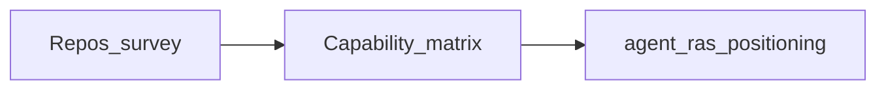
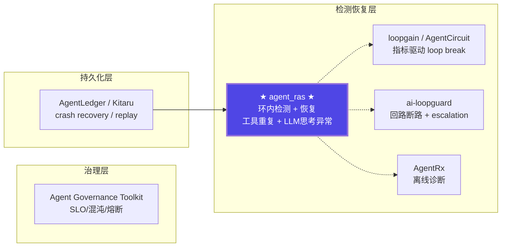

# 开源生态调研（已完成）

对照开源检测/恢复仓库，产出能力矩阵与定位。

---

# Agent 可靠性开源生态调研报告

版本：v0.1  
最后更新：2026-07-29

> 文档类型：调研报告 | 关联项目：agent-insight / agent_ras  
> 调研范围：与 agent_ras 可对照的 agent 检测/恢复/可靠性开源仓库（不含安全审计类）

---

## 概述

---

## 一、与 agent_ras 直接可对照的开源仓库

这些仓库与 agent_ras 最接近 —— 都是在 agent 运行时做**异常检测 + 自动恢复**，而非单纯的观测或安全审计。

### 1.1 ai-loopguard（~50 stars）

回路断路器 + escalation 库，框架无关、drop-in。用 `@guard.protect` 装饰器包裹 agent step，靠 3 种 trigger 判定卡死：`test_failure`（同一测试通过→失败→通过反复）、`repeated_error`（同一异常连续 N 次）、`schema_invalid`（输出 schema 校验连续失败 N 次），并支持自定义回调。命中后打包"试过什么/失败什么"上下文，escalation 到更强模型让它"break the loop"，并记录成本事件。关键 API：`Guard(escalation_model, workhorse_model_name, triggers)`、`guard.record_test_results()`、`guard.reset()`；集成 LangGraph callback handler 与 CrewAI step wrapper。跟踪 escalation rate / cost per completed task / routing vs failover，区分"主动路由"与"可用性失败"。

**与 agent_ras 对照**：对应 `RepeatToolCallDetector` + `RecoveryPolicy`（escalation）。agent_ras 额外覆盖 LLM 思考异常，且恢复手段不止 escalation（suppress/abort/steer）。

### 1.2 loopgain（~40 stars）

控制论驱动的 loop 收敛检测器，替代固定 `max_iterations`。核心基于 Barkhausen criterion（电子工程反馈振荡器分析），实时测量 loop 的 Aβ loop-gain bands：收敛即停、质量退化前 rollback 到 best-so-far。三行接入：`LoopGain(target_error=0.1)` + `lg.should_continue()` 循环。明确边界——检测 *convergence* 而非 *correctness*，效果取决于 verifier 提供的 error signal 质量。预置 LangGraph/CrewAI/AutoGen/LangChain/OpenAI Agents SDK/Claude Agent SDK 适配，并提供 Claude Code plugin 自动扫描仓库里可包裹的 loop（literal/recursive/graph-cycle/semantic）逐文件提 diff。自带 benchmark：对比 `max_iter=20` 省 92.8% API spend、约 15× 更快。

**与 agent_ras 对照**：对应 loop 检测 + 恢复，但纯指标驱动（控制理论），不带语义判定；agent_ras 的 L3 文本/语义检测是其不具备的维度。

### 1.3 AgentCircuit / AgentFuse（~30 stars）

单装饰器 `@reliable()` 串起 4 个组件：**Budget**（per-node dollar/time + 跨节点 GlobalBudget）→ **Fuse**（state hashing 循环检测，同输入 3+ 次判死循环）→ 运行函数 → **Pricing**（40+ 模型定价表算成本）→ **Sentinel**（Pydantic schema 校验）→ 失败时 **Medic**（用 LLM 重新生成符合 schema 的输出，最多 2 次再抛原错，杜绝静默失败）。零配置、无 server、无 DB，纯装饰器；适配 LangGraph/LangChain/CrewAI/AutoGen。错误类型区分 `BudgetExceededError`/`TimeoutExceededError`/`LoopError`，traces 可落 SQLite 持久化。

**与 agent_ras 对照**：对应 `RepeatToolCallDetector` + `RecoveryEngine`。AgentCircuit 的 Medic 是"输出级 LLM 修复"，agent_ras 额外有 LLM 思考异常检测和流式恢复（截断/中止/steering）。

### 1.4 reivo-guard（~15 stars）

`Guard` 类 before/after 钩子，TS + Python 双语言实现，纳秒级开销。循环检测双轨：**Hash**（SHA-256 滑窗匹配，同 prompt N 次判 loop）+ **Semantic**（TF-IDF cosine 相似度）。异常检测用 EWMA z-score（token 量突增）+ CUSUM drift（Page's algorithm，Python 独有）+ N-gram cycle（Python 独有）。预算执行支持 per-user/agent/session，配 4 级优雅降级（50%/85%/96%/100% → normal/aggressive/new_sessions_only/blocked），并用 OLS 回归预测预算耗尽时间。质量验证走 logprobs（OpenAI/Gemini）+ LLM-as-Judge（Anthropic）。1 行接入 LiteLLM callback，或 LangChain/LangGraph/CrewAI handler。

**与 agent_ras 对照**：检测方法互补——reivo 用统计信号（z-score/CUSUM/TF-IDF），agent_ras 用文本/语义分析；reivo 的 4 级降级和预算预测是 agent_ras 未做的成本侧能力。

### 1.5 SpecOps AI（~20 stars）

OTel-native 可靠性工具包，SDK 层（trace/eval/replay/heal/simulate）+ OTel 协议 + 任意 OTel backend。装饰器 `@trace_agent`/`@trace_tool`/`@trace_llm` 产出 span；`@replayable` + `recording()`/`replaying()` 实现确定性重放，可导出 JSON 分享。**Health Score** 把 loop_rate/consensus/self_healing/chaos_resilience 合成 0-100 分 + grade。**Self-Healing** 用 RetryPolicy/FallbackPolicy/escalation/memory pruning。**Simulation Sandbox** 测 loop/budget/cascade；**Chaos** 注入 hallucination/loop/drift 验证自愈；**Regression** 录 golden run 检行为漂移。多智能体侧有 `check_consensus`（quorum）/`check_divergence`（edit distance）/`check_memory_integrity`；RCA 从 OTel spans 构因果图导 Graphviz DOT。

**与 agent_ras 对照**：覆盖检测+恢复全链路，但以 OTel 观测为基础、事后/沙箱为主，非环内实时拦截；agent_ras 的 inproc 环内拦截和流式恢复是其不具备的。

### 1.6 Ojas（~10 stars，仓库已不可访问）

> ⚠️ 该仓库（`beingmartinbmc/ojas`）截至本次复核已 404，疑似删除或改名（作者后续仓库 `jambavan` 转向 MCP 持久化记忆方向）。下文为 2026-07-29 快照描述，仅供参考。

持续健康层：drift/loop/unstable 检测 → 诊断 → 恢复协议推荐，定位为 12 步全生命周期（ingest→scan→detect→diagnose→recover→consolidate→audit→handoff）。

**与 agent_ras 对照**：设计理念最接近——都是"检测+诊断+恢复"完整闭环。agent_ras 更轻量（环内），Ojas 更重（全生命周期）。

### 1.7 microsoft/AgentRx（131 stars）

微软出品的离线诊断框架（非实时拦截），pipeline：`Raw logs → Trajectory IR → Invariants → Checker → Judge → Reports`。**Invariants** 分 static（policy/tool/structure）与 dynamic（per-step context-aware）两类；**Checker** 逐步评估 invariant 违反并记证据；**Judge** 用 LLM 把故障分类到 10 类 taxonomy（Instruction/Plan Adherence、Invention of New Information、Invalid Invocation、Misinterpretation of Tool Output、Intent-Plan Misalignment、Underspecified Intent、Intent Not Supported、Guardrails Triggered、System Failure、Inconclusive），并定位 *critical failure step*。覆盖 Tau-bench / Flash / Magentic-One 三域，附 HuggingFace 数据集与论文（arXiv:2602.02475）。

**与 agent_ras 对照**：对应 agent_ras 离线诊断方向（如 L3 Reviewer）。agent_ras 额外有在线检测和恢复；AgentRx 的 10 类 taxonomy 可作为 agent_ras 故障分类的参照。

---

## 二、更广范围的对照

### 2.1 诊断/观测层（检测为主，恢复为辅）

#### agentomaly（包名 spectra）

OTel 行为画像 + 运行时异常检测。先用 `ProfileTrainer` 从历史 traces 训练 `BehavioralProfile`（含 Markov 模型），运行时 `Monitor` 按 sensitivity（z-score 阈值 1.5–4.0）跑 6 种检测器：**Tool Sequence**（Jensen–Shannon 散度 + Markov 转移概率，捕 novel 转移/低概率序列/loop）、**Cost Spike**（rolling z-score）、**Latency Regression**（Welch's t-test，P50/P95/P99）、**Output Distribution**（KL divergence on 长度+词表）、**Retry Storm**（Shewhart 控制图 3σ）、**Hallucination Rate**（Bernoulli CUSUM on postcondition 失败率）。响应策略 log/alert/quarantine/block 四级；CLI 支持 `train`/`analyze`/`compare`（profile drift 作 rollout 门）/`trend`（异常是否恶化）/`dashboard`。集成 OTel backend、Slack、PagerDuty、LangGraph、MCP。

#### AgentTelemetry

OTel-based 观测，定义 9 种 agent 专用 span kind（AGENT / LLM_CALL / TOOL_CALL / PLANNING / REASONING / RETRIEVAL / GUARD_RAIL / DELEGATION / MEMORY），配 7 个框架自动 instrument 适配器（LangChain/CrewAI/AutoGen/Anthropic/OpenAI/LlamaIndex/custom，策略含 callback/hook/monkey-patch/span handler）。3 级隐私（NONE / METADATA_ONLY / FULL）控制是否捕获 prompt/completion。4 个分析模块：**AnomalyDetector**（循环委派、无限重试、成本爆炸、上下文溢出）、**CostAggregator**（按 model/agent/trace 聚合 USD）、**DecisionAttributor**（把 tool call 回溯到触发它的 LLM 决策）、**HallucinationTracer**（token-overlap 启发式找无检索依据的输出）。附 AIware 2026 论文与 14 故障类 benchmark（FDR 0.612，DSM 元模型上限 1.0）。

### 2.2 持久化执行层（关注 crash recovery / replay）

#### AgentLedger

运行时可靠性层，位于 harness 之下，不替代 LangChain/LangGraph 等而是补其缺口。核心 **Tool Ledger** 把每次工具调用入账，保证幂等与重试安全（防 duplicate side effect，worker crash 后能安全重放）。**evidence-driven replay** 让任意 run 可从 checkpoint 重放；policy/approval/sandbox 边界在账本上强制；cost/failure attribution 把成本与故障归到具体 step。存储 SQLite/Postgres/MySQL；Python 为参考实现，Go/TS/Rust 有对齐同一运行时契约的 native baseline（共享 conformance gate）。适配 LangChain/LangGraph/CrewAI/AutoGen/OpenAI Agents SDK/LlamaIndex/Semantic Kernel；Inspector 导出只读 HTML 供本地调试。

#### Overseer

多智能体可靠运行时，核心理念是"质量门控内嵌运行时而非事后补"。`Process` 把每步建成图节点，**verifier 是 first-class node**（`@process.verifier(after=, retry=3)` 返回 `VerifierResult` pass/fail）；每次 attempt 都 snapshot，自检失败时 pause 等人工而非假装通过。配 Retry/Halt 策略、retry-from-any-node、UI + REST + WebSocket、SQLite 持久化与 time-travel。`openai_compatible` adapter 接任意 OpenAI 兼容端点。

#### Kitaru（ZenML 团队）

持久化执行运行时，`@flow` + `@checkpoint` 两装饰器，Python-first 无 graph DSL。每步（model call/tool call/decision）记为可重放 checkpoint 到自有对象存储，支持 **replay with overrides**（换模型/参数/工具输出做 what-if）。**Crash recovery**：崩溃/驱逐/超时后从 checkpoint 恢复，已完成 checkpoint 返回缓存输出不重烧 token。`kitaru.wait()` 暂停-释放计算-恢复（HITL，可跨小时/天）；`flow.deploy()` 冻结为版本快照按名调用（tag 回滚，调用方无需 redeploy）；`@checkpoint(runtime="isolated")` 把重/险步隔离到独立 pod/job。适配 PydanticAI/OpenAI Agents SDK/Anthropic SDK；自托管 + 内置 UI。关注"不丢状态"而非"检测异常"。

### 2.3 治理层

#### microsoft/agent-governance-toolkit（1K+ stars，微软出品）

完整治理套件，核心理念是"不在 prompt 内赢，而在 wire 前用确定性代码拦截——被拒动作结构上不可能"。四大组件：**Agent OS**（策略引擎，每个 tool call / message send / delegation 在到达 wire 前被确定性拦截）、**AgentMesh**（零信任身份，多 agent 共享 API key 时仍可追溯到具体 agent）、**Agent SRE**（SLO / 混沌 / 熔断 / 成本护栏）、**Agent Runtime**（沙箱隔离）。`pip install` 一键接入任意框架，提供 PyPI / npm / NuGet 三语言 SDK，覆盖 10/10 OWASP Agentic Top 10、AARM Extended R1–R9、ATF All 5 Elements；支持作为 Claude Code plugin marketplace 安装。Public Preview 阶段。

---

## 三、对照总结：agent_ras 的独特定位

### 3.1 架构全景

### 3.2 能力矩阵对照

| 能力维度 | agent_ras | ai-loopguard | loopgain | AgentCircuit | reivo-guard | Ojas | AgentRx | agentomaly |
|----------|:---:|:---:|:---:|:---:|:---:|:---:|:---:|:---:|
| 工具重复调用检测 | ✅ | ✅ | — | ✅ | — | — | — | — |
| LLM 文本死循环（字面重复） | ✅ | — | — | — | ✅ (hash) | ✅ | — | — |
| LLM 语义死锁检测 | ✅ | — | — | — | ✅ (TF-IDF) | ✅ | — | — |
| LLM 过度思考（overthinking） | ✅ | — | — | — | — | ✅ | — | — |
| 多级分层（L1/L2/L3） | ✅ | — | — | ✅ (Fuse/Medic/Sentinel) | — | — | — | — |
| 流式恢复（suppress/abort） | ✅ | — | — | — | — | — | — | — |
| 文本注入恢复（steering） | ✅ | — | — | ✅ (Medic LLM修复) | — | ✅ | — | — |
| 自动 escalation | — | ✅ | — | — | — | — | — | — |
| 离线诊断/故障分类 | ✅ (L3 Reviewer) | — | — | — | — | ✅ | ✅ (10类) | ✅ (5种) |
| 多平台适配 | ✅ (3+1) | ✅ (2) | ✅ (6) | ✅ (4) | ✅ (3) | — | — | ✅ (OTel) |
| 嵌入式部署（inproc） | ✅ | — | — | — | — | — | — | — |
| 持久化/Replay | — | — | — | — | — | — | — | ✅ (OTel) |
| 成本/TTL 断路 | — | ✅ | ✅ | ✅ | ✅ | — | — | ✅ |

### 3.3 关键发现

**agent_ras 在所有对照仓库中具有以下独特能力：**

1. **LLM 文本流内思考异常检测**：ai-loopguard / loopgain / AgentCircuit 都只关注工具调用层面的异常。agent_ras 是唯一在 LLM 推理流内同时检测字面重复、语义死锁、过度思考的仓库。

2. **环内流式恢复**：suppress（截断流的输出）+ abort（终止 + 通知用户）+ steer（注入自我修正提示）的组合，在对照仓库中无完全对等实现。AgentCircuit 的 Medic 可做 LLM 修复但不截断流。

3. **多级分层检测（L1/L2/L3）**：从文本字面 → 语义 → LLM Skill 判定的递进式检测链，AgentCircuit 有类似的 Fuse/Medic/Sentinel 三层但检测维度不同（工具重复/输出修复/schema）。

4. **detection + recovery + reviewer 全闭环**：Ojas 有类似的完整闭环但更重（12 步生命周期）。agent_ras 的轻量级环内拦截设计使其更适合嵌入式场景（如 OpenCode bun:ffi inproc 模式）。

---

## 四、参考文献

1. **microsoft/AgentRx** — GitHub: https://github.com/microsoft/AgentRx | MIT License | 131 stars | 2026-03
   - 自动化 agent 故障诊断框架，LLM-judge + structured invariant 评估。

2. **deghosal-2026/ai-loopguard** — GitHub: https://github.com/deghosal-2026/ai-loopguard | 2026
   - Agent 回路断路器，检测卡死模式后 escalation 到更强模型。

3. **loopgain-ai/loopgain** — GitHub: https://github.com/loopgain-ai/loopgain | 2026
   - 基于控制理论的 agent loop 收敛检测，Aβ loop-gain bands + best-so-far rollback。

4. **simranmultani197/AgentFuse (AgentCircuit)** — GitHub: https://github.com/simranmultani197/AgentFuse | 2026
   - 装饰器式 agent 可靠性层：Fuse（循环检测）+ Medic（LLM 修复）+ Sentinel（schema）+ Budget。

5. **tazsat0512/reivo-guard** — GitHub: https://github.com/tazsat0512/reivo-guard | 2026
   - Hash + semantic loop 检测 + EWMA z-score 异常检测 + budget guard。

6. **kripikroli/specops-ai** — GitHub: https://github.com/kripikroli/specops-ai | 2026
   - OTel-native agent 可靠性工具包：自愈策略 + RCA 因果图 + 混沌工程沙箱。

7. **beingmartinbmc/ojas** — GitHub: https://github.com/beingmartinbmc/ojas | 2026（仓库已 404，见 1.6 节说明）
   - Agent 持续健康层：drift/loop/unstable 检测 + 诊断 + 恢复协议推荐。

8. **sushaan-k/agentomaly** — GitHub: https://github.com/sushaan-k/agentomaly | 2026
   - OTel 行为画像 + 6 种统计异常检测器 + PagerDuty/Slack 集成。

9. **Krishnachaitanyakc/AgentTelemetry** — GitHub: https://github.com/Krishnachaitanyakc/AgentTelemetry | Apache-2.0 | 2025
   - OTel-based agent 观测，9 种 span kind + 4 个分析模块。

10. **yaogdu/AgentLedger** — GitHub: https://github.com/yaogdu/AgentLedger | 2026
    - 持久化执行运行时，Python/Go/TS/Rust 四语言对等，故障分类 + evidence 回归。

11. **nikitavivat/Overseer** — GitHub: https://github.com/nikitavivat/Overseer | 2026
    - 声明式 multi-agent graph + verifier 节点 + snapshot + retry。

12. **zenml-io/kitaru** — GitHub: https://github.com/zenml-io/kitaru | ZenML 团队 | 2026
    - 持久化执行：crash 恢复 + checkpoint replay + HITL wait。

13. **microsoft/agent-governance-toolkit** — GitHub: https://github.com/microsoft/agent-governance-toolkit | 1K stars | 2026
    - 微软完整治理套件：Agent OS + AgentMesh + Agent SRE + Agent Runtime。
