# 故障域自包含插件化（规划）

> 范围：仓根 `agent_ras/`。把「故障模式 = 检测 + 恢复策略 + 文案 + Skill」收成**自包含插件包**；框架启动时目录扫描自动注册。  
> 目标态：新增故障模式只需新增 `fault_domains/<id>/` 下文件与对应文档，**不修改**框架已有源码。  
> 状态：**前置已落地，插件包未落地**。对照代码日 2026-08-10。  
> 版本：v0.6 · 2026-08-10（Skill 目录名为独立 skill id；role→name 由 PLUGIN 映射）

---

## 一句话结论

| 项目 | 约定 |
|------|------|
| 插件形态 | 自包含目录 + `detector.py`（含 `PLUGIN` 元数据） |
| 是否需要 manifest.yaml | **不需要**（元数据唯一真源 = `PLUGIN`） |
| 发现方式 | 扫描 `fault_domains/*/detector.py`，`importlib` 读 `PLUGIN` |
| 新域触点 | 仅插件目录 + 设计文档；零改 registry / config 字段 / models 枚举 |
| 前置进度 | P0 分层搬家 + P1 注册入口统一 **已完成**；P2 自包含插件 **未开始** |

---

## 1. 背景与问题

### 1.1 代码现状快照（2026-08-10）

**已完成（勿再当缺口）**

| 项 | 证据 |
|----|------|
| `detectors/` / `recovery/` / `agents/` 顶层；`ras_embed`→`ras_runtime` | `b26d497` |
| Monitor / SessionHub 共用 `build_member_detectors`；删除 `force_thinking_loop` | [`registry.py`](../../../../agent_ras/detectors/registry.py)、`fc1d5fd` |
| `SessionState.detectors: list` + 首命中 `_dispatch_signal` | [`session_hub.py`](../../../../agent_ras/ras_runtime/session_hub.py) |
| `_config_from_payload` 按 `detector_config_models()` 分发；扁平键仅 `FLAT_PAYLOAD_DOMAIN` | 同左 |
| Monitor 经 `parse_recovery_verdict`；`fault_domain` 由 `PendingRecovery.from_anomaly` 打戳 | [`monitor.py`](../../../../agent_ras/core/monitor.py)、[`state.py`](../../../../agent_ras/recovery/state.py) |

**仍须手改才能加新域（P2 要消掉）**

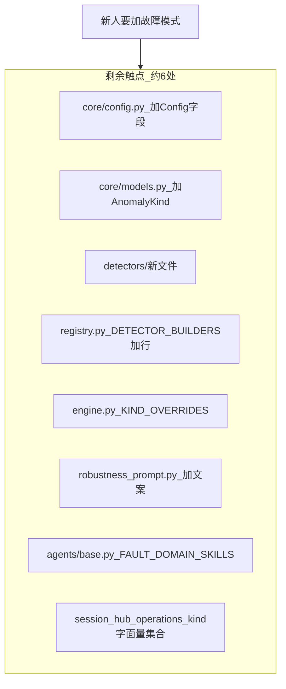

| # | 触点 | 文件 | 现状 |
|---|------|------|------|
| 1 | 配置模型 | [`core/config.py`](../../../../agent_ras/core/config.py) | 仍静态 `RepeatToolConfig` / `LlmThinkingLoopConfig`；`DetectorsConfig.extra=forbid` |
| 2 | Kind 枚举 | [`core/models.py`](../../../../agent_ras/core/models.py) | `AnomalyKind` 仍为 Enum |
| 3 | Detector + 注册 | [`detectors/*`](../../../../agent_ras/detectors/) + [`registry.py`](../../../../agent_ras/detectors/registry.py) | 仍手写 `DETECTOR_BUILDERS`；**无** `fault_domains/` |
| 4 | Recovery 覆盖 | [`recovery/engine.py`](../../../../agent_ras/recovery/engine.py) | `DEFAULT_KIND_OVERRIDES` 硬编码 thinking 两 kind |
| 5 | 用户文案 | [`robustness_prompt.py`](../../../../agent_ras/recovery/robustness_prompt.py) | 域专属双语字典仍在框架内 |
| 6 | Skill 绑定 | [`agents/base.py`](../../../../agent_ras/agents/base.py) | `FAULT_DOMAIN_SKILLS` / `_KIND_TO_FAULT_DOMAIN` 手账 |
| 7 | Kind 集合分支 | [`session_hub.py`](../../../../agent_ras/ras_runtime/session_hub.py) `_is_llm_anomaly_kind`；[`operations.py`](../../../../agent_ras/recovery/operations.py) `_THINKING_LOOP_KINDS` | 仍字面量集合，未走 `anchor` / `stream_kinds` 注册表 |

编排侧「双登记 / SessionState 硬字段」已消；**能力侧登记点仍在**，故尚非「只加目录」。

### 1.2 与旧规划 / 姊妹仓的关系

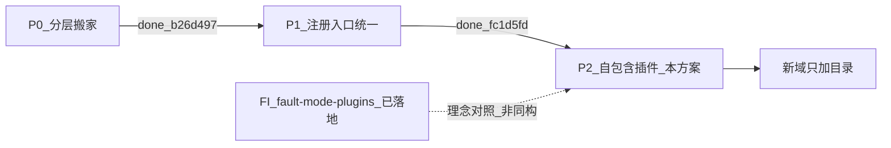

- 旧版「只做搬家 + 统一 registry、不做动态发现」的 **P0/P1 已交付**；本版继续做 P2，并维持：无独立 manifest、`AnomalyKind`→字符串、配置迁入域 `config_model`。
- FI 侧 [fault-mode-plugins.md](../../../agent-fault-injection/designs/features/fault-mode-plugins.md) 已用 **`skills/<id>/SKILL.md` metadata** 做到 Lane A 只加目录（`a5c51a1`）。RAS 检测含算法代码，不能照搬「仅 SKILL」；对齐点是 **禁止双源 catalog**，元数据跟实现同包（RAS = `PLUGIN` in `detector.py`）。

---

## 2. 目标与非目标

### 2.1 目标

| ID | 目标 |
|----|------|
| G1 | 故障域 = 一个目录：检测实现 + `PLUGIN` 元数据 + 可选文案/Skill + 说明文档 |
| G2 | 框架启动扫描自动注册；**新域零改** registry / config 静态字段 / models / SessionHub / Monitor |
| G3 | 无独立 `manifest.yaml`；元数据与工厂同文件，避免 YAML/Python 双源 |
| G4 | 深挂载 Monitor 与协议 SessionHub **共用** `build_member_detectors`；`enabled` 语义一致 | **✅ 已满足（P1）** |
| G5 | Wire 契约不变（`abort_stream` / `emit_notice` / `push_steering`）；Insight 旁路 kind 仍为字符串 |

### 2.2 非目标

- 不做纯声明式检测（算法仍在插件 `detector.py`）。
- 不新增 wire 动作类型；不合并 Monitor 与 SessionHub 编排核。
- Insight [`fault-mode-catalog.ts`](../../../../src/lib/ingest/ras/fault-mode-catalog.ts) / 能力配置 UI **本阶段不自动发现**（环内先生效；看板另立项）。
- 不要求仓外非 Python 工具只读枚举域列表。

---

## 3. 目标架构总览

### 3.1 逻辑结构

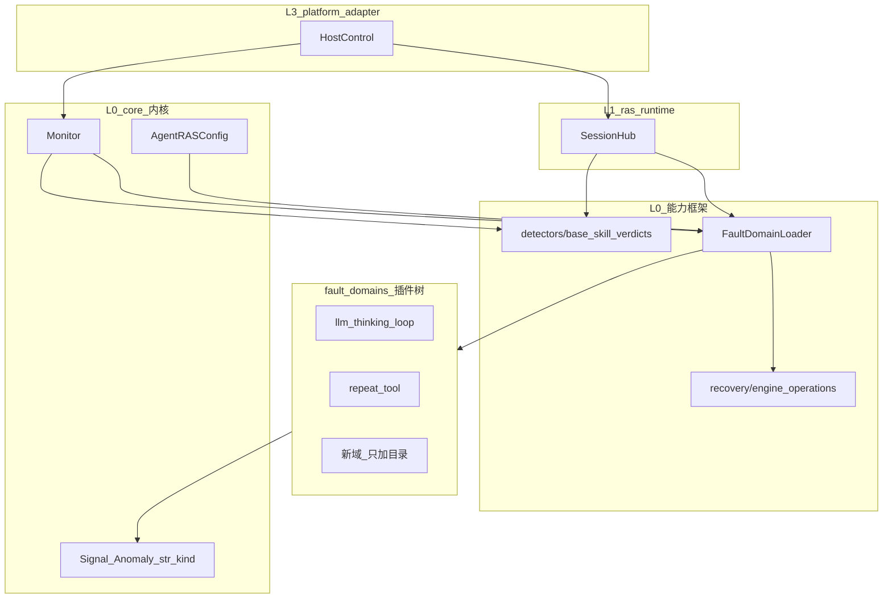

**依赖方向**：编排（Monitor / SessionHub）→ Loader → 各插件；插件只依赖 `core.models` / `detectors.base` / `agents` / `fault_domains.types`，**禁止** import 宿主 SDK。

### 3.2 目录布局（目标态）

```text
agent_ras/
  core/                      # 内核：models / config / monitor / host_control / …
  detectors/                 # 协议与共享算法：base.py / skill_verdicts.py /（通用工具）
  recovery/                  # 通用恢复引擎 + operations（无域专属字典膨胀）
  agents/                    # AgentAdapter / RASAgents；skills 表由 Loader 填充
  fault_domains/             # ★ 插件根
    types.py                 # FaultDomainPlugin / RecoverySpec
    loader.py                # 扫描 · 注册 · build_member_detectors
    _template/               # 脚手架（_ 前缀不加载）
      detector.py
      messages.yaml.example
      README.md
    llm_thinking_loop/       # 内置域迁入
      detector.py            # PLUGIN + Detector
      skills/
        llm-loop-detection/SKILL.md
        llm-loop-review/SKILL.md
      messages.yaml
      README.md
    repeat_tool/
      detector.py
      messages.yaml
      README.md              # 无 skills/ 亦可
    <new_domain>/
      detector.py
      skills/
        <detection-skill-id>/SKILL.md   # 按需；名=独立 skill id
        <recovery-skill-id>/SKILL.md
      messages.yaml
      README.md
  ras_runtime/
  platform_adapter/
```

### 3.3 插件包内部结构

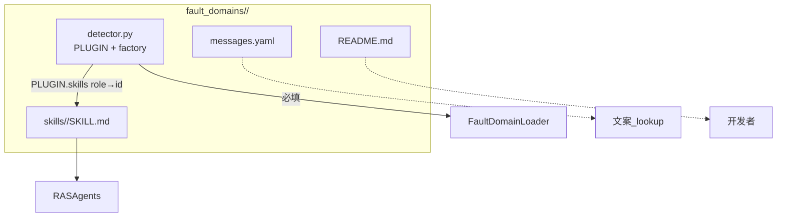

| 文件 | 必填 | 职责 |
|------|------|------|
| `detector.py` | ✅ | 导出 `PLUGIN` + `factory` + `Detector` |
| `skills/<skill_id>/SKILL.md` | — | 符合 Skill 规范；`<skill_id>` 为独立语义名 |
| `messages.yaml` | — | 域专属 steer/notice |
| `README.md` | 建议 | 场景摘要 / 链到 designs |

---

## 4. 核心契约：`PLUGIN`（替代 manifest）

### 4.1 为何不要 manifest.yaml

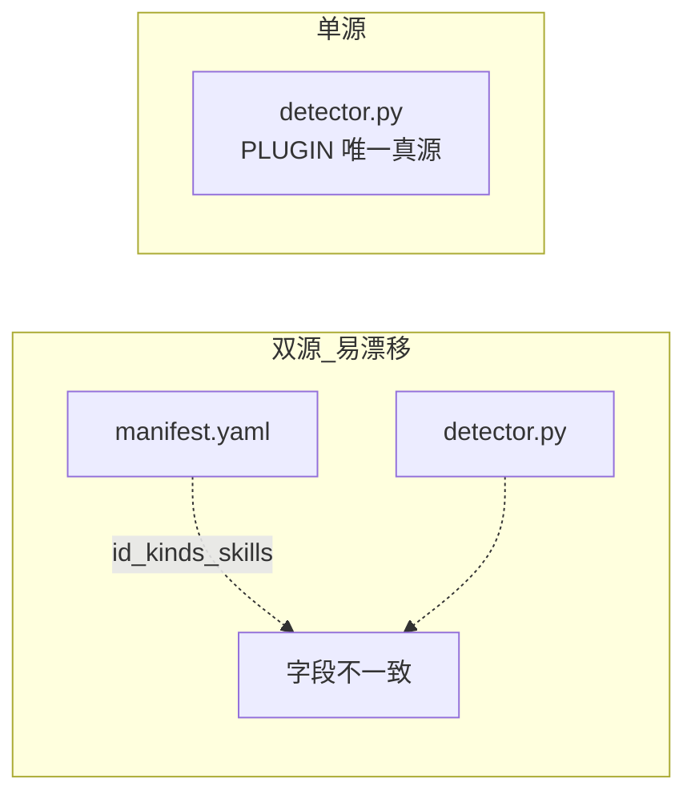

| 原设想 manifest 职责 | 落点 |
|----------------------|------|
| id / kinds / skills / recovery / anchor | `PLUGIN` |
| config schema | `PLUGIN.config_model`（Pydantic） |
| entry 模块 / 工厂名 | 约定文件 `detector.py` + `PLUGIN.factory` |
| 人读说明 | `README.md` / designs（不参与加载） |

### 4.2 `FaultDomainPlugin` 形状

```python
# fault_domains/types.py（示意）
@dataclass(frozen=True)
class RecoverySpec:
    kind_overrides: Mapping[str, Sequence[RecoveryAction]]
    stream_kinds: Sequence[str] = ()   # 走 suppress / abort 分支的 kind
    anchor: Literal["llm", "tool"] = "llm"

@dataclass(frozen=True)
class FaultDomainPlugin:
    id: str                              # == detector.name / 宿主 config 键
    version: int
    enabled_by_default: bool
    kinds: Sequence[str]
    kind_to_domain: Mapping[str, str]
    skills: Mapping[str, str]            # role → skill_id；如 detection→llm-loop-detection
    recovery: RecoverySpec
    config_model: type[BaseModel]
    factory: Callable[[BaseModel, RASAgents], Detector | None]
```

### 4.3 域内示例（示意）

```python
PLUGIN = FaultDomainPlugin(
    id="analysis_paralysis",
    version=1,
    enabled_by_default=True,
    kinds=("analysis_paralysis", "analysis_paralysis_severe"),
    kind_to_domain={
        "analysis_paralysis": "analysis_paralysis",
        "analysis_paralysis_severe": "analysis_paralysis",
    },
    skills={
        "detection": "analysis-paralysis-detection",  # → skills/analysis-paralysis-detection/SKILL.md
        "recovery": "analysis-paralysis-review",
    },
    recovery=RecoverySpec(
        kind_overrides={...},
        stream_kinds=("analysis_paralysis", "analysis_paralysis_severe"),
        anchor="llm",
    ),
    config_model=AnalysisParalysisConfig,
    factory=build_detector,
)
```

**规则摘要**

- `Anomaly.kind` ∈ `PLUGIN.kinds`；`Anomaly.detector` == `PLUGIN.id`。
- 路径 = `fault_domains/<domain_id>/skills/<PLUGIN.skills[role]>/SKILL.md`。
- 禁止 import 宿主 SDK。

---

## 5. 发现与加载流程

### 5.1 扫描规则

| 规则 | 说明 |
|------|------|
| 默认根 | `agent_ras/fault_domains/` |
| 扩展根 | 环境变量 `RAS_FAULT_DOMAIN_PATHS`（`os.pathsep` 分隔） |
| 合法包 | 子目录含 `detector.py` 且模块导出 `PLUGIN` |
| 忽略 | 目录名以 `_` 开头（如 `_template`） |
| 冲突 | 同 `PLUGIN.id` 后者失败并打错误日志，保留先加载者 |

### 5.2 加载时序

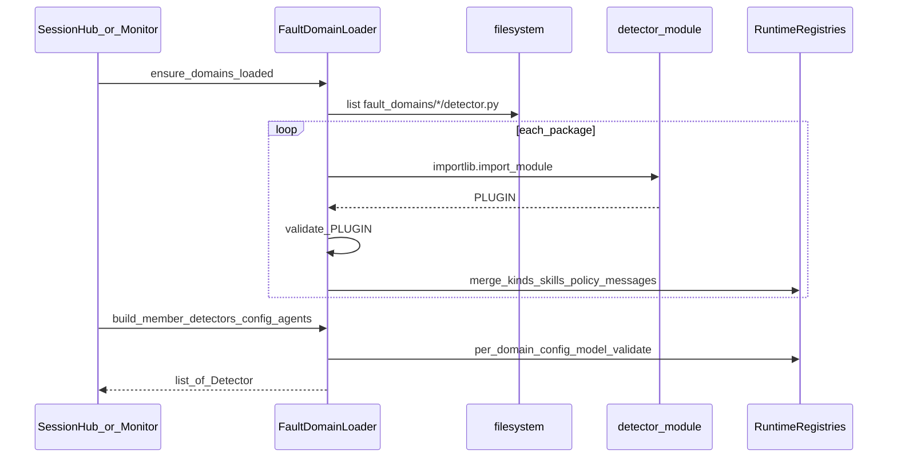

### 5.3 Loader 填充的运行时注册表

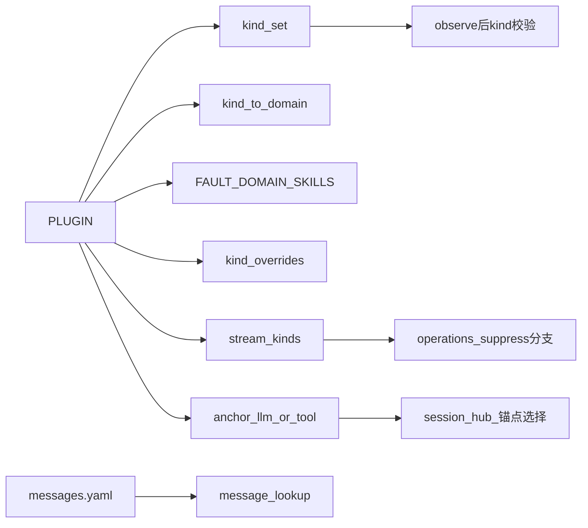

对外稳定 API（替换硬编码 [`detectors/registry.py`](../../../../agent_ras/detectors/registry.py)）：

```text
ensure_domains_loaded() -> None
build_member_detectors(config, agents) -> list[Detector]
fault_domain_for_kind(kind) -> str | None
is_stream_kind(kind) -> bool
anchor_for_kind(kind) -> "llm" | "tool" | None
```

---

## 6. 框架一次性改造（之后新域零改）

### 6.1 `Anomaly.kind`：枚举 → 稳定字符串

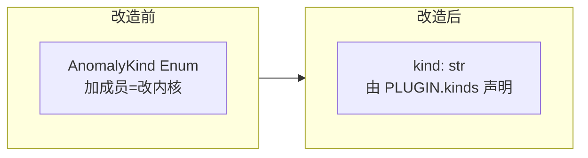

- Wire / Insight 仍吃字符串（如 `"llm_thinking_loop"`），**契约值不变**。
- 未知 kind：fail-open 打日志，丢弃或降级 `observe_only`（实现期定一种并单测锁死）。

### 6.2 配置：静态字段 → 按域动态校验

- `DetectorsConfig` 不再为每域加字段；宿主 JSON 保持 `detectors.<domain_id>.*`。
- Loader 用各域 `config_model` 校验；未知键忽略或 warn（与现 `extra` 策略对齐时写明）。
- [`_config_from_payload`](../../../../agent_ras/ras_runtime/session_hub.py) **删除** thinking/repeat 白名单，按已发现域 id 分发。

### 6.3 SessionHub / Monitor 去硬编码

| 项 | 状态 | 说明 |
|----|------|------|
| `SessionState.detectors: list` + 首命中 observe | ✅ 已落地 | `_dispatch_signal` |
| 删除 `force_thinking_loop`；`enabled` 两路径一致 | ✅ 已落地 | |
| Monitor `parse_recovery_verdict` / pending `fault_domain` 打戳 | ✅ 已落地 | 不再常量 fallback |
| `_is_llm_anomaly_kind` 字面量 | ❌ 待做 | → `anchor_for_kind(kind) == "llm"` |
| `_THINKING_LOOP_KINDS` | ❌ 待做 | → `is_stream_kind(kind)` |
| `FAULT_DOMAIN_SKILLS` 手账 | ❌ 待做 | → Loader 填充 |

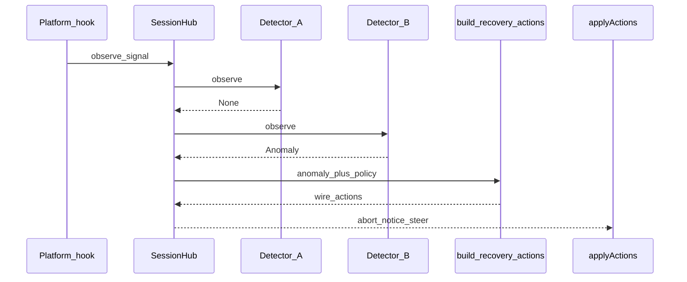

### 6.4 Recovery / 文案

- 默认 `kind_overrides` = 各 `PLUGIN.recovery` 合并；宿主 `policy.kind_overrides` 仍可覆盖。
- [`robustness_prompt.py`](../../../../agent_ras/recovery/robustness_prompt.py) 只留**通用**模板；域文案来自插件 `messages.yaml`。
- 新域**不得**改 wire 类型集合。

### 6.5 Detection / Recovery Skill 怎么放

**约定：完整遵守 Skill 包规范 `skills/<skill_id>/SKILL.md`；`<skill_id>` 是独立语义名，不是 RAS role 字面量。**

role（`detection` / `recovery`）是**调用角色**，落在 `PLUGIN.skills` 映射里；磁盘目录名是 **skill 身份**，与 FI 的 `skills/<fault-id>/SKILL.md`、现网 `llm-loop-detection` 一致。

```text
fault_domains/<domain_id>/
  detector.py
  skills/
    <detection-skill-id>/
      SKILL.md
    <recovery-skill-id>/          # 可选
      SKILL.md
  messages.yaml
  README.md
```

**thinking-loop 示例**

```text
fault_domains/llm_thinking_loop/
  detector.py
  skills/
    llm-loop-detection/SKILL.md   # 自 detectors/skills 迁入（目录名保留）
    llm-loop-review/SKILL.md      # 自 recovery/skills 迁入
```

```python
skills={
    "detection": "llm-loop-detection",
    "recovery": "llm-loop-review",
},
# 路径 = <pkg>/skills/<skill_id>/SKILL.md
# skill_for(domain, role) → skill_id；load_skill_body 拼路径
```

曾考虑又放弃的方案：

| 方案 | 问题 |
|------|------|
| 根目录 `detection.md` 压平 | 不符合 `skills/<id>/SKILL.md` |
| 固定 `skills/detection/`、`skills/recovery/` | 目录名是 role 不是 skill id，语义不合规范 |

层数：`fault_domains/<id>/skills/<skill_id>/SKILL.md`（相对 `agent_ras/` 为 5）。**接受多一层**，换规范合规与可迁移的 skill 身份；不要为减层牺牲约定。

| 问题 | 答案 |
|------|------|
| skill 名谁定？ | 域作者；建议 kebab-case，与现有 `llm-loop-*` 一致 |
| 无 L3？ | 不建 `skills/`，`PLUGIN.skills` 省略或空 |
| 只要检测？ | 只声明 `detection` → 一个 skill 目录 |
| 加载？ | `fault_domains/<id>/skills/<skill_id>/SKILL.md`；迁移期可回退旧全局路径 |
| 与 FI | 同为 `skills/<id>/SKILL.md`；FI 的 id 是故障模式，RAS 的 id 是检测/复核 skill |

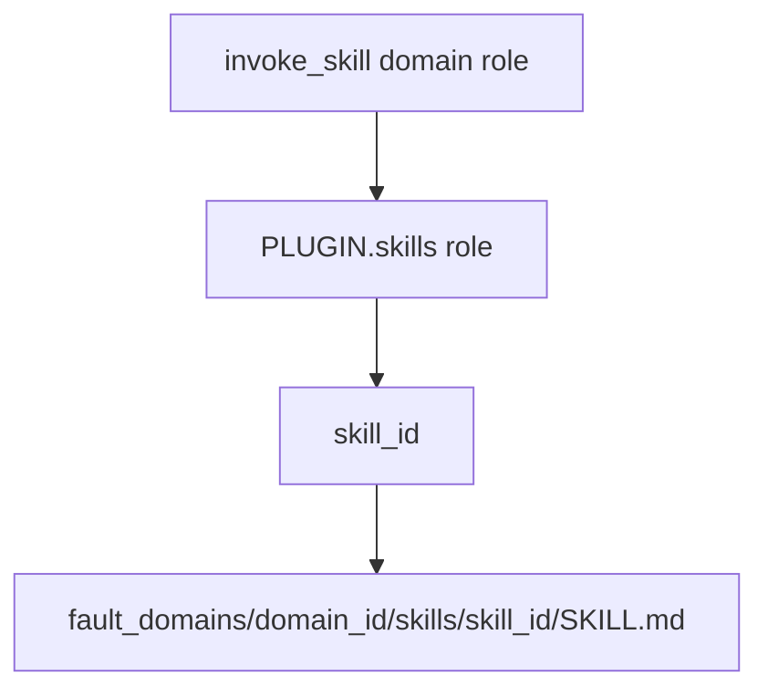

---

## 7. 前后对比：扩展一个故障域

### 7.1 触点对比


| | 改造前 | 改造后 |
|---|--------|--------|
| 框架源码 | 必改多处 | **不改** |
| 配置 | `config.py` 加字段 | 域内 `config_model` |
| Kind | `AnomalyKind` 加成员 | `PLUGIN.kinds` |
| 注册 | `registry.py` 加一行 | 目录扫描 |
| 文案 | 改 `robustness_prompt` | 域 `messages.yaml` |
| Skill | 改 `FAULT_DOMAIN_SKILLS` | 域包 `skills/<skill_id>/SKILL.md` + PLUGIN 映射 |
| 文档 | features/*.md | 同左 + 域 README |

### 7.2 新增域操作清单（目标态）

1. 复制 `fault_domains/_template/` → `fault_domains/<id>/`。
2. 实现 `PLUGIN` + `build_detector` + `Detector`（按需 `AsyncRecoveryDetector`）。
3. 按需添加 `skills/<skill_id>/SKILL.md`，并在 `PLUGIN.skills` 写清 role→id；可选 `messages.yaml`。
4. 域 `README.md`；复杂需求写 [`docs/agent-ras/designs/features/`](./) 并在 [Agent RAS README](../../README.md) 登记。
5. 单测 + 冒烟既有 thinking-loop / repeat 不回归。

**禁止清单**：改 `registry` / `config` 静态字段 / `models` 枚举 / `session_hub` / `monitor` / `robustness_prompt` 大字典；**也不新增**独立 manifest。

---

## 8. 内置域迁移

将现有能力迁为同形态插件，一次性删掉硬编码 builders：

| 现位置 | 目标插件包 |
|--------|------------|
| [`detectors/llm_thinking_loop.py`](../../../../agent_ras/detectors/llm_thinking_loop.py) + skills | `fault_domains/llm_thinking_loop/` |
| [`detectors/repeat_tool.py`](../../../../agent_ras/detectors/repeat_tool.py) | `fault_domains/repeat_tool/` |

`detectors/` 保留：`base.py`、`skill_verdicts.py`、可复用算法片段。  
宿主配置键 **`detectors.llm_thinking_loop` / `detectors.repeat_tool` 保持兼容**。

---

## 9. 兼容性与风险

| 面 | 结论 |
|----|------|
| Wire JSON | 不变 |
| 宿主配置键名 | 内置域键名不变 |
| `enabled:false` | ✅ 已同语义（P1）；P2 保持 |
| Insight catalog / 能力 UI | 暂不自动发现；新域环内可用、看板文案可能滞后 |
| 仓外 pin `AnomalyKind` 枚举 | P2 破；调用方改用字符串 |

| 风险 | 缓解 |
|------|------|
| 插件 import 副作用 / 循环依赖 | Loader 只 import `detector` 模块；禁止插件 import Monitor/Hub |
| 恶意/损坏插件拖垮启动 | 单包校验失败 skip + error log；核心内置域加载失败则 fail-fast |
| 大 diff 冲击在途分支 | P0/P1 已合入；P2 分 commit：types+Loader → kind/config 动态化 → 迁内置域 → template（**不再**含 SessionState 泛化） |
| kind 字符串拼写漂移 | Loader 校验 + 单测固定内置 kind 字面量 |
| `DetectorsConfig` 与 Insight 能力配置面板硬编码域键 | 环内先动态；Insight UI 另立项（同非目标） |

---

## 10. 实现分期与验证

### 10.1 分期（P0/P1 已完成，仅排 P2）

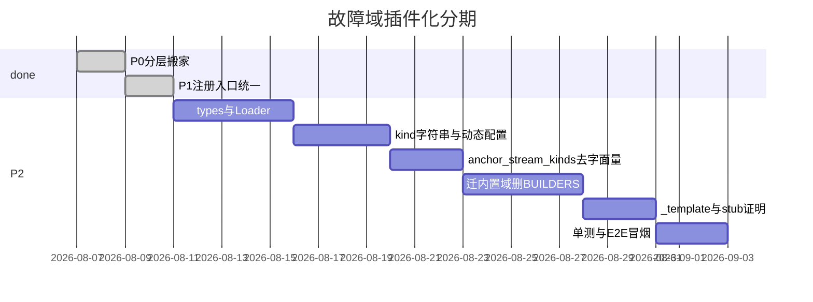

1. ~~SessionState 泛化 / 统一 registry / 删 force_thinking_loop~~（✅ P1）  
2. `FaultDomainPlugin` + `FaultDomainLoader`；`build_member_detectors` 改走 Loader。  
3. `Anomaly.kind` 字符串化 + 配置按域 `config_model` 动态校验。  
4. `_is_llm_anomaly_kind` / `_THINKING_LOOP_KINDS` / skills 表 → 注册表。  
5. 迁 `llm_thinking_loop`、`repeat_tool`；删 `DETECTOR_BUILDERS`。  
6. `_template` + stub 域证明「只加目录」。  
7. 同步模块指南（落地后）。

### 10.2 验证计划

| 层级 | 内容 |
|------|------|
| 单测 | `test_fault_domain_loader.py`：发现、PLUGIN 校验、未知 kind、`enabled=false`、id 冲突 |
| 回归 | `cd agent_ras && python -m pytest tests -q` |
| E2E | `e2e_l3_thinking_dead_loop` / `e2e_l2_similar_clauses` / xiaoO inproc / `smoke_inproc` |
| 插件证明 | stub 域仅新增目录即可被 observe 路径装上（框架 git diff 无登记点改动） |

未跑 E2E 前不得在实现 PR 宣称完成。

---

## 11. 文档与清单同步

- [x] 本文件改写为自包含插件方案真源（v0.2）
- [x] v0.3 按最新代码校正：P0/P1 已完成；剩余触点表；分期去掉已交付项
- [ ] P2 落地后更新 [detectors.md](../modules/detectors.md)「扩展指南」（当前「注册」小节仍描述旧双路径，见下）
- [ ] P2 落地后更新 [recovery.md](../modules/recovery.md) / [monitor.md](../modules/monitor.md) / [architecture.md](../architecture.md)
- [x] [docs/agent-ras/README.md](../../README.md) 特性表已标「部分落地」
- [ ] [docs/design/README.md](../../../design/README.md) 需求清单描述与实现状态（随 P2）

---

## 附录 A：与旧版决策对照

| 旧决策 | 本版 |
|--------|------|
| D1 AnomalyKind 保留枚举 | **推翻** → 动态字符串（P2） |
| D5 注册入口统一 | **✅ 已落地**；P2 再升级为 Loader 扫描 |
| D6 配置留在 core/config 静态字段 | **推翻** → 域内 `config_model`（P2） |
| 不做 entry_points / 配置迁出 | **推翻** → 目录扫描 + `PLUGIN`（P2） |
| 独立 manifest.yaml（中间稿） | **不做** → `PLUGIN` 单源 |

## 附录 B：消息文件示意

```yaml
# fault_domains/<id>/messages.yaml
cn:
  steer_default: "检测到分析停滞，请收敛结论并开始执行。"
  notice_default: "可靠性：已中断冗长分析并注入纠正提示。"
en:
  steer_default: "Analysis appears stalled; converge and act."
  notice_default: "Reliability: interrupted overthinking and steered the agent."
```
