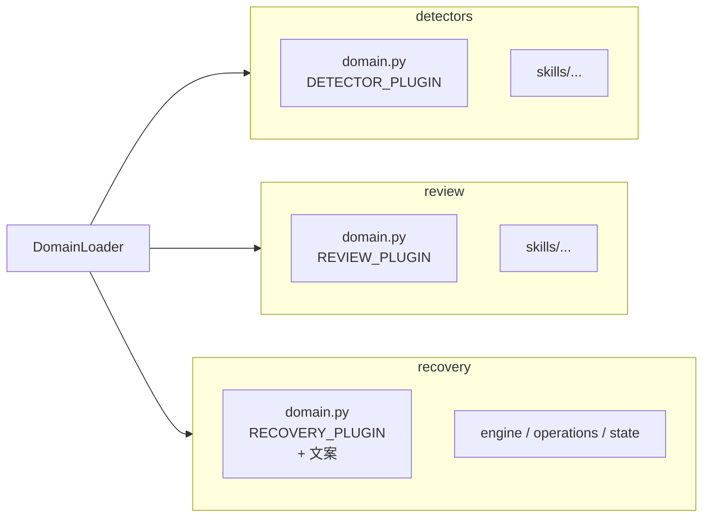

# 故障域插件化：detectors / review / recovery 三分治

版本：v0.8.1  
最后更新：2026-08-13

> 文档类型：架构设计（已落地） | 关联项目：agent-insight / agent_ras  
> 范围：仓根 `agent_ras/`。检测、**评审**、恢复三棵树平级扩展；目录扫描 + `*_PLUGIN` 自动注册；**不设** `fault_domains/`。

---

## 一、背景与动机

- **不做** `fault_domains/` 整包；检测 / 评审 / 恢复分树独立开发。
- **抽出 `review/`**：`llm-loop-review` 是语义评审，不是恢复引擎。
- **`recovery/` 压平**：与 `detectors/` 同构；策略与文案同模块，避免 `messages/` 再分一层。

## 二、设计目标

| ID | 目标 |
|----|------|
| G1 | 新检测：只增 `detectors/`（± detection skill） |
| G2 | 新评审：只增 `review/`（± review skill） |
| G3 | 新恢复：只增 `recovery/<domain>.py`（**含** overrides + 文案） |
| G4 | 无 fault_domains；无独立 manifest；无单独 messages 目录树 |
| G5 | Wire / 统一 registry 保持 |

## 三、目录布局



```text
agent_ras/
  detectors/
    base.py / skill_verdicts.py / registry.py / loader.py / types.py / catalog.py
    llm_thinking_loop.py          # DETECTOR_PLUGIN
    repeat_tool.py
    skills/llm-loop-detection/SKILL.md
  review/
    llm_thinking_loop.py          # REVIEW_PLUGIN
    skills/llm-loop-review/SKILL.md
  recovery/
    engine.py / operations.py / state.py / robustness_prompt.py  # 通用内核
    llm_thinking_loop.py          # RECOVERY_PLUGIN + 域文案（同文件）
    repeat_tool.py                # RECOVERY_PLUGIN + 域文案（同文件）
  agents/
```

`DomainLoader`（[agent_ras/detectors/loader.py](../../../../agent_ras/detectors/loader.py)）三路扫描各目录：

- 跳过框架文件名（`base` / `registry` / `loader` / `types` / `catalog` / `skill_verdicts` / `engine` / `operations` / `state` / `robustness_prompt` / `__init__`）；
- 只加载导出了对应 `*_PLUGIN` 且 `isinstance` 校验通过的模块；
- 同一 `id` 重复注册时记 error 并保留先到者；
- 扫描结果 join 成运行时注册表（kind→domain、skills、overrides、stream kinds、anchor、messages、terminate kinds、msg key 模板、kind labels）。

## 四、PLUGIN 契约

契约定义在 [agent_ras/detectors/types.py](../../../../agent_ras/detectors/types.py)。

```python
# detectors/my_domain.py
DETECTOR_PLUGIN = DetectorPlugin(
    id="my_domain",
    kinds=(...),
    kind_to_domain={...},
    config_model=MyConfig,
    factory=build_detector,
    detection_skill="my-detection",      # 可选
    verdict_parser=parse_verdict,        # 可选
    anchor="llm",                        # 可选
    priority=100,                        # 数值小者先跑
    presentation=DomainPresentation(...),  # 可选，驱动 Insight UI
)

# review/my_domain.py
REVIEW_PLUGIN = ReviewPlugin(
    id="my_domain",
    review_skill="my-review",
    verdict_parser=parse_review_verdict,  # 可选
)

# recovery/my_domain.py  —— 策略与文案在一起
RECOVERY_PLUGIN = RecoveryPlugin(
    id="my_domain",
    kind_overrides={...},
    stream_kinds=(...),
    anchor="llm",
    messages={  # 同文件；不要再拆 recovery/messages/
        "cn": {"steer_default": "...", "notice_default": "..."},
        "en": {"steer_default": "...", "notice_default": "..."},
    },
    terminate_kinds=(...),               # 可 TERMINATE 的 kind
    msg_key_templates={                  # 可选：evidence.msg_key → 文案模板键
        "steer": {...}, "notice": {...}, "critical": {...},
    },
)
```

`ROLE_SKILL_DIRS`：`detection` → `detectors/skills`；`review` → `review/skills`。Skill role 用 `"review"`（配置键 `config.recovery` 不变）。

## 五、新增故障模式的触点

### 5.1 只新增（+ 改参数模板）

| 能力 | 文件 |
|------|------|
| 检测 | **新增** `detectors/my_domain.py`（含 `DETECTOR_PLUGIN` + `presentation` + `config_model`） |
| 检测 skill（可选） | **新增** `detectors/skills/<id>/SKILL.md` |
| 评审（可选） | **新增** `review/my_domain.py` |
| 评审 skill（可选） | **新增** `review/skills/<id>/SKILL.md` |
| 恢复策略 + 文案（可选） | **新增** `recovery/my_domain.py` |
| **默认参数（唯一共用可改）** | **修改** `agent_ras/config/agent_ras_config.default.yaml` 的 `detectors.<id>` |
| 设计/单测（建议） | `docs/agent-ras/designs/features/...`、测试文件 |

Insight 能力目录与配置面板由 `presentation` + `config_model` schema **自动发现**（见 [capability-config.md](capability-config.md)），**不要**再改 `fault-mode-catalog.ts` / 配置 Panel / `normalize` kind 白名单 / `inproc.example`。

### 5.2 除上表外，还要改框架吗？

**一般不用。** Loader 扫描后自动注册。下列**不要**再改：

- `detectors/registry.py` / `loader.py` / `types.py`（除非扩展 PLUGIN 契约本身）
- `core/config.py` 静态域字段、`core/models.py` AnomalyKind 枚举
- `recovery/engine.py` 默认 overrides、`robustness_prompt.py` 大字典
- `agents/base.py` 的 skill 手账
- `session_hub` / `monitor` / `operations` 的 kind 字面量表
- Insight 故障模式 UI / 宿主配置面板（已解耦）

**例外（非本方案常规扩展）**

| 情况 | 是否要改框架 |
|------|----------------|
| 需要**新的 wire 动作类型** | 要（另立项；本方案非目标） |

建议仍补：设计文档登记 + 单测（算「新增」，不是改框架）。

### 5.3 共同文件只留 yaml

新增**同类**可靠性能力（复用现有 `SignalKind` + 现有 wire `abort_stream` / `emit_notice` / `push_steering`）只允许：

- **新增** `detectors/<id>.py`（`DETECTOR_PLUGIN` + `config_model` + `presentation`）
- **新增**（可选）`review/<id>.py`、`recovery/<id>.py`、对应 `skills/*/SKILL.md`、单测、设计文档
- **修改** 唯一共同文件：`agent_ras/config/agent_ras_config.default.yaml`

禁止再改：loader / registry / `core/config.py` / monitor / session_hub / robustness_prompt / engine / config_sync / capability-config.ts / client-config-model.ts / plugin.js。

**永久例外（扩框架另立项）**：新 `SignalKind`、新 wire / `HostControl` 方法、新平台、仓外 entry_points。

### 5.4 `hello` 不是新接口

协议 inproc 已有 `health | hello | observe | reset | action_result | skill_result | bye`。`hello` = 按 session 建档（platform + **整份** `detectors` 能力配置），返回 `welcome`。命名取协议握手惯例，不是业务打招呼；不删除、不改名。

## 六、Detector `evidence` 键约定

框架只渲染，不选句。Detector 在 `anomaly.evidence` 里给出：

| 键 | 作用 |
|----|------|
| `msg_key` / `steer_key` / `notice_key` / `critical_key` | 选文案；缺省则用该域 `steer_default` / `notice_default` / `critical_default` |
| `needs_l3_review` | 为真且该域有 review skill → Monitor 走 L3；否则立即 abort |
| `recovery_profile` / `source` | 原样进入 `PendingRecovery`（不再从 channel 推断） |
| `fault_domain` | 可选；缺省由 kind→domain 注册表补齐 |
| `excerpt` / `thinking_excerpt` | L3 review payload 用 `excerpt`，并保留 `thinking_excerpt` 别名 |

`RecoveryPlugin.terminate_kinds` 声明可 `TERMINATE` 的 kind；`engine` 从 loader join，不再写死白名单。

## 七、配置同步与 hello

切片为 `enabled` + **整份** `detectors`（value 必须是 object）+ `recovery`。Insight 默认值解析 yaml；表单/校验走 catalog `configSchema`。
