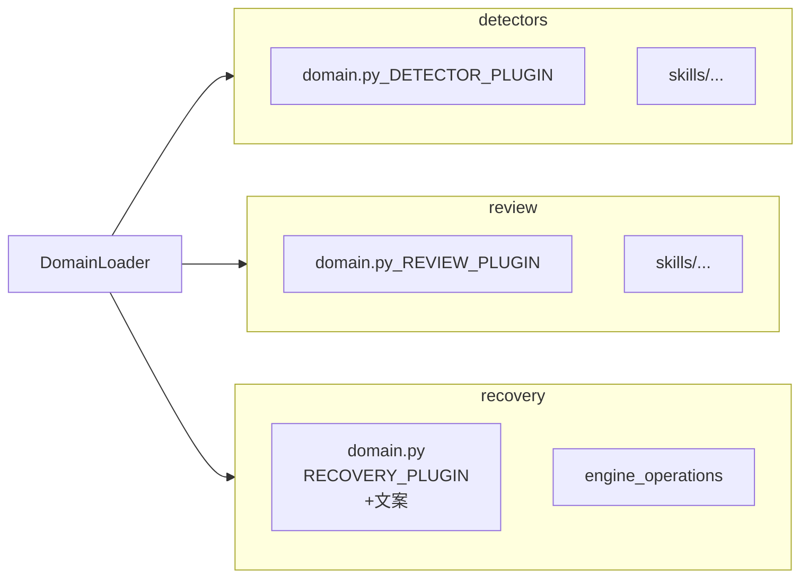

# 故障域插件化：detectors / review / recovery 三分治（已落地）

> 范围：仓根 `agent_ras/`。检测、**评审**、恢复三棵树平级扩展；目录扫描 + `*_PLUGIN` 自动注册；**不设** `fault_domains/`。  
> 状态：**P2 已落地**（DomainLoader + 三分治 PLUGIN；`llm-loop-review` → `review/skills`；role=`review`）。  
> 版本：v0.8.1 · 2026-08-10（实现对照同日）

---

## 一句话结论

| 项目 | 约定 |
|------|------|
| 三棵树 | `detectors/`（检测）· `review/`（语义评审）· `recovery/`（策略 + **文案** + 投递） |
| 分层 | 对齐 `detectors/`：`<tree>/<domain>.py` + 可选 `skills/<skill_id>/SKILL.md`；**无** `recovery/plugins/`、`recovery/messages/` 另树 |
| 恢复文案 | 与恢复策略**同文件**：写在 `recovery/<domain>.py` 的 `RECOVERY_PLUGIN`（或同模块常量）里 |
| 原 `llm-loop-review` | 迁到 `review/skills/llm-loop-review/` |
| Skill role | `"recovery"` → `"review"`（配置键 `config.recovery` 不变） |
| 关联 | 共用 `domain_id`；Loader 三路扫描 join |
| 新域触点 | **只新增下表文件**；不改框架登记点 |



---

## 1. 动机摘要

- **不做** `fault_domains/` 整包；检测 / 评审 / 恢复分树独立开发。
- **抽出 `review/`**：`llm-loop-review` 是语义评审，不是恢复引擎。
- **`recovery/` 压平**：与 `detectors/` 同构；策略与文案同模块，避免 `messages/` 再分一层。

---

## 2. 目标

| ID | 目标 |
|----|------|
| G1 | 新检测：只增 `detectors/`（± detection skill） |
| G2 | 新评审：只增 `review/`（± review skill） |
| G3 | 新恢复：只增 `recovery/<domain>.py`（**含** overrides + 文案） |
| G4 | 无 fault_domains；无独立 manifest；无单独 messages 目录树 |
| G5 | Wire / P1 统一 registry 保持 |

---

## 3. 目录布局（目标态）

```text
agent_ras/
  detectors/
    base.py / skill_verdicts.py / registry.py / loader.py / types.py
    llm_thinking_loop.py          # DETECTOR_PLUGIN
    repeat_tool.py
    skills/llm-loop-detection/SKILL.md
  review/
    llm_thinking_loop.py          # REVIEW_PLUGIN
    skills/llm-loop-review/SKILL.md
  recovery/
    engine.py / operations.py / state.py / robustness_prompt.py  # 通用内核
    llm_thinking_loop.py          # RECOVERY_PLUGIN + 域文案（同文件）
  agents/
```

扫描跳过框架文件名；只加载导出了对应 `*_PLUGIN` 的模块。

---

## 4. PLUGIN 契约（摘要）

```python
# detectors/my_domain.py
DETECTOR_PLUGIN = DetectorPlugin(
    id="my_domain",
    kinds=(...),
    kind_to_domain={...},
    detection_skill="my-detection",  # 可选
    config_model=MyConfig,
    factory=build_detector,
)

# review/my_domain.py
REVIEW_PLUGIN = ReviewPlugin(
    id="my_domain",
    review_skill="my-review",
)

# recovery/my_domain.py  —— 策略与文案在一起
RECOVERY_PLUGIN = RecoveryPlugin(
    id="my_domain",
    kind_overrides={...},
    stream_kinds=(...),
    anchor="llm",
    messages={  # 同文件；不要再拆 recovery/messages/
        "cn": {"steer_default": "...", "notice_default": "..."},
        "en": {"steer_default": "...", "notice_default": "..."},
    },
)
```

`ROLE_SKILL_DIRS`：`detection` → `detectors/skills`；`review` → `review/skills`。

---

## 5. 新增故障模式：改哪些文件？

### 5.1 目标态：只新增（+ 改参数模板）

| 能力 | 文件 |
|------|------|
| 检测 | **新增** `detectors/my_domain.py`（含 `DETECTOR_PLUGIN` + `presentation` + `config_model`） |
| 检测 skill（可选） | **新增** `detectors/skills/<id>/SKILL.md` |
| 评审（可选） | **新增** `review/my_domain.py` |
| 评审 skill（可选） | **新增** `review/skills/<id>/SKILL.md` |
| 恢复策略 + 文案（可选） | **新增** `recovery/my_domain.py` |
| **默认参数（唯一共用可改）** | **修改** `agent_ras/config/agent_ras_config.default.yaml` 的 `detectors.<id>` |
| 设计/单测（建议） | `docs/agent-ras/designs/features/...`、测试文件 |

Insight 能力目录与配置面板由 `presentation` + `config_model` schema **自动发现**（见 [capability-catalog-decouple.md](capability-catalog-decouple.md)），**不要**再改 `fault-mode-catalog.ts` / 配置 Panel / `normalize` kind 白名单 / `inproc.example`。

### 5.2 除上表外，还要改框架吗？

**一般不用。** Loader 扫描后自动注册。下列**不要**再改：

- `detectors/registry.py` / `loader.py` / `types.py`（除非扩展 PLUGIN 契约本身）
- `core/config.py` 静态域字段、`core/models.py` AnomalyKind 枚举
- `recovery/engine.py` 默认 overrides、`robustness_prompt.py` 大字典
- `agents/base.py` 的 skill 手账
- `session_hub` / `monitor` / `operations` 的 kind 字面量表
- Insight 故障模式 UI / 宿主配置面板（已解耦）

**例外（非本方案常规扩展）**

| 情况 | 是否要改框架 |
|------|----------------|
| 需要**新的 wire 动作类型** | 要（另立项；本方案非目标） |

建议仍补：设计文档登记 + 单测（算「新增」，不是改框架）。

### 5.3 历史（P2 落地前）

曾须改 `config` / `models` / `DETECTOR_BUILDERS` / overrides / prompt / skill 表——**P2 已消除这些常规触点**。

---

## 6. 实现分期（P2）

1. C1：三插件类型 + DomainLoader 三路扫描  
2. C2：kind 字符串 + 动态 config  
3. C3：建 `review/`；迁 llm-loop-review；role → `review`  
4. C4：内置域挂 PLUGIN；文案进 `recovery/<domain>.py`；删 BUILDERS  
5. C5：模板 + 文档；pytest + E2E  

---

## 7. 文档同步

- [x] v0.8.1：三分治；文案与策略同文件；新增触点清单  
- [x] P2 落地后更新 modules 指南与 README 状态
