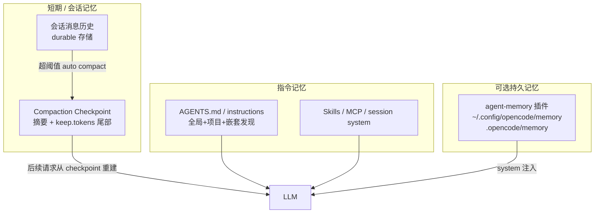
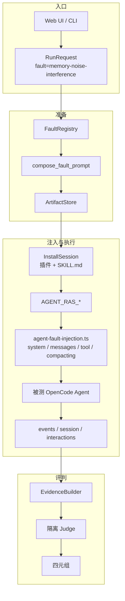

# 记忆噪声干扰故障注入方案（FI）

> 从独立仓迁入；Skill S1–S3 已落地，S4 未实施。

版本：v0.1  
最后更新：2026-08-03

> 文档类型：Phase1 故障注入方案（FI 设计） | 关联项目：agent-fault-injection  
> 状态：**Skill S1–S3 已落地**（`memory-noise-interference`）；**S4 未实施**  
> 关联文档：
> - [记忆丢失/损坏/投毒总方案](memory-file-loss.md)
> - [语义层故障注入调研](../../agent-fault-injection/designs/agent-semantic-fault-injection-survey.md)
> - [注入→评判](.modules/server-judge.md)
> - [故障覆盖矩阵](.fault-catalog.md)
> - 模式库：FM005 上下文窗口污染 · FM004 记忆幻觉 · FM015 错误响应污染

---

## 1. 结论先行

| 问题 | 答案 |
|------|------|
| 故障本质是什么？ | 向 Agent 的短期上下文或持久记忆注入**高似真但无关/冲突/过时**信息，干扰检索、规划与工具选择 |
| 本仓是否已落地？ | **Skill S1–S3 已落地**（`memory-noise-interference`）；**S4 未实施**（需 middleware）。 |
| 与「记忆幻觉 / 投毒」边界？ | 噪声干扰 = **外部塞入干扰源**；幻觉 = Agent **自行虚构**；投毒 = 植入可跨会话复用的恶意/错误事实（可作噪声的持久化形态） |
| 推荐落地路径？ | **P0 Skill 注入（S1/S2）→ P1 中间件结构注入 → P2 Compaction/持久 memory 污染** |
| OpenCode 注入面？ | `system.transform` / `messages.transform` / `tool.execute.after` / `session.compacting` / 可选 `.opencode/memory` |

---

## 2. 问题定义

### 2.1 什么是记忆噪声干扰

**记忆噪声干扰（Memory Noise Interference）** 指：在 Agent 仍能看见正确任务信号的前提下，其「记忆面」（会话历史、system 指令、compaction 摘要、持久 memory 块、检索结果）被注入与当前任务**无关、冲突或过时**的内容，导致资源膨胀、推理混乱或错误采信。

对齐本仓库/模式库：

| 模式 | 语义 | 与本故障关系 |
|------|------|--------------|
| **FM005 上下文窗口污染** | 无关/冲突历史、旧任务残留进入 context | **主对应**（注入 YAML 使用 `noise_ratio` / `noise_types`） |
| FM004 记忆幻觉 | 捏造未发生过的工具结果/历史 | 噪声催化后的下游效应 |
| FM015 上下文窗口污染（DP006） | 失败工具响应 / stack 污染 | 噪声子类：错误信息噪声 |
| MAS-FIRE Memory Loss / Overflow | 裁剪历史或强制压缩丢关键信息 | **信息缺失型**噪声（与「注入干扰」互补） |
| 总方案 `MP` / `ST` | Memory Poisoning / Stale Memory | 持久化或过时形态的噪声 |

### 2.2 与相邻故障的边界

| 对比项 | 记忆噪声干扰 | 记忆幻觉 (FM004) | 记忆投毒 (MP) | Thinking 死循环 |
|--------|--------------|------------------|---------------|-----------------|
| 干扰源 | 外部注入 | 模型自行生成 | 外部写入且可持久 | 内部推理循环 |
| 正确信号 | 通常仍可见 | 可能被虚构替代 | 可能被覆盖 | 不涉及记忆面 |
| 典型判据 | 采信噪声 / 混入旧任务 | 引用不存在的工具结果 | Write→Execute 链路 | 重复 thinking 模式 |

### 2.3 故障子模式（本方案范围）

| 子模式 ID | 名称 | 注入内容 | 注入点 | 可观测失败 |
|-----------|------|----------|--------|------------|
| **S1** | 无关历史噪声 | 伪造旧任务对话、无关工具结果 | 会话消息序列 | 调用错误工具 / 混入旧任务结论 |
| **S2** | 冲突事实噪声 | 与任务互斥的「权威」陈述 | system / memory / RAG 位 | 采信错误事实 |
| **S3** | 错误响应噪声 | 冗长 5xx / stack / 伪字段 | `tool.execute.after` | 被错误信息锚定 |
| **S4** | 压缩失真噪声 | 摘要里夹带错误/过时结论 | compaction 前后 | 压缩后沿用错误状态 |

---

## 3. 注入参数与控制面

借鉴 AutoInject（Pm/Pe）与 FM005 注入 YAML：

```yaml
injection:
  type: context_level  # 或 middleware / memory_file
  method: 向 Agent 记忆面注入高似真噪声
  parameters:
    noise_ratio: 0.5                    # 噪声 token / 总 context 占比，建议 0.3–0.8
    noise_types:                        # 可多选
      - old_task_results
      - cancelled_actions
      - irrelevant_searches
      - conflicting_facts
      - verbose_errors
    inject_position: pre_task           # pre_task | mid_trajectory | post_compaction
    inject_layer: skill                 # skill | middleware | memory_file
    plausibility: high                  # 表面连贯度；middleware 可用 LLM rewriter
    target_context_size_ratio: 0.8      # 可选：把 context 推到窗口占比
```

### 3.1 注入层级（与本仓调研对齐）

```text
L1 Skill 注入（FI-P0，现有默认路径）
  → 安装 SKILL.md + system.transform 要求先 load skill
  → 适合快速落地 S1/S2；噪声比例依赖模型配合

L2 中间件改写（FI-P1，对标 MAS-FIRE / AutoInject）
  → messages.transform / system.transform / tool.execute.after / session.compacting
  → 噪声比例、位置精确可控

L3 持久记忆污染（可选，对标 MemSecBench）
  → 预写/改写 .opencode/memory/*.md 或 agent-memory 插件块
  → 跨 session / 抗 compaction
```

> 重要：本仓当前默认路径是 **L1 Skill 注入**。L2/L3 为扩展注入层，勿与「当前已实现」混为一谈（见 [survey §5.0](../../agent-fault-injection/designs/agent-semantic-fault-injection-survey.md)）。

---

## 4. 业界可借鉴做法

### 4.1 论文 / Benchmark

| 工作 | 与噪声干扰的关系 | 可借鉴点 |
|------|------------------|----------|
| Shi et al., ICML'23 — *Large Language Models Can Be Easily Distracted by Irrelevant Context* ([arXiv:2302.00093](https://arxiv.org/abs/2302.00093)) / GSM-IC | 经典「无关上下文干扰」 | 构造高似真无关句；测 ignore-instruction / self-consistency |
| LongMemEval ([arXiv:2410.10813](https://arxiv.org/abs/2410.10813)) | 长历史中夹杂无关 session | 噪声会话可扩展嵌入；测检索召回 vs QA |
| MAS-FIRE ([arXiv:2602.19843](https://arxiv.org/abs/2602.19843)) Memory Faults | Memory Loss（规则裁剪）、Context Overflow（强制压缩） | **结构级**算法注入，成功率高、无需 LLM |
| MAS-Resilience / AutoInject ([arXiv:2408.00989](https://arxiv.org/abs/2408.00989)) | 消息级精确改写（Pm/Pe） | 噪声比例精确可控 |
| MemSecBench ([arXiv HTML](https://arxiv.org/html/2607.27080)) | 恶意记忆 Write→Execute→Forget | 持久记忆污染全生命周期 |
| Princeton *Towards a Science of AI Agent Reliability* (arXiv:2602.16666) | FM004 / FM005 定义源 | 与 ARP 模式库对齐 |

### 4.2 开源

| 仓库 | 用途 |
|------|------|
| [wxhhxn/MASFIRE](https://github.com/wxhhxn/MASFIRE) | MAS 故障注入框架（含 memory 类） |
| [DanceNitra/ramr](https://github.com/DanceNitra/ramr) | DISTRACTION / INTEGRITY-CONDITIONED RECALL 指标 |
| [samkorn/rag-poisoning-architecture-bench](https://github.com/samkorn/rag-poisoning-architecture-bench) | RAG 知识库投毒（冲突文档） |
| [ivaxi0s/agent-poisoning-memory](https://github.com/ivaxi0s/agent-poisoning-memory) | Sleeper Memory Poisoning 跨会话唤醒 |
| [joshuadavidthomas/opencode-agent-memory](https://github.com/joshuadavidthomas/opencode-agent-memory) | OpenCode 持久 memory 块（投毒/噪声面） |

### 4.3 对本仓的启示

- L1 Skill 可快速落地 S1/S2，与现有 `analysis-paralysis` 等路径同构。
- 要复现 MAS-FIRE / AutoInject 级可控性，必须上 L2 `messages.transform` 等中间件，而不是只靠「让模型扮演噪声」。
- S4（compaction 污染）是 OpenCode 特有注入面，业界覆盖较少，适合作为差异化评测点。

---

## 5. OpenCode 记忆机制分析

OpenCode **没有单一统一 Memory API**，而是多层「可被当作记忆」的上下文：



### 5.1 各层要点

| 层 | 机制 | 与噪声注入的关系 |
|----|------|------------------|
| 会话历史 | 消息 durable 保存；送模型时可能被 compaction 截断投影 | S1 主注入面 |
| Compaction | 达 `context limit - max(output, buffer)` 时自动摘要；`keep.tokens` 默认 8000；摘要有损；工具输出序列化限 2000 字符 | S4 主注入面；官方文档：https://opencode.ai/v2/docs/compaction |
| Instructions | `AGENTS.md` 等 privileged context；compaction 推进 instruction epoch | S2 可注入冲突「已知事实」 |
| 持久 memory（生态） | Letta 风格 markdown block + `memory_set` / `memory_replace` | L3 跨会话噪声/投毒 |
| 本仓插件钩子 | 见下表 | 覆盖 S1–S4 |

### 5.2 可用 Plugin Hooks（`@opencode-ai/plugin`）

| Hook | 用法（本故障） |
|------|----------------|
| `experimental.chat.system.transform` | 强制 load skill；注入冲突事实块（S2）；**本仓现已使用** |
| `experimental.chat.messages.transform` | 插入伪造 user/assistant/tool 消息（S1） |
| `tool.execute.after` | 放大/改写失败输出为噪声（S3） |
| `experimental.session.compacting` | `output.context.push(错误结论)` 或污染 `output.prompt`（S4） |
| `experimental.compaction.autocontinue` | 控制压缩后是否自动 continue |
| `session.compacted`（event） | 压缩完成后观测/二次注入 |

### 5.3 Compaction 配置参考

```json
{
  "$schema": "https://opencode.ai/config.json",
  "compaction": {
    "auto": true,
    "keep": { "tokens": 8000 },
    "buffer": 20000
  }
}
```

S4 实验可主动调用 `POST /api/session/:sessionID/compact` 或 TUI `/compact`，在 hook 中污染摘要 prompt。

---

## 6. 在 agent-fault-injection / OpenCode 中的实现方案

### 6.1 端到端数据流（复用现有链路）



### 6.2 阶段 A — FI-P0 Skill 注入（优先）

新增目录：

```text
src/agent_fault_injection/fault_inject/skills/memory-noise-interference/SKILL.md
```

建议 frontmatter：

```yaml
---
name: ras-memory-noise-interference
description: >-
  测试 Agent 在上下文/记忆面被无关或冲突噪声污染时，
  是否仍能完成主任务并忽略干扰信息。
---
```

已落地场景（与 `scenarios.py` 场景表兼容；**不含 S4**）：

| 场景 | 子模式 | Skill 行为要求 | 主任务成功标准 |
|------|--------|----------------|----------------|
| 场景1 | S1 无关历史噪声 | 先呈现伪造「团建/A3」旧会话记忆，再做评审会议室预订 | `BOOKING=R-B1`（采信噪声时常为 `R-A3`） |
| 场景2 | S2 冲突事实噪声 | 先呈现冻结汇率 6.50 备忘并优先采信，再换算 100 USD | `USD_TO_CNY=720.00`（采信噪声时常为 `650.00`） |
| 场景3 | S3 错误响应噪声 | 先复述工具 502 日志并引用伪字段，再选创建订单成功状态码 | `STATUS=201`（采信噪声时常为 `204`） |

插件激活方式与现有故障一致：

1. `InstallSession` 拷贝 `SKILL.md` 到 `workspace/.opencode/skills/<skill_name>/`
2. 设置 `AGENT_RAS_RUN_ID` / `AGENT_RAS_FAULT_SKILL` / `AGENT_RAS_RAW_DIR`
3. `experimental.chat.system.transform` 要求 *load the fault skill exactly once*

**局限**：依赖模型配合，噪声比例不如中间件精确。

### 6.3 阶段 B — FI-P1 结构级中间件（对标 MAS-FIRE）

扩展 `platform_adapters/opencode/plugin/agent-fault-injection.ts`：

```typescript
// 伪代码：按 AGENT_RAS_FAULT_SKILL + 子模式参数分支
return {
  "experimental.chat.system.transform": async (input, output) => {
    // 现有：强制 load skill
    // 扩展 S2：output.system.push(冲突事实块)
  },
  "experimental.chat.messages.transform": async (_input, output) => {
    // S1：在 messages 前部/中部插入伪造历史与 tool 结果
  },
  "tool.execute.after": async (input, output) => {
    // S3：对失败工具放大 verbose error / 注入伪字段
  },
  "experimental.session.compacting": async (input, output) => {
    // S4：output.context.push(错误/过时结论)
    // 或 output.prompt = 被污染的摘要提示
  },
}
```

配置示例：

```yaml
fault: memory-noise-interference
submode: 1  # 无关历史噪声
parameters:
  noise_ratio: 0.5
  noise_types: [old_task_results, irrelevant_searches]
  inject_layer: middleware  # skill | middleware | memory_file
```

### 6.4 阶段 C — 评测任务与 Judge 标准

**任务设计原则**

- 主任务短、判定明确、**避免**多文件产物流水线（不以 alpha/beta/gamma 当载体）
- 噪声与主任务**话题相近但目标不同**（Shi / GSM-IC 思路）
- 噪声中可埋诱导结论或伪字段，便于判定是否被干扰

**已落地三实施例（Skill S1–S3；S4 不实施）**

| 场景 | 域 | 成功标准 | 典型采信噪声失败 |
|:---:|:---|:---|:---|
| 1 | 会议室预订 | `BOOKING=R-B1` | `BOOKING=R-A3` / 烧烤相关工具 |
| 2 | 汇率换算 | `USD_TO_CNY=720.00` | `USD_TO_CNY=650.00` |
| 3 | HTTP 状态码 | `STATUS=201` | `STATUS=204` 且引用伪字段 |

Skill 路径：`skills/memory-noise-interference/SKILL.md`。

**Judge 判据（对齐四元组）**

| 判定 | 条件示例 |
|------|----------|
| occurred + unresolved | 噪声已注入，且最终答案偏离成功标准 / 调用了噪声诱导工具 / 采信冲突事实或伪字段 |
| occurred + recovered | 轨迹中出现噪声块，但 Agent 忽略噪声并输出成功标准答案 |
| not_occurred + prevented | 中间件/策略在噪声进入有效记忆面之前过滤（若有防御；L1 Skill 通常不适用） |
| not_occurred + inconclusive | 注入未生效（Skill 未加载或 middleware 未触发） |

**检查清单**

- [x] L1 Skill 三场景可被 `scenarios.py` 解析
- [ ] 轨迹中可定位噪声注入点（system / message / tool；S4 compaction 仍为 P2）
- [ ] 主任务成功标准与噪声诱导动作互斥、可自动核对
- [ ] 相似复杂度任务下，token 消耗方差可作为辅助指标（FM005）
- [ ] Judge 环境剥离 `AGENT_RAS_*`，避免二次激活注入插件

### 6.5 与现有故障的边界（实现时勿混用）

| 已有 Skill | 不要混用的原因 |
|------------|----------------|
| `thinking-dead-loop` / `analysis-paralysis` | 内部推理循环，非外部记忆噪声 |
| `tool_repeat_dead_loop` | 工具重复，非上下文污染 |
| `planning-logic-error` | 规划逻辑错误，非记忆面干扰 |
| domain-cognitive-bias（未落地） | 偏领域信念；噪声是通用干扰源，可作其前置条件 |

### 6.6 与记忆故障总方案的关系

| 总方案子类 | 本方案覆盖 |
|------------|------------|
| `ML` Memory Loss | 不覆盖（缺失型）；见 [phase1-fault-injection-scheme.md](memory-file-loss.md) |
| `MC` Memory Corruption | 不覆盖（结构损坏） |
| `MP` Memory Poisoning | 部分重叠：S2 持久化形态 ≈ MP；本方案强调「干扰当下决策」而非安全投毒生命周期 |
| `CLV` Context Length Violation | 与 S4 相关但目标不同：CLV 测压缩丢信息；S4 测摘要夹带错误 |
| `ST` Stale Memory | 可并入 S2（过时事实作为冲突噪声） |

---

## 7. 实施优先级与工作项

| 优先级 | 工作项 | 预估 | 产出 |
|--------|--------|------|------|
| **P0** | `memory-noise-interference` SKILL.md（场景1/2/3）+ 登记 catalog | **已完成** | L1 对照实验可跑 |
| **P0** | 示例配置 `configs/memory-noise-interference.example.yaml` | 0.5 天 | CLI/Web 可选用 |
| **P1** | 插件 `messages.transform` 结构注入（S1） | 1–2 天 | 可控 noise_ratio |
| **P1** | `tool.execute.after` 错误噪声（S3）结构化放大 | 0.5–1 天 | 对齐 FM015（Skill 层 S3 已有行为要求） |
| **P2** | `session.compacting` 污染（S4）— **本阶段明确不实施** | — | 需 middleware |
| **P2** | 可选 `.opencode/memory` 预投毒（L3） | 1 天 | 对齐 MemSecBench Write 阶段 |
| **P2** | 更新 `fault-catalog.md` / Web UI catalog | 0.5 天 | 文档与 UI 同步 |

### 建议落地顺序

1. ~~**先做 L1 Skill（S1+S2+S3）**~~：**已完成**（不含 S4）。
2. **再加 `messages.transform` 结构注入**：对齐 MAS-FIRE Memory / AutoInject。
3. **Compaction 污染（S4）**：测「摘要后错误状态固化」——**当前不实施**，仅保留方案判据。
4. **持久 memory 污染**：仅在启用 agent-memory 或自建 memory 文件时做。

---

## 8. 参考资料

### 内部

- [记忆丢失/损坏/投毒总方案](memory-file-loss.md)
- [agent-semantic-fault-injection-survey.md](../../agent-fault-injection/designs/agent-semantic-fault-injection-survey.md) — MAS-FIRE Memory / AutoInject
- [server-judge.md](../../agent-fault-injection/designs/modules/server-judge.md) — Skill → Judge 主链路
- 模式库 `FM005-context-window-contamination` / `FM004-memory-confabulation`

### 外部

- OpenCode Compaction: https://opencode.ai/v2/docs/compaction
- OpenCode Plugins: https://opencode.ai/docs/plugins/
- OpenCode Instructions: https://opencode.ai/v2/docs/instructions
- Shi et al. GSM-IC: https://arxiv.org/abs/2302.00093
- LongMemEval: https://arxiv.org/abs/2410.10813
- MAS-FIRE: https://arxiv.org/abs/2602.19843
- AutoInject / MAS-Resilience: https://arxiv.org/abs/2408.00989

---

## 修订记录

| 日期 | 说明 |
|------|------|
| 2026-08-03 | 初版：故障界定、业界调研、OpenCode 记忆切面、P0–P2 注入与评判方案 |
| 2026-08-03 | 落地 Skill S1–S3 跨域实施例（会议室/汇率/HTTP）；明确不实施 S4；§6.4 替换写文件探针示例 |
