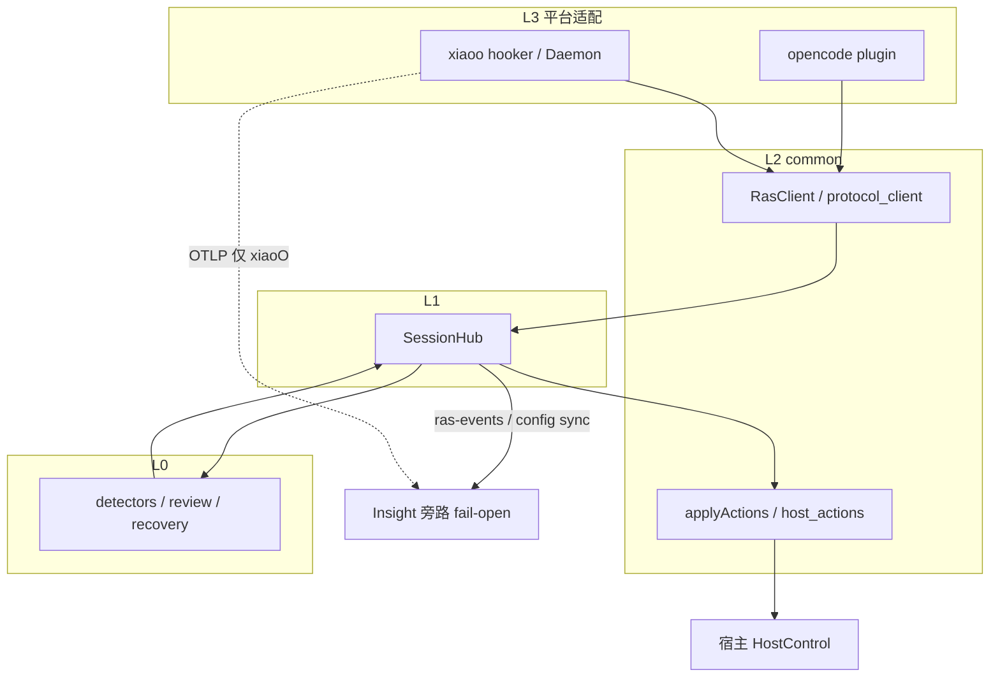
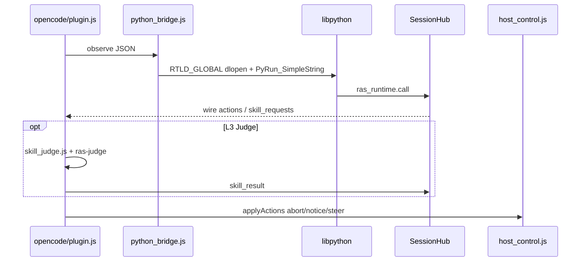
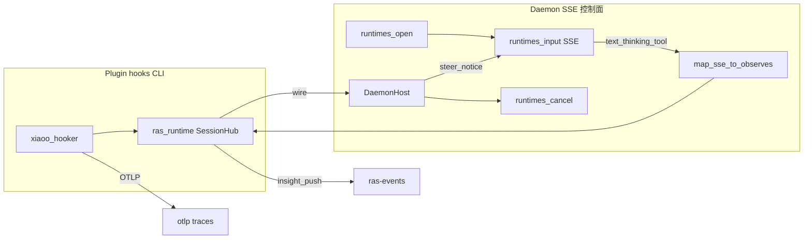
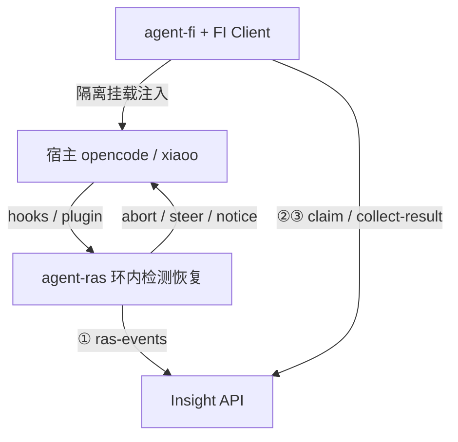

# Agent RAS × OpenCode / xiaoO 对接分析

版本：v1.0  
状态：分析说明（对齐现网实现；非新特性立项）  
关联：[architecture.md](../architecture.md)、[platform-adapter.md](../modules/platform-adapter.md)、[xiaoo-adapter.md](./xiaoo-adapter.md)、[xiaoo-observe-ingest.md](./xiaoo-observe-ingest.md)、[capability-config-sync.md](./capability-config-sync.md)、[guides/platform-opencode.md](../../guides/platform-opencode.md)、[guides/platform-xiaoo.md](../../guides/platform-xiaoo.md)、[ras-fi-insight-relationship.md](../../../agent-fault-injection/designs/ras-fi-insight-relationship.md)

## 1. 结论

OpenCode 与 xiaoO **共用**协议 inproc 骨架：`hooks → RasClient → SessionHub → L0 Detectors/Recovery → wire → HostControl`（**不经** openjiuwen 的 `AgentRASMonitor`）。分叉在 **L3 挂载形态、检测核嵌入方式、控制面 API、L3 语义 Judge、观测导出**。

| | OpenCode | xiaoO |
|--|----------|-------|
| 一句话 | 同进程 Bun 插件 + libpython + ras-judge | Hooker / Daemon SSE + 本机 Python + OTel |
| L3 Judge | 有（`supports_host_skill_judge=True`） | 无（hello 强制关 semantic） |
| 正式 mid-stream | `part.delta` | Daemon SSE（CLI hooks 偏 turn/tool） |

---

## 2. 共享模块关系



**设计原则**：检测/恢复算法只在 L0；L3 禁止复制 Detector；runtime 生命周期归宿主；Insight 只旁路消费。

### 2.1 源码落点

| 层 | 路径 |
|----|------|
| L0 / L1 | `agent_ras/detectors/`、`recovery/`、`ras_runtime/session_hub.py` |
| L2 | `agent_ras/platform_adapter/common/`（`ras_client`、`host_actions`、`protocol_client`、`python_bridge.js`、`subprocess_ipc`） |
| L3 OpenCode | `agent_ras/platform_adapter/opencode/`（`plugin.js`、`host_control.js`、`skill_judge.js`、`config_sync.js`） |
| L3 xiaoO | `agent_ras/platform_adapter/xiaoo/`（`hooks.py`、`daemon_*.py`、`hooker/`、`otel_trace.py`、`config_sync.py`） |
| 安装 | `scripts/install-ras.js` → `~/.config/opencode`、`~/.config/xiaoo` |
| 本机配置 | `~/.agent-insight/ras/config.json`（`agent_ras.platforms.<platform>`） |

### 2.2 配置同步

Insight `GET /api/ingest/ras-config?platform=opencode|xiaoo` → 客户端合并写入本机 RAS 配置。详见 [capability-config-sync.md](./capability-config-sync.md)。xiaoo hello 仍强制 `semantic_content_enabled=false`。

---

## 3. 双路径机制

### 3.1 OpenCode



1. **采点**：`message.part.delta` / `part.updated`、tool hooks → `createRasClient().observe`
2. **嵌入核**：`python_bridge` 先 `dlopen(libpython, RTLD_GLOBAL)`，再 `bun:ffi` 绑定 Py API → `ras_runtime.call`
3. **编排**：SessionHub + L0 → `build_recovery_actions` → wire（可 park `skill_requests`）
4. **L3 Judge（独有）**：`skill_judge.js` 独立 session + ras-judge → `skill_result` 回 Hub
5. **投递**：`session.abort`（v1/v2 兼容）· toast notice · idle 后 `session.prompt` steer

### 3.2 xiaoO



1. **Hooker（CLI）**：`Chat.received` → hello；`Tool.post` → tool after；lifecycle → reset（偏 turn/tool）
2. **Daemon SSE（正式 mid-stream）**：`text_delta` / `thinking_delta` / `tool_*` → observe → SessionHub
3. **嵌入核**：本机 Python `import ras_runtime`；hooker 经 `subprocess_ipc` 共享 Hub（**无需** libpython FFI）
4. **无 L3 Judge**：`supports_host_skill_judge=False`
5. **投递 + 观测**：`POST .../runtimes/cancel` + `.../input`（lease）；旁路 ras-events **+** OTel flush

本地私改 gateway（`ras_control.sock` 上游注入）**废止**；正式控制面为官方 Daemon HTTP/SSE。

---

## 4. 机制差异矩阵

| 维度 | OpenCode | xiaoO |
|------|----------|-------|
| 宿主语言 | Bun / JS 同进程 | Python hooker + Daemon HTTP |
| 检测核嵌入 | 必须 libpython FFI | 本机 Python import |
| Stream 深度 | `part.delta` 近实时 | CLI turn 级；Daemon SSE mid-stream |
| Abort | `session.abort` + 重试 | `POST runtimes/cancel`（lease） |
| Steer / Notice | toast + idle 后 prompt | `runtimes/input`（可 `[RAS]` 前缀） |
| L3 语义 Judge | 有（ras-judge） | 无（强制关 semantic） |
| 观测上报 | ras-events | ras-events + OTLP traces |
| 上游侵入 | 官方 Plugin API | 禁止改源码；废止私改 sock |
| 能力开关 | `platform_capabilities["opencode"].supports_host_skill_judge=True` | `xiaoo=False` |

---

## 5. 信号与恢复映射

### 5.1 采点 → Signal

| 来源 | Signal / 用途 |
|------|----------------|
| OC `part.delta` / `updated` | `STREAM_CHUNK` · thinking/llm |
| OC tool hooks | `BEFORE/AFTER_TOOL_CALL` |
| XO `Chat.received` | `hello`（唯一建会话入口） |
| XO `Tool.post` | `AFTER_TOOL_CALL` + result/error |
| XO SSE `text_delta` / `thinking_delta` | `STREAM_CHUNK` · `llm_output` / `llm_reasoning` |
| XO SSE `tool_*` | `AFTER_TOOL_CALL` · RepeatToolCall 等 |

### 5.2 wire → Host

| wire | OpenCode | xiaoO（正式） |
|------|----------|---------------|
| `abort_stream` | `session.abort` | `runtimes/cancel` |
| `emit_notice` | toast / 可见回退 | `runtimes/input` |
| `push_steering` | idle 后 `session.prompt` | `runtimes/input` |
| `skill_result` | 回 SessionHub | 不适用 |

---

## 6. 与 FI / Insight 的边界



| | RAS | FI |
|--|-----|----|
| **OpenCode** | 协议 inproc；可 libpython 嵌 detectors | 系统 config + workspace TS 插件（无 so；分层叠加，不必 merge 用户 config） |
| **xiaoO** | hooks / Daemon → ras_runtime | config overlay（保留 RAS hooker）+ Python hooker |
| **与 Insight** | ① ras-events；XO 另 OTel | ②③ FI Client + collect-result |
| **恢复/评判** | 本机 HostControl | Insight 服务端 Judge |

同宿主可并存 RAS 与 FI，挂载点与配置隔离；xiaoO 适配设计要求 **`agent_fault_injection/**` 零 diff**（RAS 侧不改 FI）。

**FI 配置为何不对称：** OpenCode 靠 workspace 增量挂 FI，系统侧 RAS 仍在；xiaoO 评测必须临时替换整份 `XIAOO_CONFIG`，而 hooker 列表是替换语义——故 overlay 时必须以用户 config 为底并**保留**原 `[hooker].plugins`（含 RAS）再叠加 FI，否则同跑会丢 RAS。理由与对照表见 [xiaoo-platform-adaptation.md §4.1](../../../agent-fault-injection/designs/xiaoo-platform-adaptation.md)；挂载总览见 [ras-fi-insight-relationship.md §6](../../../agent-fault-injection/designs/ras-fi-insight-relationship.md)。

---

## 7. 模块依赖简图

```text
OpenCode 宿主 (plugin + SDK) ──┐
                                ├──► L2 common ──► L1 SessionHub ──► L0 core
xiaoO 宿主 (hooker / Daemon) ──┘         │                │
                                         │                └──► Insight (config / events)
                                         └── xiaoO only: OTel
```

L3 分叉进 L2 后合流；仅 xiaoO 另连 OTel；仅 OpenCode 在 L3 回灌 `skill_result`。

---

## 8. 延伸阅读

| 主题 | 文档 |
|------|------|
| 架构真源 / FFI | [architecture.md](../architecture.md) |
| 能力矩阵 / 加平台 | [platform-adapter.md](../modules/platform-adapter.md) |
| xiaoO 设计 | [xiaoo-adapter.md](./xiaoo-adapter.md) |
| xiaoO OTel | [xiaoo-observe-ingest.md](./xiaoo-observe-ingest.md) |
| 配置同步 | [capability-config-sync.md](./capability-config-sync.md) |
| OpenCode 安装验收 | [platform-opencode.md](../../guides/platform-opencode.md) |
| xiaoO 安装验收 | [platform-xiaoo.md](../../guides/platform-xiaoo.md) |
| RAS · FI · Insight | [ras-fi-insight-relationship.md](../../../agent-fault-injection/designs/ras-fi-insight-relationship.md) |
