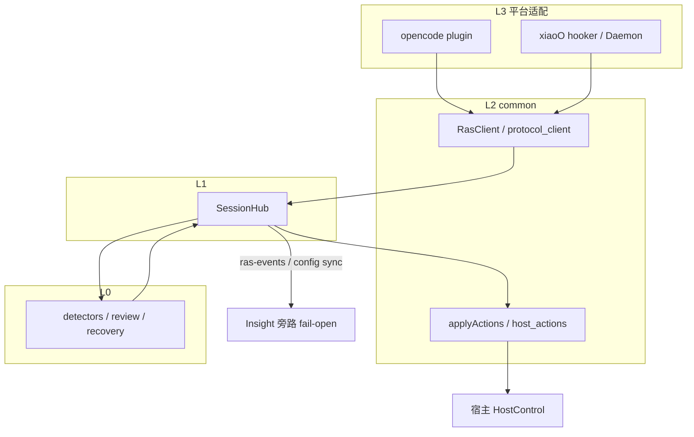
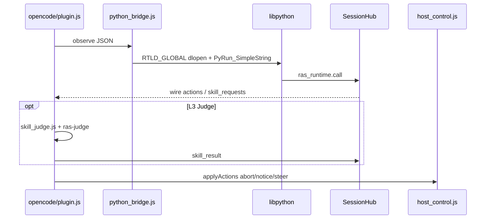
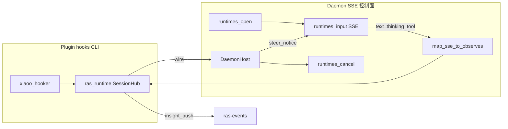
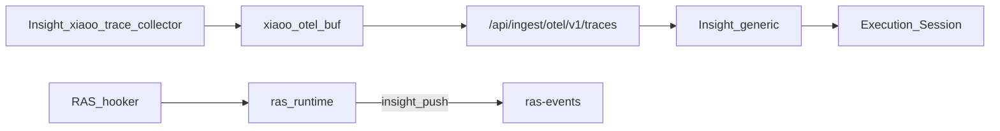
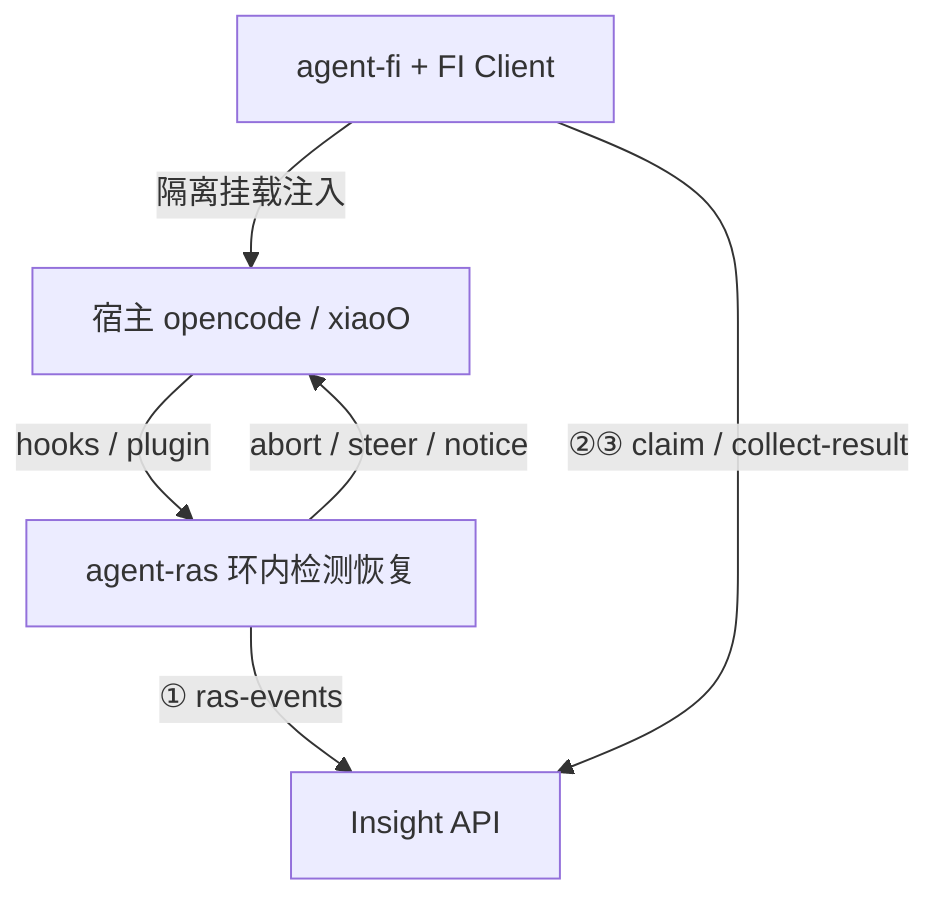

# OpenCode / xiaoO 平台接入方案

版本：v2.5  
最后更新：2026-08-13  
状态：已落地（对齐现网实现）

---

## 1. 概述

Agent RAS 的价值在于 **环内** 干预：在 Agent 仍在输出、宿主还能 cancel/steer 时发现问题并恢复。OpenCode 与 xiaoO 是两类典型宿主——前者有官方 Plugin、同进程事件；后者是 gateway + hooker、stock 版无深挂载——但 RAS 对它们的产品承诺相同：同一套 detector 阈值、同一套 recovery 语义、同一套 Insight join 键。

本方案的核心设计命题是 **「算法单点、适配薄层」**：L0 写一次，L3 只翻译宿主世界与 RAS 世界。若允许 L3 复制 detector 或改 wire 文案，平台一多就会阈值漂移、A/B 失效、单测碎片化。OpenCode 与 xiaoO 因此在 L2 合流为协议 inproc，**刻意不** 走 openjiuwen 的 `AgentRASMonitor` 深挂载链——那不是「降级」，而是承认两家宿主没有 rail 级拦截能力，用更薄的 `SessionHub` 直调 L0，避免 jiuwen 专用分支污染 inproc。

| | OpenCode | xiaoO |
|--|----------|-------|
| 一句话 | 同进程 Bun 插件 + libpython + ras-judge | Hooker / Daemon SSE + 本机 Python；⓪ Trace 走 Insight collector |
| L3 Judge | 有（HostCallback + ras-judge） | 有（同一 inproc：`HostCallback` + `RasClient.skill_result`） |
| 正式 mid-stream | `message.part.delta` + `part.updated` | Daemon SSE（CLI hooks 偏 turn/tool） |
| 检测核嵌入 | 必须 libpython FFI（Bun 同进程） | 本机 Python import；hooker 经 `subprocess_ipc` 共享 Hub |

---

## 2. 总体架构

分层哲学：**L0 管「该不该拦」；L1 管会话状态与 recovery 编排；L2 管跨平台 wire 契约；L3 管宿主 API 翻译**。Insight 在 Hub 旁路，不参与环内决策。

下图表达的是 **合流点**（L2）与 **分叉点**（L3），不是调用顺序手册；文件级时序见 `architecture.md` §4。



配置同步的设计意图：看板是阈值「权威源」，客户端 hello 携带合并结果，避免每台机器手改 JSON 与看板漂移。OpenCode / xiaoO 默认开 semantic Judge（显式 `false` 才关）。

### 2.1 源码落点

| 层 | 路径 |
|----|------|
| L0 / L1 | `agent_ras/detectors/`、`review/`、`recovery/`、`ras_runtime/session_hub.py` |
| L2 | `agent_ras/platform_adapter/common/`（`ras_client`、`host_actions`、`protocol_client`、`python_bridge.js`、`transport/subprocess_ipc/`） |
| L3 OpenCode | `agent_ras/platform_adapter/opencode/`（`plugin.js`、`host_control.js`、`skill_judge.js`、`config_sync.js`） |
| L3 xiaoO | `agent_ras/platform_adapter/xiaoo/`（`hooks.py`、`daemon_*.py`、`hooker/`、`config_sync.py`） |
| ⓪ xiaoO Trace | `scripts/xiaoo-trace-collector/`（Insight 侧；RAS **不做** OTLP） |
| 安装 | `scripts/install-ras.js` → `~/.config/opencode`、`~/.config/xiaoo` |
| 本机配置 | `~/.agent-insight/ras/config.json`（`agent_ras.platforms.<platform>`） |

### 2.2 配置同步

Insight `GET /api/ingest/ras-config?platform=opencode|xiaoo` → 客户端合并写入本机 RAS 配置。`semantic_content_enabled` 默认 **true**（显式 `false` 才关 L3）；OpenCode / xiaoO 均走 SessionHub 的 `skill_requests` / `skill_result`，不按平台强制关掉 semantic。

### 2.3 协议 inproc 与深挂载对照

| | 协议 inproc（OpenCode / xiaoO） | 深挂载（openjiuwen） |
|--|--------------------------------|----------------------|
| 编排核 | `SessionHub` | `AgentRASMonitor` |
| 恢复出口 | `build_recovery_actions` → JSON wire → `applyActions` | `RecoveryExecutor` 直调 Host |
| 嵌入方式 | libpython FFI 或本机 Python import | 宿主已是 Python，Rail 注入 |
| L3 Judge | `HostCallbackAgentAdapter` + `skill_result` | `DeepAgentAdapter` |
| 环内 abort 能力 | 部分能力（SDK / Daemon lease） | 深（chunk / rail 级） |

---

## 3. OpenCode 接入

### 3.1 设计目标与取舍

OpenCode 路径追求 **最低环内延迟** 与 **可挂载语义 Judge**。接受的能力边界是：abort 依赖 SDK，属 partial，产品文档不得与 openjiuwen 深挂载混称。

HostControl 的三条设计约束：

1. **文案不可改写**：toast/steer 必须来自 core wire，否则 recovery 策略与 UI 分离失败，阈值实验不可比。
2. **`ok` 必须真实**：abort 后 3s 内仍有 assistant 文本 → 记 `no_effect`，用于区分「调了 API 但没停住」。
3. **steer 与 abort 竞态**：abort 已使 session idle 时须立即 steer，否则用户看到停流却收不到恢复指令。

L3 Judge **后台单飞** 的理由：Judge 可能慢于主流 chunk 间隔，阻塞 observe 会放大延迟；同一 request 只下发一次避免 Judge 风暴。

### 3.2 架构与时序



1. **采点**：`message.part.delta` / `part.updated`、tool hooks → `createRasClient().observe`
2. **嵌入核**：`python_bridge` 先 `dlopen(libpython, RTLD_GLOBAL)`，再 `bun:ffi` 绑定 Py API → `ras_runtime.call`
3. **编排**：SessionHub + L0 → `build_recovery_actions` → wire（可 park `skill_requests`）
4. **L3 Judge**：`skill_judge.js` 独立 session + ras-judge → `skill_result` 回 Hub（xiaoO 走同一 `skill_result` 协议，host runner 不是 ras-judge 插件）
5. **投递**：`session.abort`（v1/v2 兼容）· toast notice · idle 后 `session.prompt` steer

安装与验收的操作步骤见 `platform_adapter/opencode/INSTALL.md`；设计层验收标准是：**环内恢复先于 ingest 成功**——ingest 挂掉时仍应 abort/notice。

### 3.3 HostControl（wire → OpenCode API）

| wire | 实现要点 |
|------|----------|
| `abort_stream` | `session.abort`（兼容 SDK v2 `{ sessionID }` 与 v1 `{ path: { id } }`）+ 可选 `session.interrupt` + 双次 `tui.executeCommand(session.interrupt)`；限频重试 |
| `emit_notice` | `tui.showToast` → fallback `tui.publish` / `noReply` prompt；正文原样来自 core |
| `push_steering` | idle 后 `session.prompt({ sessionID, parts })`；abort 已 idle 则立即注入 |
| `skill_result` | 回 SessionHub（xiaoO 不适用） |

### 3.4 OpenCode 采点 → Signal

| 来源 | Signal / 用途 |
|------|----------------|
| `message.part.delta` / `part.updated` | `STREAM_CHUNK` · `llm_output` / `llm_reasoning` |
| tool hooks before/after | `BEFORE_TOOL_CALL` / `AFTER_TOOL_CALL` |
| plugin session 生命周期 | `hello` / `reset` |

---

## 4. xiaoO 接入

### 4.0 原则（入口无关 / Daemon 控制面）

| # | 原则 |
|---|------|
| P1 | 检测/恢复只在 L0 + `ras_runtime`；L3 禁止复制策略 |
| P2 | **入口无关**：差异只在 Host callable / 采点运输，不在 Detector |
| P3 | hooks → `RasClient` → `SessionHub` → wire → `CallableHostControl` |
| P4 | `xiaoo/` 仅 hook 映射 + Host 三函数 + Daemon 客户端；**`agent_fault_injection/**` 零 diff** |
| P5 | Daemon HTTP/SSE 为 stock master 正式 Stream/Host 路径（lease 由 RAS 持有） |
| P6 | FI Worker **不**拉起 `DaemonRasSession`；RAS 是否在场 = 平台挂载 |

### 4.1 设计目标：互补双路径

hooker 与 Daemon 不是两套 RAS，而是 **同一 Hub 上的两种采点/控制来源**：

| 路径 | 设计职责 | 为何不能由另一路径替代 |
|------|----------|------------------------|
| hooker | 会话边界、turn 级 tool、lifecycle | Daemon 不承担 chat 级 hello 语义 |
| Daemon SSE | mid-stream 思考/tool、正式 cancel/steer | hooker 在 stock 上无 token 流挂载 |
| gateway `stream_delta` 直调 | 仅 RAS ① 文本 observe | 非 4 段 hook_point，不能进 collector |



1. **Hooker（CLI）**：`Chat.received` → hello；`Tool.post` → tool after；lifecycle → reset；`stream_delta` → **仅** ① text observe（**不**转发 Trace）
2. **Daemon SSE（正式 mid-stream）**：`text_delta` / `thinking_delta` / `tool_*` → observe → SessionHub
3. **嵌入核**：本机 Python `import ras_runtime`；hooker 经 `subprocess_ipc` 共享 Hub（**无需** libpython FFI）
4. **L3 Judge**：与 OpenCode 同为 inproc `HostCallback` + `skill_result`（Python `RasClient.skill_result`，无需 ras-judge 插件）
5. **投递 + 旁路**：`POST .../runtimes/cancel` + `.../input`（lease）；旁路 **仅** ras-events；完整链路 OTLP **仅** Insight `xiaoo-trace-collector`（RAS/FI 不做 Trace）

本地私改 gateway（`ras_control.sock` 上游注入）**已移除**；正式控制面为官方 Daemon HTTP/SSE。

### 4.2 L3 模块边界

| 模块 | 职责 |
|------|------|
| `hooker/` | Chat / Tool / lifecycle → hello / observe / reset（**tool_post 禁止 hello**） |
| `hooks.py` | `build_xiaoo_daemon_host_fns`；plugin hooker Host **unwired**（stdout HookAction） |
| `daemon_*` | open / input / cancel + SSE→Signal |

### 4.3 采点映射

**Plugin hooks**

| 来源 | Signal |
|------|--------|
| `*.Chat.message.received` | `hello`（唯一建会话入口） |
| `*.Tool.*.post` | `AFTER_TOOL_CALL` + result/error |
| `stream_delta`（gateway 直调，非 4 段 hook_point） | `assistant_text` / `STREAM_CHUNK` |
| Session closed-like | `reset` |

**Daemon SSE → Signal**

| SSE `type` | Signal | Detector |
|------------|--------|----------|
| `text_delta` | `STREAM_CHUNK` / `llm_output` | `LlmThinkingLoopDetector` L1/L2 |
| `thinking_delta` | `STREAM_CHUNK` / `llm_reasoning` | 同上 |
| `tool_result`（含 `is_error`） | `AFTER_TOOL_CALL` | `RepeatToolCallDetector`（含 `unknown_tool_repeat`） |
| `tool_call` failed/denied | 同上（错误） | 同上 |

### 4.4 HostControl

| wire | Daemon 路径（正式） |
|------|---------------------|
| `abort_stream` | `POST /api/v1/runtimes/cancel` |
| `emit_notice` / `push_steering` | `POST .../runtimes/input`（同一 `client_id`；可选 `[RAS]` 前缀） |

Plugin hooker 不接线 Host；CLI 路径恢复动作为 stdout HookAction。

### 4.5 完整链路观测（⓪ 与 ①）

设计问题：谁为 Insight **主树**负责？答案必须是 collector（⓪），不是 RAS（①）。



| 层 | 职责 |
|----|------|
| ⓪ Trace | `scripts/xiaoo-trace-collector/` → `POST /api/ingest/otel/v1/traces` |
| ① RAS | 仅 `ras-events` + 环内检测/恢复 |
| ③ FI | 仅 `collect-result` → Judge；不合成 Execution |

**观测原则（P1–P6）**

| # | 原则 |
|---|------|
| P1 | ⓪ Trace 由 Insight `xiaoo-trace-collector` 上报 OTLP |
| P2 | ① RAS 仅 ras-events；hooker **不** buffer/flush OTLP，**不**调用 Insight `note_*` |
| P3 | ③ FI 仅 collect-result；**不**做 Trace，**不**合成可靠性 `Execution` |
| P4 | 字段保持 generic 可解析（`service.name=xiaoo`、`session.id`、`gen_ai.*` / `tool.*`） |
| P5 | Insight 服务端优先零改动（generic ingest）；不足再加法 |
| P6 | `stream_delta` 仅服务 ① observe；⓪ 助手文本真源为 `*.Llm.complete.post` → `note_stream` |

**字段（Join 与 ingest）**

| 用途 | **必发（现网认）** | 可选双写 |
|------|-------------------|----------|
| Session / Join | `session.id` = native gateway id | `witty.session.id` 同值 |
| Resource | `service.name=xiaoo` | — |
| LLM | `gen_ai.span.kind=llm`；`gen_ai.prompt` / `gen_ai.completion` | `witty.agent.*` |
| Tool | `tool.name`；`input.value` / `output.value` | `witty.tool.*` |

**Join**：RAS `taskId`（strip `xiaoo:`）=== `session.id`。

**Flush 策略**

| 事件 | 谁处理 |
|------|--------|
| Chat / Tool / `*.Llm.complete.post` / Session lifecycle | Insight collector（note + flush） |
| `stream_delta` | RAS hooker → **仅** ① `observe_text_delta`（无 Trace；不能注册为 collector 4 段 hook_point） |
| lifecycle idle/complete | Insight collector **flush OTLP**；RAS 仅 `reset` |

无 llm/tool turn 时 collector **不** POST 空 agent 根 span。`Llm.complete.post` 等 hook 常无 `session_id`，collector 用 chat/lifecycle 维护 sticky `_active_session.json` 关联。

### 4.6 验收门禁

| # | 通过条件 |
|---|----------|
| A | stock xiaoO master；无 upstream 私改 |
| B | Daemon SSE → thinking / tool observe 进 Hub |
| C | `tool_repeat_dead_loop` submode 2 + `thinking-dead-loop` 可检出并恢复 |
| D | abort / notice / steer 在 Daemon lease 下 `ok` |
| E | Insight `platform=xiaoo`；同 taskId 可见 RasAnomaly + Execution |
| F | `agent_fault_injection/**` 零 diff |
| G | `e2e_xiaoo_daemon_harness.py` / 单测通过 |

验收验证的是 **§8 关键决策是否成立**（见上表），而非单点 API 通不通。

```bash
cd agent_ras && PYTHONPATH=. python scripts/e2e_xiaoo_daemon_harness.py
cd agent_ras && PYTHONPATH=. python scripts/e2e_xiaoo_inproc_harness.py
```

---

## 5. 机制差异与契约

### 5.1 差异矩阵

| 维度 | OpenCode | xiaoO |
|------|----------|-------|
| 宿主语言 | Bun / JS 同进程 | Python hooker + Daemon HTTP |
| 检测核嵌入 | 必须 libpython FFI | 本机 Python import |
| Stream 深度 | `part.delta` 近实时 | CLI turn 级；Daemon SSE mid-stream |
| Abort | `session.abort` + 重试 | `POST runtimes/cancel`（lease） |
| Steer / Notice | toast + idle 后 prompt | `runtimes/input`（可 `[RAS]` 前缀） |
| L3 语义 Judge | 有（ras-judge host runner） | 有（`HostCallback` + `RasClient.skill_result`） |
| 观测上报 | ras-events（⓪ 由 Insight OC upload 插件） | ras-events（⓪ 由 Insight xiaoo-trace-collector OTLP） |
| ① RAS | ras-events | ras-events |
| 上游侵入 | 官方 Plugin API | 禁止改源码；废止私改 sock |
| 能力开关 | `supports_host_skill_judge=True` | `supports_host_skill_judge=True` |

### 5.2 采点 → Signal

| 来源 | Signal / 用途 |
|------|----------------|
| OC `part.delta` / `updated` | `STREAM_CHUNK` · thinking/llm |
| OC tool hooks | `BEFORE/AFTER_TOOL_CALL` |
| XO `Chat.received` | `hello`（唯一建会话入口） |
| XO `Tool.post` | `AFTER_TOOL_CALL` + result/error |
| XO SSE `text_delta` / `thinking_delta` | `STREAM_CHUNK` · `llm_output` / `llm_reasoning` |
| XO SSE `tool_*` | `AFTER_TOOL_CALL` · RepeatToolCall 等 |
| XO `stream_delta`（gateway 直调） | 仅 ① RAS observe；非 ⓪ Trace |

### 5.3 wire → Host

| wire | OpenCode | xiaoO（正式） |
|------|----------|---------------|
| `abort_stream` | `session.abort` | `runtimes/cancel` |
| `emit_notice` | toast / 可见回退 | `runtimes/input` |
| `push_steering` | idle 后 `session.prompt` | `runtimes/input` |
| `skill_result` | 回 SessionHub | 回 SessionHub（`RasClient.skill_result`） |

Host 返回 notice/steer **正文必须来自 core wire**；abort 后 3s 内仍有 assistant 文本则记 `no_effect`。

---

## 6. 与 FI / Insight 的协作



| | RAS | FI |
|--|-----|-----|
| **OpenCode** | 协议 inproc；可 libpython 嵌 detectors | 系统 config + workspace TS 插件（无 so；分层叠加，不必 merge 用户 config） |
| **xiaoO** | hooks / Daemon → ras_runtime | config overlay（保留 RAS hooker）+ Python hooker |
| **与 Insight** | ① ras-events；⓪ 各走 Insight 采集器 | ②③ FI Client + collect-result（不造 Execution） |
| **恢复/评判** | 本机 HostControl | Insight 服务端 Judge |

---

## 7. 模块依赖简图

```text
OpenCode 宿主 (plugin + SDK) ──┐
                                ├──► L2 common ──► L1 SessionHub ──► L0 core
xiaoO 宿主 (hooker / Daemon) ──┘                          │
                                                          └──► Insight ① ras-events

⓪ Trace：OpenCode → Insight upload 插件；xiaoO → Insight xiaoo-trace-collector（非 RAS）
```

L3 分叉进 L2 后合流；完整链路 Trace **不经** RAS；OpenCode / xiaoO 均在 L3 回灌 `skill_result`。

---

## 8. 设计意图与关键决策

### 8.1 要解决的根本问题

平台适配不是「把 hook 名映射成函数名」，而是回答三个设计问题：

1. **观测够不够早**：思考环要在 token 流上累积，turn 结束后才看见等于放弃 abort。
2. **恢复可不可信**：toast 出现但流仍在，比不提示更伤信任；Host 的 `ok` 必须反映宿主执行结果。
3. **职责清不清楚**：RAS 管环内检测与 ras-events；Insight 管完整 Trace 与看板 join；FI 管注入与 collect-result——三者不能互相「顺便」代劳。

若不在设计层钉死边界，实现上最容易出现的三种腐化是：L3 里复制 L0 逻辑、RAS hooker 里 buffer OTLP、为 xiaoO 私改 gateway。本方案对三种腐化均给出显式否决与替代路径。

### 8.2 决策：L0 单点，L3 只做翻译

**意图**：让 thinking-loop、repeat-tool 等域的阈值、review、recovery 文案在全平台一致，Insight 看板改配置一次，各宿主 hello 同步。

**理由**：Detector 的状态机（连续失败计数、流式字符累积）跨 chunk 有记忆，若分平台实现，bug 修一处漏一处。L3 允许的差异只有：事件从哪来、cancel 调哪个 API、Judge 有没有挂载点。

**约束**：L3 禁止改用户可见文案（必须原样展示 core wire）；禁止在 L3 写检测阈值。

### 8.3 决策：inproc 用 SessionHub，不用 AgentRASMonitor

**意图**：OpenCode/xiaoO 与 openjiuwen 共用 L0 源码，但编排核不同。

**理由**：`AgentRASMonitor` 与 `RecoveryExecutor`、Rail 生命周期绑定，假设宿主是 Python 且能 deep abort / force-finish。OpenCode 是 Bun 插件，xiaoO 是 HTTP cancel——没有同构 StreamBus。硬套 Monitor 会把 inproc 路径拖进 jiuwen 专用 wire（如 `TERMINATE`），增加 dead code 与错误预期。

**取舍**：接受 inproc 恢复能力为部分能力（环内尽力打断），换取架构清晰与维护成本可控。

### 8.4 决策：Insight 旁路 fail-open

**意图**：RAS 首先是用户的环内安全网，其次才是观测数据源。

**理由**：ras-events ingest 失败不应导致该停的流不停。config 拉取失败也不应阻止 hello 用本机缓存阈值工作。旁路与主路径解耦，是可靠性产品的基本姿态。

### 8.5 OpenCode：为什么必须同进程 FFI

**否决方案**：独立 RAS 守护进程 + RPC；外置 Python 子进程每 chunk IPC。

**理由**：流式检测的状态在 SessionHub 内累积，跨进程每次 observe 都要序列化 session 快照，延迟与竞态不可接受；且 OpenCode 宿主不是 Python，无法 `import ras_runtime`。

**选定方案**：`RTLD_GLOBAL` dlopen libpython，与 Bun 同地址空间调 `ras_runtime.call`。代价是安装器必须探测 libpython、Windows 原生不支持——这是为环内低延迟支付的工程成本。

**另两条产品级约束**（来自 OpenCode SDK 现实，不是实现细节堆砌）：

- 必须同时听 `part.delta` 与 `part.updated`：否则 1.18+ 流式路径下检测发生在段末，mid-stream abort 名存实亡。
- abort 必须兼容 SDK v1/v2：只传一种参数时流会继续，用户会判定 RAS 失效；TUI interrupt 只能兜底，不能当唯一手段。

**L3 语义 Judge 的存在理由**：字面 L1/L2 对 thinking-loop 误报成本高，需要异步语义判定且不阻塞主流。OpenCode 与 xiaoO 都走 SessionHub 的 `skill_requests` / `skill_result`（`HostCallbackAgentAdapter`）；差别只在 host runner：OpenCode 用 `skill_judge.js` + ras-judge，xiaoO 用 Python 侧 `RasClient.skill_result`。

### 8.6 xiaoO：为什么双路径，为什么废止私改 gateway

**否决方案 A**：只做 CLI hooker——无法在 stock master 上 mid-stream cancel，思考环只能事后看。

**否决方案 B**：私改 gateway / sock 注入——每轮 upstream 合并是持续税，违反「交付 stock master、不改源码」。

**选定方案**：hooker 管会话与 turn 级 tool（hello 唯一入口、tool_post 禁止 hello 是为避免「一 tool 一 session」污染 Hub）；Daemon SSE 管 mid-stream 与正式 Host（lease 保证 cancel 作用在 RAS 正在观测的 runtime）。

**入口无关** 的设计意图：未来若 xiaoO 增加 TUI 直连接口，Detector 不应改；只增 L3 采点与 Host callable。

**subprocess IPC** 的存在理由：gateway fork hooker 子进程是平台行为，不是 RAS 能禁止的；repeat-tool 需要跨 tool 调用的连续计数，**必须** 单一 Hub，否则检测语义在进程边界断裂。

**hooker Host 故意 unwired**：子进程内嵌 Daemon 客户端会与 lease 模型冲突；CLI 集成方若需要 HookAction 可自行消费，正式 cancel/steer 闭环以 Daemon harness 为准。

**skip unknown session**（v0.3.1）：假 session 会污染 Insight join，宁可丢 observe 也不写 `unknown`——这是数据质量优先于「尽量多收」的设计选择。

### 8.7 观测：为什么 Trace 从 RAS 拆出

**意图**：RAS 回答「现在要不要停」；Insight 回答「这一轮到底发生了什么」。二者对事件完整性与 flush 时机的需求不同。

**理由**：OTLP buffer 与 detector 耦在一起，会迫使 flush 策略服从检测节奏，且 RAS 与 FI 会争抢「谁建 Execution 主树」。v0.1→v0.3 的演进是在实践中确认：Trace 是 Insight 产品层能力，应独立 collector 承担。

**xiaoO 特有风险**：`stream_delta` 不能挂进 collector 的 4 段 hook_point（平台插件体系限制），若强行双写会重复或丢事件；故 stream_delta **仅** 服务 RAS ① observe，⓪ 助手文本以 `Llm.complete.post` 为真源。sticky session 是因为 hook payload 常缺 `session_id`——collector 用 lifecycle 记忆关联，FI 不得传 session 顶替，否则 join 键被评测污染。

**Join 不变量**：RAS `taskId`（去 `xiaoo:`）与 OTLP `session.id` 必须同源，看板才能把 RasAnomaly 与 Execution 对齐。

### 8.8 与 FI 的边界意图

RAS 与 FI **问题域不同**：前者是运行期护栏，后者是评测期注入。FI Worker 拉起 RAS 会混淆「注入导致的异常」与「RAS 检出的异常」，无法黑盒评 FI。

xiaoO 评测 overlay 整份 config 时 hooker 列表是**替换语义**——设计约束是 overlay 必须以用户 config 为底保留 RAS hooker，否则同跑 silently 丢 RAS。OpenCode 侧 workspace 插件叠加，不对称是平台 config 模型差异，不是实现疏漏。

### 8.9 明确非目标

- 不在 OpenCode 复刻 jiuwen chunk suppress / deep rail abort。
- 不让 RAS/FI 承担 xiaoO 日常完整 OTLP。
- 不 fork xiaoO、不维护私改 gateway。
- 不为 xiaoO RAS 改 `agent_fault_injection/**`。

---

## 9. 演进与变更原则

**加 detector**：只动 L0/YAML；L3 仅当新 Signal 类型需要新采点。

**改 recovery 文案**：只动 L0；L3 原样展示。

**改平台 abort/Host**：动 L3 HostControl，对照 §5 契约，不引入 L0 分支。

**禁止回流**：RAS 内嵌 OTLP、L3 复制 detector、xiaoO 私改 gateway、FI Worker 启 RAS——均属架构回退，PR 应拒。

v0.1→v0.3（xiaoO Trace）的教训：「方便」把采集塞进 hooker 短期省事，长期边界模糊；独立 collector 是产品分层，不是多一个安装步骤。
