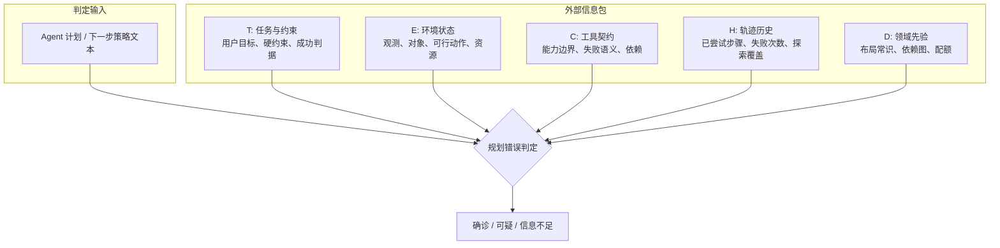
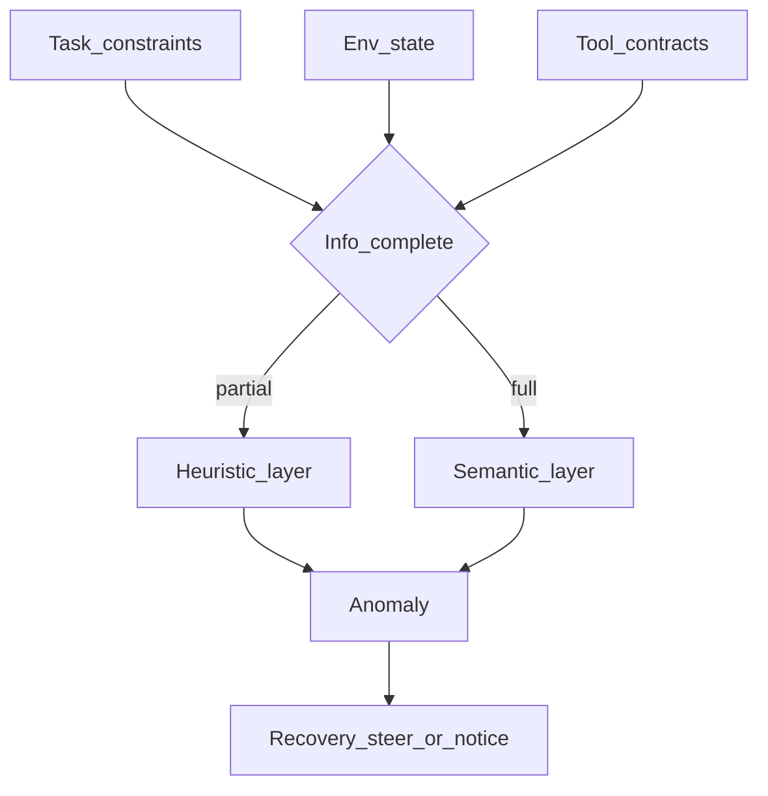
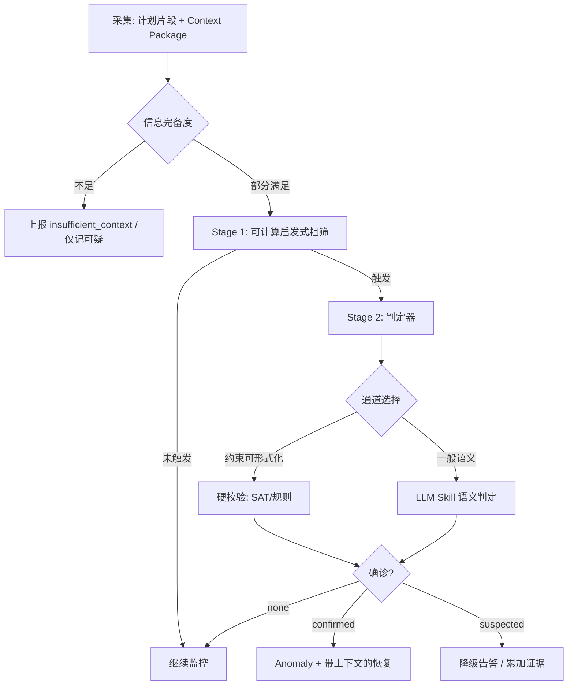
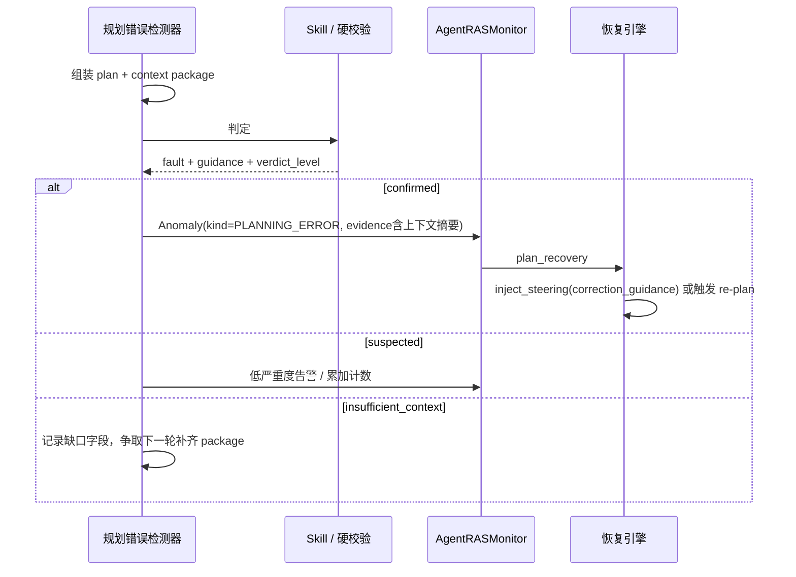
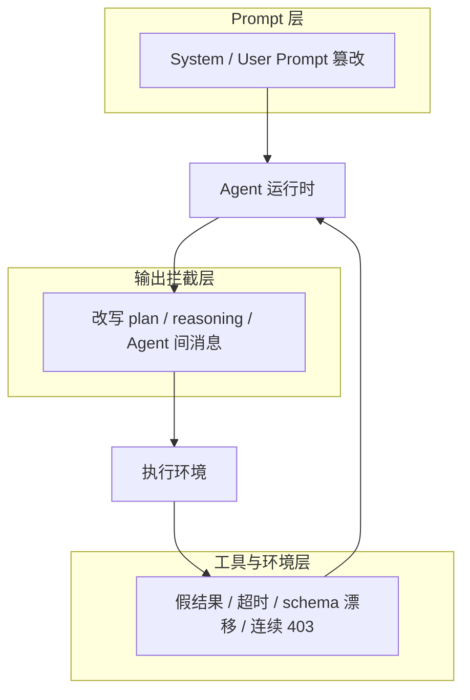
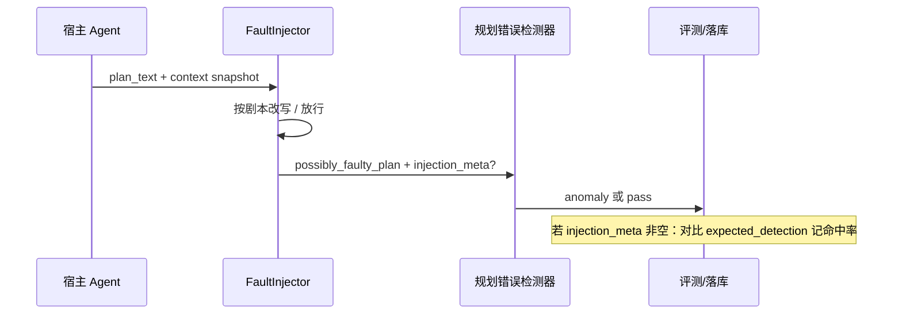

# LLM Agent 规划错误（Planning Error）检测 — 需求分析与方案

版本：v0.2  
最后更新：2026-07-30

> 文档类型：Phase1 需求分析 + 方案设计（合并） | 关联项目：agent-insight / agent_ras  
> 复杂度：**High**（判定依赖任务约束、环境状态、工具契约等外部信息；需按信息完备度分层检测，而非纯文本模式匹配）  
> 关联模块：[agent_ras/detectors/](../../../../agent_ras/detectors/)、[agent_ras/recovery/](../../../../agent_ras/recovery/)、现有 L3 Skill 判定通道  
> 关联调研：[语义层故障注入调研](./analysis-paralysis.md)

---

## 一、场景问题

### 1.1 问题定义

**Planning Error（规划错误）** 是 LLM Agent 在「目标分解 → 策略选择 → 下一步行动」环节产出的一类根因故障：计划或下一步策略在逻辑上不健全、在当前前提下不可行、或系统性忽略了任务约束，使得后续执行即使局部正确也会偏离目标。

其关键特征：

- **错误发生在策略层**：问题出在「要做什么 / 按什么顺序做 / 用什么手段做」，而不只是某次工具参数拼写错误
- **通常会级联放大**：早期规划失误会扭曲后续记忆、反思与行动，形成失败传播链（AgentErrorTaxonomy / AgentDebug 的核心观察）
- **「错」相对外部真值成立**：离开任务约束、环境前置条件、工具能力边界等外部信息，单看 agent 输出文本往往无法判定「是否规划错误」——计划可能看起来通顺、自信、结构完整

AgentErrorTaxonomy（Zhu et al., 2025）将 Planning 模块定义为：

> 逻辑不健全或不可行的策略（impossible actions、constraint ignorance、incoherent subgoals），会级联成后续误操作。

业界常用的细分子类如下：

| 子类 | 定义 | 判定时最依赖的外部信息 |
|------|------|------------------------|
| **Constraint Ignorance** | 形成计划时忽略时间、预算、价格、尺寸、范围等显式约束 | 用户任务中的完整约束集合 |
| **Impossible Action** | 规划了当前前置条件下物理/逻辑上不可能的步骤 | 当前环境状态 / 可执行动作集合 |
| **Inefficient Planning** | 计划过长、搜索空间过窄、步序不合理，易触达步数上限 | 领域先验（高概率位置/路径）+ 已探索集合 |
| **Incorrect Decomposition** | 子任务切分逻辑错误、顺序错误或目标误解 | 任务成功判据 + 依赖关系 |
| **Ineffective Tool Selection** | 选错工具，或明知失败仍坚持同一工具/来源 | 工具契约（能力、失败语义）+ 近期观测 |
| **Missing Prerequisite** | 缺少必要前置步骤（未获取输入就调用下游） | 工具/子任务依赖图 |
| **Unrealistic Planning** | 步骤表面合理，但超出下游模块或运行时能力 | 下游能力边界 / 运行时配额 |

> 来源：AgentErrorTaxonomy（arXiv:2509.25370）、PreFlect Planning Errors（arXiv:2602.07187）、PDoctor（arXiv:2404.17833）、Exploring Autonomous Agents（arXiv:2508.13143）。

### 1.2 典型表现

#### 表现 1：约束被复述但未真正进入策略（Constraint Ignorance）

任务（WebShop 类）：

```
Find me men’s shirts … color: navy, fit type: women, size: small,
price lower than 50.00 dollars.
```

Agent 规划摘要（简化）：

```
搜索男士衬衫，匹配面料与款式，颜色 navy，再筛选结果。
```

文字上「提到了」部分条件，但未处理 `fit type: women` 与 `men’s shirts` 的冲突，也未把价格阈值变成可执行过滤步骤。离开原始约束清单，这段规划看起来完全合理。

#### 表现 2：对环境对象张冠李戴（Impossible Action）

任务（ALFWorld 类）：`put two soapbar in toilet`  
当前观测：柜中只有 `cloth 1` 与 `soapbottle 2`，无可取 soapbar。

Agent 规划：

```
take soapbottle 2 from cabinet 4 —— 拿来当 soapbar 用 / 或许能替代……
```

若不提供「柜内对象列表」与「目标对象类型」，无法区分这是「创造性替代」还是「不可行动作」。

#### 表现 3：搜索策略系统性偏窄（Inefficient Planning）

任务：在房间中找 saltshaker。  
Agent 连续多步只搜 cabinets，忽略 countertop / table 等常见放置面。

单步动作都合法，但相对领域先验是低效计划；需要「已访问位置集合 + 领域布局先验」才能判定。

#### 表现 4：工具能力与计划不匹配（Ineffective Tool Selection）

任务（GAIA 类）：从已下线个人站点横幅符号中解读含义。  
Agent 计划：用 `visit_webpage` 拉取横幅图片再交给 image inspector。

若工具契约写明「`visit_webpage` 只返回文本 markdown、不能取图；目标站返回 403」，则该计划在执行前即可判失败；若没有工具契约，只能等连续 403 后事后归因。

### 1.3 影响范围

- **级联失败**：规划层根因常出现在轨迹中前段/中段（AgentErrorBench 观察：多数失败聚集在 step 6–15），之后记忆与反思被污染，修复成本指数上升
- **步数与成本浪费**：Inefficient Planning 会消耗步数配额直至 `step_limit`，表现为「忙了很久仍失败」
- **静默错误答案**：Constraint Ignorance 可能导致「看似完成、实际未满足约束」的错误交付（比崩溃更危险）
- **不可逆副作用风险**：错误规划若包含删除、发送、下单等动作，事后反思无法回滚（PreFlect 强调 prospective 校验的动机）

---

## 二、判定前提：外部信息依赖（核心约束）

### 2.1 核心命题

> **从定义上看，规划错误是相对「外部真值」的判定，不是相对「文本流畅度」的判定。**  
> 判定器必须能回答：「相对什么，这个计划是错的？」——这个「什么」通常不在 agent 当前这一句输出里，而在任务说明书、环境状态、工具手册、历史观测或领域规则里。

因此：

1. **仅读推理/规划文本的检测器天然信息不足**，容易把通顺但错误的计划判成正常，或把探索性计划误判成错误。
2. **信息完备度决定可检测子类与可检测时机**（执行前 / 执行中 / 事后）。
3. 产品设计必须显式声明：**每种检测模式需要哪些上下文包（context package）**，缺包时降级为「可疑」而非「确诊」。

### 2.2 外部信息分类



| 信息包 | 内容示例 | 缺失时的后果 |
|--------|----------|--------------|
| **T 任务与约束** | 价格上限、尺寸、时间窗、必须/禁止项、完成定义 | 无法判 Constraint Ignorance；易把部分满足当成功 |
| **E 环境状态** | 当前房间对象、页面 DOM 摘要、仓库文件树、数据库 schema | 无法判 Impossible Action / Missing Prerequisite |
| **C 工具契约** | 工具能否读图、是否会 403、参数 schema、副作用级别 | 无法做执行前 Ineffective Tool Selection；只能事后 |
| **H 轨迹历史** | 已访问 URL/位置、连续相同失败、已排除选项 | 无法区分「首次探索」与「低效固执」 |
| **D 领域先验** | 「调料常在台面」「先搜再点」「编译前要装依赖」 | Inefficient Planning 缺少参照基线 |

### 2.3 信息完备度与可判定性矩阵

| 子类 | 仅有 P | P+T | P+T+E | P+T+E+C | P+全量(T/E/C/H/D) |
|------|--------|-----|-------|---------|-------------------|
| Constraint Ignorance | ❌ | ✅ 强 | ✅ | ✅ | ✅ |
| Impossible Action | ❌ | ⚠️ 弱 | ✅ 强 | ✅ | ✅ |
| Missing Prerequisite | ❌ | ⚠️ | ✅ | ✅ 更强 | ✅ |
| Ineffective Tool Selection | ❌ | ❌ | ⚠️ | ✅ 强（可执行前） | ✅ |
| Inefficient Planning | ❌ | ❌ | ⚠️ | ⚠️ | ✅ 强（需 H+D） |
| Incorrect Decomposition | ❌ | ✅ 中 | ✅ | ✅ | ✅ |
| Unrealistic Planning | ❌ | ⚠️ | ⚠️ | ✅（需能力边界） | ✅ |

说明：

- **仅有 P（计划文本）**：几乎不能确诊，最多做「结构异常启发式」（过长、自相矛盾句）——召回低、误报难控。
- **P+T**：适合约束类错误的在线粗检。
- **P+T+E**：适合具身/IDE/浏览等「状态可见」场景的 Impossible Action。
- **+C**：才能把「计划在执行前就不可行」从「执行失败后再归因」前移。
- **+H+D**：才适合 Inefficient Planning；否则探索期误杀率高。

### 2.4 用例详析：外部信息如何决定「能不能判」

#### 用例 U1：电商约束购物（WebShop 风格）

**任务**：在价格、尺码、颜色、版型等多重过滤下找商品。

| 规划片段 | 缺什么信息时的判断 | 有什么信息后的判断 |
|----------|--------------------|--------------------|
| 「先 search men’s shirts navy」 | 看起来合理 | 对照 T：未纳入 `price<50` 与冲突的 `fit type: women` → **Constraint Ignorance** |
| 「点击第一个结果下单」 | 像果断执行 | 对照 T+E：当前列表项不满足 size/price → **计划跳过校验步**（分解缺失） |

**检测含义**：

- Stage1 触发条件不应是「出现 plan 字样」，而应是「计划摘要对 T 中硬约束的覆盖率不足」或「约束关键词未进入可执行步骤」。
- 必须把**用户原始约束结构化抽出**（或原样附给判定 LLM），否则判定模型会与执行 agent 犯同样的遗漏。

**恢复依赖的信息**：同样需要 T——恢复指令应是「按完整约束重写搜索 query / 增加过滤步骤」，而不是笼统「再想想」。

#### 用例 U2：具身房间操作（ALFWorld 风格）

**任务**：`find two pencils and put them in drawer` / `put two soapbar in toilet`。

| 规划片段 | 仅有 P | +E（观测与 admissible actions） | +H（已搜位置）+D（布局先验） |
|----------|--------|----------------------------------|------------------------------|
| `take soapbottle` | 合法英文动作 | 目标是 soapbar 且柜中无 soapbar → **Impossible Action** | — |
| 连续 `look` / 反复开同一柜 | 像在确认 | 动作合法但无新信息 | 已确认桌面仅一支笔仍 `look` → **Inefficient Plan** |
| `go to cabinet 1..N` 穷举 | 像系统搜索 | 每步合法 | 先验上铅笔更常在 desk/shelf，且 H 显示未访问 → **Inefficient** 可疑 |

**检测含义**：

- 没有 E，Impossible Action **无法在线确诊**（除非领域规则极强且写死）。
- Inefficient 对「尚未探索的穷举」应容忍；对「已知空结果仍重复」才可加重。
- 上下文包最小集：`{task, current_observation, admissible_actions, recent_k_steps}`。

#### 用例 U3：开放域调研（GAIA / 浏览器 Agent）

**任务**：从可能已失效的站点提取特定符号含义。

| 规划片段 | 仅有 P+T | +C（工具契约） | +H（连续失败） |
|----------|----------|----------------|----------------|
| 用 `visit_webpage` 取横幅图再 OCR | 像合理多步计划 | 契约：该工具无图、目标域常 403 → **执行前 Ineffective Tool Selection** | 已 14 步 404/403 仍同策略 → 确诊并触发 re-plan |
| 改走 Wayback + 抽 HTML 文本 | 像换套路 | 与契约匹配 → 正常 | — |

**检测含义**：

- 工具契约是「执行前检测」的关键；没有 C，只能做 **事后** 检测（失败计数阈值）。
- 契约可以是静态 YAML（工具说明书），也可以是运行时从连续错误码归纳的「软契约」。
- PreFlect 用离线蒸馏的 Planning Errors 降低对「当场完整世界模型」的依赖，但仍需把 **available tools + 近期失败摘要** 喂给 reflector。

#### 用例 U4：软件工程 Agent（修 bug / 改仓库）

**任务**：修复测试失败；或「给模块加缓存且不破坏 API」。

| 规划片段 | 需要的外部信息 | 可能判定 |
|----------|----------------|----------|
| 「直接改生产配置开关」 | T：环境是否允许；C：是否有写权限/审批工具 | 缺审批 → Unrealistic / Constraint |
| 「先重写整个服务再跑测试」 | D：最小复现路径先验；H：已定位失败测试名 | Inefficient / Incorrect Decomposition |
| 「调用不存在的内部 API」 | E：代码索引 / LSP / 仓库符号表 | Impossible Action（符号层） |
| 「跳过失败测试并提交」 | T：成功判据含测试全绿 | Constraint Ignorance（违反质量约束） |

**检测含义**：

- IDE Agent 的 E 往往来自 **检索/测试/诊断工具的输出**，不是自然语言「房间描述」；接入时要把这些结构化结果纳入 context package。
- 若平台只截获 LLM 文本、不截获 tool result，则规划错误检测会系统性变瞎。

#### 用例 U5：多步骤预约/排程（PDoctor 风格）

**任务**：多项服务按顺序、在营业时间内完成；每项有耗时。

| 规划片段 | 仅有 P | +T（形式化时间/顺序约束） |
|----------|--------|----------------------------|
| 美发 10:00 开始、耗时 2h；染色 start=08:00 | 看不出问题 | Z3/SAT：start≥12:00 违反 → **Order/Time Error** |

**检测含义**：

- 当约束可形式化时，**不需要**再靠 LLM 做语义猜测；应用约束求解做硬检测。
- 代价是：必须能从用户需求合成约束（PDoctor 的假设），开放域自然语言目标不一定可形式化。
- 产品分层：可形式化子集走「硬校验」；其余走「LLM + 上下文包」。

#### 用例 U6：多 Agent 流水线中的 Planner（代码生成框架）

**任务**：Planner 把用户需求拆成给 Code Generator 的子任务列表。

| 规划片段 | 需要的外部信息 | 可能判定 |
|----------|----------------|----------|
| 增加「请用户确认是否用线性回归」 | T：任务已指定方法 | Incorrect / 冗余分解（引入不必要人工门闩） |
| 「用 GPU 集群重训大模型再回答」 | D：下游只有本地脚本执行器 | Unrealistic Planning |
| 子任务依赖颠倒（先可视化未清洗的数据） | D：数据管线依赖图 | Missing Prerequisite / 顺序错误 |

**检测含义**：

- 判定对象可能是 **结构化计划 JSON**，而不是 ReAct 里的一句 Thought。
- 外部信息包括「下游 agent 的能力声明」（能跑什么代码、有无网络、有无 GPU）。

### 2.5 用例结论：对检测产品的硬约束

1. **Context package 是一等公民**：检测 API 不能只有 `plan_text`，至少按场景声明 `task_constraints` / `observation` / `tool_specs` / `history_summary` 中的必选字段。
2. **三级判定结果**：`confirmed` / `suspected` / `insufficient_context`——信息不足时不得强行确诊，避免误恢复。
3. **子类与场景绑定启用**：例如无 E 的纯聊天 agent 可关 Impossible Action；无形式化 T 的场景不启用 SAT 通道。
4. **观测接入是前置工程**：规划错误检测的落地进度，往往卡在「能不能稳定拿到 tool result / 环境快照」，而不是卡在 prompt 文案。
5. **恢复同样吃外部信息**：`correction_guidance` 必须引用缺失的约束或应切换的工具；空泛 steer（「请重新规划」）收益有限。

---

## 三、业务价值

### 3.1 定量收益（来自公开实验，作目标参考）

| 维度 | 预期效果 | 数据来源 |
|------|---------|---------|
| 根因定位准确率 | All-Correct 相对强基线 +24pp；Step 准确率约 45% | AgentDebug（AgentErrorBench） |
| 任务成功率 | 针对性反馈 + 从关键步重跑，最高约 +26% relative | AgentDebug on ALFWorld/GAIA/WebShop |
| 合法计划率 | 定位首个约束违反 + 局部 ICL，约 59% → 89%（网格世界） | L-ICL（arXiv:2602.00276） |
| 复杂任务效用 | 事前反思 + 动态 re-plan 显著优于纯事后反思 | PreFlect（GAIA 等） |

### 3.2 定性价值

- 把「失败轨迹」从不可解释的黑盒，变成可定位的规划子类 + 可执行修复建议
- 为 agent-insight / agent_ras 增加**策略层**可靠性维度（与文本循环、工具参数错误等执行层故障互补）
- 支持故障注入与评测：可按子类构造缺失约束、伪造环境、禁用工具契约等，测量检测器在不同信息完备度下的表现

---

## 四、解决方案



### 4.1 总体原则

不假设「只看 token 流就能确诊规划错误」。采用 **信息感知的分层级联**：



### 4.2 Stage 1：启发式粗筛（降低 LLM 调用）

Stage 1 **不替代**外部信息，只在已有 package 上做便宜特征：

| 启发式 | 依赖信息包 | 指向的可疑子类 |
|--------|------------|----------------|
| 计划文本对硬约束关键词覆盖率 &lt; 阈值 | T | Constraint Ignorance |
| 计划动作 ∉ admissible_actions / 对象 ∉ observation | E | Impossible Action |
| 连续 ≥N 次相同工具错误码且计划未改工具 | H+C | Ineffective Tool Selection |
| 连续 ≥N 步无新状态覆盖（位置/URL/文件未变） | H | Inefficient Planning |
| 计划引用未出现在前置步骤输出中的中间量 | H+E | Missing Prerequisite |

未装配对应信息包时，该条启发式自动禁用。

### 4.3 Stage 2：精判通道

#### 4.3.1 硬校验通道（可选）

适用：时间窗、顺序、资源配额、schema 等可形式化约束（PDoctor / L-ICL 思路）。

- 输入：结构化约束 + 动作链  
- 输出：违反的约束 ID、首个违反步  
- 优点：低误报；缺点：约束抽取本身可能失败

#### 4.3.2 LLM Skill 语义判定（主通道）

复用现有 L3 Skill 调用通道；**强制**把 context package 写入 prompt，禁止只贴计划正文。

判定输出建议：

```json
{
  "abnormal": true,
  "primary_fault": "constraint_ignorance",
  "confidence": 0.0,
  "rationale": "简短理由",
  "missing_context": [],
  "evidence_refs": ["constraint:price<50", "obs:cabinet_objects"],
  "correction_guidance": "可执行的修复建议",
  "verdict_level": "confirmed"
}
```

`missing_context` 非空且关键证据不足时，`verdict_level` 应为 `insufficient_context` 或 `suspected`，`abnormal` 建议为 false 或单独告警通道，避免误触发强恢复。

#### 4.3.3 判定 Skill 要点（摘要）

```markdown
你是规划错误检测器。你将收到：
1) agent 的计划/下一步策略；
2) 外部上下文包（任务约束、环境观测、工具契约、历史摘要——可能部分缺失）。

规则：
- 只有当「计划相对于已提供的外部真值」不成立时，才可判 abnormal=true。
- 若关键外部信息缺失，输出 verdict_level=insufficient_context，不要猜测环境中不存在的对象或工具能力。
- 区分：探索性计划（信息不足时的合理试探） vs 在已知失败/已知约束下仍重复的错误计划。
- primary_fault 只能取枚举值；correction_guidance 必须引用具体约束或工具替代，禁止空泛鼓励。
```

### 4.4 与恢复的衔接



恢复动作建议按子类分 profile：

| primary_fault | 推荐恢复 |
|---------------|----------|
| constraint_ignorance | steer：重述完整约束并要求写入下一步可执行过滤 |
| impossible_action | steer：基于当前 observation 重选对象/动作；必要时请求重新感知 |
| inefficient_plan | steer：扩大搜索集合 / 切换策略；附加已探索集合 |
| ineffective_tool_selection | steer：禁止刚失败的工具或域名，点名替代工具 |
| incorrect_decomposition | 触发结构化 re-plan（产出新的子任务列表） |
| missing_prerequisite | steer：先补齐前置步骤再调用下游 |

### 4.5 数据模型扩展（草案）

```python
class AnomalyKind(str, Enum):
    # ... existing ...
    PLANNING_ERROR = "planning_error"

class PlanningFault(str, Enum):
    NONE = "none"
    CONSTRAINT_IGNORANCE = "constraint_ignorance"
    IMPOSSIBLE_ACTION = "impossible_action"
    INEFFICIENT_PLAN = "inefficient_plan"
    INEFFECTIVE_TOOL_SELECTION = "ineffective_tool_selection"
    INCORRECT_DECOMPOSITION = "incorrect_decomposition"
    MISSING_PREREQUISITE = "missing_prerequisite"
    UNREALISTIC_PLANNING = "unrealistic_planning"
```

Anomaly evidence 示例：

```json
{
  "mode": "planning_error",
  "channel": "context_aware_skill",
  "recovery_profile": "planning_constraint_ignorance",
  "verdict_level": "confirmed",
  "primary_fault": "constraint_ignorance",
  "context_packages_present": ["task_constraints", "history_summary"],
  "context_packages_missing": ["tool_specs"],
  "task_constraints_excerpt": "price < 50; size=small; fit=women",
  "plan_excerpt": "search men’s shirts navy…",
  "skill_confidence": 0.86,
  "correction_guidance": "将 price/size/fit 全部写入 search query，并增加结果过滤步骤；显式处理 fit=women 与 men’s 的冲突。"
}
```

### 4.6 落地分期建议

| 分期 | 内容 | 信息包要求 |
|------|------|------------|
| **P0** | 事后/近线：轨迹落盘后 LLM 归因（AgentDebug 风格），服务洞察与评测 | 尽量完整 T/E/C/H（离线可拼） |
| **P1** | 在线 Stage1 启发式 + Skill：先做 Constraint Ignorance（强依赖 T）与 Tool 连败（依赖 H+C） | 强制接入用户任务原文 + tool 错误摘要 |
| **P2** | 环境态 Impossible Action（依赖 E：observation / admissible） | 框架 adapter 必须上报 tool result / 环境快照 |
| **P3** | 可形式化子集硬校验；Inefficient 需领域先验配置 | 约束抽取器 + 可选领域先验包 |

---

## 五、参考业界做法

### 5.1 AgentDebug — 模块化归因 + 根因反馈重跑

**来源**：arXiv:2509.25370  

将失败轨迹逐步标注 Memory / Reflection / **Planning** / Action；定位最早 critical error，生成 `correction_guidance`，从该步 re-rollout。Planning 子类含 Constraint Ignorance / Impossible Action / Inefficient Plan。  

**与本方案关系**：提供子类定义、根因优先、以及「恢复必须带着可执行建议」的范式；其评测设定默认具备较完整轨迹上下文（接近本方案的离线 P0）。

### 5.2 PreFlect — 事前反思 + 蒸馏 Planning Errors + 动态 re-plan

**来源**：arXiv:2602.07187  

离线蒸馏三类规划错误先验；执行前 reflector 对照先验改写计划；执行中触发 re-plan 时再次 prospective 校验。强调不可逆动作不能只靠事后反思。  

**与本方案关系**：降低对「完整世界模型」的依赖，用经验先验补 D；但仍需 available tools 与 trajectory summary——印证「不是零外部信息」。

### 5.3 PDoctor — 合成约束 + 形式化检测规划链

**来源**：arXiv:2404.17833  

从合成用户需求得到形式约束，检查工具调用链是否违反顺序/时间/参数约束。  

**与本方案关系**：对应硬校验通道；说明在信息可结构化时，规划错误可以不靠 LLM 语义猜。

### 5.4 GNNVerifier — 计划图结构校验

**来源**：arXiv:2603.14730  

计划转为带属性的有向图，用 GNN 发现类型不匹配、缺失中间产物、断裂依赖等结构问题——这类错误纯 LLM verifier 易被流畅叙述带偏。  

**与本方案关系**：适合 Incorrect Decomposition / Missing Prerequisite；图的构建本身需要工具 IO schema（信息包 C）。

### 5.5 L-ICL — 定位首个约束违反并注入局部示范

**来源**：arXiv:2602.00276  

找到第一条违反域约束的步骤，注入最小正确 IO 示例。  

**与本方案关系**：恢复侧「局部纠正」优于整段重训式 ICL；检测侧依赖明确域约束（T 的可检查形式）。

### 5.6 方案对比小结

| 维度 | AgentDebug | PreFlect | PDoctor | GNNVerifier | **本方案** |
|------|------------|----------|---------|-------------|------------|
| 主要时机 | 事后/迭代重跑 | 执行前 + 执行中 | 执行中硬检 | 计划生成后 | **按信息完备度：P0 事后 → P1+ 在线** |
| 外部信息 | 完整轨迹 | 工具列表 + 错误先验 + 历史 | 形式约束 | 计划图 + schema | **显式 context package + 三级 verdict** |
| 误诊控制 | 根因聚焦 | 先验锚定 | 形式证明 | 结构分数 | **insufficient_context 降级** |
| 接入复杂度 | 中（Skill） | 中高 | 中（约束抽取） | 高 | **中（复用 L3；卡点在观测接入）** |

---

## 六、故障注入方案

> 开放域很少有「金标准计划」。评测用真值来自**注入剧本标签**（注入点 + 期望 `primary_fault`），而不是世界最优路径。通用语义注入机制的深度拆解见 [analysis-paralysis.md](./analysis-paralysis.md)。

### 6.1 设计原则

1. **非侵入优先**：不改模型权重；在 Prompt、plan/消息输出、工具结果边界注入。
2. **标签自带真值**：每条注入记录 `fault_type`、`injection_point`、`context_packages_snapshot`，供检测器评测；开放域不以金计划作 oracle。
3. **语义注入 ≠ 工具混沌**：规划错误主路径是改写 plan / 删约束；工具超时等只作「诱发坚持坏工具」的辅路径。
4. **可复现**：固定种子、固定剧本 ID；注入前后各留一份 plan 原文。

### 6.2 注入机制（业界三层）



| 机制 | 做法 | 业界来源 | 对本故障的用途 |
|------|------|----------|----------------|
| **Prompt Modification** | 角色指令中嵌入「可忽略次要约束」「只搜 cabinets」等 | MAS-FIRE Prompt；AutoTransform | Constraint Ignorance、Inefficient、过度分解 |
| **Interception & Response Rewriting** | 拦截 plan 文本：删约束句、加环依赖、换不存在工具名、删前置步 | MAS-FIRE Semantic Rewriting；AutoInject；AEGIS Response Corruption | 全部 Planning 子类的主注入面 |
| **Tool / Env Chaos** | 超时、畸形 JSON、连续 403、空观测 | agentfuzz / agent-chaos / AgentChaos | 诱发 Ineffective Tool Selection；本身属 System/Action |

### 6.3 子类 → 注入剧本映射

| `primary_fault` | 推荐机制 | 最小注入操作 | 检测侧必备上下文 |
|-----------------|----------|--------------|------------------|
| `constraint_ignorance` | L2 改写 plan，或 L1 Prompt | 从 plan 中删除用户 query 已写明的硬约束（价格/尺码/范围）；或 Prompt：「次要过滤条件可省略」 | **T** 用户任务原文 |
| `impossible_action` | L2 改写下一步 | 将动作对象改为当前 observation 中不存在的实体 | **E** 当前观测 / admissible |
| `inefficient_plan` | L1 或 L2 | Prompt：「仅搜索 cabinets」；或改写 plan 禁止访问高先验位置 | **H** 已探索集 + 可选 **D** |
| `ineffective_tool_selection` | L2 + 可选 L3 | plan 中换成已知会失败的工具；或工具层连续返回同一错误码 | **C** + **H** |
| `incorrect_decomposition` | L2 | 颠倒依赖顺序；或插入与目标无关的子任务 | **T** + 可选依赖图 |
| `missing_prerequisite` | L2 | 删除「先获取输入再调用下游」的前置步 | **H** + **C**/schema |
| `unrealistic_planning` | L1 / L2 | 写入下游能力外的步骤（如要求不存在的 GPU 集群） | 下游能力声明 |

与 MAS-FIRE Planning 目录的对应：`Inexecutable Plan` ≈ impossible / 环依赖 / 假工具；`Critical Information Loss` ≈ constraint_ignorance（从 plan 抠掉关键约束）。

### 6.4 剧本数据格式（草案）

```yaml
id: pe-inject-webshop-constraint-01
fault_type: constraint_ignorance
injection:
  mechanism: response_rewriting   # prompt | response_rewriting | tool_chaos
  target: plan_text               # plan_text | system_prompt | tool_result
  ops:
    - remove_spans: ["price lower than 50", "fit type: women", "size: small"]
expected_detection:
  primary_fault: constraint_ignorance
  min_verdict_level: confirmed    # 有 T 时要求 confirmed；缺包则允许 suspected
context_required: [task_constraints]
recovery_check:
  - plan_after_recovery_covers: ["price", "fit", "size"]
```

AEGIS 式流水线可选：从**已成功轨迹**出发 → 按上表改写 plan → 得到带标签失败轨，用于检测器回归（不必等人标金计划）。

### 6.5 开源与业界资产

| 资产 | 类型 | 与本方案关系 |
|------|------|--------------|
| [CUHK-ARISE/MAS-Resilience](https://github.com/CUHK-ARISE/MAS-Resilience) | 开源：AutoTransform / AutoInject | **机制可直接借鉴**（消息/输出拦截 + Pm/Pe）；故障类型需换成 Planning 剧本 |
| [MAS-FIRE](https://arxiv.org/abs/2602.19843) / [wxhhxn/MASFIRE](https://github.com/wxhhxn/MASFIRE) | 论文 + 实验数据 | **Planning 故障目录与三层注入定义最贴**；实现需自建中间件 |
| [kfq20/AEGIS](https://github.com/kfq20/AEGIS) | 开源：成功轨 → 上下文感知注入 | 适合批量造带标签失败轨，服务检测器评测 |
| [ulab-uiuc/AgentDebug](https://github.com/ulab-uiuc/AgentDebug) | 开源：AgentErrorBench 标注失败轨 | **评测集**，不是注入器；含 Planning 三类标签 |
| [agentfuzz](https://github.com/SubhashPavan/agentfuzz) / [agent-chaos](https://github.com/deepankarm/agent-chaos) / [AgentChaos](https://github.com/floritange/AgentChaos) | 开源：工具/LLM API 混沌 | 辅路径；测「失败后是否换策略」，不替代语义 plan 改写 |

### 6.6 在 agent_ras / Insight 中的挂载建议



| 挂载点 | 内容 |
|--------|------|
| plan 写出后、送检测前 | L2 Response Rewriting（主） |
| session 启动 | 可选 L1 Prompt 剧本 |
| tool result 返回前 | 可选 L3 Chaos（辅） |
| Insight 故障注入评测页 | 选择剧本 ID → 跑任务 → 对照 `expected_detection` |

分期建议：

| 分期 | 注入能力 |
|------|----------|
| **FI-P0** | 离线：YAML 剧本 + 手工/脚本改写历史 plan，喂给检测器回归 |
| **FI-P1** | 在线：plan 写出钩子上的 `constraint_ignorance` / `ineffective_tool_selection` 改写 |
| **FI-P2** | 补 Impossible（依赖 E）+ 工具混沌组合；对接评测页命中率看板 |

### 6.7 与检测分期的对齐

- 注入剧本的 `context_required` 必须与第二节信息包矩阵一致：缺包时只评 `suspected`，不因「未 confirmed」判检测失败。
- 开放域主指标：`injection_hit_rate`（命中期望 fault）+ `false_alarm_rate`（未注入时误报）；不以「是否等于金计划」为指标。

---

## 七、参考文献

1. **Zhu, K., et al.** "Where LLM Agents Fail and How They can Learn From Failures." arXiv:2509.25370, 2025. https://arxiv.org/abs/2509.25370  
   - AgentErrorTaxonomy；Planning 子类；AgentDebug 根因定位与反馈恢复。

2. **Wang et al.** "PreFlect: From Retrospective to Prospective Reflection in Large Language Model Agents." arXiv:2602.07187, 2026. https://arxiv.org/abs/2602.07187  
   - 蒸馏 Planning Errors；执行前反思；动态 re-plan。

3. **Ji, Z., et al.** "Testing and Understanding Erroneous Planning in LLM Agents through Synthesized User Inputs." arXiv:2404.17833, 2024. https://arxiv.org/abs/2404.17833  
   - PDoctor：形式约束检测规划链；顺序/时间类错误实例。

4. **Hao, Y., et al.** "GNNVerifier: Graph-based Verifier for LLM Task Planning." arXiv:2603.14730, 2026. https://arxiv.org/abs/2603.14730  
   - 计划图结构校验，补 LLM verifier 对跨步依赖不敏感的问题。

5. **Kumar, A., & Cohen, W. W.** "Localizing and Correcting Errors for LLM-based Planners." arXiv:2602.00276, 2026. https://arxiv.org/abs/2602.00276  
   - 首个约束违反局部化 + Localized ICL 纠正。

6. **Huo, Y., et al.** "Exploring Autonomous Agents: A Closer Look at Why They Fail When Completing Tasks." arXiv:2508.13143, 2025. https://arxiv.org/abs/2508.13143  
   - Planner 侧 improper decomposition / failed self-refinement / unrealistic planning。

7. **ulab-uiuc/AgentDebug** https://github.com/ulab-uiuc/AgentDebug  
   - 开源 taxonomy、标注基准与调试流程参考。

8. **Huang et al.** "On the Resilience of LLM-Based Multi-Agent Collaboration with Faulty Agents." ICML 2025. https://arxiv.org/abs/2408.00989  
   - AutoTransform / AutoInject；开源 [MAS-Resilience](https://github.com/CUHK-ARISE/MAS-Resilience)。

9. **Jia et al.** "MAS-FIRE: Fault Injection and Reliability Evaluation for LLM-Based Multi-Agent Systems." arXiv:2602.19843, 2026. https://arxiv.org/abs/2602.19843  
   - Planning：Inexecutable Plan / Critical Information Loss；三层注入机制。

10. **Aegis / AEGIS.** "Automated Error Generation and Attribution for Multi-Agent Systems." arXiv:2509.14295. https://github.com/kfq20/AEGIS  
    - 成功轨迹上上下文感知注入，产出带标签失败轨。

11. 本仓 [语义层故障注入调研](./analysis-paralysis.md) — AutoInject / MAS-FIRE 机制深拆与过度思考注入草案。

---

## 八、开放问题（Phase2 前需对齐）

1. **在线 vs 近线**：P0 仅做轨迹洞察是否足够作为第一期交付，还是必须上在线恢复？  
2. **Context package 最小强制字段**：各框架 adapter（OpenCode / Claude Code / Hermes…）能否稳定提供 observation 与 tool result？  
3. **`insufficient_context` 是否对用户可见**：还是仅进入内部评测与数据飞轮？  
4. **与现有 anomaly 的边界**：工具参数错误（Action）vs 选错工具（Planning）的归属规则。  
5. **领域先验 D 的配置形态**：全局默认 / 按 skill / 按场景包，由谁维护？  
6. **故障注入默认挂载**：FI-P1 是否默认进评测页，还是仅 CI/回归开关？注入是否允许写生产同进程 runtime？
