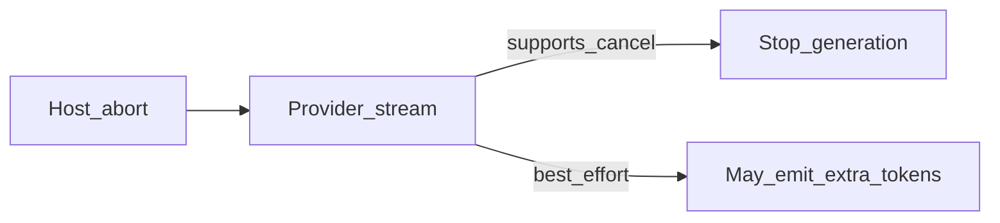

# Provider 断连停推理调研

各 Provider 在断连/取消时停止推理的能力边界调研。

---

# 流式断连停推理：Provider 能力调研报告

**调研日期：** 2026-07-22  
**范围：** DeepSeek / GLM（智谱）/ Kimi（Moonshot）/ MiniMax / OpenAI / Claude（Anthropic）/ MiMo（小米）  
**核心问题：** 客户端拆掉 HTTP/SSE 连接后，服务端是否取消继续生成，从而避免「本地已停、远端仍无限吐 token 计费」

**相关文档：**

- [stream-abort.md](./stream-abort.md) — 本仓库 abort / `aclose` 停流契约
- [thinking-loop.md](./thinking-loop.md) — LLM 思考死循环检测与恢复
- [modules/platform-adapter.md](../modules/platform-adapter.md) — `request_abort_stream` / HostControl 摘要

---

## 1. 问题场景

### 1.1 场景定义

Agent 在单次 `llm.stream` 中陷入思考/文本死循环时，本地会：

1. 检测异常并 `request_abort_stream`（宿主 rail abort 契约，见 `rail/base.py`）
2. ReAct 在 chunk 边界 `break`（宿主流循环消费 abort）
3. 调用 `stream_iter.aclose()`（**语言标准**方法；触发的客户端 `close()` 为宿主既有清理路径）

**归属区分：** `aclose` ≠ 本仓自造 API；本仓依赖宿主 abort 信号并在 abort 后主动 `aclose`。详见 [stream-abort.md](./stream-abort.md)。

**本地不再收 chunk ≠ 服务端一定停推理。**  
协议层通常**没有**统一的「stop 业务报文」，停流依赖服务端是否感知 TCP/HTTP disconnect 并 cancel 生成任务。

### 1.2 风险形态

| 形态 | 说明 |
|------|------|
| A. 断连即停 | 服务端感知 disconnect，停止后续生成；**已生成部分仍计费** |
| B. 断连不停 | 服务端不感知或不 cancel，继续算到 `max_tokens` / 自然结束 → **可能继续计费** |
| C. 假停 | 只关前端/`close_stream`，上游连接仍在读 → 本地「看不见」但仍在烧（本系统 abort 路径刻意避免） |

本报告关注 **形态 A vs B**（abort 已拆连接之后）。

### 1.3 证据等级说明

| 等级 | 含义 |
|------|------|
| **强** | 官方/权威聚合商明确文档，或官方社区共识清晰 |
| **中** | 兼容 OpenAI 流式 + 第三方/聚合商标注，但厂商自家文档未写死 |
| **弱** | 仅协议兼容推断，**无公开 cancel SLA**，需实测 |

---

## 2. 业界总体情况

1. **主流直连 Chat Completions / Messages SSE**：业界默认停法就是 **abort/关闭连接**，极少提供「发一条 stop JSON」的同步业务接口（OpenAI Responses 的 background `cancel` 是例外路径）。
2. **「做好了」通常指：** disconnect → 尽快停生成；**不是** 断连后 0 计费。已吐出的 output（及少量 in-flight）仍计费。
3. **聚合层会放大差异：** OpenRouter 明确区分「支持断连即停计费」与「不支持则继续处理并按完整响应计费」。
4. **中间应用层是重灾区：** 若后端不把浏览器 disconnect 传到上游 SDK abort，即使用户关页，上游仍可能继续烧（与 provider 是否支持无关）。

---

## 3. 分 Provider 梳理

### 3.1 OpenAI — 已做（强）

| 项 | 内容 |
|----|------|
| 公开结论 | 中途关闭/abort 流会结束生成；按**已消费（+少量在途）**计费，不按「若跑完会有多少」全额计 |
| 证据 | OpenAI 开发者社区多帖共识；官方侧确认 cancel 后可能**不返回**最终 usage chunk，但后台仍记部分用量；OpenRouter 将 OpenAI 列为 **Supported**（abort 立即停处理与后续计费） |
| 注意 | 仅 `break` 循环而不 `abort`/`close` 连接，可能仍继续计费；Responses **background** 另有显式 `cancel`，且曾出现 cancel 状态与流行为不完全一致的问题 |
| 对本系统 | 与当前「拆连接」策略匹配；断连后一般**不会**无限输出 |

### 3.2 Claude（Anthropic）— 已做（强）

| 项 | 内容 |
|----|------|
| 公开结论 | SDK 支持 `AbortSignal` / `stream.abort()` / `controller.abort()`；正确 abort 后停止继续消耗；**output 按切断前实际生成计费**，input 通常已计 |
| 证据 | Anthropic 官方 SDK README/helpers；OpenRouter 将 Anthropic 列为 **Supported**；实践文档强调必须把客户端 disconnect **传到** SDK，否则上游继续吐 token |
| 注意 | 「没传 abort」时会出现断连不停；责任在调用链，不在「Claude 没做」 |
| 对本系统 | 直连 Anthropic 时，`aclose`/关连接符合其预期停法 |

### 3.3 DeepSeek — 基本已做（中～强）

| 项 | 内容 |
|----|------|
| 公开结论 | OpenAI/Anthropic 兼容 SSE；关闭 HTTP 连接用于取消进行中的生成；聚合商侧将其标为支持断连停处理/停后续计费 |
| 证据 | OpenRouter **Supported** 列表含 **DeepSeek**；第三方技术指南写明 *Closing the HTTP connection cancels generation server-side*，未收到的 output 不再计费；官方文档强调流式与兼容性，**较少单独写 cancel SLA** |
| 注意 | 官方文档措辞弱于 OpenAI 社区；thinking 长流更依赖代理不误杀连接；仍建议账单侧 spot-check |
| 对本系统 | 直连 `api.deepseek.com` 时，拆连接是合理且被业界认可的路径 |

### 3.4 MiniMax — 存在「断连不停」风险（中，偏风险）

| 项 | 内容 |
|----|------|
| 公开结论 | 文本侧提供 OpenAI/Anthropic 兼容流式；**未见**官方明确「HTTP 断开即 cancel 推理」的 SLA |
| 证据 | OpenRouter 将 **Minimax** 列入 **Not Currently Supported**：对该类 provider，取消流式时模型**可能继续处理**，并按**完整响应**计费；语音 WebSocket 另有 `task_finish` 等显式结束事件（与 Chat Completions 不是同一套） |
| 注意 | OpenRouter 标注的是**经聚合通道**的行为；直连 MiniMax 是否更好需实测，但公开材料**不能**支撑「已做好这一层」 |
| 对本系统 | **高优先级实测对象**；不能默认与 OpenAI 同等安全 |

### 3.5 GLM（智谱 BigModel）— 未公开保证（弱）

| 项 | 内容 |
|----|------|
| 公开结论 | 提供 SSE 流式与 OpenAI 兼容调用；文档侧重如何开流，**未检索到**「客户端断开即停止生成/计费」的官方说明 |
| 证据 | 官方流式能力页存在；无等价于 OpenRouter「Supported」的厂商自证；OpenRouter 列表中未见明确「Zhipu/GLM」条目可直接引用 |
| 注意 | 兼容协议 ≠ 实现了 disconnect cancel；需对 `open.bigmodel.cn` 直连做 abort 压测 + 账单核对 |
| 对本系统 | **按未保证处理**，直到实测通过 |

### 3.6 Kimi（Moonshot）— 未公开保证（弱）

| 项 | 内容 |
|----|------|
| 公开结论 | 明确兼容 OpenAI Chat Completions + SSE 流式；官方流式指南讲 chunk/`[DONE]`，**未写** disconnect cancel 与计费边界 |
| 证据 | [Kimi 流式文档](https://platform.kimi.com/docs/guide/utilize-the-streaming-output-feature-of-kimi-api)、OpenAI 兼容说明；无权威聚合商将其标为 Supported cancel |
| 注意 | 与 GLM 同类：工程上可假设「多数兼容栈会尝试 abort」，但**不能写进 SLA** |
| 对本系统 | **需实测**；尤其长 reasoning / 超长上下文场景 |

### 3.7 MiMo（小米）— 未公开保证（弱）

| 项 | 内容 |
|----|------|
| 公开结论 | 商业 API（`api.xiaomimimo.com`）兼容 OpenAI / Anthropic，支持 `stream=true` SSE；文档有流式与用量说明，**未见**断连取消生成的正式承诺 |
| 证据 | 官方 OpenAI 兼容与 Quick Start；OpenRouter 列表未见 MiMo |
| 注意 | 推理加速档（如 UltraSpeed）吞吐高，若未 cancel，断连后空转成本可能更大 |
| 对本系统 | **需实测**；不能默认已做 |

---

## 4. 对照总表

| Provider | 断连停生成？ | 证据强度 | 计费（断连后） | 备注 |
|----------|--------------|----------|----------------|------|
| **OpenAI** | 是（共识） | 强 | 已生成+少量在途 | 须真正 close/abort |
| **Claude** | 是（SDK+聚合） | 强 | 切断前 output | 须传 AbortSignal |
| **DeepSeek** | 是（聚合+实践） | 中～强 | 未收到的一般不计 | 官方 SLA 表述弱 |
| **MiniMax** | **存疑/偏否（聚合）** | 中 | OpenRouter：可能按完整响应 | **优先实测** |
| **GLM** | 未知 | 弱 | 未知 | 无公开保证 |
| **Kimi** | 未知 | 弱 | 未知 | 无公开保证 |
| **MiMo** | 未知 | 弱 | 未知 | 无公开保证 |

> OpenRouter 原文要点：*Streaming requests can be cancelled by aborting the connection. For supported providers, this immediately stops model processing and billing.*  
> 不支持时：*the model will continue processing and you will be billed for the complete response.*

---

## 5. 结论

### 5.1 场景是否存在？

**存在。**  
「拆连接后服务端仍继续生成并计费」在协议上成立；是否发生取决于 **provider + 接入路径（直连/聚合/自建网关）**。

### 5.2 业界是否「已经做好」？

- **OpenAI、Claude：** 可以认为 **直连路径已做这一层**（断连/abort → 停后续生成；部分用量仍计）。证据充分。
- **DeepSeek：** **大概率已做**（聚合商明确 Supported + 实践文档），但官方 cancel SLA 不如前两者醒目。
- **MiniMax：** **不能认为已做好**；至少经 OpenRouter 时被标为不支持断连即停，存在「继续处理并按完整响应计费」风险。
- **GLM / Kimi / MiMo：** **公开材料不足以认定已做**；仅 OpenAI 兼容流式，**应按未保证 + 必测**。

### 5.3 对本仓库 Agent RAS 的含义

1. 当前 **拆连接、不发业务 stop** 与 OpenAI/Claude/DeepSeek 等主流直连做法一致，是合理默认。
2. **不能**据此声称「所有国内兼容 API 断连后一定不再烧 token」。
3. 若生产主力是 **MiniMax / GLM / Kimi / MiMo**，应用「长 stream → abort → 看网关吞吐是否立刻归零 + 账单是否接近已收 token」做验收；MiniMax 优先。
4. 即便「已做」的厂商，也只保证 **停后续生成**，**不保证** 断连瞬间 0 费用。

### 5.4 建议动作（可选）

1. 对实际 `base_url` 做 1 次受控 abort 账单对比（同 prompt、同 `max_tokens`，完整跑完 vs 中途 aclose）。
2. 文档/方案中将「断连停流」写成：**依赖 provider 的 disconnect cancel；OpenAI/Claude/DeepSeek 置信度高，其余需验证**。
3. 若某厂商实测为形态 B，再评估：换直连节点、限 `max_tokens`、或厂商是否提供显式 cancel。

---

## 6. 资料锚点

- [OpenRouter Streaming / Stream Cancellation](https://openrouter.ai/docs/api_reference/streaming)
- [OpenAI 社区断连计费讨论](https://community.openai.com/t/api-billing-for-streaming-if-i-close-connection-midway/624323)
- [Anthropic SDK streaming abort](https://github.com/anthropics/anthropic-sdk-typescript)
- [DeepSeek 官方 API（OpenAI 兼容）](https://api-docs.deepseek.com/)
- [Kimi 流式文档](https://platform.kimi.com/docs/guide/utilize-the-streaming-output-feature-of-kimi-api)
- [MiMo OpenAI 兼容](https://platform.xiaomimimo.com/docs/en-US/api/chat/openai-api)
- [MiniMax 文本/OpenAI 兼容文档](https://platform.minimaxi.com/docs/api-reference/text-openai-api)

---

## 7. 修订记录

| 日期 | 说明 |
|------|------|
| 2026-07-22 | 初稿：基于公开文档与 OpenRouter 聚合商标注整理 |
| 2026-07-23 | 落盘至 `docs/agent-ras/`；补充 `aclose` / abort 信号的宿主契约 vs 既有清理 vs 语言标准归属 |
