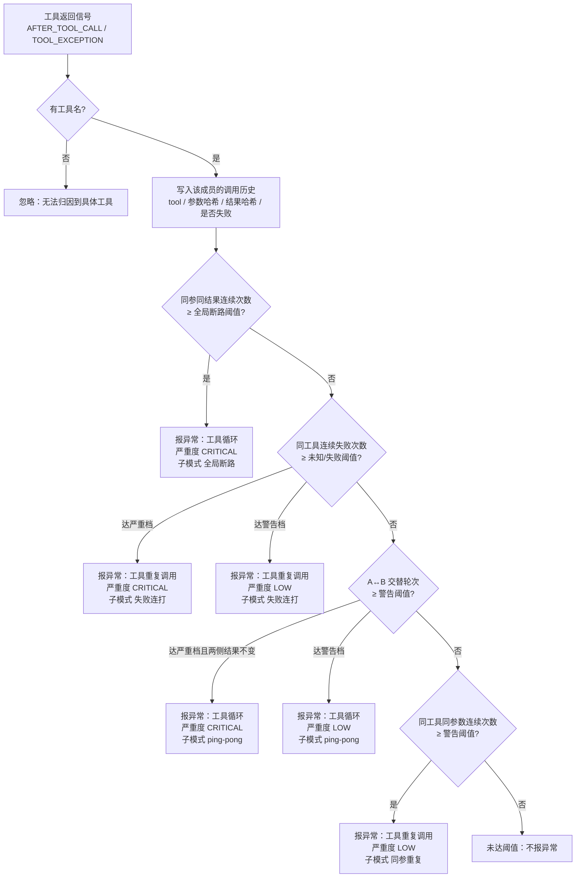
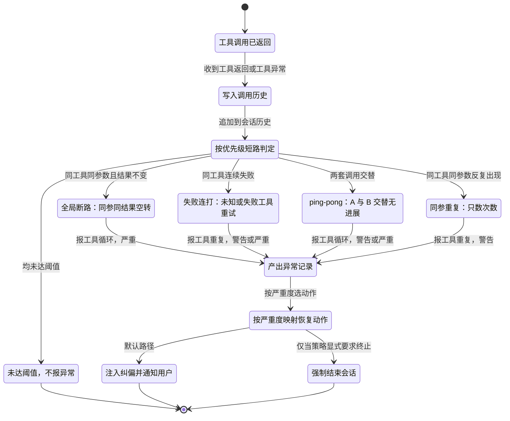

# 工具重复死循环检测与恢复方案

> 适用范围：仓根 `agent_ras/`（`RepeatToolCallDetector` + `recovery/repeat_tool.py`）  
> 算法来源：jiuwenswarm `fix/circuit_breaker_recovery` → `circuit_breaker_rail.py`；落地形态以当前 `agent_ras` 为准。  
> 对照：思考/文本死循环见 [thinking-loop.md](./thinking-loop.md)（流内 abort + L3 Reviewer）。本域 **不**引入 detection/review skill。

---

## 1. 问题场景与子模式

Agent 在工具轮次上原地踏步：同一调用反复发出、失败工具死磕、两个工具互相踢皮球，或同参同结果反复空转。这类故障发生在 **一次工具调用已经返回之后**，而不是正在进行的 `llm.stream` 内部（与思考死循环的边界见 [stream-abort.md](./stream-abort.md)）。

| 子模式 | `detector_kind` | 现象 | AnomalyKind | 默认严重度 |
|--------|-----------------|------|-------------|------------|
| 同参重复 | `generic_repeat` | 连续同一 `tool+args` | `repeat_tool_call` | LOW |
| 失败连打 | `unknown_tool_repeat` | 同一工具连续失败 / 未知工具反复重试 | `repeat_tool_call` | LOW → CRITICAL |
| ping-pong | `ping_pong` | A↔B 交替调用 | `tool_call_loop` | LOW → CRITICAL |
| 全局断路 | `global_circuit_breaker` | 同 `tool+args` 且 **结果哈希不变** | `tool_call_loop` | CRITICAL |

Insight 能力目录中，该故障的父级名为 `tool_repeat_dead_loop`（中文「工具重复死循环」）；运行时 detector `name` = `repeat_tool_call`，域 id = `repeat_tool`。

### Case 1：generic_repeat — 同参重复

**场景**：参数完全相同的工具被连续调用（例如反复 `read` 同一路径），次数达到阈值。

**判定**：从历史尾部向前回溯，连续 `tool_name + args_hash` 相同的记录数 ≥ `warning_threshold`（默认 5）。只看调用次数，**不**要求结果不变。

**默认恢复**：严重度为 LOW，采取「观察 + 注入纠偏提示」；当 `notify_user_on_warning=true` 时同时向用户发通知。该子模式本身 **不**升级为 CRITICAL，硬中断交给 Case 4 兜底。

### Case 2：unknown_tool_repeat — 失败工具连打

**场景**：工具连续返回错误（未知命令、`is_error`、`success=false`、非零 exit 等），Agent 不换工具、不改参数继续调用。

**判定**：同一 `tool_name` 尾部的失败连续段。warning = `unknown_tool_threshold // 2`（默认 5）；critical = `unknown_tool_threshold`（默认 10）。当 `unknown_tool_threshold == warning_threshold` 时，critical 取阈值 + 1，避免 warning 与 critical 退化为同一档。

失败判定由 `ToolResultErrorDetector` 完成，识别 `success` / `is_error` / `status∈{error,failed,failure}` / `result_type=error` / 非空 `error` / 非零 `exit_code` 等字段。

### Case 3：ping_pong — A↔B 交替

**场景**：两个不同 `args_hash`（通常是两个工具，或同一工具的两套参数）串行交替调用，没有实质进展。

**判定**：尾部交替段的「轮次」= `len(streak) // 2`。轮次 ≥ `warning_threshold` 报 LOW；≥ `critical_threshold` **且** 两侧各自的结果哈希都保持不变（`no_progress`）才报 CRITICAL。

调用必须串行：若一次响应里并发多个工具，会打乱交替顺序，导致漏检。FI 剧本对此有明确要求。

### Case 4：global_circuit_breaker — 同参同结果空转

**场景**：同一工具、同一参数、**同一结果哈希** 连续出现，说明完全没有新信息。

**判定**：尾部同 `tool+args` 且 `result_hash` 不变的连续段 ≥ `global_breaker_threshold`（默认 10）→ CRITICAL `tool_call_loop`。

与 Case 1 的分工：generic 只数次数（先告警）；global breaker 额外要求结果不变（后断路）。

---

## 2. 方案价值

| 价值点 | 说明 |
|--------|------|
| **挡住无进展的工具空转** | 同参、失败连打、交替、同结果四类轨迹都能在阈值处截住，避免 token 与外部副作用空烧 |
| **分层干预，默认不硬杀会话** | LOW 纠偏（注入纠偏提示）；CRITICAL 升级为用户通知。`TERMINATE` **不是** CRITICAL 的默认动作 |
| **零 LLM Judge 成本** | 仅依赖结构化历史与哈希，无 L3 skill，不增加环内模型调用 |
| **与思考死循环正交** | 本域监听 `AFTER_TOOL_CALL`，思考域监听 `STREAM_CHUNK`，二者共用 Rail/Monitor/Recovery 骨架 |

若不做本方案：Agent 可能在同一工具上循环到宿主超时或人工停任务；失败工具会把错误日志刷满。

---

## 3. 整体方案

### 3.1 检测

只观察 `SignalKind.AFTER_TOOL_CALL` 与 `TOOL_EXCEPTION`，且信号必须带 `tool_name`。不消费 `tool_calls.delta`，不扫描流 chunk。

历史按 `member_name`（缺省为 `"default"`）以滑动窗口保存；窗口长度 = `max(4×critical, 2×global_breaker, 2×unknown)`。每条记录包含：`tool_name`、`args_hash`、`result_hash`、`has_error`。

**优先级（短路，先命中先报）**：

```text
global_circuit_breaker → unknown_tool_repeat → ping_pong → generic_repeat
```

同一 session 内，若本次 `(kind, severity, detector_kind)` 与上次上报相同，则抑制重复 Anomaly（避免每一步工具调用都刷一次同样的告警）；签名变化（例如 LOW → CRITICAL）时会再报一次。



Catalog presentation（Insight 能力目录）把 unknown / ping_pong 的 warning 档标注为 medium；**运行时实际发出的是 LOW**，以检测器代码为准。

### 3.2 端到端：两条编排路径

工具循环与思考循环共用 Detection / Recovery 插件，但 **编排入口不同**，不要把 Monitor 的 thinking-loop 自动恢复套用到本域。

```mermaid
flowchart TB
  subgraph deep ["深挂载路径（openjiuwen）"]
    Rail["Rail 采集层\n把生命周期钩子转成 Signal"]
    Mon["Monitor 编排\n检测后立即做恢复，不走流抑制"]
    Det["RepeatToolCallDetector\n四档短路判定工具循环"]
    Rec["RecoveryExecutor\n按严重度执行通知与纠偏"]
    HostA["宿主副作用\n用户通知 + 注入纠偏\n可选强制结束会话"]
    Rail --> Mon
    Mon --> Det
    Det -->|异常| Rec
    Rec --> HostA
  end

  subgraph proto ["协议路径（OpenCode / xiaoO）"]
    Hook["平台钩子 / SSE\n采集 tool 结果与错误"]
    Hub["SessionHub 编排\n协议 inproc，不经 Monitor"]
    Det2["同一检测器\n四档短路判定工具循环"]
    Wire["组装恢复动作列表\n恒先打断流，再通知/纠偏"]
    AA["平台执行动作\n打断流 + 用户通知 + 注入纠偏"]
    Hook --> Hub
    Hub --> Det2
    Det2 -->|异常| Wire
    Wire --> AA
  end
```



| 路径 | 检测入口 | 恢复 | abort / terminate |
|------|----------|------|-------------------|
| 深挂载 Monitor | `handle(AFTER_TOOL_CALL)` → `recovery(phase=immediate)` | `RecoveryExecutor.apply`：通知 + 纠偏提示 | **不**打断当前 `llm.stream`（工具已结束）。`TERMINATE` 仅当 policy 显式包含且 kind ∈ `terminate_kinds` 时触发 |
| 协议 SessionHub | `call_observe` / `action_result` | `build_recovery_actions` | **恒先** `abort_stream`，再通知 / 纠偏。wire **无** `terminate`，inproc 路径无法 `force_finish` |

thinking-loop 在 Monitor 上走 `_dispatch_automatic_recovery`（L1/L2 立即 abort，L3 Reviewer）；本域 **不**走那条状态机，也 **不**走 `SUPPRESS_STREAM`。

限流：`LocalAutoRecovery` 在每个 invoke 内对每种动作最多放行 5 次（thinking-loop 自动恢复不受此限流约束）。

### 3.3 恢复策略

`recovery/repeat_tool.py` 的 `kind_overrides` **为空**，因此按 **severity 默认表** 映射，而不是 thinking-loop 那种 kind 覆盖（`OBSERVE_ONLY + SUPPRESS_STREAM`）。

| Severity | 默认动作 | 本域哪些场景会命中 |
|----------|----------|--------------------|
| LOW | `observe_only` + `inject_steering`；`notify_user_on_warning` 时再发通知 | generic；unknown / ping_pong 的 warning 档 |
| MEDIUM | `report_to_user` | 检测器当前几乎不发 |
| CRITICAL | `inject_steering` + `escalate_user`（**默认不含** `TERMINATE`） | unknown / ping_pong / global_breaker 的 critical 档 |

`terminate_kinds = ("repeat_tool_call", "tool_call_loop")` 只是 **允许** terminate 的 kind 白名单。真正调用 `request_force_finish` 还要求 policy 动作集里显式包含 `TERMINATE`，且 `plan_recovery` 仅在 CRITICAL 时才带 critical 文案。

文案按 evidence 的 `msg_key` / `steer_key` / `notice_key` / `critical_key` 从域插件取；纠偏提示的核心是：停止同参重试、调整参数或更换工具、证据充分时结束任务。

### 3.4 总流程

把前面四种子模式、检测优先级与恢复策略合在一起，运行时状态流转如下。默认只走「纠偏 + 通知」；强制结束会话不是默认动作。



### 3.5 模块映射

| 层 | 路径 |
|----|------|
| 检测 | [`agent_ras/detectors/repeat_tool.py`](../../../../agent_ras/detectors/repeat_tool.py) |
| 恢复策略 + 文案 | [`agent_ras/recovery/repeat_tool.py`](../../../../agent_ras/recovery/repeat_tool.py) |
| Policy / Executor | [`agent_ras/recovery/engine.py`](../../../../agent_ras/recovery/engine.py) |
| Wire（协议路径） | [`agent_ras/recovery/operations.py`](../../../../agent_ras/recovery/operations.py) `build_recovery_actions` |
| 深挂载编排 | [`agent_ras/core/monitor.py`](../../../../agent_ras/core/monitor.py) `handle` → `recovery(immediate)` |
| 协议编排 | [`agent_ras/ras_runtime/session_hub.py`](../../../../agent_ras/ras_runtime/session_hub.py) |
| 默认配置 | [`agent_ras/config/agent_ras_config.default.yaml`](../../../../agent_ras/config/agent_ras_config.default.yaml) |
| Insight 能力目录 | `DETECTOR_PLUGIN.presentation`（与检测器同文件） |
| FI 注入剧本 | [`agent_fault_injection/fault_inject/skills/tool_repeat_dead_loop/SKILL.md`](../../../../agent_fault_injection/fault_inject/skills/tool_repeat_dead_loop/SKILL.md) |

模块摘要：[detectors.md](../modules/detectors.md) · [recovery.md](../modules/recovery.md) · [monitor.md](../modules/monitor.md)。

---

## 4. 配置

入口：`AgentRASConfig.detectors.repeat_tool`。

```yaml
detectors:
  repeat_tool:
    enabled: true
    warning_threshold: 5
    critical_threshold: 10
    global_breaker_threshold: 10
    unknown_tool_threshold: 10
recovery:
  notify_user_on_warning: true
```

| 参数 | 默认 | 作用 | 调参风险 |
|------|------|------|----------|
| `warning_threshold` | 5 | generic 的次数门槛；ping_pong 轮次的 warning 档 | 过低：正常重试误报；过高：空转更久才告警 |
| `critical_threshold` | 10（须 ≥ warning） | ping_pong 的 CRITICAL 轮次（还需 `no_progress`） | 过低：交替策略被误杀 |
| `global_breaker_threshold` | 10 | 同参同结果的连续段长度 | 过低：合法的幂等读取被误断；过高：空转拖得更长 |
| `unknown_tool_threshold` | 10 | 失败连打的 CRITICAL 门槛；warning = 阈值/2 | 过低：偶发失败升级过快 |

当 `critical_threshold < warning_threshold` 时，配置校验阶段即会失败。

---

## 5. 与 FI、思考死循环的边界

| 对比项 | 工具重复死循环 | LLM 思考死循环 |
|--------|----------------|----------------|
| 信号 | `AFTER_TOOL_CALL` / `TOOL_EXCEPTION` | `STREAM_CHUNK`（`llm_output` / `llm_reasoning`） |
| 算法 | 结构化历史 + 哈希 | L1/L2 字面 + 可选 L3 skill |
| Review | 无 | `llm-loop-review` |
| 默认恢复 | 纠偏提示 + 通知（CRITICAL 再升级用户） | 抑制流 + abort + 纠偏提示 |
| 硬停会话 | 非默认，需 policy 加 `TERMINATE` | 停的是 **当前 stream**，并非 force-finish 整段 invoke |

**FI**：故障名为 `tool_repeat_dead_loop`，子模式 1–4 对应上表四类。Skill 场景总览里的次数（generic ≥10、global_breaker ≥30、ping_pong CRITICAL ≥20）是 **注入剧本** 的目标调用次数，用来保证「跑得足够长」；**并非** RAS 检测阈值。现行 RAS 默认 5 / 10 / 10，因此同一剧本会 **早于 Skill 表格** 告警或断路。本文与 RAS 文档 **均不修改** FI Skill 阈值。

验收参考：xiaoO 常用 submode 2（unknown，连续失败次数 ≥ RAS `unknown_tool_threshold`）→ 检出 + cancel/恢复。详见 [platform-xiaoo.md](../../guides/platform-xiaoo.md)。

---

## 6. 小结

本方案用 **四档短路检测**（全局断路 → 失败连打 → ping-pong → 同参重复）把工具轮次上的无进展循环转化为 `repeat_tool_call` / `tool_call_loop` Anomaly，再按严重度注入纠偏提示与用户通知。默认 **可恢复、不硬杀**；协议路径额外 `abort_stream`，深挂载路径不打断已结束的工具调用。与思考死循环共享骨架、信号正交。
