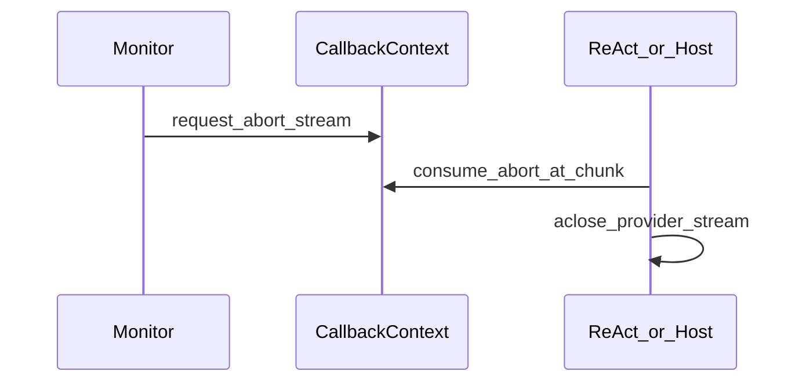
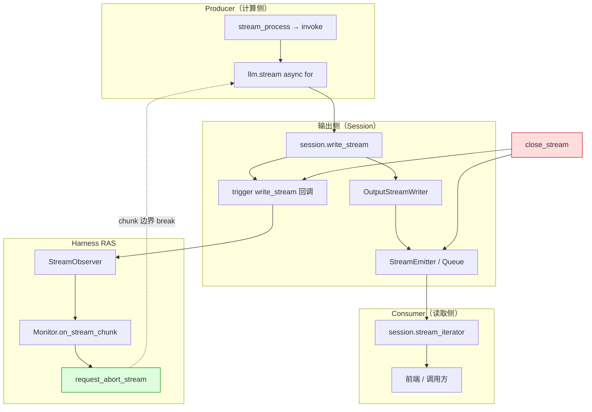

# `llm.stream` 停流机制分析

## 1. 文档目的

本文按讨论顺序整理 Agent RAS 场景下「**如何停止进行中的 `llm.stream`**」相关问题，澄清各机制的职责边界，避免误以为 `close_stream` 等输出侧操作会自动级联停止 provider 流。

**相关文档：**

- [thinking-loop.md](./thinking-loop.md) — LLM 思考死循环检测与恢复
- [modules/platform-adapter.md](../modules/platform-adapter.md) — HostControl / abort 契约摘要
- [modules/monitor.md](../modules/monitor.md) — 自动恢复编排（L3 Reviewer，非人工 HITL）

**涉及代码（示意）：**

- 宿主 agent-core：`rail/base.py`、`react_agent.py`、`session` write_stream
- 本仓：`agent_ras/core/monitor.py`、`agent_ras/recovery/operations.py`
- 深挂载：`agent_ras/platform_adapter/openjiuwen/{rail,stream_observer,host_control}.py`

---

## 2. 问题背景：为何 `llm.stream` 特殊

多数 Agent 异常（工具死循环、策略失败、轮次级纠偏）发生在 **一次 model_call 已经结束之后**——下一轮工具或下一轮 `llm.stream` 之前，可用 `force_finish`、steering、`abort` 等手段收束。

**LLM 思考死循环不同**：故障嵌在**当前这一次尚未结束的** `llm.stream` 内部。

| 对比维度 | 典型工具/轮次异常 | LLM 思考死循环（Case A/B/C） |
|----------|-------------------|------------------------------|
| 故障落点 | model_call **之间** 或 tool 之后 | **单次** `llm.stream` **内部**持续吐字 |
| 自然终点 | 有 tool_calls / finish_reason，流会结束 | 往往**没有**可收敛的 finish；provider 会持续推 chunk |
| 仅靠「等流结束再处理」 | 通常可接受 | 前端一直刷字、reasoning 无限加长，token 持续空转 |
| 仅靠 `force_finish` / 会话 `abort` / `close_stream` | 常够用 | **挡不住**已在飞行中的 provider 流 |

因此：检测与自动恢复可以在 harness 完成，但一旦确认「异常」，必须有一条 core 契约能在 **chunk 边界**协作式退出并尽量 `aclose` 当前 `llm.stream`——否则「已判定死循环」与「provider 仍在烧 token」会长期并存。

---

## 3. 各停流机制能否打断飞行中的 `llm.stream`

### 3.1 总览

| 机制 | 存在位置 | 能否打断飞行中 provider 流 | 说明 |
|------|----------|------------------------------|------|
| `force_finish` | `rail/base.py` | **否** | 流循环内不检查；仅在 `_call_model` 返回后 `consume_force_finish` 跳出 ReAct 迭代 |
| `DeepAgent.abort` | task_loop 专用 | **否** | 只设 `LoopCoordinator._aborted`，阻止外循环下一轮 |
| `close_stream` | `session/agent.py` | **否** | 关输出 emitter + END_FRAME，不 cancel 内部 ReAct/LLM 任务 |
| `request_abort_stream()` | `rail/base.py` + ReAct 流循环 | **是** | chunk 边界协作式 break + `aclose(stream_iter)` |
| 外层 `asyncio task.cancel()` | 调用方 | **是** | 需显式 cancel，非 `close_stream` 自动触发 |
| provider 自然结束 | provider 侧 | **是** | thinking loop 场景往往不会自然结束 |

### 3.2 `force_finish`

- 作用时机：**model_call 之间**、ReAct 轮次边界。
- 在 `_railed_model_call` 的 `async for chunk in stream_iter` 循环内**不检查**该标志。
- 自动恢复确认异常后若只调 `force_finish`，当前这次 `llm.stream` 仍会继续消费 chunk 直到 provider 结束。

### 3.3 `DeepAgent.abort`

- 面向 task_loop 外循环协调，阻止**下一轮**任务。
- 不进入 ReAct 内部的 `llm.stream` 消费循环，无法打断当前 model_call 内的 provider 流。

### 3.4 `close_stream`

`Session.close_stream()` 实际行为：

1. 关闭 stream emitter，向 queue 发送 `END_FRAME`
2. 注销 `{session_id}write_stream` 回调（含 RAS `StreamObserver`）
3. **不**触发 `post_run` 全量 session 清理
4. **不** cancel 任何 asyncio task

```python
# openjiuwen/core/session/agent.py
async def close_stream(self):
    await self._inner.stream_writer_manager().stream_emitter().close()
    await Runner.callback_framework.unregister_event(
        event=self._session_id + "write_stream"
    )
```

---

## 4. `close_stream` 之后，会不会通过其他机制自动停掉 `llm.stream`？

**结论：基本不会可靠自动停。** 不能假设存在「链式反应」让 provider 流自行终止。

### 4.1 `write_stream` 失败不会 break 流循环

emitter 关闭后，`OutputStreamWriter._do_write` **静默丢弃** chunk，只打 warning，**不抛异常**：

```python
# openjiuwen/core/session/stream/writer.py
async def _do_write(self, validated_data):
    if self._stream_emitter and not self._stream_emitter.is_closed():
        await self._stream_emitter.emit(validated_data)
    else:
        session_logger.warning("Stream message discarded, emitter already closed", ...)
```

ReAct 的 `async for chunk in stream_iter` **不依赖** `write_stream` 成功与否来决定是否 break，因此 `close_stream` 不会通过写失败间接停流。

### 4.2 `stream_iterator` 结束 ≠ producer 停止

ReAct 流式路径采用 producer / consumer 分离：

```python
# openjiuwen/core/single_agent/agents/react_agent.py
task = asyncio.create_task(stream_process())      # producer：invoke + llm.stream

async for result in session.stream_iterator():    # consumer：读输出 queue
    yield result

await task                                        # consumer 结束后仍等 producer 跑完
```

- `close_stream` 发 END_FRAME → consumer（`stream_iterator`）可退出
- producer（`stream_process` → `invoke` → `llm.stream`）**继续运行**，直到自然结束或被 `await task` 等完
- consumer 提前停读，也**不会**自动 cancel producer task

### 4.3 正常路径：`close_stream` 发生在 LLM 流结束之后

`post_run`（内部可能 `close_stream`）位于 `stream_process` 的 `finally`，在 `invoke` **返回之后**：

```python
async def stream_process():
    try:
        final_result = await self.invoke(inputs, session, _streaming=True, **kwargs)
        ...
    finally:
        if self.is_agent_session:
            await session.post_run()   # 此时 llm.stream 已结束
```

正常完成时，顺序是「LLM 流结束 → 再 close 输出通道」，而非反过来。

### 4.4 DeepAgent task_loop 同理

```python
# 宿主 DeepAgent / task_loop（路径随 openjiuwen 发行版而定）
async def _stream_process():
    try:
        async for result in self._run_task_loop(ctx, session):
            await self._write_round_result_to_stream(result, session)
    finally:
        await session.close_stream()   # 目的是 unblock stream_iterator，不是停 llm.stream

task = asyncio.create_task(_stream_process())
async for chunk in session.stream_iterator():
    yield chunk
await task
```

`finally` 里的 `close_stream` 让外层 `stream_iterator` 结束；内部 `await task` 仍会等待 ReAct 跑完，**不是**通过 `close_stream` 反向中断 LLM。

### 4.5 注销 `write_stream` 回调：只断监测，不断 provider

- RAS `StreamObserver` 挂在 `trigger("{session_id}write_stream")` 上
- `close_stream` 后 Rail/Observer **收不到**后续 chunk，thinking-loop 检测也停止
- provider 侧 HTTP/SSE **仍可能在跑**
- `close_stream` **不会**调用 `request_abort_stream()`

### 4.6 `close_stream` 的间接副作用汇总

| 副作用 | 是否等于停 LLM |
|--------|----------------|
| 前端/consumer 不再收到新 chunk | 否 |
| `stream_iterator` 收到 END_FRAME 后退出 | 否 |
| RAS 监测链路断开 | 否 |
| 后续 `write_stream` 被静默丢弃 | 否 |

---

## 5. 进程类比：是否存在「父停子停」的级联释放？

**不像。** 当前架构没有「父进程 exit → 子进程被 OS 回收」那种生命周期绑定。

| 进程模型 | Agent 流式模型 |
|----------|----------------|
| 父进程 exit → 子进程被 reparent / kill | `close_stream` 关的是**输出管道**，不是**计算任务** |
| 内核负责级联回收 | producer 与 consumer 是**并列 asyncio task**，无自动级联 cancel |
| 明确的父子生命周期 | 无「谁关了谁，另一个自动停」的内建机制 |

更贴切的类比：

```
close_stream  ≈  关掉广播喇叭（前端不再听到）
llm.stream    ≈  后台还在说话的麦克风（provider 连接仍在推 token）
```

喇叭关了，麦克风**不会**因此自动关。

asyncio 默认也**不会**像进程组那样做「父 task 结束 → 子 task 全杀」。要有显式停止信号，类似发 SIGTERM：

| 机制 | 是否类似「父停子停」 |
|------|----------------------|
| `close_stream` | 否 — 只关输出 |
| `request_abort_stream()` + chunk 边界 break + `aclose` | **是** — 协作式 kill producer |
| 外层 `task.cancel()` | **是** — 需调用方主动 cancel |

---

## 6. 真正有效的停流路径：`request_abort_stream`



### 6.1 契约（`base.py`）

在 `AgentCallbackContext` 上新增：

- `_abort_stream` 内部标志
- `request_abort_stream()` — 请求在当前 / 下一 chunk 边界打断进行中的 `llm.stream`
- `consume_abort_stream()` — 读取并清除 pending 标志
- `has_abort_stream_request` — 是否仍有 pending abort

### 6.2 消费（`react_agent.py`）

在 `_railed_model_call` 的 streaming 路径：

1. `stream_iter = llm.stream(...)`，再 `async for chunk in stream_iter`
2. **每个 chunk 处理前**：若 `ctx.has_abort_stream_request` → `consume_abort_stream()` → `break`
3. chunk 仍经 `session.write_stream` 写出（供 RAS `StreamObserver` 监测/截断）
4. **每个 chunk 处理后**：再次检查 abort（覆盖「本 chunk 写出期间」恢复逻辑置位的情况）
5. `finally`：若已 abort 且 iterator 支持 `aclose`，则调用以尽量关闭 provider 流

```python
async for chunk in stream_iter:
    if ctx.has_abort_stream_request:
        ctx.consume_abort_stream()
        stream_aborted = True
        break
    ...
finally:
    if stream_aborted:
        await stream_iter.aclose()  # 尽量关闭 provider 连接
```

**归属区分（勿混）：**

| 层级 | 内容 | 归属 |
|------|------|------|
| 语言标准 | `stream_iter.aclose()` | **Python 异步生成器标准方法**（`AsyncGenerator.aclose`），非 agent_ras / 宿主自造 API |
| 宿主既有 | `llm.stream(...)` 为 async generator；客户端 `stream()` 的 `finally` 里 `async_client.close()` | 宿主 SDK 既有清理路径；RAS 未改该路径本身 |
| 宿主 abort 契约 | `request_abort_stream` / `consume_abort_stream` / `has_abort_stream_request`；ReAct 在 abort 后 `break` 并**主动调用** `aclose` | Agent RAS 依赖的停流契约（由宿主 rail/ReAct 提供） |

`aclose` 向生成器注入 `GeneratorExit`，使既有客户端 `finally` 得以执行并拆掉 HTTP 连接。ReAct 用 `getattr(stream_iter, "aclose", None)` 探测后调用。

**行为边界：** abort 是协作式的，仅在 chunk 边界生效；置位后可能再吐出少量 token，属预期。

### 6.3 Monitor 触发（自动恢复确认异常）

```
agent_ras/core/monitor.py
  L1/L2 text_repetition → 立即 request_abort_stream + steering
  L3 plan_execution → Reviewer 确认异常后 request_abort_stream + steering
  Reviewer 正常 / 超时 / 异常 / 非法 JSON → fail-open flush，不 abort
  → 宿主 react_agent.py chunk 边界 break + aclose
```

监测与停流分工：

```
# 监测 / 截断
react_agent.py
  → Session.write_stream(output)
      → trigger("{session_id}write_stream")          # writer.write 之前
          → StreamObserver → Monitor.on_stream_chunk
      → stream writer 写出（close 后静默丢弃）

# 停流（自动恢复确认异常）
Monitor
  → request_abort_stream()
  → ReAct 流循环 break + aclose
```

---

## 7. 架构示意



图例：

- **绿色虚线**：唯一可靠的协作式停流路径
- **红色**：`close_stream` 只作用于输出侧，不反向连到 `llm.stream`

---

## 8. 结论与实践建议

1. **`force_finish`、`DeepAgent.abort`、`close_stream` 均无法打断已在飞行中的 `llm.stream`** — 这是引入 `request_abort_stream` 的直接原因。
2. **`close_stream` 之后不会可靠地通过其他机制自动停 LLM** — 不存在「父停子停」式级联；最多是输出丢弃、监测断开、consumer 结束。
3. **自动恢复确认异常时，必须显式走 `request_abort_stream()`** — 由 ReAct 在 chunk 边界 break 并 `aclose` provider 迭代器；该 core 契约无需为本改造再扩展。
4. **正常流式完成时**，`close_stream` 发生在 `invoke` 返回之后，职责是释放输出通道、发送 END_FRAME，与停 LLM 无关。
5. **若需硬中断**（非协作式），调用方需显式 `task.cancel()`，并自行处理 `CancelledError` 与资源清理；这不是 `close_stream` 的语义。

---

## 9. 修订记录

| 日期 | 说明 |
|------|------|
| 2026-07-17 | 初稿：整理 close_stream / force_finish / abort 与 `llm.stream` 边界讨论 |
| 2026-07-23 | 补充归属区分：`aclose`=语言标准；客户端 close=宿主既有；abort 信号与主动 `aclose`=宿主 abort 契约 |
