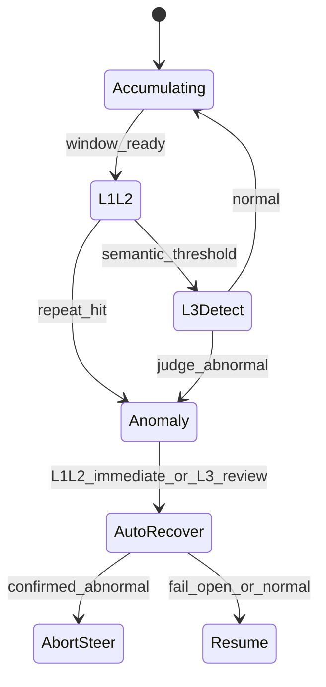
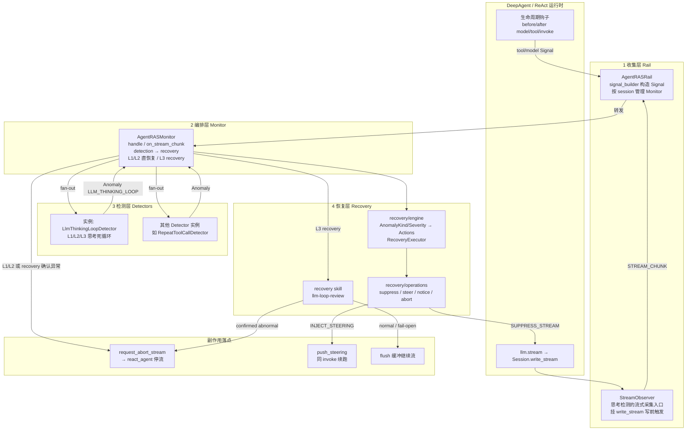
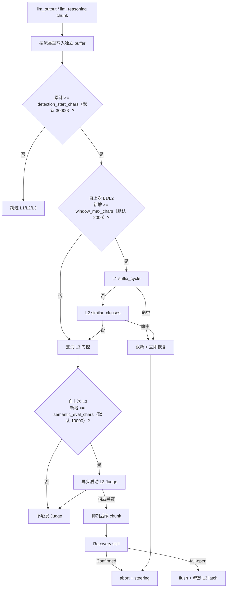

# Thinking Loop 检测与恢复（已落地）

LLM 思考/文本死循环：L1/L2 字面 + 可选 L3 语义。



---

# LLM 思考死循环检测与恢复方案

> 适用范围：仓根 `agent_ras/`（`LlmThinkingLoopDetector` + 自动恢复 + abort）  
> 对比基准能力来源：原 Thinking Loop Lock 生产 case / 实测数据；落地形态以当前 `agent_ras/core` 为准。

---

## 1. 问题场景与 Case 示例

长链路 Agent 在复杂任务中，单次 `llm.stream` 内可能陷入**无法收敛的输出/推理循环**。前端若只等模型自然结束，token 与时延会持续膨胀。

典型失败可归为三类：

### Case A：精确字面重复循环

**场景**：模型卡在固定短语或短周期块，机械复制。

**样例**：

```text
让我协助让我协助让我协助让我协助让我协助让我协助……（同短语连续数十次）
```

**特征**：末尾存在严格相邻周期（如周期长度 10~150 字、重复 ≥5 次）。  
**影响**：输出完全可预测，任务无法推进；适合用 **L1 `suffix_cycle`** 快速截断。

### Case B：渐进式语句循环

**场景**：表面在「推进」，实为同一意图的措辞变体反复出现（例如反复「先看磁盘/上下文再测试」）。

**样例（摘要）**：

```text
明白，我先看看当前磁盘状况和之前的工作上下文，再开始测试。
明白，磁盘安全第一。我先看看当前磁盘状况和之前的工作进展，再动手测试。
好的，我先看看当前磁盘情况和之前的任务上下文，然后开始测试。
……（多句高相似、仅微变）
```

**特征**：无固定短周期，但分句后词汇相似度 ≥0.9 的句簇达到阈值。  
**影响**：传统「完全相同字符串」易漏报；需 **L2 `similar_clauses`**。

### Case C：规划-执行 / 语义死循环（含文本崩坏）

**场景**：例如「幽灵来源」识别——reasoning 中 URL/字段被撕碎粘连，或在来源 1~N 上反复权衡、无结论；单次 call 可达数万字。

**样例（摘要）**：字段名与 URL 交叉拼接的乱码粘连；或「再看一下来源 1…等一下…再看来源 2…」语义空转。

**特征**：往往**没有**稳定字面周期或高相似句簇。  
**影响**：仅靠 L1/L2 不够；需 **L3 语义 Judge**（异步、不阻塞主流式），恢复侧再经独立 recovery skill（当前为 `llm-loop-review`）二次确认后打断 provider 流。

---

## 2. 方案价值

| 价值点 | 说明 |
|--------|------|
| **遏制无限思考 token** | 命中后抑制后续 chunk；确认异常后 `request_abort_stream`，避免 provider 继续空转烧 token |
| **保护用户体验** | 流中即可停更异常输出；L1/L2 直接恢复，L3 以 recovery skill 二次确认降低误杀正常长推理的风险 |
| **分层成本可控** | L1/L2 同步、亚毫秒~毫秒级；L3 异步，启动门槛默认 30k、增量门控默认 10k，避免频繁调用 Judge 模型 |
| **可恢复而非硬杀** | 异常路径注入 steering，同 invoke 内可续跑纠偏；recovery skill 正常 / 超时 / 非法输出 fail-open flush 后继续 |

若不做本方案：Case A/B/C 类故障常表现为「前端一直刷字 / 推理条无限加长」，直到超时或人工停任务——成本与体验均不可控。

---

## 3. 整体方案

### 3.1 能力分层

| 层级 | 机制 | 监听流 | 算法 | 覆盖 Case |
|------|------|--------|------|-----------|
| **L1** | `suffix_cycle` | `llm_output` / `llm_reasoning` | 末尾严格周期重复 | Case A |
| **L2** | `similar_clauses` | 同上 | 分句相似度 ≥ 阈值 | Case B |
| **L3** | `plan_execution` 语义 Judge | `llm_reasoning` + **临时** `llm_output` | Skill/LLM 判定语义循环或文本崩坏 | Case C |

- L1 → L2 **串行短路**（`text_repetition` 通道）。  
- 同 chunk：**先 L1/L2，未命中再考虑 L3**；L3 异步 `create_task` 后不阻塞，在飞期间后续 chunk 仍可跑 L1/L2。`llm_output` 与 `llm_reasoning` **分 buffer**，不混算字数/时间锚点。  
- L3 **临时**也扫描 `llm_output`（兼容无独立 reasoning 流的模型）；稳定后可收回仅 `llm_reasoning`。  
- `tool_calls.delta` **不扫描**（仅可见助手文本）。

### 3.2 端到端架构（Agent RAS，以 LLM 思考检测为实例）

Agent RAS **深挂载**路径骨架是四层：**Rail（收集）→ Monitor（编排）→ Detection（检测）→ Recovery（恢复）**。  
协议 inproc 路径由 hooks → `RasClient` → **`SessionHub`** 编排（不经 Monitor），恢复动作经 wire `applyActions`；勿与深挂载混读。  
LLM 思考死循环只是 Detection 里的一个 **Detector 实例**；工具循环等共用同一 Rail/Monitor/Recovery（或 Hub 侧等价检测），仅 Signal 来源与 Detector 不同。



**分层职责**：

| 层 | 模块 | 职责 |
|----|------|------|
| **Rail** | `platform_adapter/openjiuwen/{rail,stream_observer}.py`、`core/signal_builder.py` | 采集生命周期与流事件 → Signal；创建/销毁 Monitor；**不做**检测与恢复决策 |
| **Monitor** | `core/monitor.py` | 编排 `detection` → `recovery`；L1/L2 直接 abort；L3 启动 recovery skill；思考循环走 `on_stream_chunk` |
| **Detection** | `core/detectors/*`（本方案实例：`llm_thinking_loop.py`） | Signal → `Anomaly`；L1/L2 同步、L3 异步首次 Judge |
| **Recovery** | `core/recovery/{engine,operations,robustness_prompt}.py`、recovery skill `llm-loop-review` | 映射并执行 `SUPPRESS_STREAM` / steering；L3 recovery 二次复核（`llm-loop-review`） |

**思考死循环实例路径**：

1. **Rail 采集**：`write_stream` → `StreamObserver` → `Monitor.on_stream_chunk`（`Signal(STREAM_CHUNK)`）。  
2. **Monitor 编排**：`detection` fan-out → **`LlmThinkingLoopDetector`**。  
3. **Detection 命中**：产出 `Anomaly(LLM_THINKING_LOOP / LLM_THINKING_DEAD_LOOP)`。  
4. **Recovery 执行**：截断/抑制流；`text_repetition` 立即 abort + steering；`plan_execution` 先抑制再跑 recovery skill，确认异常才 abort，否则 fail-open flush。

### 3.3 检测与恢复流程



> 注：L3 `create_task` 后不阻塞主流式；在飞期间后续 chunk 的 L1/L2 仍可检测。

### 3.4 模块映射（按 Agent RAS 分层）

| 层 | 路径 |
|----|------|
| Rail / 流观测 | `agent_ras/platform_adapter/openjiuwen/{rail,stream_observer,factory}.py`；`core/signal_builder.py` |
| Monitor | `agent_ras/core/monitor.py` |
| Detection（本方案实例） | `agent_ras/core/detectors/llm_thinking_loop.py` |
| Skill 注册表 | `agent_ras/core/agents/base.py`（故障域 × `detection`/`recovery` → skill 名） |
| Recovery | `agent_ras/core/recovery/{engine,operations,robustness_prompt}.py` |
| 配置 | `agent_ras/core/config.py` → `LlmThinkingLoopConfig` |
| Core 停流契约 | 宿主 `openjiuwen`/`agent-core`：`rail/base.py` abort API；`react_agent.py` 流循环消费 |
| 协议 inproc | `agent_ras/ras_embed/session_hub.py`（不经 Monitor） |

---

## 4. 配置与检测频率评审

配置入口：`AgentRASConfig.detectors.llm_thinking_loop`（YAML / 工厂装配等价字段）。

```yaml
detectors:
  llm_thinking_loop:
    enabled: true
    detection_start_chars: 30000    # 累计字符达此门槛后才开始 L1/L2/L3
    # L1/L2 text_repetition
    window_max_chars: 2000          # 近窗 = 扫描间隔 = 最小可检长度
    loop_repeat_threshold: 5        # 周期/相似句簇重复次数阈值
    similar_clause_sim_threshold: 0.95
    # L3 plan_execution（异步首次 Judge + 恢复侧 recovery skill）
    semantic_eval_chars: 10000      # 启动后，自上次 eval 的增量字数门
    semantic_content_enabled: true  # 默认启用；显式 false 才关闭语义 Judge
    # skill 名与 skill 超时为内部常量（SKILL_TIMEOUT_SECONDS），不暴露配置
```

### 4.1 检测频率：为何这样定（评审结论）

#### 4.1.1 启动门槛与 L1/L2 间隔

**结论**：默认先攒够 **30000** 字符再开检，避免短推理误伤；启动后 L1/L2 按 **`window_max_chars`（默认 2000）** 近窗密扫，L3 按 **10000** 增量再调 Judge。

实现上 `window_max_chars` **一身三用**（见 `LlmThinkingLoopDetector`）：

1. **近窗 FIFO**：buffer 超限截断最旧内容；  
2. **扫描门控**：自上次扫描新增字符 `pending < window_max_chars` 则跳过；  
3. **算法下限**：传给 `LoopDetector(min_text_length=...)`。

与 L1 算法硬约束对齐：

| 约束 | 数值 | 含义 |
|------|------|------|
| 周期长度 | 10–150 字 | `SUFFIX_CYCLE_MIN/MAX_PATTERN_LEN` |
| 重复阈值 | 默认 5 | `loop_repeat_threshold` |
| L1 理论最短可检包 | \(10 \times 5 = 50\) 字 | 最短周期 × 阈值 |
| 近窗 / 扫描间隔 | 默认 2000 | `window_max_chars` |

因此：

- 默认 **2000** 覆盖远高于 L1 最短可检包，适合在启动门槛之后做近窗周期检测。  
- 若需更早发现 Case A，可下调 `detection_start_chars`，而不是把 `window_max_chars` 打到 &lt;50。

#### 4.1.2 参数总表

| 参数 | 默认 | 评审理由 | 调参风险 |
|------|------|----------|----------|
| **`detection_start_chars` = 30000** | 统一启动门槛 | 短推理不启检；长输出才进入 L1/L2/L3 | **过低**：短任务误报；**过高**：死循环白烧更久 |
| **`window_max_chars` = 2000** | L1/L2 近窗 = 扫描间隔 = `min_text_length` | 启动后近窗扫描；限制内存与最坏扫描长度 | **&lt;50**：空扫/无效；**过大**：Case A 发现过晚 / P95 升高 |
| **`loop_repeat_threshold` = 5** | 重复 ≥5 才报 | 正常列举/强调常出现 2~4 次相近句；阈值 5 在回归集上区分「偶发重复」与「死循环」，4 次不报、5 次报 | **过低**：正常 checklist 误报；**过高**：死循环拖更久 |
| **`similar_clause_sim_threshold` = 0.95** | 高相似才聚类 | 压低「口头禅 + 不同后续」误报；配合枚举豁免 | 过低误报 Case 正常叙述；过高漏 Case B |
| **`semantic_eval_chars` = 10000** | L3 字数门 | 启动后每约 10k 增量调一次 Judge；L3 buffer 上限仍为 `max(window, 2×semantic_eval)` | 过小：Judge 贵且易误判短犹豫；过大：语义空转发现太晚 |
| **L3 recovery（故障域默认 skill `llm-loop-review`）** | 恢复侧二次复核 | 首次 L3 Judge 仍保留；recovery 确认异常才 abort，超时/异常/非法 JSON fail-open | recovery 失败一律按正常继续，避免误杀 |
| **`semantic_content_enabled` = false** | 显式关 L3 | 默认开启 L3；业务需关异步 Judge/费用时显式设 `false`，仅保留 L1/L2 | 生产防 Case C 保持默认 `true` 并配齐 Skill |

**频率设计原则（摘要）**：

1. **先冷启动、再分层**：未达 `detection_start_chars` 不检；之后 L1/L2 用近窗间隔，L3 用更大增量。  
2. **快路径相对密、贵路径相对稀**：L1/L2 每 `window_max_chars` 一扫；L3 默认 10k 增量，避免每个小犹豫都调模型。  
3. **阈值与误报联动**：重复阈值、相似度阈值优先服务「可接受误报率」，再谈灵敏度；L3 另加 recovery skill 降低误杀。

---

## 5. 效率测试

口径拆分（勿混用）：

| 层级 | 测什么 | 数据来源 |
|------|--------|----------|
| **L1/L2** | 本地字面检测算法 wall time | Linux WSL2，`LoopDetector(min_text_length=100)`，每项 **30 次取 P95** |
| **L3** | detection **Agent** 整次 `invoke` wall time（含加载 Skill、1~2 轮 model_call，不是单次直连 model） | Windows office-claw 运行日志 |

日志路径：`C:\Users\<user>\.office-claw\.jiuwenclaw\service_default\.logs\openjiuwen\run\jiuwen.log`（WSL：`/mnt/c/Users/<user>/...`）。

**L3 统计方法**：以 `Executing tool: skill_tool ... llm-loop-detection` 为起点，只计入 detection member 的 `session_id=default_session` 事件；终点为同会话最后一次 `model_call done`（现行契约：最终 assistant 直接输出 JSON，不再依赖 `skill_complete(report=...)`）。排除 `skill_complete` 风暴（旧契约死循环，单次 &gt;10 次 complete）及 wall &gt; 60s 的异常样本。

> **为何作废旧 L3 表**：旧表用 `evaluate_thinking_excerpt` **直连 model**（约 0.9~1.1 s），只等价于 agent 内**单轮** `model_call` 量级，低估了真实 L3（Skill 加载 + 多轮 ReAct）。

### 5.1 L1/L2（按输入规模，本地算法）

| 输入规模 | L1/L2 P95 |
|----------|-----------|
| 100 字 | **0.028 ms** |
| 500 字 | **0.435 ms** |
| 1000 字 | **0.488 ms** |
| 2000 字 | **0.646 ms** |
| 4000 字 | **0.929 ms** |
| 10000 字 | **1.743 ms** |

### 5.2 L3（detection Agent，office-claw 日志）

**现行路径（2026-07-15 ~ 07-16，JSON 终答，n=5）**：

| 指标 | 数值 |
|------|------|
| Agent wall P50 | **~3.4 s** |
| Agent wall P95 | **~5.3 s** |
| Agent wall 区间 | 2.9 ~ 5.3 s |
| `model_call` 累加 P50 / P95 | ~3.7 s / ~6.5 s |
| 典型轮次 | 1~2 轮 `default_session` model_call |

样例（日志时间戳 → wall）：

| 起点（skill_tool） | wall | mc 累加 | 轮次 |
|--------------------|------|---------|------|
| 2026-07-15 15:35:05 | 5.3 s | 6.5 s | 2 |
| 2026-07-15 15:40:03 | 2.9 s | 1.8 s | 1 |
| 2026-07-16 10:54:20 | 3.4 s | 3.3 s | 1 |
| 2026-07-16 12:56:02 | 3.7 s | 3.7 s | 1 |
| 2026-07-16 13:01:30 | 3.3 s | 5.2 s | 2 |

**更宽样本（含 07-09 健康 invoke，排除风暴，n=13）**：wall P50 **~4.9 s**，P95 **~16.9 s**（个别含排队/慢首轮）；说明生产尾延迟应按 **数秒~十余秒** 规划，并与内部 `ASYNC_RECOVERY_TIMEOUT_SECONDS`（60s）/ `SKILL_TIMEOUT_SECONDS`（30s）对齐，而不是按 ~1 s 直连 model 估。

### 5.3 解读

- **L1/L2**：10K 字下仍 **&lt; 2 ms**（原验收门槛 50 ms → **PASS**）。相对流式 token 到达间隔可忽略，**支持 `window_max_chars=2000` 的近窗扫描**。  
- **L3**：异步、**不阻塞**主流式；真实成本是 **detection Agent 整次 invoke（约 3~5 s 量级，P95 可达数秒~十余秒）**，外加恢复侧 recovery skill 一次短生命周期 invoke。与「启动后每约 10k 增量触发一次 L3」的稀触发配套，适合兜底而非逐 chunk 同步调用。  
- **与频率参数互证**：若把 L1/L2 间隔降到极低，CPU 仍可承受，但误报与调度次数上升；L3 若把门控压得很小，则 Agent 调用次数与尾延迟会明显恶化——故维持 **密 L1/L2 + 稀 L3**。

### 5.4 功能回归（摘要）

| 类型 | 代表 | 预期 |
|------|------|------|
| Case A 正例 | `让我协助`×N、短周期粘连 | L1/L2 detected |
| Case B 正例 | 「先看磁盘/上下文」句簇 | L2 detected |
| Case C 正例 | 幽灵来源乱码首 4k / 语义空转 | L3 abnormal=true |
| 反例 | 递增代码、唯一列举、连贯长叙述、短礼貌语 | not detected / Judge=false |

---

## 6. 小结

本方案用 **L1/L2 字面快检 + L3 语义兜底 + 恢复侧 recovery skill**，在 `write_stream` 前监测，**自动恢复**（L1/L2 直恢复，L3 双阶段确认），**abort** 打断无限 `llm.stream`，从而在真实 Case A/B/C 上同时控制 **token 浪费、误杀风险与检测开销**。检测频率默认值经过「漏检成本 / 误报成本 / 实测时延」三角权衡；调参时应优先复测 §5 表与正反例集，再改门控数字。
