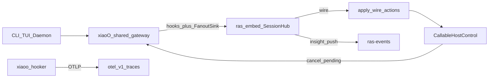

# xiaoO 平台适配（入口无关 / 协议 inproc）

版本：v0.4  
状态：已落地（协议 inproc；HTTP/SSE 已移除；xiaoO shared 注入 + inproc/CLI E2E）  
关联：[`architecture.md`](../architecture.md)、[`platform-adapter.md`](../modules/platform-adapter.md)、[`guides/platform-xiaoo.md`](../../guides/platform-xiaoo.md)

## 1. 目标与原则

为 xiaoO（CLI / TUI / daemon 任一入口）接入 agent-ras，能力同档。

| # | 原则 |
|---|------|
| P1 | 检测/恢复只在 `core` + `ras_embed`；L3 禁止复制策略 |
| P2 | **入口无关**：差异只在 Host callable 接线，不在 Detector |
| P3 | 对齐协议 inproc：hooks → `RasClient` → `SessionHub` → wire → `apply_wire_actions` → `CallableHostControl` |
| P4 | 检测/恢复复用进 `common` / `ras_embed`；**子进程嵌入运输**放 `common/transport/subprocess_ipc`；`xiaoo/` 仅 hook 映射 + Host 三函数 |
| P5 | **不**使用 daemon HTTP / SSE 作为观测或恢复路径 |

## 2. 架构

观测旁路见 [`xiaoo-observe-ingest.md`](xiaoo-observe-ingest.md)（Insight 最小侵入；OpenCode 不迁）。

- 装配：[`build_protocol_ras_client`](../../../agent_ras/platform_adapter/common/protocol_client.py)
- 子进程 hook 共享 SessionHub：[`subprocess_ipc` 运输层](../../../agent_ras/platform_adapter/common/transport/subprocess_ipc/)（嵌入模式；**不是**「平台中性核心」，OpenCode 用 [`inproc`](../../../agent_ras/platform_adapter/common/transport/inproc/)）
- 流式：gateway `LoopEventSink` fan-out → 同一 embed `observe`

## 3. L3 边界（薄）

| 保留 | 职责 |
|------|------|
| `hooker/` | Chat / Tool / lifecycle → hello / observe / reset |
| `hooks.py` | `build_xiaoo_ras_client` → common 工厂 + Host callables |
| `host_control.py` | `CallableHostControl` 薄别名 |

不设：HttpHost、SSE 泵、平台私有 Host 族、xiaoo/sidecar。

## 4. 采点映射

| 来源 | Signal |
|------|--------|
| `*.Session.lifecycle.created` / Chat received | `hello` |
| `*.Tool.*.post` | `kind=tool`, `phase=after` |
| LoopEventSink reasoning / message | `assistant_text` / `llm_reasoning` \| `llm_output` via **`hooker_main.py stream_delta`**（**不是** `plugin.json` hook_point） |
| Session closed-like | `reset` |

Session id：`xiaoo:{gateway_session_id}`（FI↔RAS 对齐键为剥前缀后的裸 gateway UUID）。

启用门控（gateway `ras_enabled`）：`AGENT_INSIGHT_RAS_HOME` / `RAS_EMBED_SOCK` **或** 默认 RAS home 下已安装 `xiaoo/hooker/hooker_main.py`。

`stream_delta` **不**每次 `hello`（避免抹掉 latch）；会话由 `chat_received` 建立，Sink 早到时由 `SessionHub.ensure` 惰性建状态。`ensure_worker` 从 `install.json` 注入 runtime `PYTHONPATH` 再 spawn `platform_adapter.common.transport.subprocess_ipc`，否则子进程找不到模块、sock 起不来、检测静默失败。

`llm_reasoning` 观测依赖宿主是否产出 reasoning 流。xiaoO CLI 对 config 里 `[llm].reasoning_effort` 可能无效；若需该流，在 **agent/用户侧** 配置或由调用方显式传 CLI flag。**FI 不默认代传** `--reasoning-effort`（零观测偏向）。

## 5. HostControl

| wire | 投递 |
|------|------|
| `abort_stream` | gateway `cancel_token` / `CancelActiveTurn` |
| `emit_notice` / `push_steering` | `pending_user_messages`（可见 `[RAS]` 前缀可选） |

## 6. 门禁

| # | 通过条件 |
|---|----------|
| A | setup 可选 xiaoo；不强制 daemon |
| B | 进程内 Sink / hook → `llm_*` / tool observe |
| C | 真实重复 tool / thinking-loop |
| D | abort / notice / steer 生效 |
| E | Insight `platform=xiaoo` |
| F | CLI 与其它入口同档（无 HTTP/SSE） |
| G | 单测 / harness 通过 |
