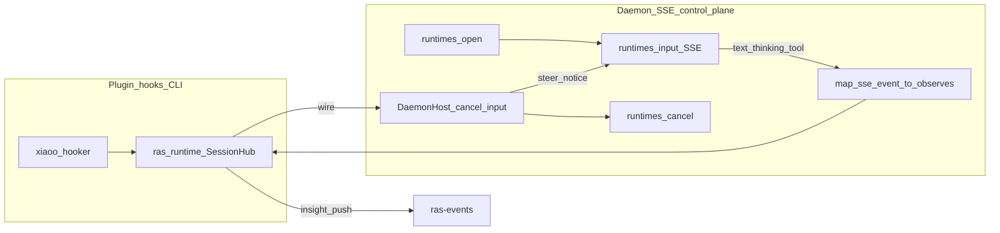

# xiaoO 平台适配（入口无关 / Daemon 控制面）

版本：v0.5  
状态：已落地（协议 inproc + **官方 Daemon SSE 控制面**；FI 库零改动；FI Worker 不启动 RAS）  
关联：[`architecture.md`](../architecture.md)、[`platform-adapter.md`](../modules/platform-adapter.md)、[`guides/platform-xiaoo.md`](../../guides/platform-xiaoo.md)

## 1. 目标与原则

为 xiaoO（CLI / TUI / daemon）接入 agent-ras。stock master **无**可配置 `LoopEventSink` 挂载；mid-stream 思考检测与 abort/steer **以 Daemon SSE + cancel/input 为主路径**。

| # | 原则 |
|---|------|
| P1 | 检测/恢复只在 L0（`detectors`/`review`/`recovery`/`core`）+ `ras_runtime`；L3 禁止复制策略 |
| P2 | **入口无关**：差异只在 Host callable / 采点运输，不在 Detector |
| P3 | 对齐协议 inproc：hooks → `RasClient` → `SessionHub` → wire → `CallableHostControl` |
| P4 | `xiaoo/` 仅 hook 映射 + Host 三函数 + Daemon 客户端；不改 FI |
| P5 | **Daemon HTTP/SSE** 为 stock master 上的正式 Stream/Host 路径（lease 由 RAS 持有） |

本地私改 gateway（`agent_ras.rs` / `ras_control.sock` 上游注入）**废止**，不得再改 xiaoO 源码。

## 2. 架构

- 装配：[`build_protocol_ras_client`](../../../agent_ras/platform_adapter/common/protocol_client.py)
- Daemon：[`daemon_client.py`](../../../agent_ras/platform_adapter/xiaoo/daemon_client.py) / [`daemon_session.py`](../../../agent_ras/platform_adapter/xiaoo/daemon_session.py)
- 子进程 hook 共享 SessionHub：[`subprocess_ipc`](../../../agent_ras/platform_adapter/common/transport/subprocess_ipc/)
- **FI**：不接线、不改 `agent_fault_injection/**`；Insight FI Worker 只跑 FI CLI，**不**拉起 `DaemonRasSession`（RAS 是否在场 = 平台挂载）

## 3. L3 边界（薄）

| 保留 | 职责 |
|------|------|
| `hooker/` | Chat / Tool / lifecycle → hello / observe / reset（**tool_post 禁止 hello**） |
| `hooks.py` | sock Host + `build_xiaoo_daemon_host_fns` |
| `daemon_*` | open/input/cancel + SSE→Signal |
| `host_control.py` | `CallableHostControl` 薄别名 |

## 4. 采点映射

### 4.1 Plugin hooks

| 来源 | Signal |
|------|--------|
| `*.Chat.message.received` | `hello`（唯一建会话入口） |
| `*.Tool.*.post` | `kind=tool`, `phase=after`（可带 `result`/`error`） |
| `stream_delta`（若上游 Sink 直调） | `assistant_text` |
| Session closed-like | `reset` |

### 4.2 Daemon SSE → Signal（现网两类检测器）

| SSE `type` | Signal | Detector |
|------------|--------|----------|
| `text_delta` | `STREAM_CHUNK` / `llm_output` | `LlmThinkingLoopDetector` L1/L2 |
| `thinking_delta` | `STREAM_CHUNK` / `llm_reasoning` | 同上 |
| `tool_result`（含 `is_error`） | `AFTER_TOOL_CALL` + `tool_result` | `RepeatToolCallDetector`（含 `unknown_tool_repeat`） |
| `tool_call` status failed/denied | 同上（错误） | 同上 |

恢复：`abort_stream` → `POST /api/v1/runtimes/cancel`；`emit_notice` / `push_steering` → 再 `POST .../input`（同一 `client_id`）。

L3 语义思考评审：xiaoo `supports_host_skill_judge=False`，本轮非目标。

## 5. HostControl

| wire | sock 路径（遗留） | Daemon 路径（正式） |
|------|-------------------|---------------------|
| `abort_stream` | `ras_control.sock` abort | `runtimes/cancel` |
| `emit_notice` / `push_steering` | pending / steer | `runtimes/input` |

## 6. 门禁

| # | 通过条件 |
|---|----------|
| A | stock xiaoO master；无上游私改 |
| B | Daemon SSE → `llm_*` / tool observe |
| C | `tool_repeat_dead_loop` submode 2 + thinking-dead-loop |
| D | abort / notice / steer `ok`（Daemon lease） |
| E | Insight `platform=xiaoo` |
| F | **`agent_fault_injection/**` 零 diff**；FI 黑盒仍可用 |
| G | 单测 / `e2e_xiaoo_daemon_harness.py` 通过 |
