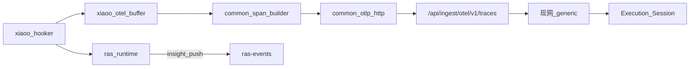

# xiaoO OTel 观测接入（Insight 最小侵入）

版本：v0.1  
状态：已落地  
 
关联：[`xiaoo-adapter.md`](xiaoo-adapter.md)、[`platform-adapter.md`](../modules/platform-adapter.md)、[`09-otlp-attribute-contract.md`](../../../developer-guide/09-otlp-attribute-contract.md)

## 1. 目标与原则

为 xiaoO 补齐 Agent Insight **完整链路**（Execution / Session），解决 RAS-only 详情无 Trace。

| # | 原则 |
|---|------|
| P1 | 观测走现网 `POST /api/ingest/otel/v1/traces`；RAS 仍 `ras-events` |
| P2 | **OTel 数据可按需新增**（含 FR-011 `witty.*` 双写） |
| P3 | **Insight 非必要不改功能**；默认走 generic；必要才加法小改且不破坏现网 |
| P4 | OpenCode 观测/RAS **保持现状**，不迁 OTel |
| P5 | L2 common 可复用；L3 xiaoo 只做 hook→DTO |

## 2. 架构

## 3. 字段表（现网兼容 + 可双写）

| 用途 | **必发（现网认）** | 可选双写（FR-011） |
|------|-------------------|-------------------|
| Session / Join | `session.id` = native gateway id | `witty.session.id` 同值 |
| Resource | `service.name=xiaoo` | — |
| LLM | `gen_ai.span.kind=llm` 或 gen_ai 前缀；`gen_ai.prompt` / `gen_ai.completion`（或 input/output.value） | `witty.agent.*` |
| Tool | `tool.name`；`tool.arguments` 或 `input.value`；结果 `output.value` / `tool.result` | `witty.tool.*` |
| Agent 根 | name `agent xiaoo` + `gen_ai.span.kind=agent`（可选） | `witty.agent.name/id` |

**Join**：RAS `taskId`（strip `xiaoo:`）=== `session.id`。

现网 normalize **优先** `session.id`，不依赖 `witty.session.id`；故上报侧始终写 `session.id`。

## 4. Flush 策略

| 事件 | 行为 |
|------|------|
| Chat received | 开会话 buffer；可选 user→prompt 记入待发 LLM 上下文 |
| stream_delta | 合并 assistant / reasoning 文本（不每 delta POST） |
| Tool post | 追加 tool span（含 outcome/output） |
| lifecycle `idle` + outcome ∈ complete/cancelled/max_turns/budget… | end spans + **flush OTLP**；RAS `reset` |
| 旧 closed-like | 仍 reset + flush（兼容） |

## 5. Insight 改动门禁

默认 **零改动**。仅当 E2E 证明 generic 不可用时，允许加法（如 `witty.session.id` 作 session 别名），并回归现有平台。

## 6. 明确不做

OpenCode→OTel；无证据 Insight 大改；只发 witty 不发现网字段；RAS anomaly 合成对话；一期 skill/sub_agent；Rust OTel SDK。

## 7. 验收

- 同 `taskId`：RasAnomalyEvent + Execution/Session  
- `/api/observe/session?taskId=` 有 interactions  
- `/agent-ras/trace/<taskId>` 有 AgentTraceView（或至少非空 interactions）  
- 未改 OpenCode 上报路径  
