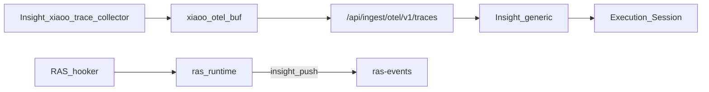

# xiaoO 完整链路观测（Insight 采集器）

版本：v0.3  
状态：已迁至 Insight（RAS / FI **不做** Trace）

关联：[`xiaoo-adapter.md`](xiaoo-adapter.md)、[`09-trace-collector.md`](../../../developer-guide/09-trace-collector.md)、[`ras-fi-insight-relationship.md`](../../../agent-fault-injection/designs/ras-fi-insight-relationship.md)

## 1. 目标与原则

为 xiaoO 提供 Agent Insight **完整链路**（Execution / Session）。按产品边界：

| # | 原则 |
|---|------|
| P1 | **⓪ Trace** 由 Insight [`scripts/xiaoo-trace-collector/`](../../../../scripts/xiaoo-trace-collector/) 上报 `POST /api/ingest/otel/v1/traces` |
| P2 | **① RAS** 仅 `ras-events` + 检测/恢复；hooker **不** buffer/flush OTLP，**不**调用 Insight `note_*` |
| P3 | **③ FI** 仅 `collect-result` → Judge；**不**做 Trace，**不**合成可靠性 `Execution` |
| P4 | 字段保持现网 generic 可解析（`service.name=xiaoo`、`session.id`、`gen_ai.*` / `tool.*`） |
| P5 | Insight 服务端优先 **零改动**（generic）；不足再加法 |
| P6 | xiaoO `stream_delta` 由 gateway 直调 **RAS** hooker，**仅**服务 ① observe。plugin `hook_point` 必须是 4 段（`a.b.c.d`），**不能**把 `stream_delta` 挂进 Insight collector。⓪ 助手文本走 Insight collector 的 `*.Llm.complete.post` → `note_stream`（非 RAS 转发、非 FI）。该 hook 现网 payload **无** `session_id`，用 chat/lifecycle 记住的 sticky `_active_session.json` 关联（禁止 FI 传 session） |

## 2. 架构（现）



安装：

```bash
node scripts/xiaoo-trace-collector/install.js
# install-ras 在安装 xiaoo hooker 成功后也会自动调用
```

产物：`~/.agent-insight/xiaoo-trace-collector/` + `~/.config/xiaoo/config.toml` `[hooker].plugins` 追加。

手工 E2E：`python3 scripts/xiaoo-trace-collector/e2e_upload.py`

## 3. 字段表

| 用途 | **必发（现网认）** | 可选双写（FR-011） |
|------|-------------------|-------------------|
| Session / Join | `session.id` = native gateway id | `witty.session.id` 同值 |
| Resource | `service.name=xiaoo` | — |
| LLM | `gen_ai.span.kind=llm`；`gen_ai.prompt` / `gen_ai.completion` | `witty.agent.*` |
| Tool | `tool.name`；`input.value` / `output.value` | `witty.tool.*` |

**Join**：RAS `taskId`（strip `xiaoo:`）=== `session.id`。

## 4. Flush 策略

| 事件 | 谁处理 |
|------|--------|
| Chat / Tool / Llm.complete.post / Session lifecycle | Insight collector plugin（note + flush） |
| stream_delta | RAS hooker → **仅** ① `observe_text_delta`（无 Trace；且不能注册为 plugin hook_point） |
| lifecycle idle/complete | Insight collector **flush OTLP**；RAS 仅 `reset` |

无 llm/tool turns 时 collector **不** POST 空 agent 根。

## 5. 历史说明

v0.1：`agent_ras` hooker 内嵌 OTel。  
v0.2：迁 Insight collector；短暂保留 RAS `stream_delta`→`note_stream` 转发与弃用 shim。  
v0.3：**拆除** RAS 全部 Trace 路径（shim / common otel_* / 转发）；边界钉死 ⓪=Insight、①=RAS、③=FI。  
v0.3.1：Insight collector 增加 `*.Llm.complete.post` 作为 ⓪ 助手文本真源；明确 `stream_delta` 不可注册为 plugin hook_point；未解析到 session 时不写 `unknown` 缓冲；`Llm.complete.post` / 部分 Tool 缺 session 时用 sticky 关联。

## 6. 验收

- 同 `taskId`：RasAnomalyEvent + Execution/Session（主树来自 Insight collector）  
- `/api/observe/session?taskId=` 有 interactions  
- `agent_ras` / `agent_fault_injection` 无日常 OTLP POST / `note_*` / 合成 Execution  
- OpenCode 上报路径不变  
