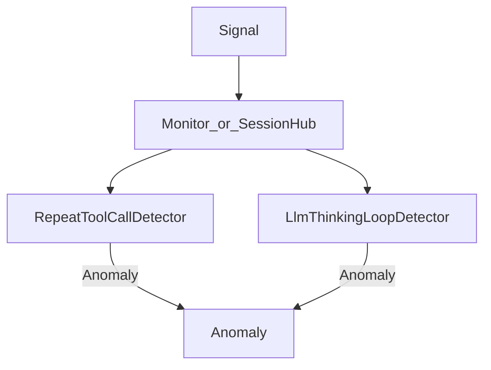
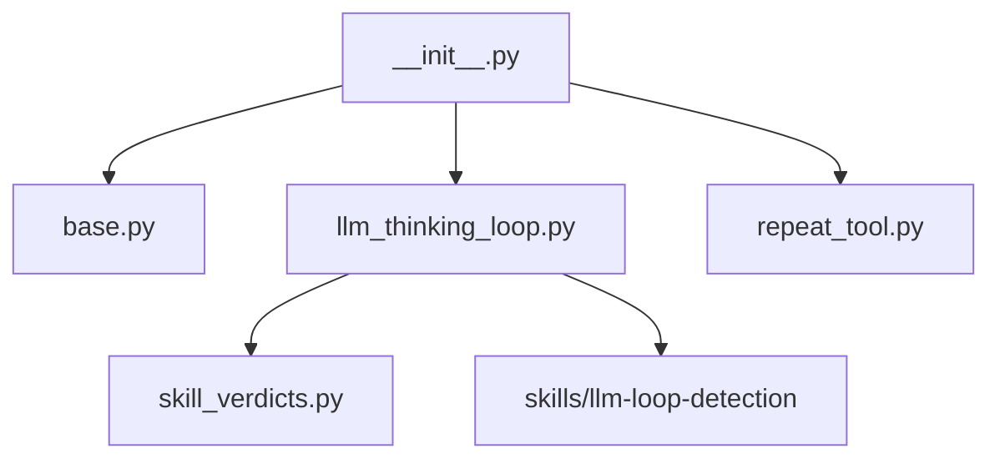
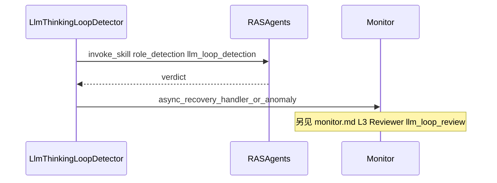

# Detectors 模块

> AET 模块详情口径：新人读完应能独立修改本模块。模板：`aet-analyzing-project` / `module-detail-template.md`。

## 概述

1. **解决什么问题**：把统一的 `Signal` 变成可选的 `Anomaly`（环内故障判定），不直接做 Host 副作用。
2. **架构角色**：L0 算法层；由 Monitor 或 `SessionHub` fan-out 调用；配置来自 `AgentRASConfig.detectors`。
3. **若移除**：无法识别工具循环与思考死循环等故障，恢复层无输入。



---

## 元数据

| 字段 | 值 |
|------|-----|
| 模块 ID | M-detectors |
| 路径 | `agent_ras/detectors/` |
| 文件数 | 5 Python + L3 skill 定义 |
| 规模 | ≈ 1632 行 Python（含 llm_thinking_loop 808 / repeat_tool 540） |
| 主要语言 | Python |
| 所属层 | L0 |

---

## 文件结构



| 文件 | 行数 | 职责 |
|------|------|------|
| `base.py` | 78 | `Detector` / `AsyncRecoveryDetector` 协议 |
| `llm_thinking_loop.py` | 808 | L1/L2 字面 + L3 语义 |
| `repeat_tool.py` | 540 | 工具重复 / ping-pong / 断路器 |
| `skill_verdicts.py` | 188 | Skill JSON 解析（fail-open） |
| `__init__.py` | 18 | 公开 re-export |

---

## 功能树

```text
检测能力
  - 工具循环
    - 同参重复 / ping-pong / 全局断路 / 未知工具连续失败
  - 思考/文本死循环
    - L1/L2 字面（suffix_cycle / similar_clauses）
    - L3 语义 Judge（llm-loop-detection skill）
  - 协议
    - observe / reset
    - 可选 AsyncRecoveryDetector
```

### 职责边界

**做什么**

- `Signal → Anomaly | None`（可 async）
- 产出 evidence（含 `recovery_profile` 等供 recovery 使用）
- L3 经 `RASAgents.invoke_skill`（唯一允许的「检测侧」外部调用）

**不做什么**

- 不 abort / steer / notice（见 [recovery.md](recovery.md)）
- 不消费 `tool_calls.delta` 类增量（见 detector docstring）
- 不做跨 session 全局聚合

---

## 公共接口契约

### 协议（`base.py`）

```python
class Detector(Protocol):  # base.py:22
    @property
    def name(self) -> str: ...
    def observe(self, signal: Signal) -> Anomaly | None | Awaitable[Anomaly | None]: ...
    def reset(self) -> None: ...
```

`AsyncRecoveryDetector`（`base.py:48`）：`has_async_recovery_in_flight` / `await_async_recovery` / `release_async_recovery` / `set_async_recovery_handler`。

### 导出（`__init__.py`）

| 符号 | 定义位置 |
|------|----------|
| `Detector` | `base.py:22` |
| `LlmThinkingLoopDetector` | `llm_thinking_loop.py:345` |
| `RepeatToolCallDetector` | `repeat_tool.py:191` |

### 注册（当前：手写 builders；目标：自包含插件）

**现状（P1 已落地）**：Monitor（含 openjiuwen factory）与 SessionHub **共用** [`detectors/registry.build_member_detectors`](../../../../agent_ras/detectors/registry.py)；按 `config.detectors.*.enabled` 门控；`SessionState.detectors: list` 首命中分发。仍须在 `DETECTOR_BUILDERS` **手加一行** + `core/config.py` 字段。

**目标态**：见 [fault-domain-plugins.md](../features/fault-domain-plugins.md)（`fault_domains/<id>/detector.py` 导出 `PLUGIN`，Loader 扫描；无独立 manifest）。

---

## 内部实现

### 关键算法

| 算法 | 用途 | 默认阈值（`config.py`） | 文件 |
|------|------|-------------------------|------|
| 起始门闩 | L1/L2/L3 均需累计字符达标 | `detection_start_chars=30000` | `llm_thinking_loop.py` |
| 扫描窗 | L1/L2 近窗 / 扫描间隔 | `window_max_chars=2000` | 同左 |
| `suffix_cycle` | 尾窗重复 pattern | `loop_repeat_threshold=5` | 同左 |
| `similar_clauses` | 分句相似度连通分量 | sim≥`0.95`，重复≥5 | 同左 |
| L3 检测 skill | `llm-loop-detection`（`role=detection`） | 每 `semantic_eval_chars=10000`；`semantic_content_enabled` 可关 | 同左 |
| global_breaker | 同 tool+args 无进展 | threshold=10 → CRITICAL | `repeat_tool.py` |
| ping_pong | A↔B 交替 | warning=5；critical=10 **且** no_progress | 同左 |
| unknown_tool | 连续失败 | critical=`unknown_tool_threshold`；warning=threshold//2 | 同左 |

**AnomalyKind**：L1/L2 → `LLM_THINKING_LOOP`；L3 语义 → `LLM_THINKING_DEAD_LOOP`（HIGH）。  
**双 skill**：检测 `llm-loop-detection`；Monitor 复核 `llm-loop-review`（recovery/skills，非 host 可配）。  
**Severity（thinking）**：`suffix_cycle`→LOW；`similar_clauses`→MEDIUM；L3→HIGH。  
**repeat_tool 检测优先级**：global_breaker → unknown_tool → ping_pong → generic。detector `name`=`repeat_tool_call`。

### 设计模式

| 模式 | 证据 | 原因 |
|------|------|------|
| Protocol / Strategy | `Detector` | 可替换算法，Monitor 无感知 |
| Fail-open | `skill_verdicts.parse_*` | Skill 解析失败不当成异常 |
| Latch | thinking-loop recovery latch | 避免恢复过程中重复触发 |

---

## 关键流程

### L1/L2 思考循环命中

```mermaid
sequenceDiagram
  participant Mon as Monitor
  participant Det as LlmThinkingLoopDetector
  participant Loop as LoopDetector
  Mon->>Det: observe STREAM_CHUNK
  Det->>Loop: detect window
  Loop-->>Det: suffix_cycle_or_similar
  Det-->>Mon: Anomaly LLM_THINKING_LOOP
```

### L3 检测（Detector）与 Reviewer（Monitor）两段



检测 skill 命中后仍可能进入 Monitor 的 **recovery Reviewer**（`llm-loop-review`），不是「检测 skill 即终判」。

---

## 依赖

| 方向 | 依赖 |
|------|------|
| 依赖 | `core.models`, `core.config`, `agents`（L3） |
| 被依赖 | `monitor.py`, `factory.py`, `session_hub.py` |

---

## 代码质量与风险

| 风险 | 说明 | 建议 |
|------|------|------|
| `repeat_tool` 缺专用单测 | 仅间接覆盖 | 补 unit tests |
| L3 延迟与费用 | 语义 eval 调 LLM | 守 `semantic_eval_chars` / timeout |
| 双注册点 | factory vs session_hub | 新增 detector 必须两边登记 |

### 测试

| 路径 | 覆盖 |
|------|------|
| `.../detectors/test_llm_thinking_loop_detector.py` | L1/L2/L3、latch |
| `.../detectors/test_detection_start_gate.py` | `detection_start_chars` |
| `.../recovery/test_auto_recovery.py` | 端到端 |

---

## 开发指南

### 扩展指南

> **目标态**见 [fault-domain-plugins.md](../features/fault-domain-plugins.md)：新域落在 `fault_domains/<id>/`，导出 `PLUGIN`，由 Loader 扫描注册，**不再**改 registry / config 静态字段 / SessionHub。  
> 下列步骤描述**当前代码**仍须手改的路径，落地插件化后以目标态为准。

1. 在 `detectors/` 实现 `Detector`（禁止宿主 SDK import）
2. 加 `*Config` 到 `core/config.py`
3. 在 `detectors/registry.DETECTOR_BUILDERS` 注册；并核对 SessionHub 路径（历史曾与 factory 门控不一致）
4. 需要 L3 检测时复用 `RASAgents` + `skill_verdicts` fail-open；复核 skill 在 recovery 侧
5. 产品方案写到 `designs/features/<topic>.md`

### 修改检查清单

- [ ] `observe` 仍无直接 Host 副作用
- [ ] `reset` 清掉 per-session 状态
- [ ] factory 与 SessionHub 注册/enabled 门控差异已核对
- [ ] AnomalyKind / evidence 与 recovery policy 对齐
- [ ] 有单测覆盖阈值边界
