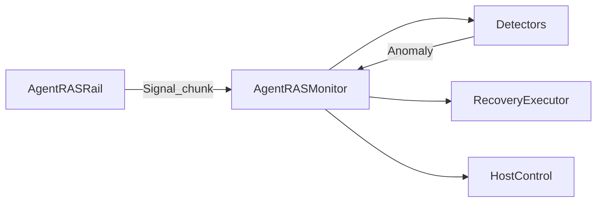
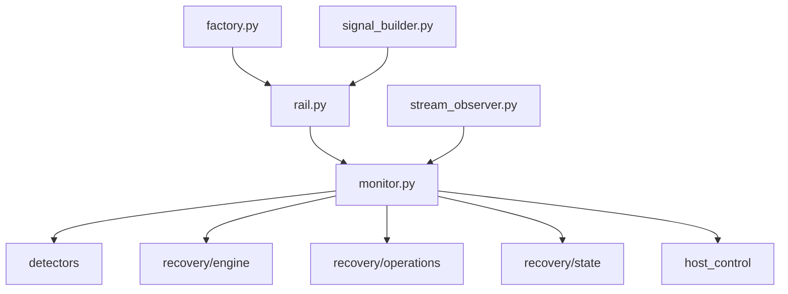
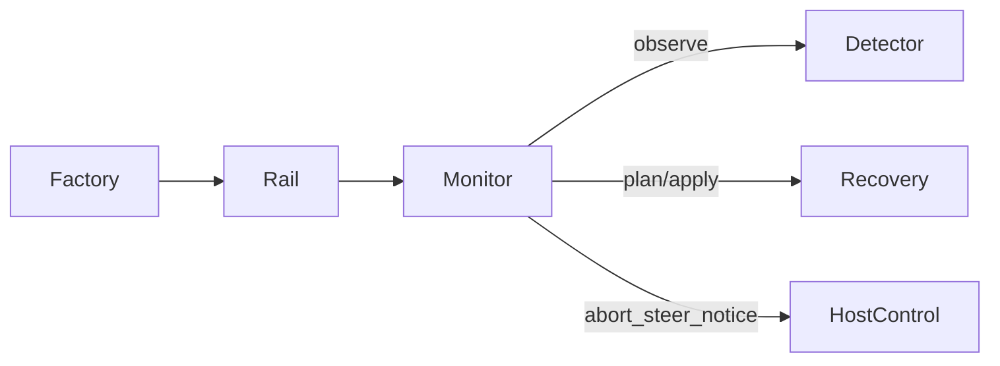
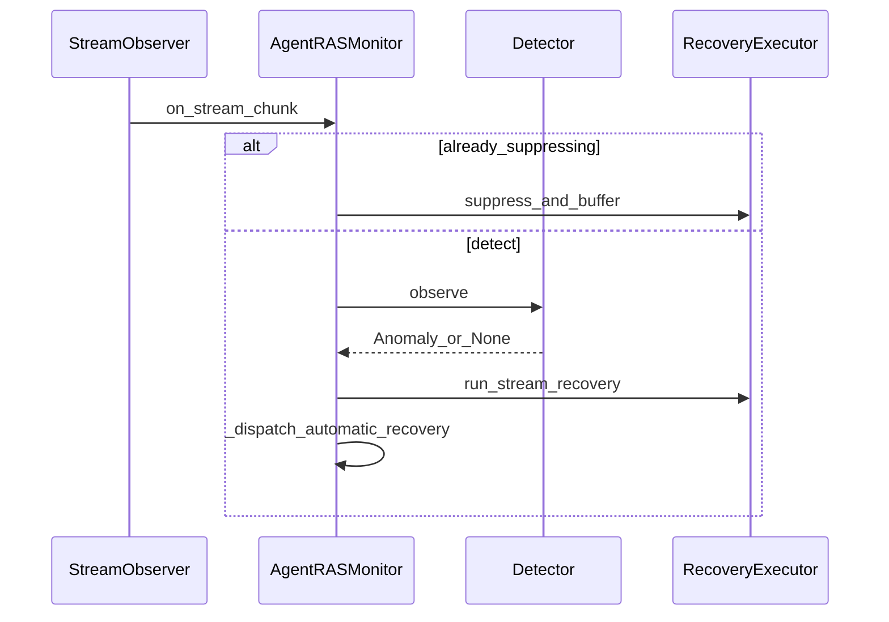
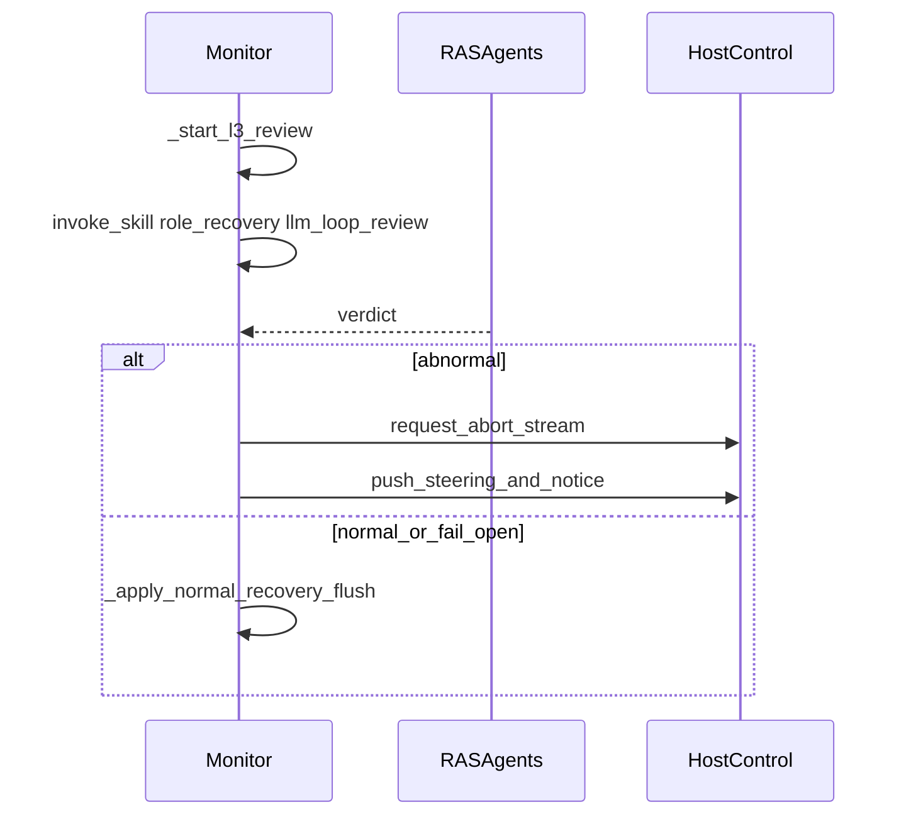

# Monitor 模块

> AET 模块详情口径：新人读完应能独立修改本模块。模板来源：`aet-analyzing-project` / `module-detail-template.md`。与现行 `monitor.py` / Rail / StreamObserver 源码对齐（含：无人工 HITL，L3 为自动 Reviewer）。

## 概述

1. **解决什么问题**：把宿主采到的 Signal / 流 chunk 统一编排成「检测 → 恢复」，并持有流抑制缓冲、L3 Reviewer 异步二次判定与 fail-open 收尾。
2. **在架构中的角色**：L0 编排中枢；由 `AgentRASRail`（openjiuwen）驱动。**不**经 `ras_runtime.SessionHub`（OpenCode inproc 是另一条编排路径）。
3. **若移除**：失去环内统一编排；流抑制、L1/L2 立即 abort、L3 Reviewer 状态机均断裂。



---

## 元数据

| 字段 | 值 |
|------|-----|
| 模块 ID | M-monitor |
| 路径 | `agent_ras/core/monitor.py`；装配/采点：`platform_adapter/openjiuwen/{rail,factory,stream_observer}.py` |
| 主文件规模 | `monitor.py` ≈ 1083 行；`rail.py` 374；`stream_observer.py` 185；`factory.py` 202 |
| 主要语言 | Python |
| 所属层 | L0 编排 + L3 采点（Rail） |
| 稳定导出 | `core/__init__.py` **不**导出 Monitor；经 `build_agent_ras_rail` 使用 |

---

## 文件结构



| 文件 | 行数 | 职责 |
|------|------|------|
| `core/monitor.py` | 1083 | `AgentRASMonitor`、`RingBuffer`；检测+恢复编排 |
| `core/signal_builder.py` | 127 | Rail 生命周期钩子用 `build_*_signal` |
| `openjiuwen/rail.py` | 374 | DeepAgent 钩子 → Monitor；session Monitor 缓存 |
| `openjiuwen/factory.py` | 202 | `build_agent_ras_rail` / detectors 装配 |
| `openjiuwen/stream_observer.py` | 185 | `{session_id}write_stream` 回调 |
| `openjiuwen/host_control.py` | 132 | `JiuwenHostControl`、`host_control_from_ctx` |

---

## 功能树

```text
Monitor 编排
  - 生命周期：start / stop / reset detectors / await async
  - 检测：handle(Signal) / on_stream_chunk → detection fan-out
  - 流恢复：suppress / truncate / finalize_stream_recovery
  - Thinking-loop 自动恢复
      - L1/L2：立即 abnormal（abort + steer + notice）
      - L3：Reviewer skill 二次判定 → abnormal 或 fail-open flush
  - 可观测：RingBuffer / get_metrics / events（不参与恢复状态机）
```

### 职责边界

**做什么**

- 持有 detectors、`RecoveryPolicy`、`RecoveryExecutor`、可选 `AnomalyReporter`
- `detection` → `recovery(phase=immediate|stream)`；thinking-loop 走 `_dispatch_automatic_recovery`
- 管理 `SuppressFlushState` / `PendingRecovery`；调度 deferred notice（`take_notice` / `consume_notice_for_emit`）
- 经 `HostControl` 施加副作用；可选 `reporter.report`

**不做什么**

- 不实现 Detector 算法；不直接 import `robustness_prompt`
- 不注册平台钩子（Rail / StreamObserver 负责）
- **无人工 HITL / `session.state` 持久化**：`DEFER_HITL` 已从 policy 剥离；L3 是**自动** Reviewer skill，不是人机确认
- `RingBuffer` 仅 metrics/debug，不参与 suppress/recovery 状态
- 不经 SessionHub（OpenCode inproc）

---

## 公共接口契约

### `AgentRASMonitor`（`monitor.py:176`）

| 方法 | 行号约 | 说明 |
|------|--------|------|
| `__init__(detectors, reporter, policy, …)` | 176 | 注入检测器与策略 |
| `start` / `stop` / `bind_host` | 302 / 319 / 264 | 生命周期；stop 等待 async detectors |
| `handle(signal, host)` | 424 | lifecycle：detection → recovery(immediate) |
| `on_stream_chunk(…)` | 436 | 流：detection + recovery(stream) + automatic |
| `detection` / `recovery` | 350 / 380 | 可单独调用的两阶段 |
| `wire_async_recovery` / `complete_async_stream_recovery` | 513 / 479 | L3 async 完成回调 |
| `finalize_stream_recovery` | 844 | `after_model_call` 收尾 / fail-open |
| `prepare_for_next_model_call` | 827 | 清除 abnormal 门闩 |
| `take_notice` / `consume_notice_for_emit` | 947 / 953 | 延迟 notice 交给 Rail |
| `get_metrics` / `events` / `get_recent_events` | 1050+ | 可观测 |

### 装配入口

- `build_agent_ras_rail` — `factory.py:127`
- `build_member_detectors` — `factory.py:78`
- `StreamObserver.attach` — 注册 `write_stream`；过滤 `llm_output` / `llm_reasoning`；跳过带 `stream_source_id` 的子流



---

## 内部实现

| 符号 | 位置 | 用途 |
|------|------|------|
| `detection` | `monitor.py:350` | fan-out `observe` |
| `on_stream_chunk` | `:436` | 流 Signal + stream recovery |
| `_dispatch_automatic_recovery` | `:556` | thinking-loop 分派 |
| `_start_l3_review` / `_invoke_l3_recovery` | `:575` / `:646` | Reviewer skill |
| `_apply_abnormal_recovery` | `:739` | abort → steer → notice |
| `_apply_normal_recovery` | `:793` | flush + release latch |

### 设计模式

| 模式 | 证据 |
|------|------|
| Orchestrator | `AgentRASMonitor` |
| Thin Adapter | `AgentRASRail` 只 hooks→Signal→Monitor |
| Factory + Registry | `DETECTOR_BUILDERS`（`factory.py:70`） |
| Protocol / DIP | `HostControl`、`Detector`、`AnomalyReporter` |
| Observer | `StreamObserver` 订 `write_stream` |
| Fail-open | L3 超时/判 normal → flush（`:609–634`, `:933–945`） |
| Session cache | Rail `OrderedDict[session_id, Monitor]`（超 soft limit 仅 warn，不驱逐） |

---

## 关键流程

### 流程 1：流 chunk

```text
Session.write_stream → StreamObserver._on_write_stream (:135)
  → Rail 在 attach 时注册的 on_chunk 回调（非 Rail.on_chunk 方法）→ Monitor.on_stream_chunk (:436)
  → detection(STREAM_CHUNK) → recovery(phase=stream)
  → _dispatch_automatic_recovery
```



### 流程 2：L3 Reviewer（自动二次判定，非 HITL）



| 步骤 | 说明 |
|------|------|
| L1/L2 | 立即 `_apply_abnormal_recovery` |
| L3 | 后台 Reviewer；`after_model_call` → `finalize_stream_recovery` 等待或 fail-open |
| Legacy | `release_after_hitl_yes` 仅为 detector 别名 → `release_after_recovery_normal` |

### 流程 3：Rail 生命周期 `handle`

```text
before/after_tool_call | on_*_exception | before/after_model_call
  → signal_builder.build_*_signal
  → monitor.handle → detection → recovery(immediate)
```

`before_model_call` 特殊序（`rail.py:303–324`）：绑 steering queue → `consume_notice_for_emit` → `prepare_for_next_model_call` → `handle(BEFORE_MODEL_CALL)`。

---

## 依赖

| 模块 | 使用 |
|------|------|
| detectors | `observe` / `AsyncRecoveryDetector` / latch 释放 |
| recovery | Policy、Executor、operations、state、`parse_skill_verdict` |
| agents | `invoke_skill(role=recovery)`、超时常量 |
| openjiuwen.core（经 Rail） | DeepAgentRail、`write_stream` 回调框架 |

---

## 代码质量与风险

| 风险 | 条件 | 影响 | 建议 |
|------|------|------|------|
| stop 超时 | L3 eval 未完成 | 异步残留 | `test_monitor_stop_*` |
| 双路径编排 | Monitor vs SessionHub | 行为漂移 | 改策略两边对齐 |
| 文档误称 HITL | 历史文案 | 实现预期错误 | 以本文 L3 Reviewer 为准 |
| 测试缺口 | factory / signal_builder / 全钩子 E2E | 回归盲区 | 改装配时补测 |

### 测试

| 路径 | 覆盖 |
|------|------|
| `recovery/test_auto_recovery.py` | L1/L2 abort、L3 Reviewer、fail-open |
| `test_monitor_stop_and_notice.py` | stop / notice |
| `test_agent_ras_rail_monitor_cache.py` | session 缓存不驱逐 |
| `test_stream_observer*.py` | attach/detach、子流跳过 |

---

## 开发指南

### 扩展

- 新检测器：实现 `Detector`，在 `factory` **与** `session_hub` 注册；勿写入 Monitor。
- 新恢复策略：优先 `recovery/engine` policy；仅编排时序变化才改 Monitor。
- 勿重新引入人工 HITL，除非产品需求 + `session.state` 持久化设计完整落地。

### 修改检查清单

- [ ] `start`/`stop` 与 async detector 释放
- [ ] 流路径与 lifecycle `handle` 行为一致
- [ ] L1/L2 立即 abort 与 L3 Reviewer / fail-open 未混用
- [ ] openjiuwen Monitor 与 SessionHub 是否需同步
- [ ] 更新 `test_auto_recovery` / `test_monitor_*`
- [ ] 文档不写「HITL」除非代码真有人机确认路径
