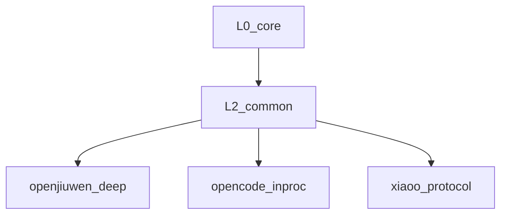
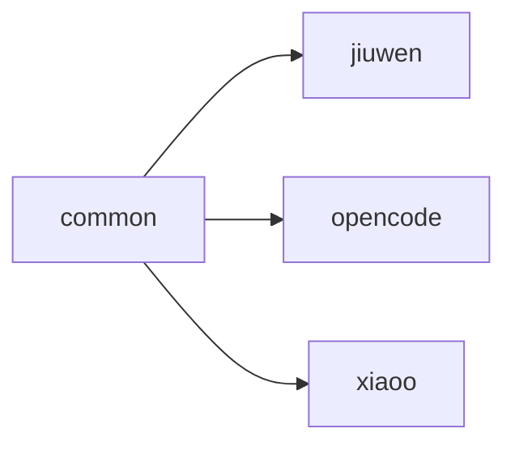
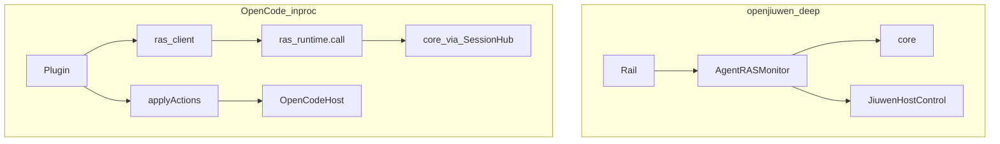
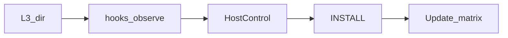

# Platform adapter 模块

> AET 模块详情口径：新人读完应能独立修改本模块。模板：`aet-analyzing-project` / `module-detail-template.md`。

## 概述

1. **解决什么问题**：把各 Agent 宿主的生命周期钩子与控制面 API 适配到 RAS（采 Signal、投递 abort/notice/steer），并共享 L2 客户端。
2. **架构角色**：L2（`common`）+ L3（按平台目录）；**禁止**复制 Detector/Recovery 算法。
3. **若移除**：无法挂到任何宿主；core 只能单测，无法环内生效。



---

## 元数据

| 字段 | 值 |
|------|-----|
| 模块 ID | M-platform-adapter |
| 路径 | `agent_ras/platform_adapter/` |
| 主要语言 | Python + JavaScript |
| 所属层 | L2 / L3 |

---

## 子模块

| ID | 名称 | 职责 | 路径 |
|----|------|------|------|
| M-pa.common | common | RasClient、applyActions、FFI bridge、Insight RAS reporter、embedding transport（`subprocess_ipc` 共享 SessionHub） | `common/` |
| M-pa.jiuwen | openjiuwen | Rail 深挂载 + Monitor + StreamObserver | `openjiuwen/` |
| M-pa.opencode | opencode | Plugin + HostControl + skill_judge | `opencode/` |
| M-pa.xiaoo | xiaoo | 协议 inproc 薄适配（hook 映射 + Daemon Host）；入口无关 | `xiaoo/` |



---

## 文件结构（关键）

| 区域 | 关键文件 | 职责 |
|------|----------|------|
| common | `ras_client.py/js`, `host_actions.js`, `protocol_client.py`, `python_bridge.js`, `insight_anomaly_reporter.py` | L2 契约、FFI / 协议工厂、① ras-events 旁路（**无** OTLP） |
| openjiuwen | `factory.py`, `rail.py`, `host_control.py`, `stream_observer.py`, `deep_agent_adapter.py` | 深挂载 |
| opencode | `plugin.js`, `host_control.js`, `skill_judge.js`, `INSTALL.md` | inproc 插件 |
| xiaoo | `hooks.py`, `daemon_*.py`, `hooker/`, `INSTALL.md` | Hook 映射 + Daemon Host；见 [opencode-xiaoo-integration](../features/opencode-xiaoo-integration.md) §4 |

---

## 功能树

```text
平台适配
  - 采点：Rail hooks / plugin events / StreamObserver
  - 投递：HostControl（abort / notice / steer）
  - L2：RasClient.observe + applyActions
  - L3 Skill：DeepAgentAdapter vs host ras-judge
  - 旁路：InsightAnomalyReporter / insight_push
```

### 职责边界

**做什么**：宿主 API 映射、session id 规范化、delivery_anchor 分配、安装说明。  
**不做什么**：不实现 LoopDetector/RecoveryPolicy；不改 wire message 文案；不监听 RAS 端口。

---

## 公共接口契约

### HostControl（协议真源 `core/host_control.py`）

平台实现：`request_abort_stream`、`push_steering`、`emit_user_notice`、`request_force_finish`、`write_stream_content` 等。

**ok 语义（2026-08-07 收紧）**：返回值必须以宿主**执行确认**为准，禁止"调用没抛异常即 ok=true"。fn 返回 `{"ok": ...}` 时 `CallableHostControl` 原样透出；xiaoo Daemon 路径以 `runtimes/cancel` / `runtimes/input` 的执行结果为准。SessionHub 另有 abort 生效性探针：abort 后 3s 窗口内仍有新 assistant 文本到达，补记 `abort_stream ok=false error=no_effect`。

### L2 Wire（`host_actions.js`）

| wire type | Host 方法 |
|-----------|-----------|
| `abort_stream` | `requestAbortStream` |
| `emit_notice` | `emitUserNotice` |
| `push_steering` | `pushSteering` |

Python 镜像：`recovery/operations.apply_recovery_actions`。

### 入口

| 平台 | 入口 |
|------|------|
| openjiuwen | `build_agent_ras_rail`（`factory.py`） |
| OpenCode | `AgentRasPlugin`（`plugin.js`）+ `npx agent-insight install-ras` |
| xiaoO | hooker stdout + `DaemonRasSession` / `build_xiaoo_daemon_host_fns` |

---

## 能力矩阵

| 能力 | openjiuwen | OpenCode | xiaoo |
|------|------------|----------|-------|
| Signal / observe | 深 | partial | partial |
| Stream 观测 | chunk（write_stream） | part.delta/updated | Daemon SSE mid-stream；hooker turn 级 |
| 检测/恢复算法 | 同一 core | ras_runtime inproc | ras_runtime |
| Insight 旁路 | InsightAnomalyReporter | SessionHub → insight_push | hooks+push |
| abort | abort_stream 流内 | session.abort + 重试 | Daemon `runtimes/cancel` |
| steering | push_steering | idle 后 session.prompt | Daemon `runtimes/input` |
| notice | 写流 | toast → 可见回退 | Daemon `runtimes/input`（`[RAS]` 前缀可选） |
| L3 AgentAdapter | DeepAgentAdapter | HostCallback + ras-judge | HostCallback + `skill_result` |
| 首期 | 全量 | 协议客户端+闸 | 协议 inproc / Daemon 控制面 |

图例：深 = 与 jiuwen 同级；partial = 可用但不等价。OpenClaw / Hermes **无** RAS 环内适配（Insight 观测仍走 OTel）。

---

## 关键流程

### 双路径对照



### 加平台 checklist



1. 新建 `platform_adapter/<name>/`：hooks + HostControl + INSTALL  
2. 协议路径优先复用 `common` 的 `RasClient` + **`applyActions`**；或 Python Monitor 深挂载  
3. **禁止**复制 detectors/recovery  
4. 更新本文件能力矩阵  
5. 使用说明链到 [`../../guides/`](../../guides/)

---

## Host / abort 契约摘要

本仓不 fork openjiuwen.core。深挂载依赖宿主：

- `request_abort_stream` / `consume_abort_stream` / steering queue  
- `write_stream` 前触发点（StreamObserver）

OpenCode：SDK v1/v2 abort 参数兼容、idle 后再 steer，详见 `opencode/INSTALL.md`。

---

## 依赖

| 子模块 | 依赖 |
|--------|------|
| common | `ras_runtime.call`、core reporter 接口 |
| openjiuwen | `openjiuwen.core.*`、`core.monitor` |
| opencode | OpenCode SDK、bun:ffi / libpython |

---

## 代码质量与风险

| 风险 | 说明 |
|------|------|
| 算法泄漏到 L3 | 审查 PR 禁止复制 detector |
| JS/Python wire 漂移 | 成对改 `host_actions.js` 与 `operations.py` |
| OpenCode abort 误用 | 只传一种 SDK 参数会导致流跑完 |
| `TERMINATE` 不可达 inproc | wire 无 terminate；CRITICAL tool loop force-finish 仅深挂载 |
| 测试缺口 | `plugin.js` / `ras_client` 缺单测；依赖 `test_host_actions.mjs` |

### 测试

| 路径 | 覆盖 |
|------|------|
| `tests/unit_tests/platform_adapter/test_host_actions.mjs` | applyActions + OpenCode host |
| `tests/unit_tests/harness/agent_ras/test_agent_ras_rail_*` 等 | jiuwen Rail / StreamObserver / DeepAgentAdapter |
| `tests/unit_tests/ras_runtime/test_call.py` | inproc 契约 |

---

## 开发指南

### 风格与约定

- Host 返回的 notice/steer **正文必须来自 core wire**，禁止改写成 summary  
- Session id：OpenCode 使用 `opencode:{nativeId}`  
- delivery_anchor：投递成功后带回 `message_id`

### 修改检查清单

- [ ] 能力矩阵行已更新且不夸大  
- [ ] 无新增 core 算法副本  
- [ ] wire 三元组与 Host 方法对齐  
- [ ] INSTALL / guides 链接有效  
- [ ] 深挂载路径测 Rail；inproc 路径测 call + applyActions  
