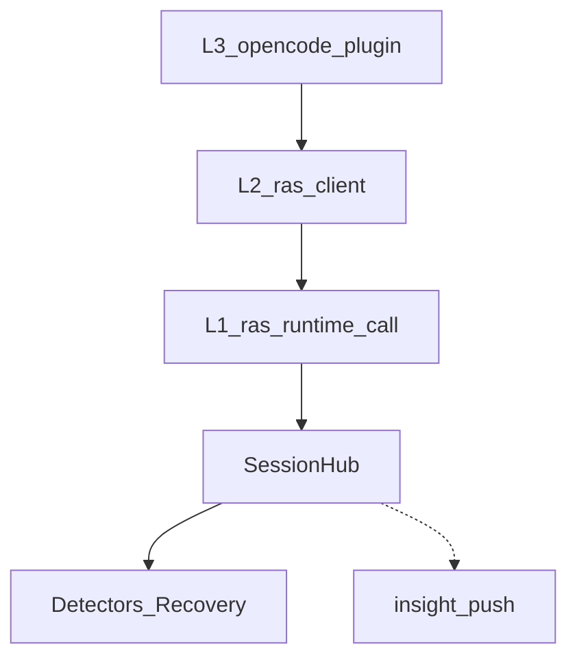
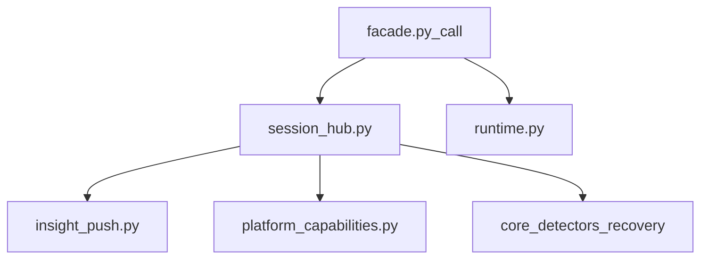
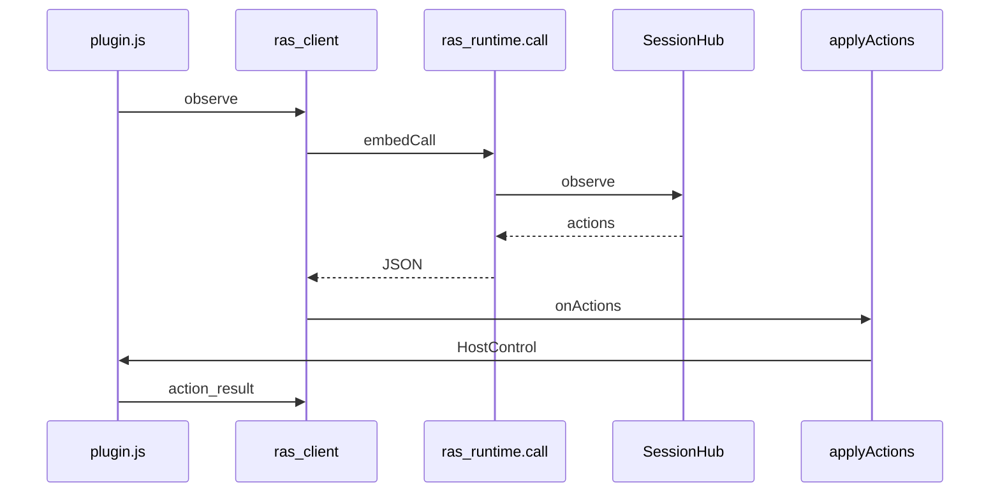

# ras-runtime 模块

> AET 模块详情口径：新人读完应能独立修改本模块。模板：`aet-analyzing-project` / `module-detail-template.md`。

## 概述

1. **解决什么问题**：为 **JS/FFI 宿主**（OpenCode 等）提供同进程同步门面 `call(op, …)`，在独立 asyncio loop 上跑 SessionHub（检测+决策），并 fail-open 旁路推 Insight。
2. **架构角色**：L1；依赖 L0 core；被 L2 `ras_client` / `python_bridge` 调用。**openjiuwen 深挂载不经本模块**（走 Rail+Monitor）。
3. **若移除**：OpenCode inproc 无法嵌入 Python 检测核；旁路 push 与 skill_result 协议断裂。

libpython 的 `RTLD_GLOBAL` 加载、结果文件回传与 L2/L3 文件级调用图见 [architecture.md §4](../architecture.md)。



---

## 元数据

| 字段 | 值 |
|------|-----|
| 模块 ID | M-ras-runtime |
| 路径 | `agent_ras/ras_runtime/` |
| 主要语言 | Python |
| 所属层 | L1 |

---

## 文件结构



| 文件 | 职责 |
|------|------|
| `facade.py` | 稳定 FFI：`call` / ops 分发 |
| `session_hub.py` | hello/observe/actions/skill_result/bye |
| `insight_push.py` | HTTP 旁路 ingest |
| `runtime.py` | daemon 线程 + asyncio loop |
| `event_bus.py` / `trail.py` / `platform_capabilities.py` | 辅助 |

**公开导出**（`__init__.py`）：仅 `call`、`reset_runtime_for_tests`。

---

## 功能树

```text
ras_runtime
  - 同步门面 call(op)
      - health / hello / observe / reset / action_result / skill_result / bye
  - SessionHub：per-session detectors + recovery wire
  - insight_push：anomaly / action_result（fail-open）
  - platform_capabilities：是否支持 host skill judge
```

### 职责边界

**做什么**：协议会话、构建 detectors、调用 `build_recovery_actions`、返回 wire actions、推送 Insight、承接 inproc `skill_result`（OpenCode / xiaoO）。SessionHub 是 inproc **编排核**（直连 Detectors + recovery wire），不是 Monitor 薄封装。  
**不做什么**：不调用 OpenCode SDK；不重做 recovery 决策；不替代 jiuwen Rail/Monitor。

---

## 公共接口契约

### `call(op, session_id, payload_json) -> str`（`facade.py:18`）

| op | 含义 |
|----|------|
| `health` | 探活 |
| `hello` | 创建 session（platform、能力） |
| `observe` | Signal 观测 → 可选 actions/anomaly/skill_requests |
| `action_result` | Host 投递 ack + anchors → push |
| `skill_result` | L3 host judge 回填（OpenCode / xiaoO inproc） |
| `reset` / `bye` | 清理 |

### Anchor 字段

| 名称 | 方向 | 键 |
|------|------|-----|
| `trace_anchor` | observe 入 / anomaly 出 | `message_id`, `part_id`, `call_id`, `channel` |
| `delivery_anchor` | action_result 入 | 白名单 `message_id` / `part_id` / `channel`（SessionHub **不**强制校验必填；Insight UI 标 RAS 的契约要求见 developer-guide） |

Insight 契约真源：[developer-guide/09-otlp-attribute-contract.md](../../../developer-guide/09-otlp-attribute-contract.md)。

---

## 内部实现

| 机制 | 位置 | 说明 |
|------|------|------|
| `run_coro` | `runtime.py` | 同步 call 调度到 embed loop |
| `SessionState` | `session_hub.py` | per-session detectors / last_trace_anchor |
| `fire_push_*` | `insight_push.py` | 缺配置跳过；失败只打日志 |
| capabilities | `platform_capabilities.py` | OpenCode / xiaoO 支持 host skill judge；openjiuwen 深挂载走 DeepAgentAdapter |

### 设计模式

| 模式 | 原因 |
|------|------|
| Facade | 稳定 FFI 面，隔离 SessionHub |
| Command（wire） | 与 JS `applyActions` 对齐 |
| Fail-open | 旁路不得拖垮主路径 |

---

## 关键流程

### OpenCode observe → deliver



---

## 依赖

| 依赖 | 用途 |
|------|------|
| `detectors` / `recovery` / `agents` | 检测与决策 |
| 被 `ras_client.py/js`、`python_bridge.js`、`InsightAnomalyReporter` 使用 | |

---

## 代码质量与风险

| 风险 | 说明 |
|------|------|
| 与 Monitor 双编排 | 改 detector 注册/恢复必须同步 session_hub |
| FFI/线程 | runtime loop 卡死影响所有 call |
| push 配置 | 依赖 `~/.agent-insight/ras/config.json` |

### 测试

| 路径 | 覆盖 |
|------|------|
| `tests/unit_tests/ras_runtime/test_call.py` | health/hello/observe/reset |
| `tests/unit_tests/ras_runtime/test_skill_result.py` | skill_result + deferred |
| `tests/unit_tests/harness/agent_ras/ras_runtime/test_insight_push.py` | push 配置与 fail-open |

---

## 开发指南

### 扩展

- 新 op：扩展 `facade.call` 分发 + SessionHub 方法 + JS client
- 新平台 capability：改 `platform_capabilities.py`
- 旁路字段：对齐 Insight ingest，禁止兼容层回潮

### 修改检查清单

- [ ] `call` JSON 契约向后兼容或显式 bump
- [ ] SessionHub 与 factory 的 detector **enabled 门控差异**已核对（SessionHub 始终建 thinking-loop detector）
- [ ] push 失败不影响 observe 返回
- [ ] anchors 白名单未引入启发式正文匹配；Insight 必填规则写在 developer-guide 而非夸大 SessionHub 校验
