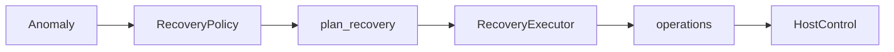
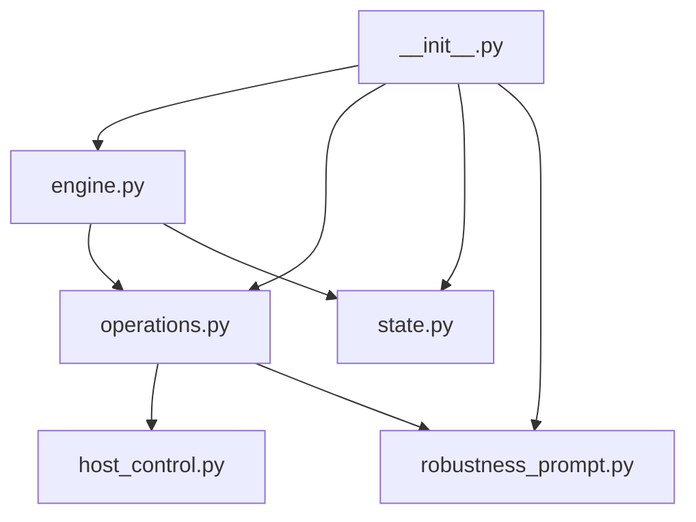
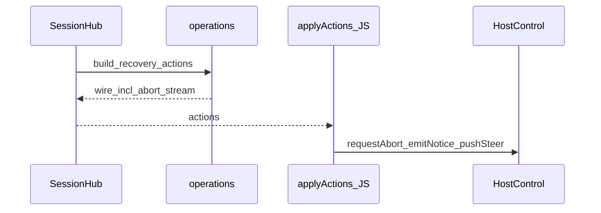

# Recovery 模块

> AET 模块详情口径：新人读完应能独立修改本模块。模板：`aet-analyzing-project` / `module-detail-template.md`。

## 概述

1. **解决什么问题**：把 `Anomaly` 映射成原子恢复动作，并经 `HostControl` 投递；文案集中渲染。
2. **架构角色**：L0 决策 + 副作用封装；平台只执行 wire，**不得重做策略**（`operations.build_recovery_actions` 注释约定）。
3. **若移除**：检测结果无法转化为 abort/steer/notice/terminate，环内恢复失效。



---

## 元数据

| 字段 | 值 |
|------|-----|
| 模块 ID | M-recovery |
| 路径 | `agent_ras/core/recovery/` |
| 规模 | engine 443 + operations 256 + state 138 + robustness_prompt 693 ≈ 1570 行 |
| 主要语言 | Python |
| 所属层 | L0 |

---

## 文件结构



| 文件 | 职责 |
|------|------|
| `engine.py` | `RecoveryAction`、Policy、`plan_recovery`、`RecoveryExecutor`、限流 |
| `operations.py` | truncate/suppress/steer/notice/terminate；`build/apply_recovery_actions` |
| `state.py` | `PendingRecovery`、`SuppressFlushState` |
| `robustness_prompt.py` | cn/en 文案与 steer/notice 模板 |
| `skills/llm-loop-review/` | L3 recovery review skill |

---

## 功能树

```text
恢复能力
  - 策略映射：severity × kind → RecoveryAction 集
  - 流抑制：truncate / buffer / flush
  - 立即动作：notice / steer / terminate
  - 协议 wire：build_recovery_actions → apply_recovery_actions
  - 文案：steer / notice / critical
  - 限流：LocalAutoRecovery（每 invoke 每 action ≤5）
```

### 职责边界

**做什么**：决策动作集、渲染 message、调用 Host 原子方法、维护 suppress 状态机。  
**不做什么**：不产 Anomaly；不实现平台 SDK；不做人工确认 UI；不持久化跨进程状态。

---

## 公共接口契约

### `RecoveryAction`（`engine.py:40`）

`OBSERVE_ONLY | REPORT_TO_USER | INJECT_STEERING | ESCALATE_USER | SUPPRESS_STREAM | TERMINATE`

### Policy 默认映射

| Severity | Actions |
|----------|---------|
| LOW | OBSERVE_ONLY, INJECT_STEERING |
| MEDIUM | REPORT_TO_USER |
| HIGH | REPORT_TO_USER, INJECT_STEERING |
| CRITICAL | INJECT_STEERING, ESCALATE_USER（**默认不含** `TERMINATE`） |

**Kind override**（仅两种）：`LLM_THINKING_LOOP` / `LLM_THINKING_DEAD_LOOP` → `OBSERVE_ONLY` + `SUPPRESS_STREAM`。

**`TERMINATE`**：仅当 policy **显式**含该动作且 kind∈`REPEAT_TOOL_CALL`/`TOOL_CALL_LOOP` 时由 `RecoveryExecutor.apply` 调 `request_force_finish`。协议 wire **无** `terminate` 类型，inproc 路径无法 force-finish。

### 关键函数

| 符号 | 位置 | 说明 |
|------|------|------|
| `RecoveryPolicy.ops_for` | `engine.py` | kind 优先于 severity |
| `plan_recovery` | `engine.py:225` | 生成 `RecoveryPlan` |
| `RecoveryExecutor.run_stream_recovery` | `engine.py:362` | 流阶段 |
| `RecoveryExecutor.apply` | `engine.py:388` | 立即阶段 |
| `build_recovery_actions` | `operations.py:183` | 协议 wire；**恒先** `abort_stream` |
| `apply_recovery_actions` | `operations.py:226` | 调 Host（与 JS `applyActions` 镜像） |
| `load_message` / `steer_text_for` | `robustness_prompt.py:490` / `:548` | 文案 |

### Wire 类型

```text
abort_stream | emit_notice | push_steering
```

Thinking-loop 在 wire 路径走专用分支（`recovery_steering_on_abnormal`），**不**经 `plan_recovery` / `LocalAutoRecovery` 限流。

---

## 内部实现

### 设计模式

| 模式 | 位置 | 原因 |
|------|------|------|
| Policy | `RecoveryPolicy` | 可配置 kind/severity 映射 |
| Command（wire） | `build_recovery_actions` | 跨语言投递同一决策 |
| State machine | `SuppressFlushState` | pending → review_awaiting → resolved/suppressed |

### 关键策略

- Immediate ops：`INJECT_STEERING | REPORT_TO_USER | ESCALATE_USER | TERMINATE`
- `TERMINATE`：非默认 CRITICAL 动作；见上节条件
- User notice：受 `notify_user_on_warning` 与 policy 约束

---

## 关键流程

### Anomaly → Host（双路径）

| 路径 | 决策 | 投递 |
|------|------|------|
| 深挂载 Monitor | `RecoveryExecutor` / `_apply_abnormal_recovery`（**不**调 `build_recovery_actions`） | 直连 `HostControl`（含 truncate / 条件 force_finish） |
| 协议 SessionHub | `build_recovery_actions` | L2 `applyActions` → Host |



### Thinking-loop abnormal（Monitor 路径）

```text
Monitor._apply_abnormal_recovery
  → host.request_abort_stream
  → apply_recovery_abnormal → inject_steering
  → emit_user_notice
```

---

## 依赖

| 依赖 | 用途 |
|------|------|
| `core.models` | Anomaly / Severity / Kind |
| `core.host_control` | Host 协议 |
| `core.config` | RecoveryPolicyConfig |
| 被依赖 | Monitor（Executor 路径）、SessionHub（仅 `build_recovery_actions`）、factory 装配 policy |

---

## 代码质量与风险

| 风险 | 说明 |
|------|------|
| 平台重做策略 | 违反分层；审查 adapter 不得改 wire 语义 |
| prompt 模板缺测 | `robustness_prompt` 大量 key 无单测 |
| 双投递实现 | Python `apply_recovery_actions` vs JS `applyActions` 必须同步 |

### 测试

| 路径 | 覆盖 |
|------|------|
| `tests/unit_tests/harness/agent_ras/recovery/test_local_auto_recovery.py` | Policy / rate limit |
| `tests/unit_tests/harness/agent_ras/recovery/test_auto_recovery.py` | L1/L2/L3 自动恢复 |
| `tests/unit_tests/core/test_operations_host_control.py` | wire build/apply |
| `tests/unit_tests/platform_adapter/test_host_actions.mjs` | JS applyActions |

---

## 开发指南

### 扩展

1. 新动作：扩展 `RecoveryAction` + Policy + `operations` +（若协议）JS `WIRE_TO_HOST`
2. 新文案：只改 `robustness_prompt.py`，平台禁止改写 message
3. 新 kind 映射：改 `DEFAULT_KIND_OVERRIDES` / config，而不是 adapter

### 修改检查清单

- [ ] Policy 与 Monitor automatic 路径是否冲突
- [ ] Python / JS wire 映射成对更新
- [ ] 文案 key 双语齐全
- [ ] 限流与 `needs_immediate_apply` 行为可测
