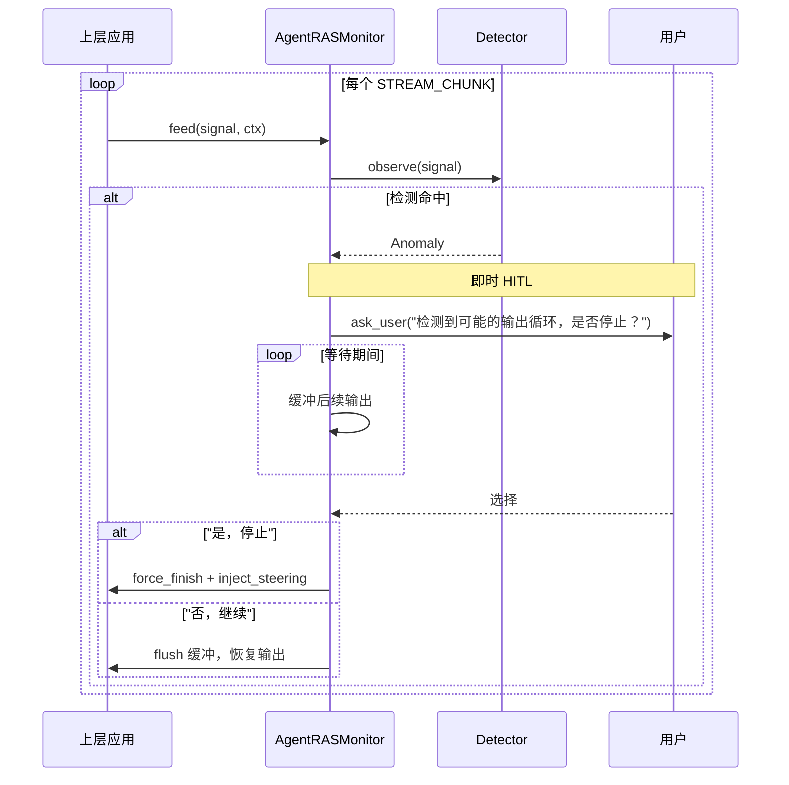

# Agent Reliability 架构优化方案（历史）

> 本文不再作为实现状态来源；当前架构见 [`../implementation_status.md`](../implementation_status.md)。

> 基于代码审查发现的改进方向，按优先级排列。

## 目标

通过对 agent_ras 模块的架构优化，实现以下目标：

1. **恢复决策统一**：消除 Rail 与 Monitor 两处恢复调用的不对称，将恢复逻辑收归 Monitor 统一管理
2. **故障恢复即时性**：解决 LLM 思考死循环检测命中后恢复延迟的问题，实现检测命中即时发起人机交互，不再等待模型输出结束
3. **接口简化**：消除 `create_deep_agent()` 中 reliability 专属的 7 个冗余参数，与框架其他 Rail 的注册模式对齐
4. **消除反向依赖**：移除外部注入 `ask_user_fn` 回调，改用 agent-core 内置的 `InterruptRequest` 机制，实现框架自闭环
5. **命名规范统一**：Config 类名、注册方式、配置来源与框架其他 Rail 保持一致

## 需求

| 编号 | 需求 | 关联章节 |
|------|------|---------|
| R-01 | 恢复调用统一到 Monitor，LOCAL/MESSAGER 两模式对称 | 一 |
| R-02 | LLM 思考死循环检测命中后即时发起 HITL，不再延迟到 after_model_call | 二 |
| R-03 | 检测命中后缓冲输出、用户确认后再截断或恢复，支持"先问后做" | 二 |
| R-04 | create_deep_agent 移除全部 reliability_* 参数，配置从 YAML 读取 | 三、五 |
| R-05 | AgentRASRail 注册方式与其他 default Rail 对齐（列表内注册，非 append） | 五 |
| R-06 | Config 类名从 AgentRASConfig 改为 TeamAgentRASConfig | 五 |
| R-07 | 移除 ask_user_fn 外部注入，改用 agent-core 内置 InterruptRequest | 四 |
| R-08 | AgentRASRail 内部自行组装 Monitor/Detector/Executor，不外泄组装细节 | 五 |

---

## 一、Remediation 调用收归 Monitor

### 问题

当前恢复操作分两处执行：`AgentRASRail._dispatch()` 做即时干预（INJECT_STEERING 等），`AgentRASMonitor._route()` 做报告（reporter.report）。LOCAL 模式在 Rail 侧恢复，MESSAGER 模式却在 Monitor 侧（通过 MessagerRecoveryReporter），两套模式不对称。

### 方案

将 LOCAL 模式的恢复调用统一到 Monitor 内部：

```python
# monitor.py — 新增
async def feed(self, signal: Signal) -> list[Anomaly]:
    """纯检测，无副作用。MESSAGER 模式复用。"""
    ...

async def recover(self, anomalies: list[Anomaly], ctx) -> None:
    """LOCAL 模式：恢复 + HITL。无 ctx 时直接返回。"""
    if not anomalies or ctx is None:
        return
    for a in anomalies:
        actions = self._policy.actions_for(a.severity, a.kind)
        await self._executor.run_stream_recovery(ctx, a, ...)
    answer = await ask_user(ctx, ...)
    ...

# rail.py — 简化为两行
anomalies = await monitor.detection(signal)
await monitor.recover(anomalies, ctx)
```

### 效果

- Monitor 成为唯一恢复决策点，LOCAL/MESSAGER 两模式对称
- Rail 不再参与恢复决策，职责缩减为信号捕获 + ctx 透传
- `feed()` 保持不变，向后兼容 MESSAGER 模式

---

## 二、LLM 思考死循环恢复机制修复

### 问题

当前实现有三个缺陷：

| 缺陷 | 说明 |
|------|------|
| **先截断后问询** | SUPPRESS_STREAM 在 HITL 之前执行，用户还没确认就被截断了 |
| **HITL 延迟执行** | DEFER_HITL 等到 `after_model_call` 才触发，模型可能一直在输出 |
| **模型不终止** | 检测命中后模型继续跑，Token 持续浪费 |

### 方案

改为"先问后做"——检测命中后立即发起 HITL，等待期间缓冲输出，用户确认后执行：



### 效果

- 用户先看到问题再决策，不会"输出被截断但不知道为什么"
- 不再依赖 `after_model_call`，模型输出期间即可发起 HITL
- 必要时可立即终止模型，不再浪费 Token

### 可行性

所有积木已存在：`suppress_and_buffer()` / `flush_suppressed_stream()` / `ask_user()` / `request_force_finish()` / `inject_steering()`。只需新增 ~20 行决策逻辑。

---

## 三、简化 AgentRASRail 调用参数

### 问题

`create_deep_agent()` 中 reliability 独占 7 个参数，其他 rail 只有 1 个 bool：

```python
# 当前
create_deep_agent(
    enable_agent_ras: bool = False,           # 冗余，AgentRASConfig 已有 enabled
    reliability_config: AgentRASConfig = None,   # 必要
    reliability_ctx_getter: Callable = None,    # 默认 lambda:None，未实质使用
    reliability_ask_user_fn: Callable = None,   # 可用 InterruptRequest 替代
    reliability_messager: Any = None,           # 可从 config.deployment_mode 推导
    reliability_agent_id: str = None,           # 冗余，card.name 已有
    reliability_session_id: str = "",           # 空串默认
)

# 理想：和其他 rail 一致
create_deep_agent(
    reliability_config: AgentRASConfig = None,   # None → 不启用
)
```

### 方案

| 参数 | 处理 |
|------|------|
| `enable_agent_ras` | 移除，由 `AgentRASConfig.enabled` 替代 |
| `reliability_config` | 保留，唯一必要参数 |
| `reliability_agent_id` | 从 `card.name` 内部获取 |
| `reliability_session_id` | Rail 内部生成 |
| `reliability_ctx_getter` | 移除，未实质使用 |
| `reliability_messager` | 从 `config.deployment_mode` 内部推导 |
| `reliability_ask_user_fn` | 换用 agent-core 内置 InterruptRequest 机制（见第四节） |

### 效果

reliability 参数与其他 rail（如 TaskPlanningRail）对齐，`create_deep_agent()` 只需一行配置即可启用。

---

## 四、修复 ask_user_fn 回调问题

### 问题

当前 reliability 通过外部注入 `ask_user_fn` 回调实现 HITL，导致：

1. **反向依赖风险**：agent-core 依赖上层（jiuwenclaw）注入回调，形成接口级耦合
2. **不必要的外部依赖**：agent-core 自身已有完整的 HITL 能力——`AskUserRail`、`InterruptRequest`、`BaseSecurityRail`

### agent-core 现有能力

```
core/single_agent/interrupt/         ← InterruptRequest 协议（5 文件）
harness/rails/interrupt/             ← AskUserRail / ConfirmRail
harness/rails/security/              ← BaseSecurityRail（SecurityInterrupt）
harness/cli/ui/repl.py               ← HITL 交互渲染
```

`AskUserRail` 注册 `ask_user` 工具，触发 `InterruptRequest` 中断等待用户输入。其他 rail（SecurityRail、SkillEvolutionRail）都走这个通道，不需要外部注入回调。

### 方案

将 reliability 的 HITL 从外部注入 `ask_user_fn` 改为直接使用 agent-core 内置的 `InterruptRequest` 机制：

```python
# 当前：外部注入回调
async def ask_user(ctx, questions, ask_user_fn):
    return await ask_user_fn(ctx, questions)   # ← 上层注入

# 改后：走 agent-core 内置通道
from openjiuwen.core.single_agent.interrupt import InterruptRequest

async def ask_user(ctx, questions):
    request = InterruptRequest(message=questions[0]["text"])
    result = await ctx.emit_interrupt(request)  # ← 走 agent-core 标准通道
    return result
```

### 效果

- 消除反向依赖，`create_deep_agent()` 不再需要 `reliability_ask_user_fn` 参数
- 与 SecurityRail、SkillEvolutionRail 的 HITL 方式统一
- 不需要上层注入任何回调，agent-core 自闭环

---

## 五、create_deep_agent 调用复杂度简化

### 问题

当前 `create_deep_agent()` 中 reliability 的注册逻辑远比其他 rail 复杂，存在三个问题：

**问题 1：注册方式不对称**

reliability 在 `default_rails` 列表之后单独 append，而非和其他 rail 一样在列表内：

```python
default_rails = [
    (SecurityRail,       True,              lambda: SecurityRail()),
    (TaskPlanningRail,   enable_task_plan,  lambda: TaskPlanningRail()),
    (SkillUseRail,       bool(skills),      _make_skill_rail),
    (SessionRail,        ...,               lambda: SessionRail()),
    (SubagentRail,       ...,               lambda: SubagentRail()),
]
# ← reliability 在这里单独 append，不在列表里
if enable_agent_ras:
    default_rails.append((AgentRASRail, True, lambda: agent_ras_rail_from_components(...)))
```

**问题 2：配置来源不一致**

其他 rail 从 YAML 读取配置，不通过 `create_deep_agent()` 参数传入：

```python
# TaskPlanningRail — 从 YAML 读
task_kwargs = resolve_task_planning_rail_kwargs(react_config)
(TaskPlanningRail, enable_task_planning, lambda: TaskPlanningRail(**task_kwargs))

# reliability — 通过 create_deep_agent 参数注入（7 个参数）
create_deep_agent(enable_agent_ras=..., reliability_config=..., reliability_ctx_getter=...,
                  reliability_ask_user_fn=..., reliability_messager=..., ...)
```

**问题 3：Config 类名不符合命名约定**

| Rail | Config 类名 | 命名模式 |
|------|-----------|---------|
| TaskPlanningRail | `TaskPlanningRailConfig` | `{Rail名}Config` |
| AgentRASRail | `AgentRASConfig` | ❌ 不符合，叫"Monitor的配置"而非"Reliability的配置" |

### 方案

**修正 1：从 YAML 读取配置，移除 create_deep_agent 参数**

参考 TaskPlanningRail 模式，配置从 YAML 的 `reliability` 段读取，在 factory.py 内部解析：

```python
# factory.py — 从 YAML 读，和其他 rail 一样
rel_cfg = TeamAgentRASConfig.model_validate(get_config().get("agent_ras", {}))

# 直接放在 default_rails 列表里（不是 append）
default_rails = [
    (SecurityRail,       True,                lambda: SecurityRail()),
    (TaskPlanningRail,   enable_task_planning, lambda: TaskPlanningRail()),
    (SkillUseRail,       bool(skills),        _make_skill_rail),
    (SessionRail,        ...,                 lambda: SessionRail()),
    (SubagentRail,       ...,                 lambda: SubagentRail()),
    (AgentRASRail,    rel_cfg.enabled,     lambda: AgentRASRail(rel_cfg)),
]
# 不再需要: if enable_agent_ras: default_rails.append(...)
# 不再需要: enable_agent_ras, reliability_config 等 7 个参数
```

**修正 2：Config 类重命名**

`AgentRASConfig` → `TeamAgentRASConfig`，与 `TaskPlanningRailConfig` 命名模式对齐。

**修正 3：组装收敛到 Rail 内部**

将 Monitor/Detector/Executor 的组装从 `agent_ras_rail_from_components` 收敛到 `AgentRASRail.__init__`：

```python
class AgentRASRail(DeepAgentRail):
    def __init__(self, config: TeamAgentRASConfig, *, member_name: str = ""):
        self._config = config
        self._member = member_name
        # 内部组装 Monitor + Detectors + Executor
        self._detectors = build_member_detectors(config)
        self._executor = RecoveryExecutor(...)
        self._monitor = AgentRASMonitor(self._detectors, ..., config=config)
```

### 效果

- `create_deep_agent()` 移除全部 7 个 reliability_* 参数
- reliability 注册从 8 行 append 缩减为列表内 1 行
- 配置从 YAML 读取，与 TaskPlanningRail 模式完全一致
- `TeamAgentRASConfig` 类名符合 `{Rail名}Config` 命名约定
- `agent_ras_rail_from_components` 中间工厂函数可移除
- 子工厂（`build_member_detectors` 等）保留为模块级函数供单元测试
