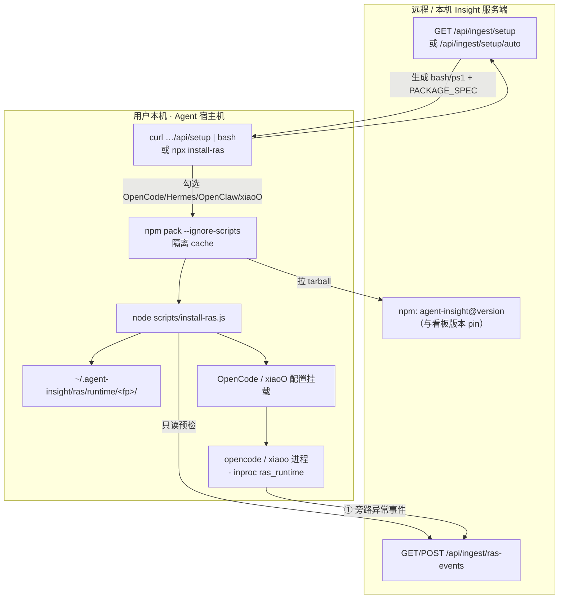
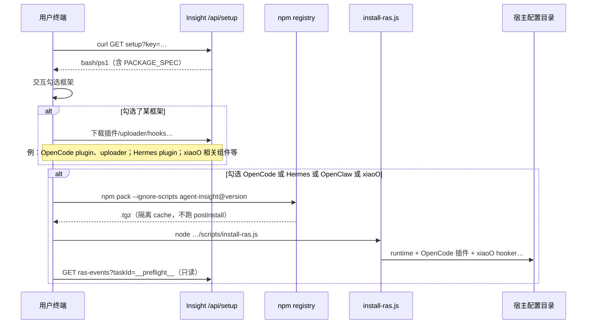
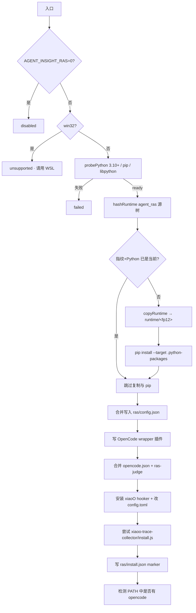
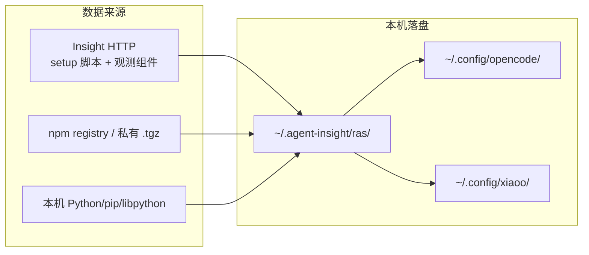

# Agent RAS：本机安装过程详解

> **读者**：需要理解「执行安装命令后，用户机器上发生了什么」的使用者与排障者。  
> **范围**：环内 RAS（`agent_ras`）的**安装面**与本机落盘；不含检测器算法细节。  
> **真源**：[`scripts/install-ras.js`](../../../scripts/install-ras.js)、[`src/lib/ingest/setup-package.ts`](../../../src/lib/ingest/setup-package.ts)、看板 [`/api/ingest/setup`](../../../src/app/api/ingest/setup/route.ts)。  
> **关系总览**：[Insight · RAS · FI](../../agent-fault-injection/designs/ras-fi-insight-relationship.md)。

---

## 1. 一句话

RAS **不是**独立守护进程。安装命令把 Python 运行时与平台挂载写到本机目录；之后检测/恢复在 **Agent 宿主进程内（inproc）** 跑，异常事件旁路 POST 到 Insight `/api/ingest/ras-events`。



---

## 2. 入口命令对照

| 入口 | 典型命令 | 何时用 | 是否装观测采集器 |
|------|----------|--------|------------------|
| **看板「安装指导」** | `curl -fsSL "$HOST/api/setup?key=…" \| bash`（Windows：`irm … \| iex`） | 平台已部署，在 **Agent 实际运行的机器** 接入 | 是（按勾选框架）+ 条件装 RAS |
| **一键部署步骤 4** | `install` 拉 `/api/setup/auto` 后执行 `~/.agent-insight/auto_setup.sh` | `npx agent-insight install` 本机同机部署 | 同上 |
| **仅 RAS** | `npx agent-insight install-ras` 或 `node scripts/install-ras.js` | 已有采集器、只补/升级 RAS | 否（但装 xiaoO hooker 成功后会尝试装 `xiaoo-trace-collector`） |
| **只检查** | `npx agent-insight install-ras --check` | 不改文件，校验指纹与挂载 | — |

> **重要**：Insight 服务端 `start` **不会**在 Agent 机上装 RAS。服务与 Agent 不在同一机器时，必须在 **Agent 宿主** 上跑上表命令。

---

## 3. 本机前置条件清单

| 项 | 要求 | 不满足时 |
|----|------|----------|
| OS | Linux / macOS；**原生 Windows 不支持** inproc（请用 WSL） | 安装器返回 `unsupported`，看板仍可用 |
| Node.js | ≥ 20（setup 脚本与 `npm pack`） | setup / pack 失败 |
| npm + tar | 下载与解压 tarball | RAS 段失败，telemetry 可继续 |
| Python | **3.10+**，带 **pip**，带 **共享 libpython**（Linux 常需 `python3-dev`） | `probePython` 失败 |
| 写权限 | `~/.agent-insight/`、`$XDG_CONFIG_HOME/opencode`、`$XDG_CONFIG_HOME/xiaoo` | 安装中断 |
| 网络 | 能访问：Insight Host（setup/预检）、npm registry（或 `AGENT_INSIGHT_CLIENT_PACKAGE_SPEC` 指向的 .tgz） | pack / 预检失败 |
| 可选宿主 | 已装 `opencode` / `xiaoo`（可后装；配置会先写好） | 仅警告，不阻塞 RAS 核心 |

环境变量（安装前后常用）：

| 变量 | 作用 |
|------|------|
| `AGENT_INSIGHT_HOST` | Insight 基址（写入事件 URL） |
| `AGENT_INSIGHT_API_KEY` | 旁路上报鉴权（`x-witty-api-key`） |
| `AGENT_INSIGHT_RAS=0` | **跳过** RAS 安装 |
| `AGENT_INSIGHT_RAS_HOME` | 覆盖默认 `~/.agent-insight/ras` |
| `AGENT_INSIGHT_DATA_DIR` | 覆盖整个数据根 |
| `AGENT_INSIGHT_CLIENT_PACKAGE_SPEC` | 覆盖 pin 包（源码/私有 .tgz URL） |
| `AGENT_INSIGHT_RAS_EVENTS_URL` | 直接指定 events URL |
| `RAS_PYTHON` | 优先使用的 Python 可执行文件 |
| `XDG_CONFIG_HOME` | OpenCode / xiaoO 配置根（默认 `~/.config`） |

---

## 4. 与「观测采集」同一次 curl 时的总序

看板安装指导生成的脚本会先装 **Trace 采集组件**，再在勾选特定框架时装 RAS。逻辑顺序如下：



触发 RAS 的框架开关（脚本内）：

```text
INSTALL_OPENCODE || INSTALL_HERMES || INSTALL_OPENCLAW || INSTALL_XIAOO
  → install_agent_insight_ras "$HOST" "$API_KEY"
```

未勾选上述任一框架时：**不会**自动装 RAS（可用单独的 `install-ras`）。

---

## 5. `install_agent_insight_ras`（bash 内嵌函数）逐步说明

实现：[`getAgentInsightRasBashInstaller()`](../../../src/lib/ingest/setup-package.ts)。

| 步 | 动作 | 细节 |
|----|------|------|
| 0 | 开关 | `AGENT_INSIGHT_RAS=0` → 打印 disabled 并 return 0 |
| 1 | 工具检查 | 需要 `npm`、`tar` |
| 2 | 临时目录 | `mktemp -d …/agent-insight-ras.XXXXXX` |
| 3 | 下载包 | 最多 **3 次**：`NPM_CONFIG_CACHE=$tmp/npm-cache-N npm pack --ignore-scripts --pack-destination $tmp "$AGENT_INSIGHT_PACKAGE_SPEC"` |
| 4 | 解压 | `tar -xzf` → `$tmp/extracted/package/` |
| 5 | 校验内容 | 必须存在 `scripts/install-ras.js` 与 `agent_ras/pyproject.toml` |
| 6 | 执行安装器 | `AGENT_INSIGHT_HOST=… AGENT_INSIGHT_API_KEY=… node …/install-ras.js` |
| 7 | 预检 | `curl -H "x-witty-api-key: …" "$HOST/api/ingest/ras-events?taskId=__agent_insight_ras_preflight__"`（失败只警告） |
| 8 | 清理 | `rm -rf` 临时目录 |

**不会**做的事：

- 不用 `npx` 把整套看板依赖装进当前目录  
- 不跑 npm 包的 `postinstall`（`--ignore-scripts`）  
- 不启动常驻 RAS daemon  

`AGENT_INSIGHT_PACKAGE_SPEC` 默认 = 当前服务端 `package.json` 的 `name@version`；可用环境变量覆盖为可被 Agent 机访问的 `.tgz` URL（源码联调）。

---

## 6. `install-ras.js` 本机落盘逐步说明

实现：[`scripts/install-ras.js`](../../../scripts/install-ras.js) → `installRas()`。



### 6.1 Python 探测

- 候选：`RAS_PYTHON` → `python3` → `python`
- 要求版本 ≥ 3.10、`python -m pip` 可用、能解析到**非 .a** 的共享 `libpython`
- 失败信息会明确提示缺 pip / 缺共享库（如装 `python3-dev`）

### 6.2 Runtime 指纹与复制

从包内 `agent_ras/` 对下列入口做内容哈希（SHA-256）：

`core` · `detectors` · `recovery` · `agents` · `platform_adapter` · `ras_runtime` · `config` · `pyproject.toml` · `README.md`

落盘目录：

```text
~/.agent-insight/ras/runtime/<fingerprint前12位>/
```

仅当「指纹 / Python 可执行路径 / 目录存在性」与 `install.json` 不一致时才重新 `copyRuntime` + `pip install --target …/.python-packages`。

### 6.3 配置合并 `~/.agent-insight/ras/config.json`

幂等合并 `agent_ras`：

- `enabled: true`
- `service.transport = inproc`
- `service.python` / `python_home` / `libpython` / `repo_root` / `python_packages`
- `insight.enabled`（默认保持 true）
- `insight.events_url` ← 由 Host 推导或 `AGENT_INSIGHT_RAS_EVENTS_URL`
- `insight.api_key` ← 环境变量或 `~/.agent-insight/.env`
- 保留用户已有阈值（如 `llm_thinking_loop`）

### 6.4 OpenCode 挂载

| 路径 | 内容 |
|------|------|
| `~/.config/opencode/plugins/agent-insight-ras.js` | 生成的 re-export，指向 runtime 内 `platform_adapter/opencode/plugin.js` |
| `~/.config/opencode/opencode.json` | `plugin` 数组加入 `./plugins/agent-insight-ras.js`；合并 `agent.ras-judge`（已有同名不覆盖） |

### 6.5 xiaoO 挂载

| 路径 | 内容 |
|------|------|
| `~/.agent-insight/ras/xiaoo/hooker/*` | 从 runtime 复制 hooker；写 `plugin.json`（Chat / Tool / Session 三类 hook） |
| `~/.config/xiaoo/config.toml` | `[hooker].plugins` 追加 hooker `plugin.json` 路径 |

成功后若存在 [`scripts/xiaoo-trace-collector/install.js`](../../../scripts/xiaoo-trace-collector/install.js)，会再装 **Insight ⓪ Trace 采集器**（完整链路观测；RAS 不再负责 OTel）。

### 6.6 安装标记 `~/.agent-insight/ras/install.json`

```json
{
  "fingerprint": "<sha256>",
  "python": "/usr/bin/python3",
  "runtimeRoot": "/home/…/.agent-insight/ras/runtime/<fp12>",
  "pythonPackages": "…/.python-packages",
  "installedAt": "ISO-8601"
}
```

`--check` 用它与当前源树指纹、OpenCode/xiaoO 挂载做一致性校验。

---

## 7. 安装完成后的目录树（示意）

```text
~/.agent-insight/
├── .env                          # 可选；HOST / API_KEY 回退源
└── ras/
    ├── install.json              # 安装标记
    ├── config.json               # inproc + insight 旁路
    ├── runtime/<fp12>/           # 内容寻址 runtime
    │   ├── core/ detectors/ recovery/ …
    │   ├── platform_adapter/opencode/plugin.js
    │   ├── platform_adapter/xiaoo/hooker/
    │   ├── pyproject.toml
    │   └── .python-packages/     # pip --target
    └── xiaoo/hooker/             # 对外挂载副本 + plugin.json

~/.config/opencode/
├── plugins/agent-insight-ras.js
└── opencode.json

~/.config/xiaoo/
└── config.toml                   # [hooker].plugins 含 RAS
```

临时目录（安装中，结束后删除）：

```text
${TMPDIR:-/tmp}/agent-insight-ras.XXXXXX/
├── npm-cache-N/
├── agent-insight-*.tgz
└── extracted/package/
```

---

## 8. 数据从哪里来

| 数据 / 产物 | 来源 |
|-------------|------|
| 安装脚本正文 | Insight `GET /api/ingest/setup`（或 `/auto`）动态生成 |
| `AGENT_INSIGHT_PACKAGE_SPEC` | 服务端当前包名@version，或 env 覆盖 |
| `agent_ras` 源码与安装器 | **npm tarball**（`npm pack`），不是再从 git clone |
| OpenCode / Hermes 等**观测**插件 | 同次 setup 从 **Insight HTTP** `/api/ingest/setup/<component>` 下载（与 RAS tarball 路径不同） |
| Python 依赖 | 本机 `pip` 装进 runtime 的 `.python-packages` |
| API Key / Host | setup 查询参数 → 环境变量 → 写入 `ras/config.json` / `.env` |
| 预检 | 本机 `curl` 打 Insight RAS ingest（只读） |



---

## 9. 安装后运行时（对照理解）

安装**不会**留下「RAS Worker」进程。运行时：

1. 用户启动 `opencode` / `xiaoo`（等）  
2. 宿主加载已挂载的插件 / hooker  
3. 同进程加载 `libpython` + `ras_runtime`  
4. 检测 → 恢复动作回投宿主；异常旁路 → Insight  

详见 [architecture.md](../designs/architecture.md)、[platform-opencode.md](platform-opencode.md)、[platform-xiaoo.md](platform-xiaoo.md)。

---

## 10. 验收与排障

### 验收

```bash
# 安装状态
npx agent-insight install-ras --check

# 关键关键文件
ls -la ~/.agent-insight/ras/install.json ~/.agent-insight/ras/config.json
test -f ~/.config/opencode/plugins/agent-insight-ras.js && echo opencode_plugin_ok

# 跑一轮真实对话后，看板「可靠性观测」/agent-ras/trace 应能看到旁路事件（若已启用 insight）
```

### 常见失败

| 现象 | 可能原因 | 处理 |
|------|----------|------|
| `unsupported` | 原生 Windows | 改 WSL |
| `未找到共享 libpython` | 无共享库 Python | 装 `python3-dev` 或换带 `.so/.dylib` 的发行版 |
| `npm pack` 失败 | 网络 / registry / 错误 PACKAGE_SPEC | 检查 registry；源码场景设 `AGENT_INSIGHT_CLIENT_PACKAGE_SPEC` |
| 预检失败 | Host 不可达 / Key 错 | 检查 `AGENT_INSIGHT_HOST`、API Key；安装本身可能已成功 |
| OpenCode 无 RAS | 未重启 opencode / 插件路径错 | 重启宿主；`--check` 看 platforms.opencode |
| 有 RAS 无完整 Trace | 只装了 RAS，未装观测采集器 | 再跑安装指导勾选对应框架；xiaoO 确认 collector |

---

## 11. 与 FI 的边界（安装面）

| | RAS（本文） | FI |
|--|-------------|-----|
| 典型 curl | `/api/setup`（条件触发） | `/api/fault-injection/setup` |
| 本机角色 | 宿主内模块 | 常驻 **FI Worker** + CLI |
| 是否互相依赖 | 否 | 否；FI Worker **不**启动 RAS |
| 文档 | 本文 | [FI 本机安装过程](../../agent-fault-injection/guides/local-install-process.md) |

---

## 12. 源码与延伸阅读

| 文件 | 说明 |
|------|------|
| [`src/lib/ingest/setup-package.ts`](../../../src/lib/ingest/setup-package.ts) | bash 内嵌 `install_agent_insight_ras` |
| [`src/app/api/ingest/setup/route.ts`](../../../src/app/api/ingest/setup/route.ts) | 安装指导脚本（含框架勾选与 RAS 触发） |
| [`src/app/api/ingest/setup/auto/route.ts`](../../../src/app/api/ingest/setup/auto/route.ts) | 一键部署 auto_setup |
| [`scripts/install-ras.js`](../../../scripts/install-ras.js) | 本机 RAS 安装器 |
| [`agent_ras/platform_adapter/opencode/INSTALL.md`](../../../agent_ras/platform_adapter/opencode/INSTALL.md) | OpenCode 适配安装摘要 |
| [configuration.md](configuration.md) | 配置项 |
| [getting-started.md](getting-started.md) | 按平台最短路径 |
