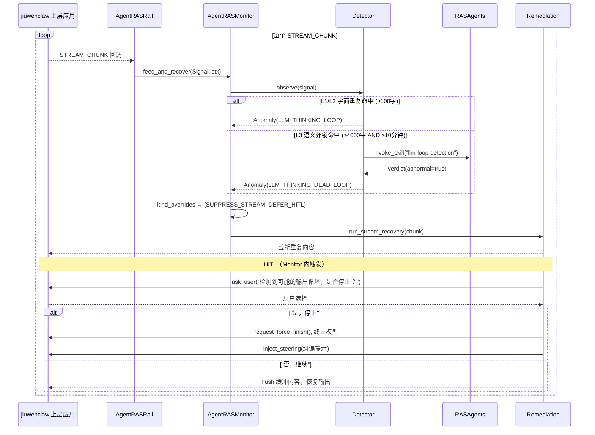

# Agent Reliability 主流程时序图（历史）

> 当前流程以 `implementation_status.md` 和代码为准。

> LLM 思考死循环检测 → Monitor 内统一检测+恢复 → 统一 HITL。

## 流程说明

| 阶段 | 触发条件 | 所在位置 |
|------|---------|---------|
| L1/L2 字面检测 | 后缀循环 ≥5次 或 近似子句 ≥5个 | Monitor 内 detector.observe() |
| L3 语义检测 | ≥4000字 AND ≥10分钟 → Skill 判决 | Monitor 内 detector → Agents |
| 恢复 + HITL | 任一检测命中 | **Monitor 内统一执行**（Rail 不参与恢复决策） |
