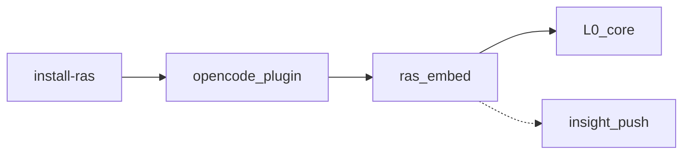

# OpenCode 接入

同进程：`ras_embed` + bun:ffi；能力为 partial（非 jiuwen 同级 chunk abort）。

**inproc 如何加载 libpython、模块如何互相调用**：见 [architecture.md §4](../designs/architecture.md)。



## 安装

在 Agent Insight 仓库根：

```bash
npx agent-insight install-ras
# 开发：node scripts/install-ras.js
# 检查：node scripts/install-ras.js --check
```

安装器写入 `~/.agent-insight/ras/`，合并 `ras-judge` 等到 OpenCode 配置。详细步骤见源码旁 [`platform_adapter/opencode/INSTALL.md`](../../../agent_ras/platform_adapter/opencode/INSTALL.md)。

## 注意

- 仅 inproc；不启本地 RAS 端口或守护进程
- 语义 Judge 默认开；可在配置中关闭
- 旁路事件 fail-open；UI 契约见 developer-guide

配置：[configuration.md](configuration.md)。能力矩阵：[../designs/modules/platform-adapter.md](../designs/modules/platform-adapter.md)。
