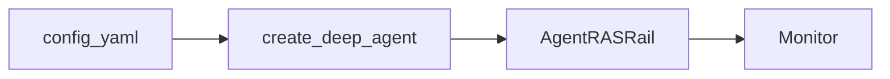

# openjiuwen / jiuwenclaw 接入

深挂载：L3 Rail 直连 L0，流内 abort / steer / notice；thinking-loop 含 L3 自动 Reviewer。



## 启用

1. 依赖已安装的 openjiuwen / agent-core（含 abort 流契约）。
2. 代码路径：`create_deep_agent(agent_ras=AgentRASConfig(...))` 或等价工厂。
3. jiuwenclaw：在资源 `config.yaml` 增加 `agent_ras` 段，由 adapter 透传，不访问 Rail 私有字段。

## 配置片段示例

```yaml
agent_ras:
  enabled: true
  detectors:
    repeat_tool:
      enabled: true
      warning_threshold: 5
      critical_threshold: 10
      global_breaker_threshold: 10
      unknown_tool_threshold: 10
    llm_thinking_loop:
      enabled: true
      semantic_content_enabled: true
      detection_start_chars: 30000
      window_max_chars: 2000
      loop_repeat_threshold: 5
      similar_clause_sim_threshold: 0.95
      semantic_eval_chars: 10000
  recovery:
    notify_user_on_warning: true
```

更多能力深度见 [../designs/modules/platform-adapter.md](../designs/modules/platform-adapter.md)。  
包入口：[`agent_ras/README.md`](../../../agent_ras/README.md)。
