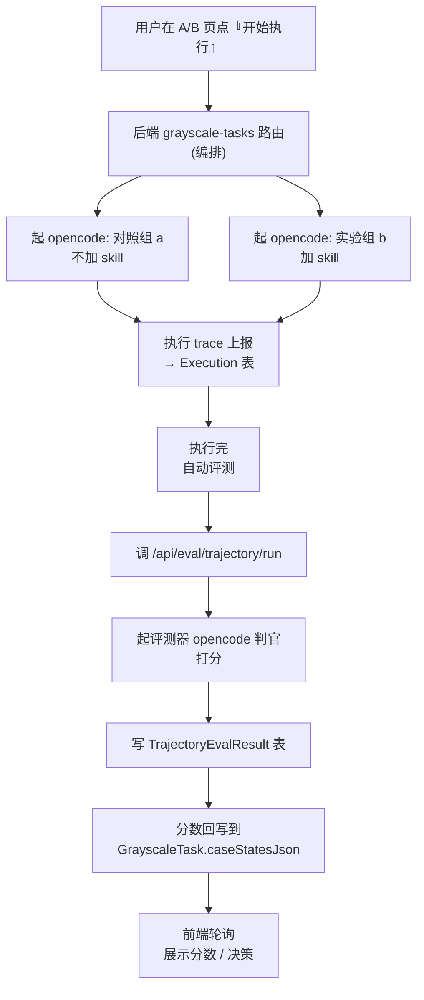
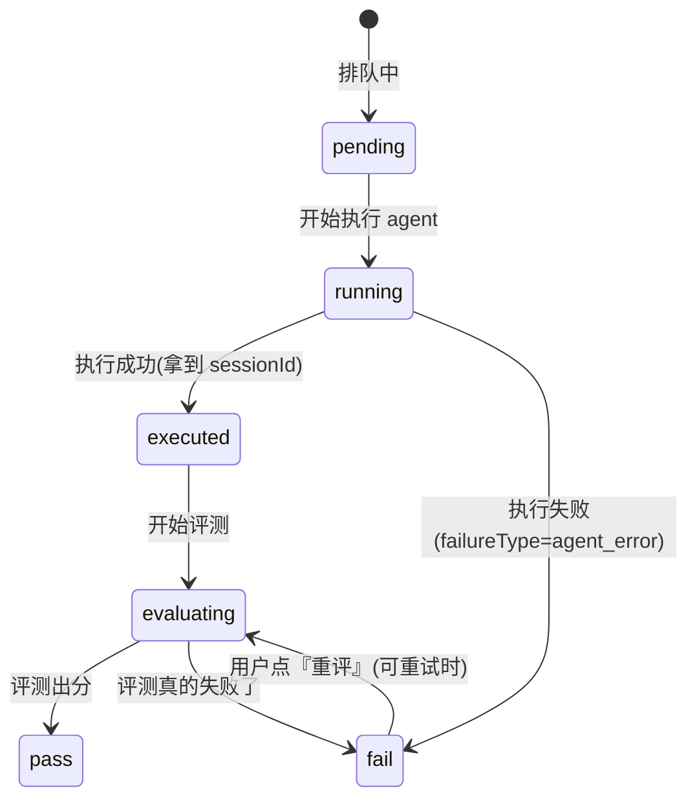

# A/B 测试模块说明

> 给第一次接触这块代码的人:先读第 1~3 节就能上手;第 4、5 节是"改之前必须看",列了哪些地方一改就出 bug、以及我们真踩过的坑。

---

## 1. 这个模块是干嘛的

**一句话:同一个 skill,对比"给 agent 用 / 不给 agent 用"(或 A 版 / B 版)的差异,帮用户判断这个 skill 到底有没有用、值不值得上线。**

用户在「Skills 评测 → A/B 测试」页操作,流程四步:

1. **配置**:选 skill、选版本、选数据集(一批用例)、选评估器。
2. **执行**:平台对每个用例,分别用**对照组**和**实验组**各跑一遍 agent。
   - **对照组(代码里叫 `a` / baseline)**:不加这个 skill(`grayscale-baseline-agent`)。
   - **实验组(代码里叫 `b` / skill)**:加这个 skill(`grayscale-skill-agent`)。
3. **评测**:执行完,自动起一个"评测器(LLM 判官)"给每条结果打分。
4. **决策**:把两侧分数一比,给出"能力 / 成本 / 稳定性"三维评估和"通过 / 打回"结论。

几个贯穿全程的概念:

| 词 | 意思 |
|---|---|
| **用例 (case)** | 数据集里的一道题,比如"分析这份日志有没有攻击" |
| **轮 (round)** | 同一道题重复跑几遍(减少随机性),`repeatRounds` 配置 |
| **侧 (side)** | `a`=对照组(无 skill)、`b`=实验组(有 skill) |
| **run** | 一次具体的执行+评测,= 某个用例 × 某轮 × 某侧 |
| **批次 (evaluatorRunId)** | 一个 A/B 任务的所有评测结果,归到同一个批次 id 下 |

所以一个 2 用例 × 2 轮的 A/B 任务,会有 `2 × 2 × 2(两侧) = 8` 个 run。

---

## 2. 数据怎么流动的

**重点:执行 agent 和评测器都在服务器上跑(不是用户本机),用的是平台自己起的 opencode 进程。**



一句话版:**点开始执行 → 服务器两侧各跑 agent → 跑完自动叫判官打分 → 分数写回任务 → 前端轮询刷新。**

---

## 3. 数据存在哪、长什么样

### 3.1 `GrayscaleTask` 表 —— 一个 A/B 任务一行

两个关键 JSON 字段:

- **`configJson`**:配置。常看的:
  - `skillId` / `versionAId` / `versionBId`:测哪个 skill 的哪两个版本。
  - `selectedDatasetId` / `checkedCaseIds`:用哪个数据集、勾了哪些用例。
  - `evaluators`:用哪些评估器。
  - **`evaluationBatchId`**:这个任务的**稳定评测批次 id**(见 4.1,很重要)。
- **`caseStatesJson`**:每个用例的执行/评测状态,结构是:

```jsonc
{
  "用例id-1": {
    "a": { "status": "pass", "score": 63, "runs": [ {run}, {run} ] },  // 对照组
    "b": { "status": "pass", "score": 55, "runs": [ {run}, {run} ] }   // 实验组
  },
  "用例id-2": { ... }
}
```

一条 **run** 长这样(只列常用字段):

```jsonc
{
  "runIndex": 1, "roundIndex": 1,
  "sessionId": "ses_155d39832ffe...",   // 这次执行的 opencode 会话 id = 执行 trace 的 id
  "status": "pass",                      // 见下面状态机
  "score": 78.8, "tier": "...",          // 评测分数
  "evaluatorRunId": "trun_178097...",    // 这条评测属于哪个批次
  "evaluationResultId": "...",           // 对应 TrajectoryEvalResult 的行 id
  "evaluations": [                       // 每个评估器一条
    { "evaluatorId": "preset-agent-task-completion", "status": "done", "score": 78.8 }
  ],
  "output": "", "failureType": null      // 失败时填原因
}
```

### 3.2 `TrajectoryEvalResult` 表 —— 一条 = 一次"对某条 trace 的评测"

- 按 **`evaluatorRunId`(批次)** 聚合。评测中心(评测执行页)就是按这个分组,一个批次显示成一条"评测任务"。
- `taskId` = 被评测的执行 trace 的 sessionId,`rawAnalysisJson` 里存分数 + `grayscaleBinding`(标记这条属于哪个 A/B 任务/用例/侧)。

### 3.3 run 的状态机(每个状态什么意思)



> 一个关键区分:**`fail` 有两种**——
> - **执行失败**:`failureType = 'agent_error'`,agent 没跑出来。前端显示「执行失败」,按钮是「重跑」(重新执行)。
> - **评测失败**:`failureType` 为空,agent 跑出来了(有 sessionId)但评测器打分失败。前端显示「评测失败」,按钮是「重评」(只重新评测,复用已有执行结果)。
>
> **这俩千万别混**:用 `failureType` 区分。混了会出现"执行明明成功却显示执行失败、还点不动重评"(见 5.4)。

---

## 4. 🔒 改这些地方之前,先想清楚(不变量)

下面每条都是"看着能简化、一简化就出 bug"的地方。

### 4.1 一个 A/B 任务 = 一个稳定批次

- **规则**:一个 A/B 任务的所有评测(全量、补评、行级重评、重启续跑)都落到**同一个** `evaluatorRunId`,这个 id 存在 `config.evaluationBatchId` 里。
- **代码**:`evaluateRunsWithConcurrency`(`grayscale-tasks/[taskId]/route.ts`)。做法叫 **seed-then-persist**:还没有批次时,先**顺序地**用第一条评测建出批次、把 id 存进 config,其余评测全部 append 到这个批次。
- **为什么**:评测中心按 `evaluatorRunId` 分组显示。如果每次评测都新建一个批次 id……
- **改错的现象**:评测执行页里冒出一堆**同名任务、分数还不一样**——因为每个批次只装了一部分 trace,各自算出来的平均分不同。我们真出现过一个 A/B 任务散成 14 个批次(其中一堆是"一条 trace 一个批次")。

### 4.2 Trace 归属 = 真正触发的用户,不是上传用的账号

- **规则**:执行 trace(Execution 表)的 `user` 字段,必须记**真正点按钮的那个用户**。
- **代码**:`runner.ts` 起 opencode 会话时,用 `tagOpencodeSession` 把真实用户登记在会话上;`ingest/upload/route.ts` 收到上报时,**用这个登记的用户**覆盖归属。
- **为什么**:A/B 的 agent 是**服务器**起的,它的 trace 上报走的是**服务器的 API key**。如果直接按"谁的 key 上传记谁",就会全部记到服务账号(`admin`)名下。
- **改错的现象**:用户在「链路追踪」或「评测批次详情」里**看不到自己的 trace 输入/输出**(显示"无 trace 输入"),因为那些 trace 记在 admin 名下、按当前用户一过滤就没了。

### 4.3 `"no valid tasks to run"` 不是失败,是"已经评过了"

- **规则**:评测派发返回 `"no valid tasks to run"` 时,**绝不能**把这条 run 标成失败。它的真实含义是"去重判定这条 trace 已经评过、没有新任务可建"。
- **代码**:`evaluateSingleRunTarget` 的 catch(`grayscale-tasks/[taskId]/route.ts`)。正确做法:从库里把这条 trace **最近一条真实评测结果**回填回来(已评出分 → pass;真失败 → fail)。
- **改错的现象**:用户**已经评出分**的 run,一点重评、或一刷新,就变成"失败",而且分数被清掉、重试还是失败,死循环。

### 4.4 打开任务页(GET)只"解卡 + 回填",绝不自动重评

- **规则**:GET 一个 A/B 任务时,可以做两件事:① 把崩溃卡死的 run 解卡成"可操作"状态;② 把"失败但库里其实有结果"的 run 用已有结果回填。但**不能自动重新跑评测**。
- **代码**:GET handler(`grayscale-tasks/[taskId]/route.ts`)。历史上有一段"打开页面就自动补评"的逻辑(`gray_recover_`),**已删除**。
- **为什么 / 改错的现象**:如果打开页面就自动评测,用户会发现"**我啥也没点,一刷新它自己就跑起来了**,还把本来有分数的又评了一遍"——既吓人又浪费,而且并发还会引发 4.1 的散裂。

### 4.5 任务名是身份

- **规则**:同一个 skill 版本下,**可以建多个 A/B 任务,用任务名区分**。唯一键是 `(user, skillName, skillVersion, taskName)`。
- **代码**:`schema.prisma` 的 `@@unique`;创建/改名在 `grayscale-tasks` 路由。
- **改错的现象**:如果唯一键漏了 `taskName`,同一版本只能有一个 A/B 任务,用户新建会"莫名其妙切到旧任务"。

### 4.6 评测失败是终态,除非"可重试且还有次数"(C+D)

- **规则**:评测失败后,只有当它"可重试且没用完重试次数"时,才回到「评测中」让重试循环再跑;否则就停在 `fail` 终态,**不再变化**。
- **代码**:`evaluateSingleRunTarget` 末尾的 C+D 段 + `eval-run-guards.ts` 的 `shouldRetryGrayscaleEval`。
- **为什么**:不这么做,UI 会出现 `fail → running → fail` 反复闪烁,用户一脸懵。

### 4.7 用例分析排除 A/B 批次;评测执行不排除

- **规则**:
  - **用例分析**(Skills 评测 → 用例分析)的历史任务列表,**只看独立评测任务,排除 A/B 批次**(A/B 的评测只在 A/B 页看)。
  - **评测执行**(评测中心 → 评测执行)是**通用查看页**,**展示全部批次**(含 A/B),这样两个 A/B 历史能互相看到、来回切。
- **代码**:`/api/eval/trajectory/runs` 给每条批次打 `source`(带 `grayscaleBinding` 即 `grayscale-ab`),用例分析的列表请求带 `excludeGrayscale=1`。
- **改错的现象**:搞反了的话——要么 A/B 任务混进用例分析里删不掉,要么评测执行里看一个 A/B 历史时另一个 A/B 历史消失了。

### 4.8 灰度重评要绕过"去重"

- **规则**:普通(用例分析)评测会按 trace 去重(评过的不重评)。但**灰度 A/B 的重评必须放行**——用户就是要重新评这条 trace。
- **代码**:`trajectory/run/route.ts`,判断 `if (!grayscaleBinding && 命中去重) 才跳过`。
- **改错的现象**:去掉这个放行,A/B 的 trace 评过一次后就**再也重评不动**,全报 `"no valid tasks to run"`。

### 4.9 展示用 `latestByCase` 去重(同用例取最新分,旧行保留)

- **规则**:一个 trace 可能被评测多次(留下多行 `TrajectoryEvalResult`)。展示时按用例取**最新一条**的分,但旧行**保留**(可追溯)。
- **代码**:`selectLatestDatasetCaseResults`。
- **为什么**:这正是允许 4.8(重评)的前提——重评只新增一行、展示取最新,所以不怕越积越多。

---

## 5. ⚠️ 这些坑我们真踩过(别再踩)

### 5.1 改错了页面
"用例分析"的历史任务列表,数据来自 **`skill-eval/page.tsx` 的 `reloadEvalTasks`**(变量 `caseEvalTasks`),**不是** `eval/page.tsx`。曾经给 `eval/page.tsx` 加了过滤,结果用例分析页面**一点没变**。改之前先确认是哪个文件在喂这个列表。

### 5.2 "给当前选中的批次开后门"反而帮倒忙
后端过滤 A/B 批次时,曾经对"用户当前选中的那条批次"特殊放行(怕用直链打开详情时被过滤掉)。但用例分析里**残留选中了一个 A/B 批次**,于是这条 A/B 批次因为"被选中"就强制显示出来了 → 用例分析里**永远剩一个 A/B 任务,怎么都去不掉**。教训:过滤就干净过滤,选中态失效时让前端自动改选一个合法的,而不是在后端开口子。

### 5.3 "URL 只读一次"会被异步重跑击穿
想做到"刷新后停在用户选的任务"(URL 里带 `?task=任务id`)。第一版写成"读一次 URL,标记为已用过"。但加载任务的逻辑会因为 **skill 信息是异步到位的**而**重跑第二次**,第二次"已用过"→ 拿不到 URL → 回退到"最新任务" → 于是**又跳回最新去了**。
**正确做法**:存一个"用户意向选中的任务 id",**每次加载都优先用它**(只要这个任务还在列表里),而不是"用一次就丢"。

### 5.4 把"评测被打断"误标成"执行失败"
服务器崩溃时,正在评测的 run 曾被一律标成 `status=fail` + `failureType=agent_error`(执行失败)。但这些 run **执行其实是成功的**(有 sessionId),只是评测被打断。后果三连:
1. 前端显示「执行失败」(误导,执行明明成功);
2. 重评只挑 `executed`/`evaluating` 的 run,`fail` 的挑不到 → **用户点重评没反应**;
3. 看不到真实原因。

**正确做法**:这类 run 应解卡成"评测失败(可重评)"或"执行完成、待评测",`failureType` 留空。

---

## 6. 三个关键流程(看时序)

### 6.1 「开始执行」(= 重新执行 + 评测)
对照组、实验组各跑 agent → 执行完 `autoEval` 自动评测 → 落到稳定批次 → 写回分数。

### 6.2 「重评」(只重新评测,不重新执行)
前端把那条 run **重置**(清掉 evaluatorRunId/score、状态置"评测中")→ 落库 → 调后端 `action='evaluate'` + `onlyMissingEvaluation` → 后端只挑被重置的那条 → 复用已有 sessionId,只重新打分。
> 关键:重评**复用执行结果**,只换分数;别误改成"重评也重新执行 agent"。

### 6.3 服务器崩溃 → 重启
启动时回收(`reapStaleGrayscaleRunsAtStartup`):正在执行/评测的残骸 run,按"执行有没有成功"分别处理(执行没完成 → 执行失败;评测被打断 → 解卡成可重评)。**不自动重评**(见 4.4),等用户点。

---

## 7. 代码地图(想改某功能,先看这里)

| 想动的功能 | 文件 / 函数 |
|---|---|
| A/B 页面整体(配置/执行/评测/历史任务切换) | `src/app/(main)/skill-eval/grayscale/page.tsx` |
| 用例分析页 + 概览卡 + A/B 评估摘要 | `src/app/(main)/skill-eval/page.tsx` |
| A/B 后端编排(执行、评测、重评、崩溃回收) | `src/app/api/debug/grayscale-tasks/[taskId]/route.ts` |
| 稳定批次(seed-then-persist) | `evaluateRunsWithConcurrency` / `persistEvaluationBatchId` |
| 单条评测派发 + `no valid tasks` 回填 + C+D | `evaluateSingleRunTarget` / `rehydrateRunFromExistingEval` |
| 崩溃残骸解卡 | `reconcileStaleGrayscaleRun`(`src/lib/grayscale/stale-run-reconcile.ts`) |
| 打开页自愈(回填已有结果) | `reconcileFailedRunsFromExistingEval`(GET handler) |
| 评测派发 + 去重 + 灰度放行 | `src/app/api/eval/trajectory/run/route.ts` |
| 评测批次列表 + 用例分析过滤 | `src/app/api/eval/trajectory/runs/route.ts` |
| Trace 归属(真实用户覆盖) | `src/app/api/ingest/upload/route.ts` + `src/lib/internal-agent-tag.ts` |
| 可重试判断 | `src/lib/engine/evaluation/eval-run-guards.ts` |
| 评测中心(通用查看) | `src/app/(main)/eval/page.tsx` |

---

## 8. 术语速查

| 词 | 解释 |
|---|---|
| 对照组 / 实验组 | a=不加 skill(baseline)、b=加 skill |
| 执行 Agent | 跑用例的 agent(`grayscale-baseline-agent` / `grayscale-skill-agent`) |
| 评估器(评测器/判官) | 给执行结果打分的 LLM(`preset-agent-task-completion` 任务完成度、`preset-agent-trace-quality` 轨迹质量) |
| 批次(evaluatorRunId) | 一个 A/B 任务的所有评测归到一个批次 id |
| run | 一次执行+评测 = 用例 × 轮 × 侧 |
| sessionId | opencode 会话 id,也是执行 trace 的 id |
| 用例分析 | Skills 评测里"按数据集/Trace 评测单个 skill"的模式(与 A/B 共用评测底座,但列表互相隔离) |
| 稳定批次 | 一个 A/B 任务恒等于一个批次 id(见 4.1) |

---

*维护提示:改到第 4 节列的任何一条,请连带更新本文档,并在 PR 里说明为什么动它。*
